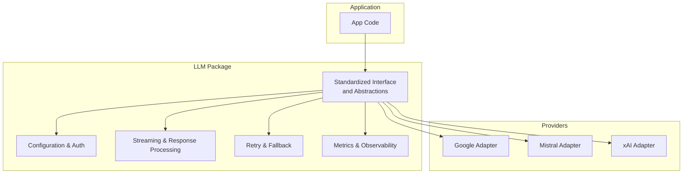
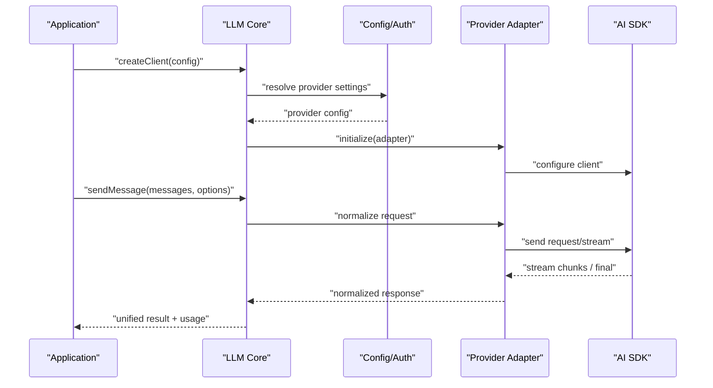
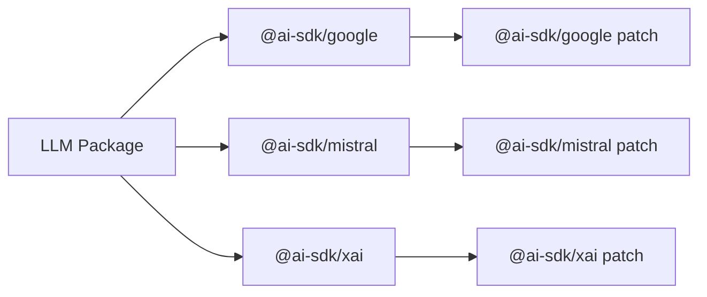

# AI Integration

<cite>
**Referenced Files in This Document**
- [packages/llm](file://packages/llm)
- [@ai-sdk/google@3.0.73.patch](file://patches/@ai-sdk%2Fgoogle@3.0.73.patch)
- [@ai-sdk/mistral@3.0.51.patch](file://patches/@ai-sdk%2Fmistral@3.0.51.patch)
- [@ai-sdk/xai@3.0.102.patch](file://patches/@ai-sdk%2Fxai@3.0.102.patch)
- [package.json](file://package.json)
</cite>

## Table of Contents
1. [Introduction](#introduction)
2. [Project Structure](#project-structure)
3. [Core Components](#core-components)
4. [Architecture Overview](#architecture-overview)
5. [Detailed Component Analysis](#detailed-component-analysis)
6. [Dependency Analysis](#dependency-analysis)
7. [Performance Considerations](#performance-considerations)
8. [Troubleshooting Guide](#troubleshooting-guide)
9. [Conclusion](#conclusion)
10. [Appendices](#appendices)

## Introduction
This document explains how the application integrates multiple AI/LLM providers (Google, Mistral, xAI) through a standardized interface implemented under packages/llm. It covers configuration, authentication, request/response handling, context management, prompt engineering patterns, response processing, rate limiting, error handling, fallbacks, and best practices. It also documents the patch files used to ensure compatibility and customization of the AI SDKs.

## Project Structure
The integration is organized around a central LLM package that abstracts provider-specific details behind a unified interface. Provider-specific adapters are implemented per vendor, while shared utilities handle configuration, streaming, retries, and metrics. Patch files ensure compatibility with specific versions of the AI SDKs.

**Diagram sources**
- [packages/llm](file://packages/llm)
- [@ai-sdk/google@3.0.73.patch](file://patches/@ai-sdk%2Fgoogle@3.0.73.patch)
- [@ai-sdk/mistral@3.0.51.patch](file://patches/@ai-sdk%2Fmistral@3.0.51.patch)
- [@ai-sdk/xai@3.0.102.patch](file://patches/@ai-sdk%2Fxai@3.0.102.patch)

**Section sources**
- [packages/llm](file://packages/llm)
- [package.json](file://package.json)

## Core Components
- Standardized Interface: A provider-agnostic API for sending prompts, managing conversation history, streaming responses, and retrieving usage metadata.
- Configuration & Authentication: Centralized loading of provider credentials, endpoints, model names, and environment variables.
- Streaming & Response Processing: Unified stream handling, tokenization, and partial message assembly.
- Retry & Fallback: Exponential backoff, jitter, and provider fallback chains.
- Metrics & Observability: Token usage, latency, error rates, and provider health checks.

Key responsibilities:
- Normalize provider requests into a common schema.
- Convert provider responses into a consistent format.
- Manage context windows and truncation strategies.
- Provide hooks for logging, telemetry, and custom transformations.

**Section sources**
- [packages/llm](file://packages/llm)

## Architecture Overview
The LLM package exposes a single entry point that selects a provider based on configuration. Each provider adapter implements the same interface, enabling seamless switching and fallbacks.

**Diagram sources**
- [packages/llm](file://packages/llm)
- [@ai-sdk/google@3.0.73.patch](file://patches/@ai-sdk%2Fgoogle@3.0.73.patch)
- [@ai-sdk/mistral@3.0.51.patch](file://patches/@ai-sdk%2Fmistral@3.0.51.patch)
- [@ai-sdk/xai@3.0.102.patch](file://patches/@ai-sdk%2Fxai@3.0.102.patch)

## Detailed Component Analysis

### Standardized Interface
- Purpose: Define a uniform contract for all providers.
- Typical methods: send, stream, getUsage, healthCheck.
- Input: normalized messages array, generation options (model, temperature, maxTokens, tools).
- Output: structured content blocks, tool calls, and usage stats.

Best practices:
- Keep messages typed and validated before sending.
- Separate system, user, assistant, and tool roles consistently.
- Enforce maximum token budgets at the interface layer.

**Section sources**
- [packages/llm](file://packages/llm)

### Provider Adapters: Google, Mistral, xAI
Each adapter maps the standardized interface to the corresponding AI SDK client.

- Google Adapter
  - Authentication: API key or service account via environment variables.
  - Request mapping: system/user/assistant messages to provider schema.
  - Streaming: chunked text and function/tool call events.
  - Usage: token counts and cost fields normalized.

- Mistral Adapter
  - Authentication: API key from environment or config.
  - Request mapping: supports tools and function calling if enabled.
  - Streaming: incremental tokens and finish reasons.
  - Usage: input/output tokens and optional cost.

- xAI Adapter
  - Authentication: API key or bearer token.
  - Request mapping: role-based messages and parameters.
  - Streaming: token-by-token updates.
  - Usage: token totals and provider-specific fields.

Common patterns:
- Validate required keys early; fail fast with clear errors.
- Map provider-specific features (tools, safety settings) to the common schema.
- Normalize error codes and messages to a unified error type.

**Section sources**
- [packages/llm](file://packages/llm)
- [@ai-sdk/google@3.0.73.patch](file://patches/@ai-sdk%2Fgoogle@3.0.73.patch)
- [@ai-sdk/mistral@3.0.51.patch](file://patches/@ai-sdk%2Fmistral@3.0.51.patch)
- [@ai-sdk/xai@3.0.102.patch](file://patches/@ai-sdk%2Fxai@3.0.102.patch)

### Configuration and Authentication
- Environment variables:
  - GOOGLE_API_KEY, MISTRAL_API_KEY, XAI_API_KEY
  - Optional: base URLs, region, project identifiers
- Config object:
  - provider selection, model name, temperature, top_p, max_tokens
  - timeout, retry policy, fallback chain
- Secrets management:
  - Load from secure env or secret manager
  - Avoid logging secrets; redact in logs

Security notes:
- Never hardcode keys in source code.
- Rotate keys regularly and scope them minimally.

**Section sources**
- [packages/llm](file://packages/llm)

### Context Management and Prompt Engineering
- Conversation history:
  - Maintain a bounded message buffer.
  - Truncate oldest messages when approaching token limits.
- System prompts:
  - Use concise instructions and examples.
  - Separate role definitions from task prompts.
- Tool/function calling:
  - Define schemas clearly and validate inputs.
  - Handle partial tool calls robustly.
- Chunking strategies:
  - Split long inputs into smaller chunks when needed.
  - Preserve context across chunks with summaries.

Optimization tips:
- Prefer few-shot examples over verbose explanations.
- Remove redundant tokens from history periodically.
- Cache frequent prompts and outputs where appropriate.

**Section sources**
- [packages/llm](file://packages/llm)

### Request/Response Handling and Streaming
- Normalization:
  - Convert provider payloads to a common shape.
  - Ensure consistent field names for content, tool_calls, and finish_reason.
- Streaming:
  - Emit incremental tokens and events.
  - Aggregate partial tool calls safely.
- Finalization:
  - Compute total tokens and cost.
  - Attach usage metadata and trace IDs.

Error normalization:
- Map provider errors to a unified error class.
- Include actionable messages and retry hints.

**Section sources**
- [packages/llm](file://packages/llm)

### Rate Limiting, Retries, and Fallbacks
- Rate limiting:
  - Respect provider headers and quotas.
  - Implement client-side throttling when necessary.
- Retries:
  - Exponential backoff with jitter.
  - Retry only on transient errors (network, 429, 5xx).
- Fallbacks:
  - Configure a priority list of providers.
  - Switch automatically on failures or quota exhaustion.

Operational guidance:
- Track failure rates per provider.
- Alert on sustained errors or quota breaches.

**Section sources**
- [packages/llm](file://packages/llm)

### Patch Files for AI SDK Compatibility
Patch files ensure stable behavior across SDK versions and enable customizations:
- @ai-sdk/google@3.0.73.patch
- @ai-sdk/mistral@3.0.51.patch
- @ai-sdk/xai@3.0.102.patch

Typical changes include:
- Workarounds for breaking API changes.
- Custom headers or auth flows.
- Improved error messages and streaming stability.
- Feature flags toggled by environment.

Maintenance:
- Pin SDK versions in package managers.
- Review patches after upgrades to avoid drift.
- Add tests that assert patched behaviors.

**Section sources**
- [@ai-sdk/google@3.0.73.patch](file://patches/@ai-sdk%2Fgoogle@3.0.73.patch)
- [@ai-sdk/mistral@3.0.51.patch](file://patches/@ai-sdk%2Fmistral@3.0.51.patch)
- [@ai-sdk/xai@3.0.102.patch](file://patches/@ai-sdk%2Fxai@3.0.102.patch)

### Implementing a Custom AI Provider
Steps:
1. Create an adapter implementing the standardized interface.
2. Map messages, parameters, and tools to the provider’s schema.
3. Implement streaming and finalize logic.
4. Normalize errors and usage data.
5. Register the adapter in the provider registry.
6. Add configuration and authentication support.
7. Write unit tests for request/response mappings and edge cases.

Validation checklist:
- Handles empty and malformed inputs gracefully.
- Streams correctly and aggregates partial content.
- Produces accurate usage statistics.
- Integrates with retry/fallback mechanisms.

**Section sources**
- [packages/llm](file://packages/llm)

### Managing Conversation History
Strategies:
- Fixed-size ring buffer with token accounting.
- Summarization of older turns to preserve context.
- Role-aware filtering to reduce noise.

Implementation tips:
- Precompute token estimates for new messages.
- Trigger summarization proactively near limits.
- Persist conversation snapshots for replay and debugging.

**Section sources**
- [packages/llm](file://packages/llm)

### Optimizing Token Usage
- Trim whitespace and comments from prompts.
- Use concise system instructions.
- Avoid repeating context already known to the model.
- Batch independent requests when possible.
- Cache repeated tool definitions and schemas.

Monitoring:
- Track tokens per request and per session.
- Set budgets and alerts for overspend.

**Section sources**
- [packages/llm](file://packages/llm)

## Dependency Analysis
The LLM package depends on provider-specific AI SDKs and uses patch files to maintain compatibility.

**Diagram sources**
- [packages/llm](file://packages/llm)
- [@ai-sdk/google@3.0.73.patch](file://patches/@ai-sdk%2Fgoogle@3.0.73.patch)
- [@ai-sdk/mistral@3.0.51.patch](file://patches/@ai-sdk%2Fmistral@3.0.51.patch)
- [@ai-sdk/xai@3.0.102.patch](file://patches/@ai-sdk%2Fxai@3.0.102.patch)

**Section sources**
- [packages/llm](file://packages/llm)
- [package.json](file://package.json)

## Performance Considerations
- Streaming first: prefer incremental responses to reduce perceived latency.
- Connection reuse: keep HTTP clients alive and pool connections.
- Backpressure: handle slow consumers without dropping tokens.
- Parallelism: fan out independent tool calls when safe.
- Caching: memoize expensive computations and repeated prompts.
- Batching: combine small requests where supported by providers.
- Monitoring: measure p50/p95 latencies and error rates per provider.

[No sources needed since this section provides general guidance]

## Troubleshooting Guide
Common issues and resolutions:
- Missing or invalid API keys: verify environment variables and permissions.
- Rate limit errors: implement backoff and switch to fallback provider.
- Streaming interruptions: reconnect and resume with last known offset.
- Token limit exceeded: truncate history or summarize older messages.
- Inconsistent responses: check model version and prompt formatting.
- Patch-related regressions: review patch diffs and pin SDK versions.

Debugging steps:
- Enable detailed logs with sensitive data redacted.
- Capture request/response payloads for analysis.
- Use health checks to validate provider availability.
- Compare behavior across providers to isolate issues.

**Section sources**
- [packages/llm](file://packages/llm)

## Conclusion
The LLM package provides a robust, extensible foundation for integrating multiple AI providers with a unified interface. By standardizing configuration, authentication, streaming, error handling, and usage tracking, it simplifies multi-provider orchestration and enables resilient, performant AI experiences. Patch files ensure compatibility and allow targeted customizations. Following the best practices outlined here will help you build reliable integrations, manage costs, and scale effectively.

[No sources needed since this section summarizes without analyzing specific files]

## Appendices

### Example: Implementing a Custom Provider
- Define adapter methods for send, stream, and usage.
- Map messages and parameters to provider schema.
- Normalize errors and usage fields.
- Register adapter and wire configuration.
- Test with unit and integration tests.

**Section sources**
- [packages/llm](file://packages/llm)

### Example: Managing Conversation History
- Maintain a bounded message list with token accounting.
- Summarize older turns when nearing limits.
- Persist snapshots for audit and replay.

**Section sources**
- [packages/llm](file://packages/llm)

### Example: Optimizing Token Usage
- Shorten prompts and remove redundancy.
- Cache tool schemas and repeated content.
- Monitor token consumption and set budgets.

**Section sources**
- [packages/llm](file://packages/llm)