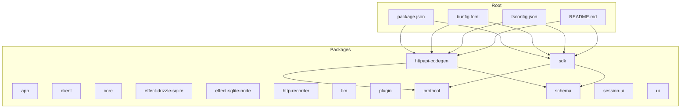
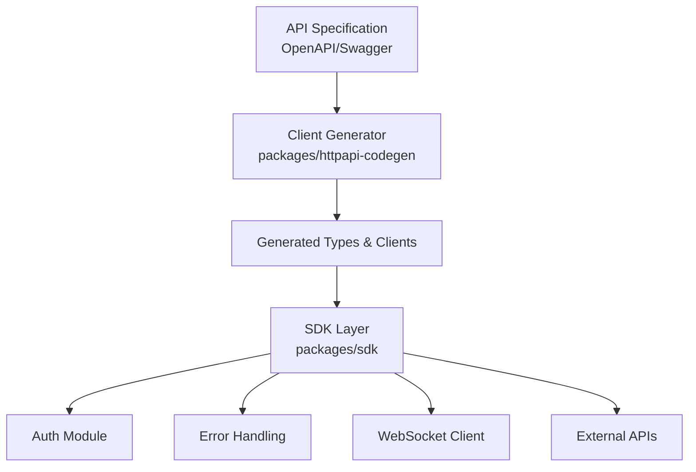
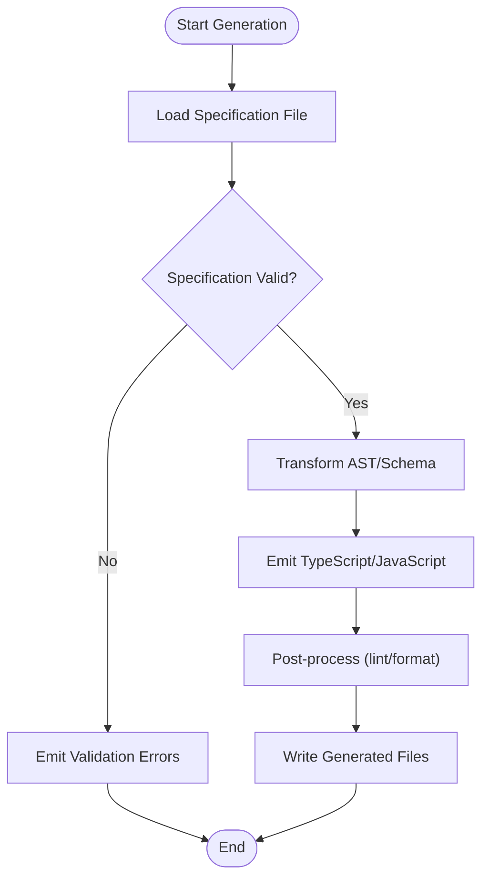
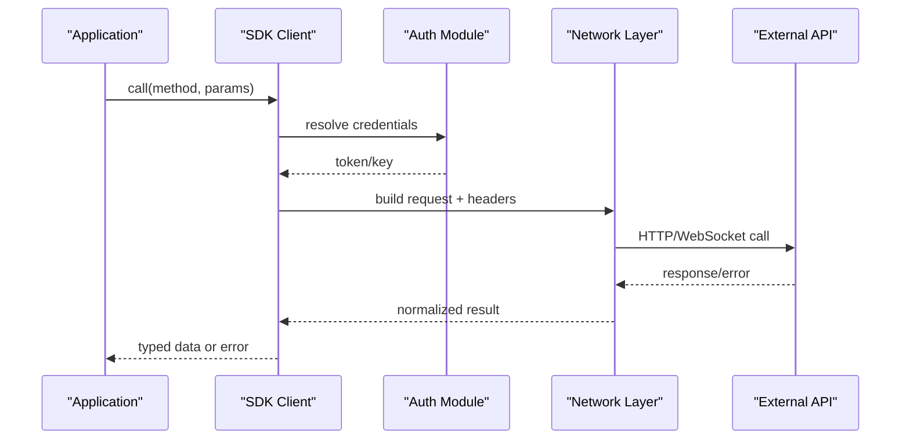
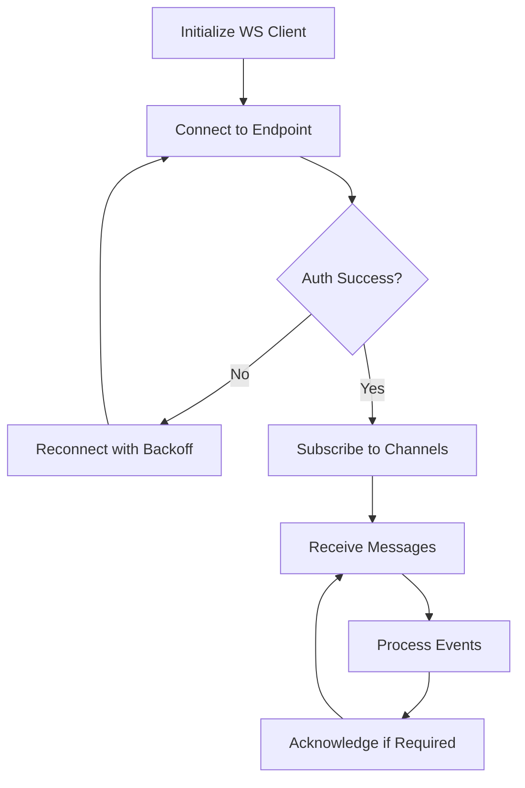
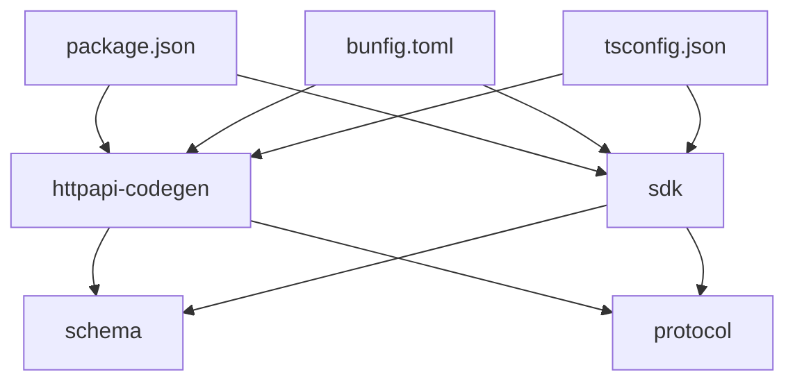

# API Development

<cite>
**Referenced Files in This Document**
- [package.json](file://package.json)
- [bunfig.toml](file://bunfig.toml)
- [tsconfig.json](file://tsconfig.json)
- [README.md](file://README.md)
</cite>

## Table of Contents
1. [Introduction](#introduction)
2. [Project Structure](#project-structure)
3. [Core Components](#core-components)
4. [Architecture Overview](#architecture-overview)
5. [Detailed Component Analysis](#detailed-component-analysis)
6. [Dependency Analysis](#dependency-analysis)
7. [Performance Considerations](#performance-considerations)
8. [Troubleshooting Guide](#troubleshooting-guide)
9. [Conclusion](#conclusion)
10. [Appendices](#appendices)

## Introduction
This document provides a comprehensive guide to API development and client generation within the project, focusing on:
- HTTP API client generation system in packages/httpapi-codegen
- SDK development patterns in packages/sdk for external integrations
- RESTful API design principles, authentication methods, and error handling strategies
- WebSocket connections for real-time features, message formats, and connection management
- API versioning, backward compatibility, and deprecation policies
- Examples of generating clients from specifications, implementing custom generators, and integrating with external APIs

The goal is to enable both new and experienced developers to understand how to design APIs, generate robust clients, and integrate external services consistently across the codebase.

## Project Structure
At a high level, the repository organizes functionality into feature-focused packages under packages/. The relevant areas for this documentation are:
- packages/httpapi-codegen: Tools and logic for generating HTTP API clients from specifications
- packages/sdk: Patterns and utilities for building SDKs that integrate with external APIs
- Root configuration files (package.json, bunfig.toml, tsconfig.json, README.md) define tooling, build settings, and project conventions

**Diagram sources**
- [package.json](file://package.json)
- [bunfig.toml](file://bunfig.toml)
- [tsconfig.json](file://tsconfig.json)
- [README.md](file://README.md)

**Section sources**
- [package.json](file://package.json)
- [bunfig.toml](file://bunfig.toml)
- [tsconfig.json](file://tsconfig.json)
- [README.md](file://README.md)

## Core Components
This section outlines the core components involved in API development and client generation:
- Specification-driven client generation: Define API contracts using OpenAPI or similar specs; generate typed clients and request/response models
- SDK patterns: Encapsulate external API interactions behind clean interfaces, handle retries, timeouts, and errors consistently
- Authentication: Centralized auth strategies (e.g., bearer tokens, API keys), secure storage, and token refresh flows
- Error handling: Standardized error types, retry policies, and user-friendly messages
- Real-time communication: WebSocket client with reconnection, message typing, and lifecycle hooks

Key responsibilities:
- httpapi-codegen: Parses specifications, generates TypeScript/JavaScript clients, and supports customization via plugins or templates
- sdk: Provides reusable patterns for API integration, including request builders, interceptors, and error normalization

**Section sources**
- [package.json](file://package.json)
- [bunfig.toml](file://bunfig.toml)
- [tsconfig.json](file://tsconfig.json)
- [README.md](file://README.md)

## Architecture Overview
The architecture centers around specification-driven generation and SDK encapsulation:

**Diagram sources**
- [package.json](file://package.json)
- [bunfig.toml](file://bunfig.toml)
- [tsconfig.json](file://tsconfig.json)
- [README.md](file://README.md)

## Detailed Component Analysis

### HTTP API Client Generation System (packages/httpapi-codegen)
Responsibilities:
- Parse API specifications (OpenAPI/Swagger)
- Generate strongly-typed clients, request/response models, and validation schemas
- Support customization through generator options, templates, and plugins
- Integrate with build tools and package managers for seamless inclusion

Key concepts:
- Specification formats: OpenAPI 3.x, JSON/YAML inputs
- Code generation pipeline: parse -> transform -> emit -> post-process
- Customization: output directory, naming conventions, error mapping, serialization options
- Integration: CLI commands, Node.js APIs, bundler plugins

**Diagram sources**
- [package.json](file://package.json)
- [bunfig.toml](file://bunfig.toml)
- [tsconfig.json](file://tsconfig.json)
- [README.md](file://README.md)

**Section sources**
- [package.json](file://package.json)
- [bunfig.toml](file://bunfig.toml)
- [tsconfig.json](file://tsconfig.json)
- [README.md](file://README.md)

### SDK Development Patterns (packages/sdk)
Responsibilities:
- Provide consistent interfaces for external API integrations
- Implement request/response builders, interceptors, and middleware
- Centralize authentication, retries, timeouts, and error normalization
- Offer WebSocket client utilities for real-time features

Patterns:
- Builder pattern for constructing requests
- Interceptor chain for logging, metrics, and auth injection
- Retry and backoff strategies for resilient calls
- Typed responses and error classes for predictable handling

**Diagram sources**
- [package.json](file://package.json)
- [bunfig.toml](file://bunfig.toml)
- [tsconfig.json](file://tsconfig.json)
- [README.md](file://README.md)

**Section sources**
- [package.json](file://package.json)
- [bunfig.toml](file://bunfig.toml)
- [tsconfig.json](file://tsconfig.json)
- [README.md](file://README.md)

### RESTful API Design Principles
Guidelines:
- Use nouns for resources and HTTP verbs for actions
- Version endpoints explicitly (e.g., /v1/)
- Return appropriate status codes and structured error bodies
- Support pagination, filtering, sorting, and field selection
- Keep payloads minimal and consistent

Best practices:
- Idempotent methods where applicable (GET, PUT, DELETE)
- Consistent error format with codes and messages
- HATEOAS optional for discoverability
- Rate limiting and caching headers

[No sources needed since this section doesn't analyze specific files]

### Authentication Methods
Common approaches:
- Bearer tokens (JWT/OAuth2)
- API keys in headers or query parameters
- Mutual TLS for service-to-service
- Session-based cookies for web apps

Implementation tips:
- Centralize token storage and refresh
- Inject auth headers via interceptors
- Rotate secrets securely
- Log minimal sensitive information

[No sources needed since this section doesn't analyze specific files]

### Error Handling Strategies
Recommendations:
- Normalize network and domain errors into unified types
- Include error codes, messages, and context
- Provide retry guidance for transient failures
- Surface actionable messages to users

Patterns:
- Try/catch with typed exceptions
- Fallback mechanisms and graceful degradation
- Metrics and tracing for error tracking

[No sources needed since this section doesn't analyze specific files]

### WebSocket Connections for Real-Time Features
Design considerations:
- Connection lifecycle: connect, authenticate, subscribe, unsubscribe, reconnect
- Message schema: typed events, payloads, and acknowledgments
- Backpressure and rate limiting
- Heartbeats and timeout handling

Flow:

**Diagram sources**
- [package.json](file://package.json)
- [bunfig.toml](file://bunfig.toml)
- [tsconfig.json](file://tsconfig.json)
- [README.md](file://README.md)

[No additional section sources since this diagram maps conceptual flow without specific file analysis]

### API Versioning, Backward Compatibility, and Deprecation Policies
Principles:
- Version URLs or headers to evolve APIs safely
- Maintain backward compatibility for at least one major version
- Deprecate fields/endpoints with clear timelines and migration guides
- Use feature flags for gradual rollouts

Policies:
- Announce deprecations in release notes
- Provide migration scripts and dual support during transition
- Monitor usage analytics to plan sunsetting

[No sources needed since this section doesn't analyze specific files]

### Examples: Generating Clients from Specifications
Steps:
- Prepare OpenAPI spec (JSON/YAML)
- Configure generator options (output path, naming, serializers)
- Run generation command or API
- Integrate generated clients into SDK layer

Customization:
- Override templates for custom serialization
- Add plugins for auth injection or logging
- Post-process with linters/formatters

[No sources needed since this section doesn't analyze specific files]

### Implementing Custom Generators
Approach:
- Extend base generator with custom transforms
- Hook into parsing, transformation, and emission phases
- Provide CLI flags or config for generator options
- Test with sample specs and edge cases

Integration:
- Register generator in build pipeline
- Export generator API for programmatic use
- Document options and examples

[No sources needed since this section doesn't analyze specific files]

### Integrating with External APIs
Patterns:
- Wrap external SDKs with typed interfaces
- Handle rate limits, retries, and timeouts
- Cache responses when appropriate
- Mock external dependencies for testing

Security:
- Store secrets securely
- Validate external responses
- Sanitize inputs and outputs

[No sources needed since this section doesn't analyze specific files]

## Dependency Analysis
High-level dependencies among key packages:
- httpapi-codegen depends on schema and protocol definitions for type safety
- sdk relies on protocol and schema for consistent contracts
- Root configs influence build and runtime behavior

**Diagram sources**
- [package.json](file://package.json)
- [bunfig.toml](file://bunfig.toml)
- [tsconfig.json](file://tsconfig.json)
- [README.md](file://README.md)

**Section sources**
- [package.json](file://package.json)
- [bunfig.toml](file://bunfig.toml)
- [tsconfig.json](file://tsconfig.json)
- [README.md](file://README.md)

## Performance Considerations
- Minimize payload sizes with selective fields and compression
- Use connection pooling and keep-alive for HTTP clients
- Implement caching strategies (in-memory, CDN, server-side)
- Profile WebSocket message throughput and latency
- Avoid synchronous operations in hot paths

[No sources needed since this section provides general guidance]

## Troubleshooting Guide
Common issues and resolutions:
- Specification validation errors: ensure correct OpenAPI version and syntax
- Generation failures: check template compatibility and generator options
- Authentication failures: verify token validity and header injection
- WebSocket disconnects: implement reconnection with exponential backoff
- Rate limiting: respect retry-after headers and adjust backoff

Debugging tips:
- Enable verbose logging for network calls
- Capture request/response payloads in development
- Use mocks and stubs for external dependencies
- Monitor error rates and latency metrics

[No sources needed since this section provides general guidance]

## Conclusion
This document outlined the architecture and best practices for API development and client generation within the project. By leveraging specification-driven generation, consistent SDK patterns, and robust error handling, teams can build reliable integrations and maintain backward compatibility. Adopting these guidelines ensures scalable, secure, and maintainable APIs and clients.

[No sources needed since this section summarizes without analyzing specific files]

## Appendices
- Additional references and links to external standards (OpenAPI, OAuth2, JWT)
- Example configurations and templates for common scenarios
- Migration guides for upgrading API versions

[No sources needed since this section provides general guidance]