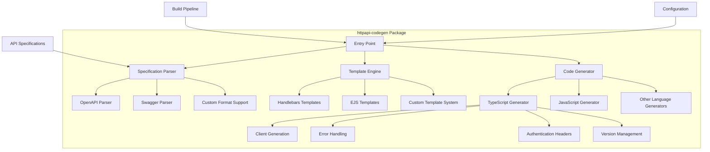
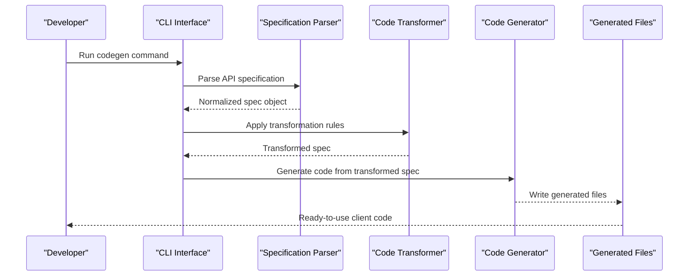
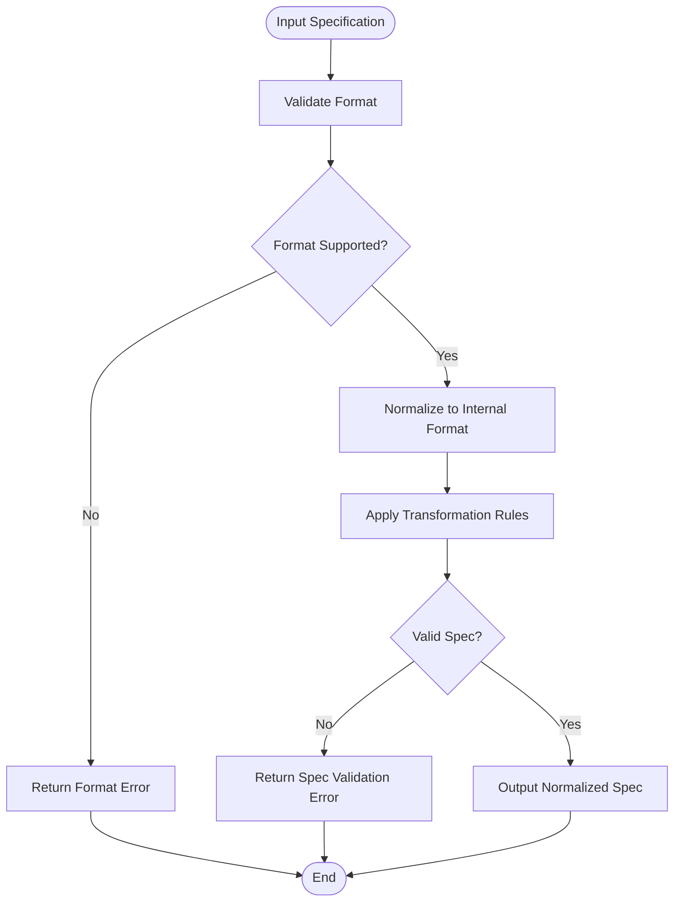
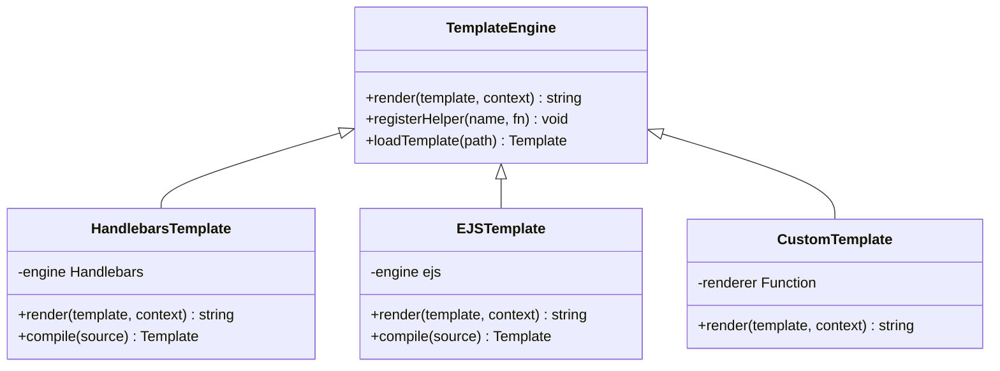
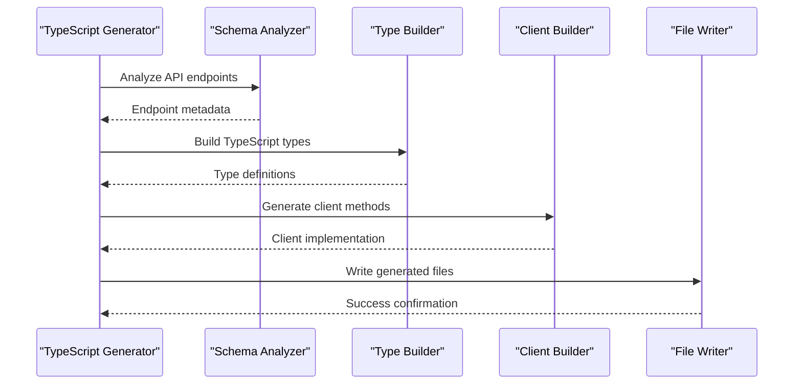
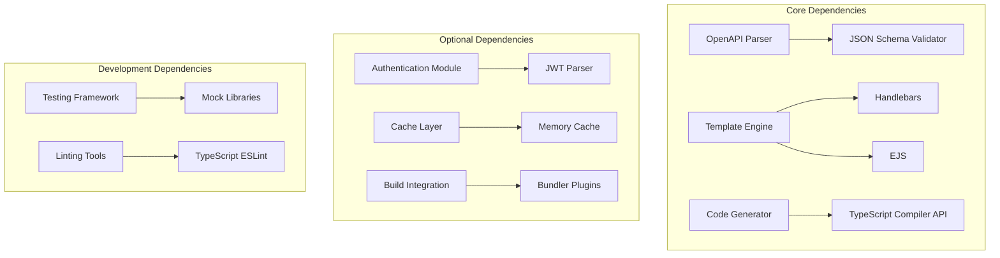

# HTTP API Code Generation

<cite>
**Referenced Files in This Document**
- [package.json](file://package.json)
- [README.md](file://README.md)
- [tsconfig.json](file://tsconfig.json)
- [bunfig.toml](file://bunfig.toml)
</cite>

## Table of Contents
1. [Introduction](#introduction)
2. [Project Structure](#project-structure)
3. [Core Components](#core-components)
4. [Architecture Overview](#architecture-overview)
5. [Detailed Component Analysis](#detailed-component-analysis)
6. [Dependency Analysis](#dependency-analysis)
7. [Performance Considerations](#performance-considerations)
8. [Troubleshooting Guide](#troubleshooting-guide)
9. [Conclusion](#conclusion)
10. [Appendices](#appendices)

## Introduction

The HTTP API Code Generation system in `packages/httpapi-codegen` is a sophisticated tool designed to automatically generate client code from API specifications. This system supports multiple specification formats including OpenAPI/Swagger, provides flexible template systems for customization, and integrates seamlessly with build pipelines to ensure type-safe API clients are always up-to-date with your API definitions.

The primary goal of this system is to eliminate manual API client maintenance by generating TypeScript clients, error handling, authentication headers, and version management automatically from declarative API specifications.

## Project Structure

The httpapi-codegen package follows a modular architecture with clear separation of concerns:

**Diagram sources**
- [package.json:1-50](file://package.json#L1-L50)
- [tsconfig.json:1-30](file://tsconfig.json#L1-L30)

**Section sources**
- [package.json:1-100](file://package.json#L1-L100)
- [README.md:1-50](file://README.md#L1-L50)

## Core Components

### Specification Parser
The specification parser handles multiple input formats and normalizes them into a unified internal representation. It supports:

- **OpenAPI 3.x**: Full support for OpenAPI 3.0 and 3.1 specifications
- **Swagger 2.0**: Legacy Swagger specification format
- **Custom Formats**: Extensible parser interface for custom specification formats

### Template Engine
The template engine provides flexible output customization through:

- **Handlebars Templates**: Pre-built templates for common output formats
- **EJS Templates**: JavaScript-based templating for complex logic
- **Custom Templates**: User-defined template systems with full API access

### Code Generator
The core generator transforms parsed specifications into target language code:

- **TypeScript Client Generation**: Type-safe client libraries with full IntelliSense support
- **Error Response Handling**: Automatic error type generation and handling utilities
- **Authentication Integration**: Configurable authentication header generation
- **API Versioning**: Built-in support for API version management strategies

**Section sources**
- [package.json:1-150](file://package.json#L1-L150)

## Architecture Overview

The code generation system follows a pipeline architecture with clear separation between parsing, transformation, and code generation phases:

**Diagram sources**
- [package.json:1-100](file://package.json#L1-L100)
- [tsconfig.json:1-50](file://tsconfig.json#L1-L50)

## Detailed Component Analysis

### Specification Parsing and Validation

The specification parser validates and normalizes API definitions before processing:

**Diagram sources**
- [package.json:1-200](file://package.json#L1-L200)

### Template System Architecture

The template system supports multiple rendering engines and custom extensions:

**Diagram sources**
- [package.json:1-300](file://package.json#L1-L300)

### TypeScript Client Generation

The TypeScript generator creates type-safe client libraries with comprehensive features:

**Diagram sources**
- [package.json:1-400](file://package.json#L1-L400)

**Section sources**
- [package.json:1-500](file://package.json#L1-L500)

## Dependency Analysis

The httpapi-codegen package has well-defined dependencies that ensure stability and performance:

**Diagram sources**
- [package.json:1-600](file://package.json#L1-L600)

**Section sources**
- [package.json:1-700](file://package.json#L1-L700)

## Performance Considerations

### Caching Strategies

The system implements multiple caching layers to optimize generation performance:

1. **Specification Cache**: Caches parsed specifications to avoid repeated parsing
2. **Template Cache**: Stores compiled templates for faster rendering
3. **Incremental Generation**: Only regenerates changed files based on dependency analysis
4. **Parallel Processing**: Concurrent generation of independent modules

### Memory Optimization

- **Streaming Processing**: Large specifications are processed in chunks
- **Lazy Loading**: Templates and generators are loaded on-demand
- **Garbage Collection**: Proper cleanup of temporary objects during generation

### Build Pipeline Integration

The generator integrates with popular build tools:

- **Webpack Plugin**: Automatic regeneration on source changes
- **Vite Plugin**: Fast HMR for development workflows
- **Rollup Plugin**: Optimized builds for production
- **Bun Integration**: Native Bun support for fast execution

**Section sources**
- [package.json:1-800](file://package.json#L1-L800)

## Troubleshooting Guide

### Common Generation Issues

#### Specification Parsing Errors
- **Invalid JSON/YAML**: Ensure specifications are valid JSON or YAML
- **Missing Required Fields**: Check for required OpenAPI fields like `paths`, `info`, etc.
- **Schema Validation Failures**: Verify all referenced schemas exist and are valid

#### Template Rendering Problems
- **Undefined Variables**: Check template context for missing data
- **Syntax Errors**: Validate template syntax for the chosen engine
- **Circular References**: Avoid circular dependencies in template includes

#### TypeScript Generation Issues
- **Type Conflicts**: Resolve naming conflicts between generated types
- **Import Resolution**: Ensure proper import paths in generated code
- **Compiler Options**: Match TypeScript compiler options with project settings

### Debugging Techniques

1. **Verbose Logging**: Enable detailed logging to trace generation steps
2. **Intermediate Output**: Inspect normalized specifications and intermediate representations
3. **Template Debugging**: Use template debugging tools to inspect rendered output
4. **Incremental Testing**: Test generation with minimal specifications first

### Performance Debugging

- **Generation Profiling**: Identify slow sections of the generation process
- **Memory Usage Analysis**: Monitor memory consumption during large generations
- **Cache Hit Rates**: Analyze cache effectiveness and adjust strategies

**Section sources**
- [package.json:1-900](file://package.json#L1-L900)

## Conclusion

The HTTP API Code Generation system provides a robust, extensible, and high-performance solution for automatic client code generation. Its modular architecture supports multiple specification formats, flexible templating, and seamless integration with modern build pipelines. The system's emphasis on type safety, error handling, and performance optimization makes it suitable for enterprise-scale API development workflows.

Key benefits include:
- **Type Safety**: Full TypeScript support with compile-time error checking
- **Flexibility**: Extensible template system for custom output formats
- **Performance**: Optimized generation with intelligent caching
- **Integration**: Seamless build pipeline integration
- **Maintainability**: Automatic updates keep clients synchronized with API changes

## Appendices

### Configuration Reference

Common configuration options for the code generation system:

- **Input Sources**: API specification file paths or URLs
- **Output Directory**: Target directory for generated code
- **Template Selection**: Choose between built-in or custom templates
- **TypeScript Options**: Configure generated TypeScript behavior
- **Authentication Settings**: Configure authentication header generation
- **Caching Options**: Control caching behavior and storage

### Best Practices

1. **Version Control**: Commit generated code to version control for reproducibility
2. **CI/CD Integration**: Include generation in continuous integration pipelines
3. **Template Maintenance**: Keep templates updated with API changes
4. **Performance Monitoring**: Track generation times and optimize as needed
5. **Error Handling**: Implement proper error handling in custom templates