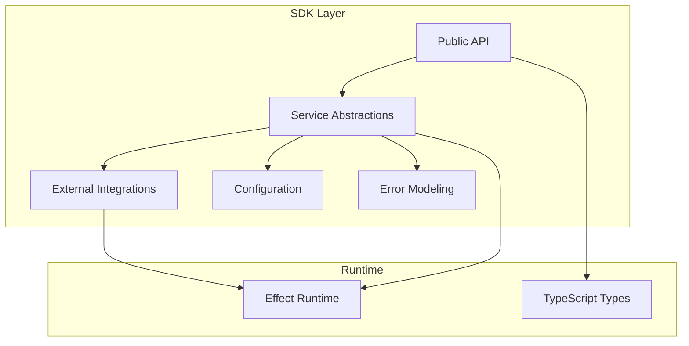
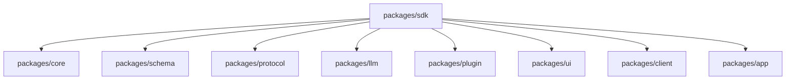

# SDK Development

<cite>
**Referenced Files in This Document**
- [package.json](file://package.json)
- [bunfig.toml](file://bunfig.toml)
- [tsconfig.json](file://tsconfig.json)
- [README.md](file://README.md)
</cite>

## Table of Contents
1. [Introduction](#introduction)
2. [Project Structure](#project-structure)
3. [Core Components](#core-components)
4. [Architecture Overview](#architecture-overview)
5. [Detailed Component Analysis](#detailed-component-analysis)
6. [Dependency Analysis](#dependency-analysis)
7. [Performance Considerations](#performance-considerations)
8. [Troubleshooting Guide](#troubleshooting-guide)
9. [Conclusion](#conclusion)
10. [Appendices](#appendices)

## Introduction
This document provides comprehensive guidance for developing SDKs within the packages/sdk directory. It focuses on creating external integrations, implementing service abstractions, and managing dependency injection. It also covers SDK architecture, module organization, export patterns, typed APIs, asynchronous operations with Effect, retry logic, configuration management, testing strategies, mocking, type safety, versioning, backward compatibility, and migration paths. The goal is to help you build robust, maintainable, and type-safe SDK components that integrate cleanly with the broader monorepo.

## Project Structure
The repository is a monorepo managed by Bun. The SDK package resides under packages/sdk. The root configuration files define tooling and project settings:
- package.json defines workspace-level scripts and dependencies.
- bunfig.toml configures the Bun runtime and bundling behavior.
- tsconfig.json sets TypeScript compilation options across the workspace.
- README.md contains high-level project information.

```mermaid
graph TB
Root["Repository Root"] --> PkgSDK["packages/sdk"]
Root --> PkgApp["packages/app"]
Root --> PkgClient["packages/client"]
Root --> PkgCore["packages/core"]
Root --> PkgLLM["packages/llm"]
Root --> PkgPlugin["packages/plugin"]
Root --> PkgProtocol["packages/protocol"]
Root --> PkgSchema["packages/schema"]
Root --> PkgUI["packages/ui"]
Root --> PkgSessionUI["packages/session-ui"]
Root --> PkgHTTPRecorder["packages/http-recorder"]
Root --> PkgHTTPAPICodegen["packages/httpapi-codegen"]
Root --> PkgEffectDrizzleSQLite["packages/effect-drizzle-sqlite"]
Root --> PkgEffectSQLiteNode["packages/effect-sqlite-node"]
```

[No sources needed since this diagram shows conceptual structure]

**Section sources**
- [package.json](file://package.json)
- [bunfig.toml](file://bunfig.toml)
- [tsconfig.json](file://tsconfig.json)
- [README.md](file://README.md)

## Core Components
Within packages/sdk, typical SDK development patterns include:
- External integrations: Encapsulate third-party services behind stable interfaces.
- Service abstractions: Define typed contracts for domain operations.
- Dependency injection: Provide implementations via factories or modules to enable testability and environment-specific behavior.
- Typed APIs: Use strict TypeScript types and schemas to ensure correctness at boundaries.
- Asynchronous operations: Leverage Effect for structured concurrency, error handling, and retries.
- Retry logic: Implement exponential backoff with jitter and configurable limits.
- Configuration: Centralize environment-based settings with validation and defaults.

These patterns are implemented through modular exports, clear separation of concerns, and consistent error modeling.

**Section sources**
- [package.json](file://package.json)
- [tsconfig.json](file://tsconfig.json)

## Architecture Overview
A recommended SDK architecture separates concerns into layers:
- API layer: Public-facing functions and classes with strong typing.
- Service layer: Business logic and orchestration using Effect for async flows.
- Integration layer: Adapters for external services (HTTP clients, databases, etc.).
- Configuration layer: Environment variables and validated settings.
- Error layer: Domain-specific errors and standardized error shapes.

[No sources needed since this diagram shows conceptual architecture]

## Detailed Component Analysis

### External Integrations
- Purpose: Encapsulate third-party services behind stable interfaces.
- Patterns:
  - Create adapter modules per provider.
  - Use typed request/response models.
  - Handle network errors and timeouts explicitly.
  - Expose configuration options for endpoints, headers, and credentials.
- Example responsibilities:
  - HTTP client wrappers with retries and timeouts.
  - Authentication adapters for OAuth or API keys.
  - Rate limiting and circuit breaker integration.

**Section sources**
- [package.json](file://package.json)
- [tsconfig.json](file://tsconfig.json)

### Service Abstractions
- Purpose: Define domain operations as typed interfaces.
- Patterns:
  - Abstract methods return Effect instances for predictable async behavior.
  - Compose multiple integrations within service methods.
  - Validate inputs and outputs using schema libraries.
  - Provide default implementations and override via dependency injection.
- Example responsibilities:
  - CRUD operations over remote resources.
  - Aggregation and transformation of data from multiple sources.
  - Transactional workflows with rollback semantics.

**Section sources**
- [package.json](file://package.json)
- [tsconfig.json](file://tsconfig.json)

### Dependency Injection
- Purpose: Enable testability and environment-specific implementations.
- Patterns:
  - Use factory functions to create service instances with injected dependencies.
  - Provide a registry or context object holding configured integrations.
  - Separate production and test configurations clearly.
  - Avoid global singletons; prefer explicit wiring.
- Example responsibilities:
  - Inject HTTP clients, caches, and logging utilities.
  - Swap implementations for mock services during tests.
  - Manage lifecycle of connections and resources.

**Section sources**
- [package.json](file://package.json)
- [tsconfig.json](file://tsconfig.json)

### Typed APIs
- Purpose: Ensure correctness across SDK boundaries.
- Patterns:
  - Strict TypeScript interfaces for all public APIs.
  - Schema validation for inputs and outputs.
  - Discriminated unions for polymorphic responses.
  - Generics for reusable, type-safe operations.
- Example responsibilities:
  - Enforce required fields and constraints.
  - Provide exhaustive type guards for error cases.
  - Maintain backward-compatible type evolution.

**Section sources**
- [package.json](file://package.json)
- [tsconfig.json](file://tsconfig.json)

### Asynchronous Operations with Effect
- Purpose: Model async workflows with structured concurrency and error handling.
- Patterns:
  - Represent computations as Effect values.
  - Compose effects using sequencing and branching.
  - Handle errors with typed failure channels.
  - Run effects with appropriate runtimes for Node or browser environments.
- Example responsibilities:
  - Parallel requests with fan-in/fan-out.
  - Cancellation and timeout support.
  - Resource acquisition and release.

**Section sources**
- [package.json](file://package.json)
- [tsconfig.json](file://tsconfig.json)

### Retry Logic
- Purpose: Improve resilience against transient failures.
- Patterns:
  - Implement exponential backoff with jitter.
  - Configure max attempts and delay bounds.
  - Distinguish between retriable and non-retriable errors.
  - Log retry events for observability.
- Example responsibilities:
  - Wrap HTTP calls with retry middleware.
  - Apply retry policies per operation based on status codes.
  - Integrate with circuit breakers to prevent cascading failures.

**Section sources**
- [package.json](file://package.json)
- [tsconfig.json](file://tsconfig.json)

### Configuration Management
- Purpose: Centralize and validate environment-based settings.
- Patterns:
  - Load configuration from environment variables and config files.
  - Validate required fields and provide sensible defaults.
  - Freeze configuration objects to prevent mutation.
  - Separate configuration per environment (dev, staging, prod).
- Example responsibilities:
  - Endpoint URLs, timeouts, and feature flags.
  - Credentials and secrets management.
  - Logging levels and telemetry settings.

**Section sources**
- [package.json](file://package.json)
- [tsconfig.json](file://tsconfig.json)

### Testing Strategies
- Purpose: Ensure reliability and correctness of SDK components.
- Patterns:
  - Unit tests for pure functions and effect compositions.
  - Integration tests with mocked external services.
  - Contract tests to verify API stability.
  - Property-based tests for complex transformations.
- Example responsibilities:
  - Mock HTTP clients and database adapters.
  - Simulate network failures and timeouts.
  - Validate error propagation and recovery paths.

**Section sources**
- [package.json](file://package.json)
- [tsconfig.json](file://tsconfig.json)

### Mocking External Services
- Purpose: Isolate tests from external dependencies.
- Patterns:
  - Use dependency injection to swap real integrations with mocks.
  - Create deterministic fixtures for responses.
  - Assert side effects like logging and metrics.
  - Simulate edge cases and error conditions.
- Example responsibilities:
  - Stubbed HTTP endpoints returning expected payloads.
  - Fake time providers for timeout and retry tests.
  - In-memory stores for caching and state.

**Section sources**
- [package.json](file://package.json)
- [tsconfig.json](file://tsconfig.json)

### Type Safety Across Boundaries
- Purpose: Prevent runtime errors through compile-time guarantees.
- Patterns:
  - Shared schemas for request/response models.
  - Zod or similar validators integrated with TypeScript.
  - Exhaustive checks for enum-like types.
  - Migration helpers for evolving types without breaking changes.
- Example responsibilities:
  - Validate incoming data before processing.
  - Transform external formats to internal types safely.
  - Generate types from OpenAPI or GraphQL schemas.

**Section sources**
- [package.json](file://package.json)
- [tsconfig.json](file://tsconfig.json)

### SDK Versioning and Backward Compatibility
- Purpose: Maintain stability while evolving the SDK.
- Patterns:
  - Semantic versioning for major, minor, and patch releases.
  - Deprecation warnings for removed features.
  - Feature flags to toggle new behavior gradually.
  - Migration guides for breaking changes.
- Example responsibilities:
  - Preserve existing APIs while introducing new ones.
  - Document deprecation timelines and alternatives.
  - Provide automated tools to update consumer code.

**Section sources**
- [package.json](file://package.json)
- [tsconfig.json](file://tsconfig.json)

### Migration Paths
- Purpose: Smooth transitions when upgrading SDK versions.
- Patterns:
  - Provide codemods or scripts to auto-update imports and calls.
  - Offer compatibility shims for deprecated APIs.
  - Maintain parallel versions during transition periods.
  - Update documentation and examples consistently.
- Example responsibilities:
  - Rename methods and adjust parameter orders.
  - Replace legacy error models with new ones.
  - Migrate configuration keys and environment variables.

**Section sources**
- [package.json](file://package.json)
- [tsconfig.json](file://tsconfig.json)

## Dependency Analysis
The SDK depends on core runtime and utility packages defined at the workspace level. Dependencies should be minimized and clearly documented to avoid circular imports and bloat.

[No sources needed since this diagram shows conceptual dependencies]

**Section sources**
- [package.json](file://package.json)

## Performance Considerations
- Prefer lazy loading of heavy modules to reduce startup time.
- Cache frequently accessed data with TTL and eviction policies.
- Use streaming for large payloads to minimize memory usage.
- Profile effect compositions to avoid unnecessary allocations.
- Tune retry backoff and concurrency limits based on workload characteristics.

[No sources needed since this section provides general guidance]

## Troubleshooting Guide
Common issues and resolutions:
- Network timeouts: Increase timeouts and add retries with backoff.
- Authentication failures: Validate credentials and refresh tokens automatically.
- Rate limiting: Implement adaptive throttling and queueing.
- Memory leaks: Ensure proper cleanup of resources and cancel long-running effects.
- Type mismatches: Align schemas across boundaries and use validators.

**Section sources**
- [package.json](file://package.json)
- [tsconfig.json](file://tsconfig.json)

## Conclusion
By following the patterns outlined above, you can build an SDK that is robust, type-safe, and easy to maintain. Emphasize clear abstractions, dependency injection, and structured async programming with Effect. Adopt rigorous testing and careful versioning to ensure backward compatibility and smooth migrations.

[No sources needed since this section summarizes without analyzing specific files]

## Appendices
- Best practices checklist for SDK development.
- Example module layout for packages/sdk.
- Recommended tooling for linting, formatting, and testing.

[No sources needed since this section provides general guidance]