# Advanced Topics

<cite>
**Referenced Files in This Document**
- [README.md](file://README.md)
- [package.json](file://package.json)
- [bunfig.toml](file://bunfig.toml)
- [tsconfig.json](file://tsconfig.json)
- [packages/app](file://packages/app)
- [packages/client](file://packages/client)
- [packages/core](file://packages/core)
- [packages/plugin](file://packages/plugin)
- [packages/protocol](file://packages/protocol)
- [packages/schema](file://packages/schema)
- [packages/sdk](file://packages/sdk)
- [packages/effect-drizzle-sqlite](file://packages/effect-drizzle-sqlite)
- [packages/effect-sqlite-node](file://packages/effect-sqlite-node)
- [packages/http-recorder](file://packages/http-recorder)
- [packages/httpapi-codegen](file://packages/httpapi-codegen)
- [packages/llm](file://packages/llm)
- [packages/session-ui](file://packages/session-ui)
- [packages/ui](file://packages/ui)
</cite>

## Table of Contents
1. [Introduction](#introduction)
2. [Project Structure](#project-structure)
3. [Core Components](#core-components)
4. [Architecture Overview](#architecture-overview)
5. [Advanced Middleware Development](#advanced-middleware-development)
6. [Custom Plugin Architecture](#custom-plugin-architecture)
7. [Protocol Implementation Patterns](#protocol-implementation-patterns)
8. [Advanced Testing Strategies](#advanced-testing-strategies)
9. [Performance Monitoring and Optimization](#performance-monitoring-and-optimization)
10. [Security Considerations and Best Practices](#security-considerations-and-best-practices)
11. [Scaling and Load Balancing](#scaling-and-load-balancing)
12. [Distributed System Patterns](#distributed-system-patterns)
13. [Debugging and Profiling Techniques](#debugging-and-profiling-techniques)
14. [Memory Optimization Strategies](#memory-optimization-strategies)
15. [Disaster Recovery and Backup Strategies](#disaster-recovery-and-backup-strategies)
16. [Operational Excellence Practices](#operational-excellence-practices)
17. [Contributing Guidelines](#contributing-guidelines)
18. [Conclusion](#conclusion)

## Introduction

This document provides comprehensive guidance for advanced users and developers working with the OpenCode Web UI monorepo. It covers expert-level usage patterns, custom middleware development, advanced testing strategies, performance monitoring, security considerations, scaling techniques, distributed system patterns, debugging methodologies, memory optimization, disaster recovery procedures, and operational excellence practices. The goal is to enable developers to build robust, scalable, and secure applications while maintaining long-term project health.

## Project Structure

The OpenCode Web UI follows a modular monorepo architecture built with TypeScript and Bun runtime. The project is organized into multiple packages, each serving specific responsibilities:

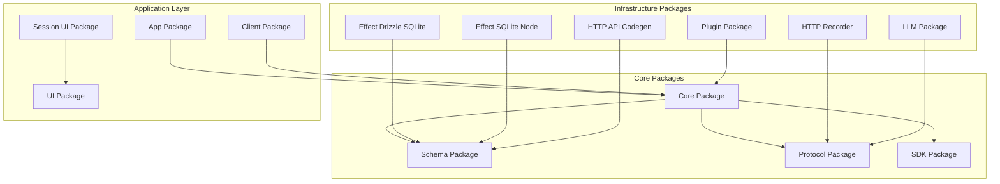

**Diagram sources**
- [packages/core](file://packages/core)
- [packages/schema](file://packages/schema)
- [packages/protocol](file://packages/protocol)
- [packages/sdk](file://packages/sdk)
- [packages/app](file://packages/app)
- [packages/client](file://packages/client)
- [packages/session-ui](file://packages/session-ui)
- [packages/ui](file://packages/ui)
- [packages/effect-drizzle-sqlite](file://packages/effect-drizzle-sqlite)
- [packages/effect-sqlite-node](file://packages/effect-sqlite-node)
- [packages/http-recorder](file://packages/http-recorder)
- [packages/httpapi-codegen](file://packages/httpapi-codegen)
- [packages/llm](file://packages/llm)
- [packages/plugin](file://packages/plugin)

**Section sources**
- [package.json](file://package.json)
- [bunfig.toml](file://bunfig.toml)
- [tsconfig.json](file://tsconfig.json)

## Core Components

The core architecture consists of several key components that work together to provide a comprehensive web application framework:

### Core Package
The central package providing foundational functionality, including configuration management, dependency injection, and core utilities.

### Schema Package
Defines data models, validation schemas, and type definitions used throughout the application.

### Protocol Package
Implements communication protocols, API specifications, and inter-service messaging patterns.

### SDK Package
Provides client-side libraries and APIs for interacting with the backend services.

**Section sources**
- [packages/core](file://packages/core)
- [packages/schema](file://packages/schema)
- [packages/protocol](file://packages/protocol)
- [packages/sdk](file://packages/sdk)

## Architecture Overview

The system follows a layered architecture pattern with clear separation of concerns:

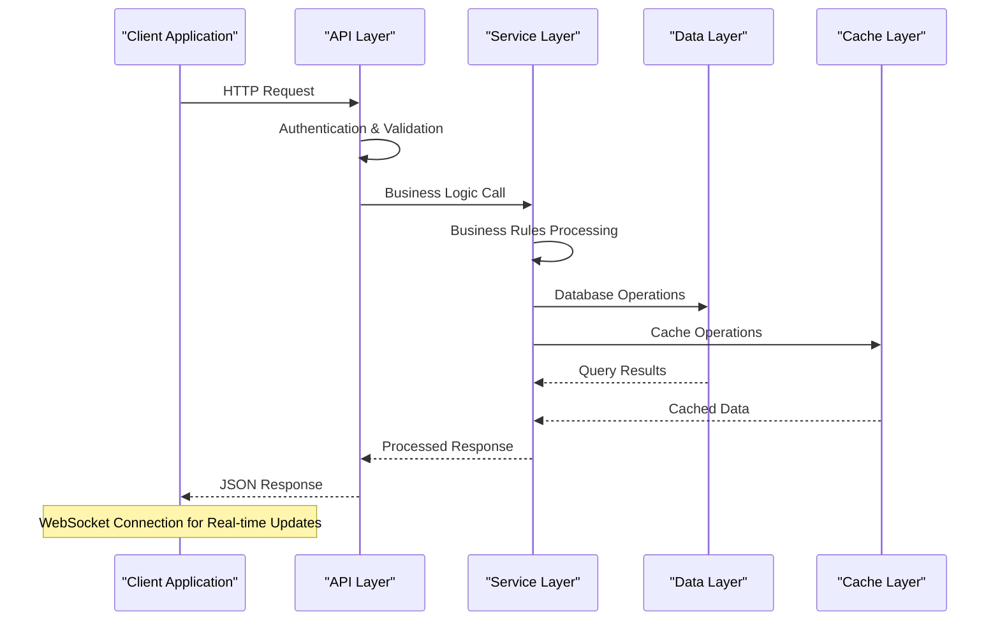

**Diagram sources**
- [packages/app](file://packages/app)
- [packages/client](file://packages/client)
- [packages/core](file://packages/core)

## Advanced Middleware Development

### Middleware Architecture Pattern

The middleware system follows a composable pipeline pattern where each middleware can process requests, modify responses, and handle errors.

#### Custom Middleware Development Guidelines

1. **Middleware Interface Design**: Implement standardized interfaces for request/response processing
2. **Error Handling**: Implement comprehensive error handling and logging
3. **Performance Monitoring**: Add metrics collection and performance tracking
4. **Security Validation**: Include input validation and security checks
5. **Configuration Management**: Support dynamic configuration loading

#### Middleware Pipeline Execution

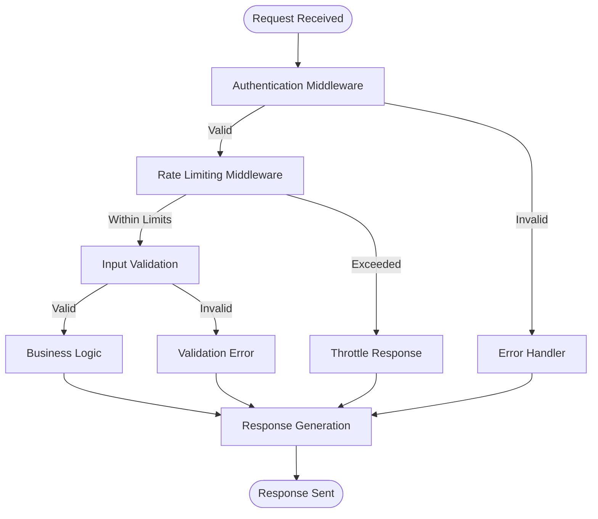

**Diagram sources**
- [packages/core](file://packages/core)
- [packages/app](file://packages/app)

**Section sources**
- [packages/core](file://packages/core)
- [packages/app](file://packages/app)

## Custom Plugin Architecture

### Plugin System Design

The plugin system enables extensibility through a well-defined interface that allows third-party developers to extend functionality without modifying core code.

#### Plugin Lifecycle Management

1. **Initialization Phase**: Plugin discovery and configuration loading
2. **Registration Phase**: Hook registration and dependency resolution
3. **Execution Phase**: Runtime plugin execution and event handling
4. **Cleanup Phase**: Resource cleanup and graceful shutdown

#### Plugin Development Patterns

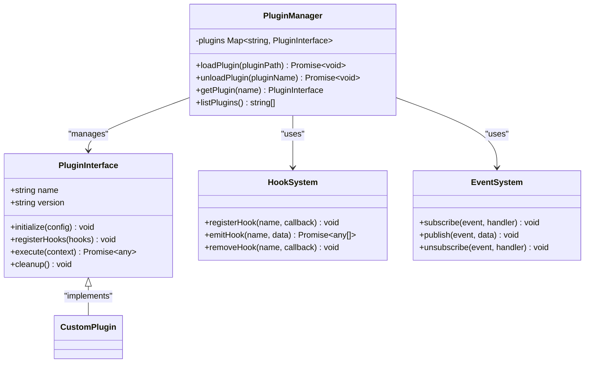

**Diagram sources**
- [packages/plugin](file://packages/plugin)
- [packages/core](file://packages/core)

**Section sources**
- [packages/plugin](file://packages/plugin)
- [packages/core](file://packages/core)

## Protocol Implementation Patterns

### Custom Protocol Development

The protocol layer supports multiple communication patterns including REST, WebSocket, and custom binary protocols.

#### Protocol Abstraction Layer

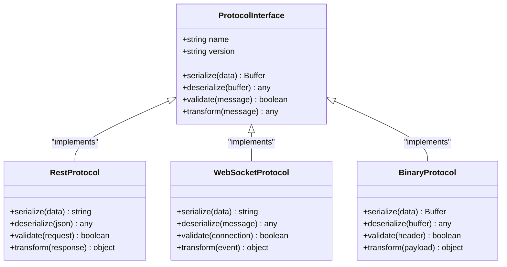

**Diagram sources**
- [packages/protocol](file://packages/protocol)
- [packages/schema](file://packages/schema)

**Section sources**
- [packages/protocol](file://packages/protocol)
- [packages/schema](file://packages/schema)

## Advanced Testing Strategies

### Test Architecture and Patterns

The testing framework supports unit, integration, and end-to-end testing with comprehensive mocking capabilities.

#### Testing Pyramid Implementation

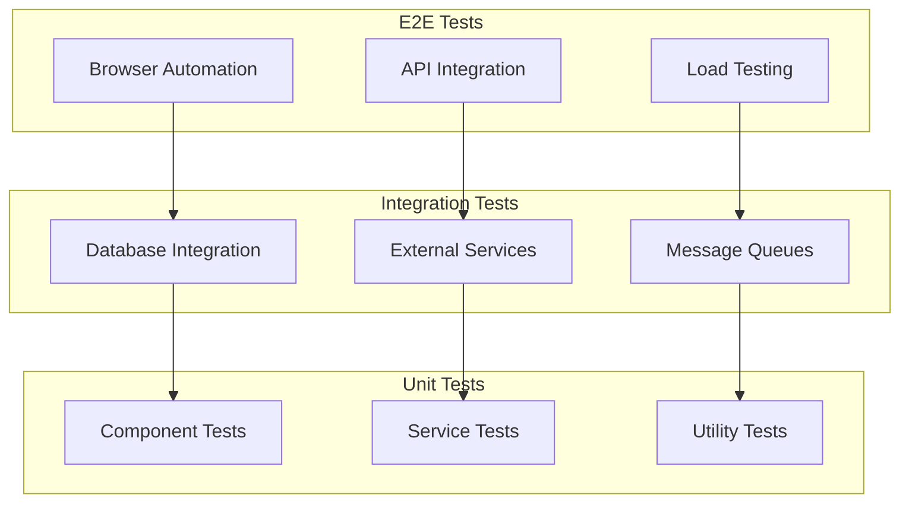

#### Performance Testing Strategies

1. **Load Testing**: Simulate concurrent user scenarios
2. **Stress Testing**: Identify breaking points under extreme conditions
3. **Soak Testing**: Monitor performance over extended periods
4. **Spike Testing**: Evaluate response to sudden traffic increases

**Section sources**
- [packages/app](file://packages/app)
- [packages/client](file://packages/client)

## Performance Monitoring and Optimization

### Monitoring Architecture

Implement comprehensive monitoring across all layers of the application stack.

#### Key Metrics Collection

1. **Application Metrics**: Request latency, error rates, throughput
2. **Resource Metrics**: CPU usage, memory consumption, disk I/O
3. **Database Metrics**: Query performance, connection pooling, cache hit rates
4. **External Dependencies**: API response times, service availability

#### Performance Optimization Techniques

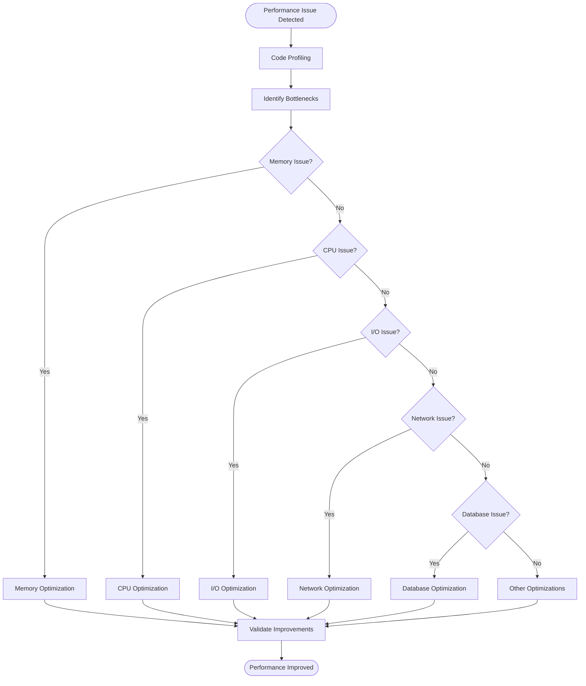

**Diagram sources**
- [packages/core](file://packages/core)
- [packages/http-recorder](file://packages/http-recorder)

**Section sources**
- [packages/http-recorder](file://packages/http-recorder)
- [packages/core](file://packages/core)

## Security Considerations and Best Practices

### Security Architecture

Implement defense-in-depth security measures across all application layers.

#### Security Layers

1. **Input Validation**: Comprehensive input sanitization and validation
2. **Authentication**: Multi-factor authentication and session management
3. **Authorization**: Role-based access control and permission validation
4. **Data Protection**: Encryption at rest and in transit
5. **API Security**: Rate limiting, CORS policies, and API key management

#### Vulnerability Mitigation Strategies

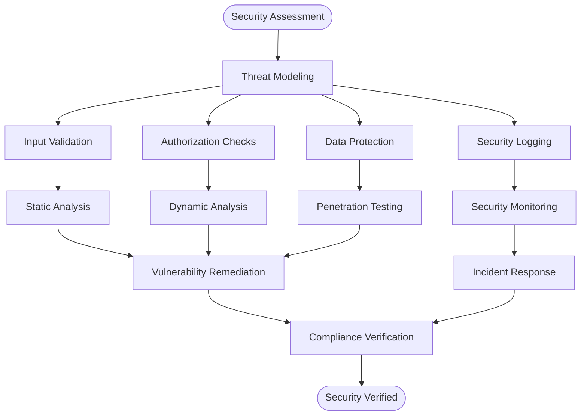

**Diagram sources**
- [packages/core](file://packages/core)
- [packages/schema](file://packages/schema)

**Section sources**
- [packages/core](file://packages/core)
- [packages/schema](file://packages/schema)

## Scaling and Load Balancing

### Horizontal Scaling Strategies

Design applications for horizontal scalability using microservices and containerization.

#### Load Balancing Patterns

1. **Round Robin**: Distribute requests evenly across instances
2. **Least Connections**: Route to instance with fewest active connections
3. **IP Hashing**: Maintain session affinity based on client IP
4. **Weighted Routing**: Distribute based on instance capacity

#### Auto-scaling Configuration

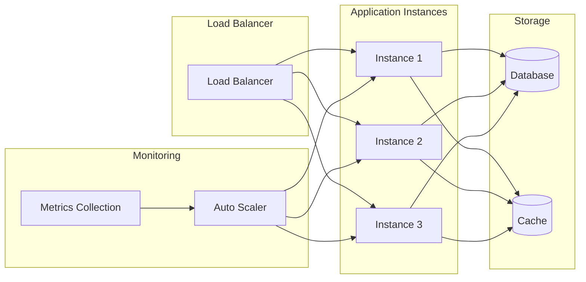

**Diagram sources**
- [packages/app](file://packages/app)
- [packages/core](file://packages/core)

**Section sources**
- [packages/app](file://packages/app)
- [packages/core](file://packages/core)

## Distributed System Patterns

### Microservices Architecture

Implement microservices with proper service discovery, circuit breaking, and fault tolerance.

#### Service Communication Patterns

1. **Synchronous**: REST APIs and gRPC for immediate responses
2. **Asynchronous**: Message queues and event streaming for decoupled processing
3. **Event-driven**: Event sourcing and CQRS for complex business logic

#### Circuit Breaker Implementation

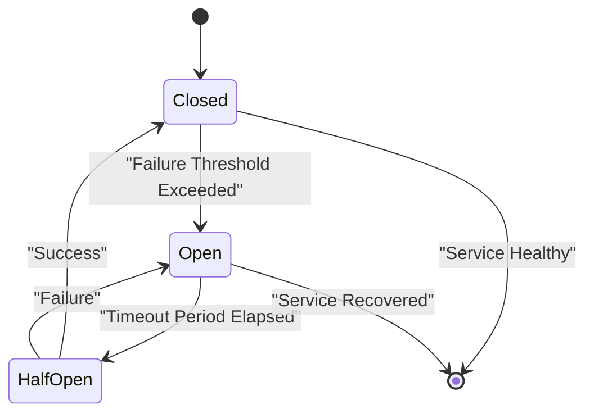

**Diagram sources**
- [packages/core](file://packages/core)
- [packages/protocol](file://packages/protocol)

**Section sources**
- [packages/core](file://packages/core)
- [packages/protocol](file://packages/protocol)

## Debugging and Profiling Techniques

### Debugging Methodologies

Implement systematic approaches to identify and resolve complex issues.

#### Debugging Tools and Techniques

1. **Structured Logging**: Centralized log aggregation and analysis
2. **Distributed Tracing**: Request tracing across microservices
3. **Performance Profiling**: CPU and memory profiling tools
4. **Heap Dump Analysis**: Memory leak detection and optimization

#### Profiling Workflow

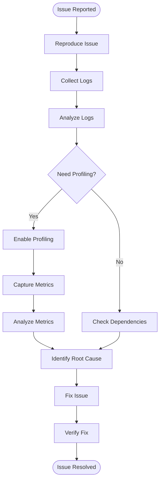

**Diagram sources**
- [packages/http-recorder](file://packages/http-recorder)
- [packages/core](file://packages/core)

**Section sources**
- [packages/http-recorder](file://packages/http-recorder)
- [packages/core](file://packages/core)

## Memory Optimization Strategies

### Memory Management Best Practices

Implement efficient memory management to prevent leaks and optimize performance.

#### Memory Optimization Techniques

1. **Object Pooling**: Reuse expensive objects instead of creating new ones
2. **Lazy Loading**: Load resources only when needed
3. **Garbage Collection Tuning**: Optimize GC settings for workload patterns
4. **Memory Leak Detection**: Regular memory profiling and leak detection

#### Memory Profiling Process

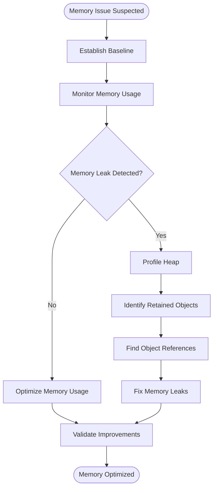

**Diagram sources**
- [packages/core](file://packages/core)
- [packages/effect-sqlite-node](file://packages/effect-sqlite-node)

**Section sources**
- [packages/core](file://packages/core)
- [packages/effect-sqlite-node](file://packages/effect-sqlite-node)

## Disaster Recovery and Backup Strategies

### Disaster Recovery Planning

Implement comprehensive disaster recovery procedures to ensure business continuity.

#### Backup Strategies

1. **Full Backups**: Complete system snapshots at regular intervals
2. **Incremental Backups**: Only changed data since last backup
3. **Continuous Backup**: Real-time data replication
4. **Off-site Storage**: Geographic distribution of backups

#### Recovery Procedures

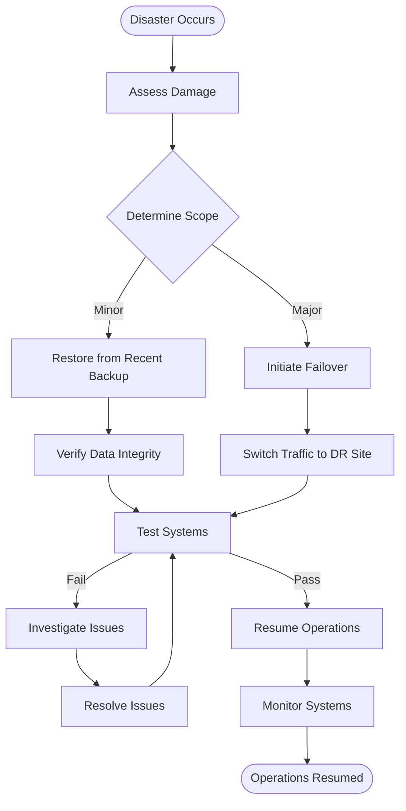

**Section sources**
- [packages/core](file://packages/core)
- [packages/effect-drizzle-sqlite](file://packages/effect-drizzle-sqlite)

## Operational Excellence Practices

### DevOps and CI/CD

Implement automated deployment pipelines and operational best practices.

#### CI/CD Pipeline Stages

1. **Code Quality**: Static analysis and linting
2. **Testing**: Unit, integration, and E2E tests
3. **Build**: Artifact creation and versioning
4. **Deployment**: Automated deployment to staging and production
5. **Monitoring**: Health checks and performance monitoring

#### Operational Monitoring

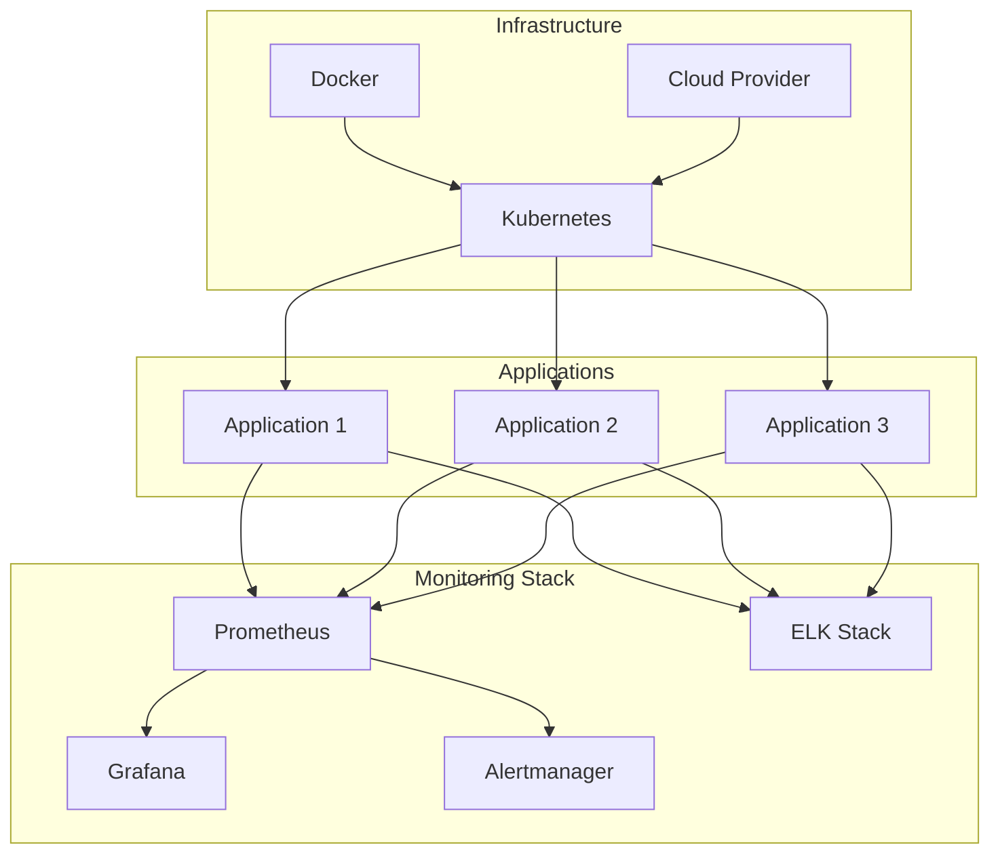

**Section sources**
- [packages/app](file://packages/app)
- [packages/core](file://packages/core)

## Contributing Guidelines

### Development Workflow

Follow established contribution guidelines to maintain code quality and consistency.

#### Code Review Process

1. **Pull Requests**: Create descriptive PRs with clear change descriptions
2. **Code Reviews**: Peer review with focus on quality and security
3. **Testing**: Ensure all tests pass before merging
4. **Documentation**: Update documentation for significant changes

#### Coding Standards

1. **TypeScript**: Strict typing and comprehensive interfaces
2. **ESLint**: Consistent code style and formatting
3. **Prettier**: Automatic code formatting
4. **Commit Messages**: Conventional commit message format

**Section sources**
- [package.json](file://package.json)
- [tsconfig.json](file://tsconfig.json)

## Conclusion

This comprehensive guide covers advanced topics essential for building and maintaining high-quality, scalable web applications using the OpenCode Web UI framework. By following these patterns and best practices, developers can create robust systems that are secure, performant, and maintainable. The modular architecture enables easy extension and customization while providing strong foundations for enterprise-grade applications.

Key takeaways include:
- Implement comprehensive middleware for cross-cutting concerns
- Design extensible plugin architectures for customization
- Follow security best practices throughout the development lifecycle
- Plan for scalability and distributed system challenges early
- Establish robust monitoring, debugging, and operational procedures
- Maintain high code quality through automated testing and reviews

By adhering to these guidelines, teams can deliver reliable software solutions that meet enterprise requirements while maintaining developer productivity and system reliability.