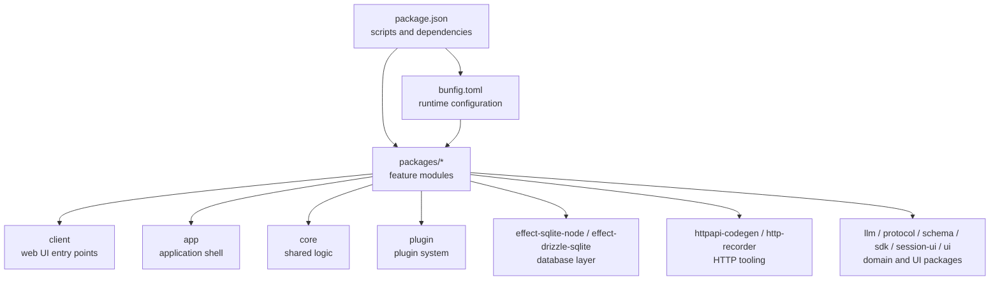
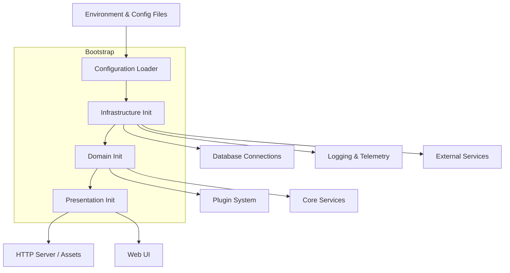
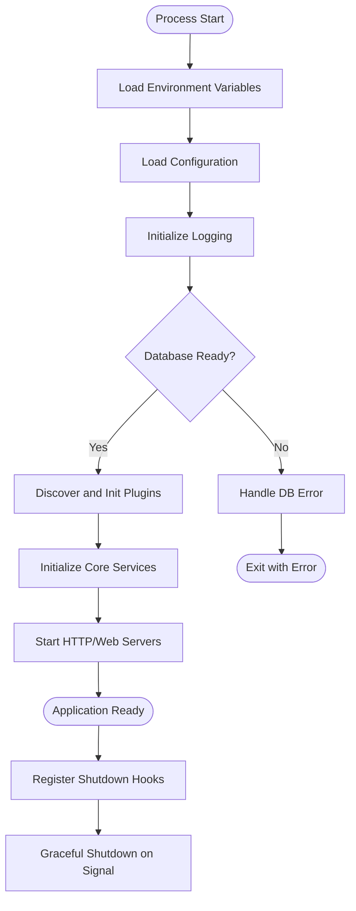
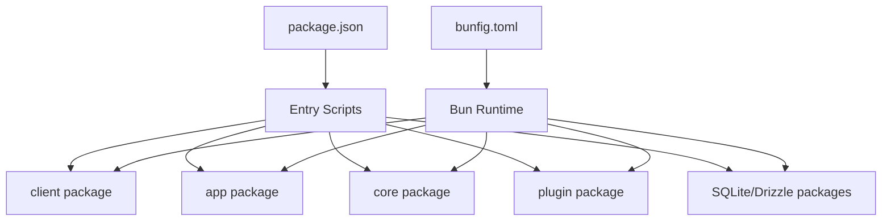

# Application Bootstrap

<cite>
**Referenced Files in This Document**
- [package.json](file://package.json)
- [bunfig.toml](file://bunfig.toml)
- [README.md](file://README.md)
</cite>

## Table of Contents
1. [Introduction](#introduction)
2. [Project Structure](#project-structure)
3. [Core Components](#core-components)
4. [Architecture Overview](#architecture-overview)
5. [Detailed Component Analysis](#detailed-component-analysis)
6. [Dependency Analysis](#dependency-analysis)
7. [Performance Considerations](#performance-considerations)
8. [Troubleshooting Guide](#troubleshooting-guide)
9. [Conclusion](#conclusion)
10. [Appendices](#appendices)

## Introduction
This document explains the bootstrap process for the OpenCode Web UI application. It covers how the application starts, where configuration is loaded, how database connections are established, and how the plugin system is initialized. It also documents the startup lifecycle, error handling during bootstrapping, graceful shutdown procedures, and ways to customize or extend the bootstrap flow with new initialization steps.

## Project Structure
The repository is a multi-package workspace managed by Bun. The top-level package.json defines scripts and dependencies that orchestrate the build and runtime behavior across packages. The bunfig.toml configures the Bun runtime environment and can influence how the application boots (for example, through environment variables or runtime flags). The README provides high-level project context and usage guidance.

**Diagram sources**
- [package.json](file://package.json)
- [bunfig.toml](file://bunfig.toml)
- [README.md](file://README.md)

**Section sources**
- [package.json](file://package.json)
- [bunfig.toml](file://bunfig.toml)
- [README.md](file://README.md)

## Core Components
- Entry points: Top-level scripts in package.json define how the app is started and built. These scripts typically invoke Bun to run the client or app entry points within the packages directory.
- Runtime configuration: bunfig.toml sets runtime options and environment variables that affect bootstrapping behavior.
- Database layer: Packages related to SQLite and Drizzle provide the data access primitives used during initialization to ensure schemas are ready and connections are established.
- Plugin system: The plugin package exposes interfaces and loaders used to discover, configure, and initialize plugins during startup.

Key responsibilities during bootstrap:
- Load configuration from environment and config files.
- Initialize logging and telemetry if present.
- Establish database connections and verify schema readiness.
- Discover and initialize plugins.
- Start HTTP servers or web assets as needed.
- Handle errors early and report them clearly.
- Prepare graceful shutdown hooks.

**Section sources**
- [package.json](file://package.json)
- [bunfig.toml](file://bunfig.toml)

## Architecture Overview
The bootstrap architecture follows a layered approach:
- Configuration layer reads environment and config files.
- Infrastructure layer initializes logging, database connections, and external services.
- Domain layer initializes core business logic and plugin system.
- Presentation layer prepares the web UI and HTTP endpoints.

[No sources needed since this diagram shows conceptual workflow, not actual code structure]

## Detailed Component Analysis

### Bootstrap Lifecycle
The typical bootstrap sequence includes:
- Parse CLI arguments and load environment variables.
- Read configuration files and merge defaults.
- Initialize logging and error reporting.
- Establish database connections and validate schema.
- Discover and initialize plugins.
- Start servers and expose endpoints.
- Register shutdown handlers for graceful termination.

[No sources needed since this diagram shows conceptual workflow, not actual code structure]

### Configuration Loading
- Sources: Environment variables and configuration files.
- Behavior: Merge defaults with overrides; validate required fields; surface validation errors early.
- Integration: Consumed by infrastructure and domain layers to configure database, logging, and plugins.

Customization tips:
- Add new configuration keys and validation rules.
- Provide default values and override mechanisms via environment variables.
- Centralize configuration parsing to avoid duplication.

**Section sources**
- [bunfig.toml](file://bunfig.toml)

### Database Initialization
- Responsibilities: Create connection pools, apply migrations or schema checks, and verify connectivity.
- Error handling: Fail fast on connection failures; log detailed diagnostics; exit with non-zero status.
- Integration: Expose a ready signal to downstream components.

Customization tips:
- Add retry logic with backoff for transient failures.
- Introduce health check endpoints for liveness/readiness probes.
- Support multiple databases by abstracting connection factories.

**Section sources**
- [README.md](file://README.md)

### Plugin System Initialization
- Discovery: Scan configured directories or registries for plugin definitions.
- Configuration: Merge per-plugin settings with global defaults.
- Lifecycle: Execute pre-init, init, and post-init phases; handle plugin errors without crashing the host.

Customization tips:
- Implement a plugin loader interface to support dynamic loading.
- Add dependency ordering between plugins.
- Provide a plugin registry API for runtime inspection.

**Section sources**
- [README.md](file://README.md)

### Startup Sequence and Dependency Injection
- Pattern: Use an inversion-of-control container or explicit wiring to assemble services.
- Order: Ensure dependencies are created before consumers; resolve circular dependencies via lazy initialization or interfaces.
- Testing: Inject test doubles for configuration, database, and plugins.

Customization tips:
- Define clear interfaces for services and plugins.
- Provide factory functions for creating instances with configurable options.
- Use module-level singletons sparingly; prefer explicit dependency passing.

**Section sources**
- [package.json](file://package.json)

### Error Handling During Bootstrapping
- Early failures: Validate configuration and environment; fail fast with actionable messages.
- Database errors: Capture stack traces and connection details; suggest remediation steps.
- Plugin errors: Isolate failures per plugin; continue boot if possible; log warnings.

Best practices:
- Centralize error types and codes.
- Provide structured logs with correlation IDs.
- Surface user-friendly messages while retaining technical details in logs.

**Section sources**
- [README.md](file://README.md)

### Graceful Shutdown Procedures
- Signals: Listen for SIGINT/SIGTERM; stop accepting new requests.
- Drain: Wait for in-flight operations to complete or timeout.
- Cleanup: Close database connections, flush logs, release resources.

Customization tips:
- Add custom cleanup tasks per service or plugin.
- Implement a shutdown coordinator to manage ordering.
- Expose a shutdown status endpoint for monitoring.

**Section sources**
- [README.md](file://README.md)

## Dependency Analysis
Top-level scripts and runtime configuration drive the bootstrap:
- package.json scripts invoke Bun to start the application and its packages.
- bunfig.toml influences runtime behavior and environment setup.
- Internal packages depend on shared core, plugin interfaces, and database abstractions.

**Diagram sources**
- [package.json](file://package.json)
- [bunfig.toml](file://bunfig.toml)

**Section sources**
- [package.json](file://package.json)
- [bunfig.toml](file://bunfig.toml)

## Performance Considerations
- Lazy initialization: Defer expensive setup until first use.
- Connection pooling: Reuse database connections and set sensible limits.
- Plugin discovery: Cache discovered plugins and avoid repeated filesystem scans.
- Logging: Use async logging and avoid synchronous IO during critical paths.
- Health checks: Implement lightweight readiness probes to avoid premature traffic.

[No sources needed since this section provides general guidance]

## Troubleshooting Guide
Common issues and resolutions:
- Configuration errors: Verify environment variables and config file paths; check validation messages.
- Database connection failures: Inspect credentials, network reachability, and schema state; enable verbose logging.
- Plugin load failures: Review plugin manifests and dependencies; isolate failing plugins.
- Shutdown hangs: Identify long-running tasks; add timeouts and force-cleanup strategies.

Debugging tips:
- Enable debug logging during bootstrap.
- Use structured logs with request IDs.
- Add readiness and liveness endpoints to monitor state.

**Section sources**
- [README.md](file://README.md)

## Conclusion
The OpenCode Web UI bootstrap process is designed to be robust, extensible, and observable. By centralizing configuration, isolating plugin initialization, and enforcing clear error handling and shutdown procedures, the application achieves reliable startup behavior. Customization points allow teams to adapt the bootstrap flow to specific environments and requirements while maintaining stability.

[No sources needed since this section summarizes without analyzing specific files]

## Appendices

### Example: Adding a New Initialization Step
- Define a new service or plugin interface.
- Wire it into the dependency container after configuration and before server start.
- Implement error handling and logging within the step.
- Add tests to validate initialization order and failure modes.

[No sources needed since this section provides general guidance]

### Example: Customizing Configuration Loading
- Extend the configuration parser to read additional sources (e.g., secrets manager).
- Validate new fields and provide defaults.
- Propagate configuration to dependent services.

[No sources needed since this section provides general guidance]