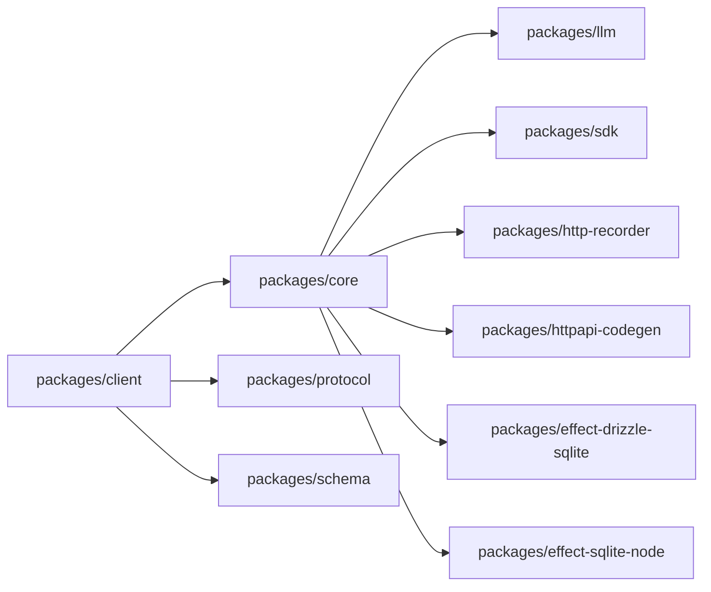

# Application Setup

<cite>
**Referenced Files in This Document**
- [package.json](file://package.json)
- [bunfig.toml](file://bunfig.toml)
- [tsconfig.json](file://tsconfig.json)
- [README.md](file://README.md)
- [bun.lock](file://bun.lock)
</cite>

## Table of Contents
1. [Introduction](#introduction)
2. [Project Structure](#project-structure)
3. [Core Components](#core-components)
4. [Architecture Overview](#architecture-overview)
5. [Detailed Component Analysis](#detailed-component-analysis)
6. [Dependency Analysis](#dependency-analysis)
7. [Performance Considerations](#performance-considerations)
8. [Troubleshooting Guide](#troubleshooting-guide)
9. [Conclusion](#conclusion)
10. [Appendices](#appendices)

## Introduction
This document explains how to set up and run the main OpenCode Web UI application. It covers environment setup, configuration management, build system (Bun + TypeScript), development workflow, deployment strategies, runtime configuration, debugging, logging, performance monitoring, and customization examples. The goal is to help you get the application running locally and in production with confidence.

## Project Structure
The repository follows a monorepo layout under packages/, with multiple internal packages such as app, client, core, llm, protocol, schema, sdk, ui, session-ui, and others. Configuration files at the repository root include package.json for dependency orchestration, bunfig.toml for Bun-specific settings, tsconfig.json for TypeScript compilation, and bun.lock for lockfile consistency.

```mermaid
graph TB
A["Repository Root"] --> B["packages/app"]
A --> C["packages/client"]
A --> D["packages/core"]
A --> E["packages/llm"]
A --> F["packages/ui"]
A --> G["packages/session-ui"]
A --> H["packages/sdk"]
A --> I["packages/protocol"]
A --> J["packages/schema"]
A --> K["packages/effect-drizzle-sqlite"]
A --> L["packages/effect-sqlite-node"]
A --> M["packages/http-recorder"]
A --> N["packages/httpapi-codegen"]
A --> O["patches/*"]
A --> P["package.json"]
A --> Q["bunfig.toml"]
A --> R["tsconfig.json"]
A --> S["bun.lock"]
```



[No sources needed since this diagram shows conceptual structure]

## Core Components
- Build toolchain: Bun is used for scripting, dependency resolution, and fast builds.
- Type system: TypeScript is configured via tsconfig.json for consistent compilation across packages.
- Monorepo orchestration: package.json defines workspace scripts and shared dependencies.
- Lockfile: bun.lock ensures deterministic installs across environments.

Key responsibilities:
- package.json: Workspace definitions, scripts, and dependency versions.
- bunfig.toml: Bun runtime and bundler configuration.
- tsconfig.json: Compiler options, module resolution, and path mappings.
- bun.lock: Deterministic dependency tree.

**Section sources**
- [package.json](file://package.json)
- [bunfig.toml](file://bunfig.toml)
- [tsconfig.json](file://tsconfig.json)
- [bun.lock](file://bun.lock)

## Architecture Overview
At a high level, the application consists of:
- A web UI layer (client/UI/session-ui)
- Core business logic (core, llm, protocol, schema)
- SDK and integration layers (sdk, http-recorder, httpapi-codegen)
- Database integrations (effect-drizzle-sqlite, effect-sqlite-node)
- Shared patches for third-party compatibility

```mermaid
graph TB
subgraph "UI Layer"
UI["packages/ui"]
Client["packages/client"]
SessionUI["packages/session-ui"]
end
subgraph "Core"
Core["packages/core"]
Protocol["packages/protocol"]
Schema["packages/schema"]
end
subgraph "Integrations"
LLM["packages/llm"]
SDK["packages/sdk"]
HTTPRecorder["packages/http-recorder"]
HTTPAPICodegen["packages/httpapi-codegen"]
end
subgraph "Data"
DrizzleSQLite["packages/effect-drizzle-sqlite"]
SQLiteNode["packages/effect-sqlite-node"]
end
Client --> UI
Client --> Core
Client --> Protocol
Client --> Schema
Core --> LLM
Core --> SDK
Core --> HTTPRecorder
Core --> HTTPAPICodegen
Core --> DrizzleSQLite
Core --> SQLiteNode
```

[No sources needed since this diagram shows conceptual architecture]

## Detailed Component Analysis

### Environment Setup
- Install Bun if not present.
- Ensure Node.js is installed only if required by specific scripts or tools; prefer Bun where possible.
- Use bun install to resolve dependencies deterministically via bun.lock.

Recommended steps:
- Clone the repository.
- Run the dependency installer.
- Verify installation by running a basic script defined in package.json.

Environment variables:
- Create a .env file at the repository root or per-package as needed.
- Common categories:
  - API endpoints and service URLs
  - Authentication tokens and secrets
  - Feature flags and toggles
  - Logging levels and output destinations
  - Database connection strings and paths
  - Cache and session storage settings

Best practices:
- Never commit secrets; use .gitignore and secret managers.
- Provide a .env.example with non-sensitive defaults.
- Validate required variables at startup.

**Section sources**
- [package.json](file://package.json)
- [bunfig.toml](file://bunfig.toml)
- [tsconfig.json](file://tsconfig.json)

### Build System (Bun + TypeScript)
- Bun handles dependency installation and execution of scripts.
- TypeScript compiles source code with shared compiler options.
- Use bun run commands defined in package.json for building, watching, and serving.

Typical workflows:
- Development: watch mode with hot reload for faster iteration.
- Production: optimized builds with minification and tree-shaking.
- Type checking: run type checks before builds to catch errors early.

Configuration highlights:
- Module resolution and path aliases are defined in tsconfig.json.
- Bun-specific bundling and runtime behavior are controlled via bunfig.toml.
- Scripts in package.json coordinate multi-package builds.

**Section sources**
- [package.json](file://package.json)
- [bunfig.toml](file://bunfig.toml)
- [tsconfig.json](file://tsconfig.json)

### Dependency Management
- All dependencies are managed through package.json and locked by bun.lock.
- Patches directory contains targeted fixes for third-party packages when necessary.
- Use bun add/remove to update dependencies consistently.

Guidelines:
- Prefer pinned versions to ensure reproducibility.
- Apply patches only when required and document reasons.
- Audit dependencies regularly for security updates.

**Section sources**
- [package.json](file://package.json)
- [bun.lock](file://bun.lock)
- [patches/*](file://patches)

### Package Orchestration
- The root package.json coordinates workspace scripts and shared configurations.
- Each package may define its own scripts for local development and testing.
- Cross-package imports rely on TypeScript path mappings and workspace linking.

Operational tips:
- Run workspace-wide commands from the root.
- Isolate package-level tasks to avoid cross-contamination.
- Use environment variables scoped per package when needed.

**Section sources**
- [package.json](file://package.json)

### Deployment Strategies
- Production builds should be optimized and stripped of development-only features.
- Containerize the application using Docker for consistent deployments.
- Serve static assets efficiently and configure caching headers.

Deployment checklist:
- Build artifacts generated by Bun and TypeScript.
- Environment variables injected at runtime via platform or orchestrator.
- Health check endpoints exposed for readiness and liveness probes.
- Log aggregation and metrics collection enabled.

**Section sources**
- [package.json](file://package.json)
- [bunfig.toml](file://bunfig.toml)

### Runtime Configuration
- Load environment variables at startup and validate them.
- Provide sensible defaults for optional settings.
- Expose configuration endpoints or health checks for observability.

Runtime best practices:
- Separate config from code; externalize secrets.
- Gracefully handle missing or invalid configuration.
- Support feature flags for gradual rollouts.

**Section sources**
- [package.json](file://package.json)
- [bunfig.toml](file://bunfig.toml)

### Debugging Setup
- Enable verbose logs during development using environment variables.
- Use Bun’s built-in debugging capabilities and attach IDE debuggers.
- Add structured logging for traceability across services.

Debugging tips:
- Use log levels to control verbosity.
- Correlate requests with unique IDs.
- Capture error stacks and context.

**Section sources**
- [package.json](file://package.json)
- [bunfig.toml](file://bunfig.toml)

### Logging Configuration
- Centralize logging configuration at the application entry point.
- Output logs in JSON format for machine parsing.
- Route logs to stdout/stderr for containerized environments.

Logging guidelines:
- Include timestamps, levels, and request IDs.
- Avoid sensitive data in logs.
- Implement log rotation and retention policies.

**Section sources**
- [package.json](file://package.json)
- [bunfig.toml](file://bunfig.toml)

### Performance Monitoring
- Instrument key operations with metrics (latency, throughput, errors).
- Use tracing to visualize request flows across components.
- Monitor resource usage (CPU, memory, I/O).

Monitoring recommendations:
- Integrate with observability platforms.
- Set alerts for anomalies.
- Profile critical paths during development.

**Section sources**
- [package.json](file://package.json)
- [bunfig.toml](file://bunfig.toml)

### Customizing Startup and Integrating Services
- Override default configurations via environment variables.
- Register additional plugins or middleware at startup.
- Wire up external services (LLM providers, databases, caches) through configuration.

Integration examples:
- Add new LLM provider by defining credentials and endpoint configuration.
- Connect to a different database by updating connection strings and drivers.
- Enable HTTP recording for API inspection during development.

**Section sources**
- [package.json](file://package.json)
- [bunfig.toml](file://bunfig.toml)

## Dependency Analysis
The monorepo organizes functionality into focused packages. Dependencies flow from UI to core and integrations, with data layers abstracted behind Effect-based packages.



[No sources needed since this diagram shows conceptual dependencies]

## Performance Considerations
- Use Bun for fast installs and builds; leverage its optimizations.
- Minimize bundle size by tree-shaking and code splitting.
- Cache dependencies and build artifacts in CI/CD pipelines.
- Profile cold starts and optimize initialization sequences.
- Configure appropriate timeouts and retries for external calls.

[No sources needed since this section provides general guidance]

## Troubleshooting Guide
Common issues and resolutions:
- Dependency resolution failures: verify bun.lock integrity and run bun install.
- TypeScript errors: ensure tsconfig paths match actual package layouts.
- Missing environment variables: validate required variables at startup.
- Port conflicts: adjust server ports or kill conflicting processes.
- Patch-related problems: review patches directory and reapply if necessary.

Debugging steps:
- Enable verbose logging and inspect startup logs.
- Reproduce issues in isolation within a single package.
- Use Bun’s debugger and attach breakpoints.

**Section sources**
- [package.json](file://package.json)
- [bunfig.toml](file://bunfig.toml)
- [tsconfig.json](file://tsconfig.json)

## Conclusion
You now have a complete guide to setting up, configuring, building, deploying, and operating the OpenCode Web UI application. Follow the environment and configuration steps carefully, use the provided scripts for development and production, and apply the troubleshooting advice when issues arise. For customizations, extend the startup process and integrate additional services through environment-driven configuration.

[No sources needed since this section summarizes without analyzing specific files]

## Appendices

### Quick Start Checklist
- Install Bun and required tools.
- Copy .env.example to .env and fill in values.
- Run bun install to resolve dependencies.
- Execute development scripts from package.json.
- Build for production and deploy artifacts.

### Example Commands
- Install dependencies: bun install
- Start development server: bun run dev
- Build production artifacts: bun run build
- Run type checks: bun run typecheck

[No sources needed since this section provides general guidance]