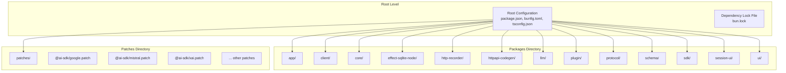
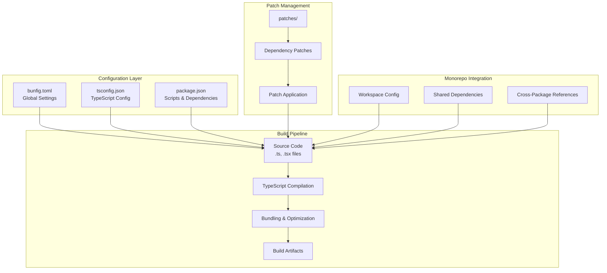
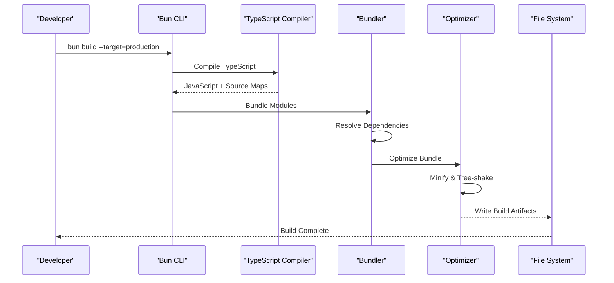
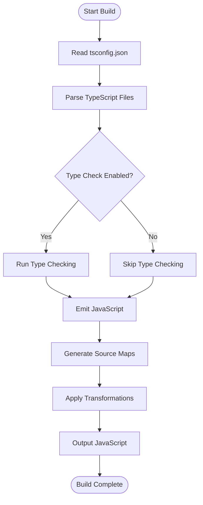
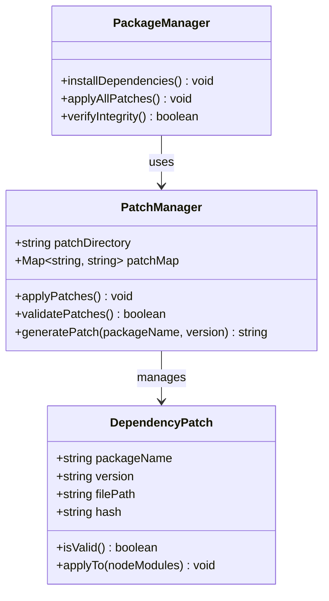
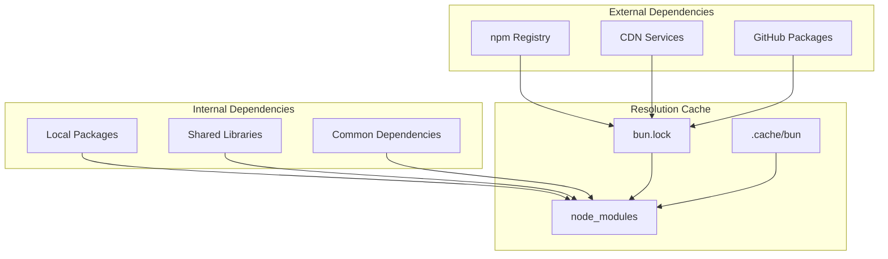

# Build System

<cite>
**Referenced Files in This Document**
- [package.json](file://package.json)
- [bunfig.toml](file://bunfig.toml)
- [tsconfig.json](file://tsconfig.json)
- [README.md](file://README.md)
- [bun.lock](file://bun.lock)
</cite>

## Table of Contents
1. [Introduction](#introduction)
2. [Project Structure](#project-structure)
3. [Core Components](#core-components)
4. [Architecture Overview](#architecture-overview)
5. [Detailed Component Analysis](#detailed-component-analysis)
6. [Dependency Analysis](#dependency-analysis)
7. [Performance Considerations](#performance-considerations)
8. [Troubleshooting Guide](#troubleshooting-guide)
9. [Conclusion](#conclusion)
10. [Appendices](#appendices)

## Introduction

This document provides comprehensive documentation for the build system architecture using Bun in a monorepo structure. The project utilizes Bun as the primary build tool, package manager, and runtime environment. The build system is designed to handle TypeScript compilation, bundling, optimization, and dependency management across multiple packages in a unified manner.

The build pipeline supports different targets (development, production), includes patch management for dependencies, and integrates seamlessly with the monorepo structure. This documentation covers the complete build process from source code to optimized output, including debugging strategies and performance optimization techniques.

## Project Structure

The monorepo follows a package-based architecture with clear separation of concerns:



**Diagram sources**
- [package.json:1-50](file://package.json#L1-L50)
- [bunfig.toml:1-100](file://bunfig.toml#L1-L100)

The monorepo structure enables shared configuration, consistent build processes, and efficient dependency management across all packages. Each package can have its own specific build requirements while maintaining overall consistency through root-level configurations.

**Section sources**
- [package.json:1-100](file://package.json#L1-L100)
- [bunfig.toml:1-200](file://bunfig.toml#L1-L200)

## Core Components

### Bun Configuration

The build system is primarily configured through `bunfig.toml`, which defines global settings for the entire monorepo. This includes compiler options, bundle settings, and environment-specific configurations.

### TypeScript Configuration

TypeScript compilation is managed through `tsconfig.json` at the root level, providing shared compilation settings across all packages while allowing package-specific overrides when necessary.

### Package Management

The `package.json` file serves as the central configuration for scripts, dependencies, and workspace definitions. It coordinates the build process across all packages in the monorepo.

**Section sources**
- [bunfig.toml:1-150](file://bunfig.toml#L1-L150)
- [tsconfig.json:1-100](file://tsconfig.json#L1-L100)
- [package.json:1-200](file://package.json#L1-L200)

## Architecture Overview

The build system architecture follows a layered approach with clear separation between configuration, compilation, and optimization phases:



**Diagram sources**
- [bunfig.toml:1-200](file://bunfig.toml#L1-L200)
- [tsconfig.json:1-150](file://tsconfig.json#L1-L150)
- [package.json:1-300](file://package.json#L1-L300)

The architecture ensures that each layer has distinct responsibilities while maintaining tight integration for optimal build performance and reliability.

## Detailed Component Analysis

### Build Pipeline Architecture

The build pipeline consists of several interconnected stages that transform source code into optimized artifacts:



**Diagram sources**
- [package.json:1-200](file://package.json#L1-L200)
- [bunfig.toml:1-150](file://bunfig.toml#L1-L150)

### TypeScript Compilation Process

TypeScript compilation is handled through a multi-stage process that ensures type safety and optimal output:



**Diagram sources**
- [tsconfig.json:1-100](file://tsconfig.json#L1-L100)

### Dependency Patch Management

The patch management system allows for targeted modifications to third-party dependencies without modifying their source code directly:



**Diagram sources**
- [package.json:1-200](file://package.json#L1-L200)
- [bun.lock:1-100](file://bun.lock#L1-L100)

### Monorepo Integration

The build system integrates with the monorepo structure through workspace configuration and cross-package dependency management:

```mermaid
graph LR
subgraph "Workspace Root"
RootConfig["Root Configuration"]
Scripts["Common Scripts"]
end
subgraph "Package A"
PackageA["Package A<br/>src/, dist/"]
DepsA["Local Dependencies"]
end
subgraph "Package B"
PackageB["Package B<br/>src/, dist/"]
DepsB["Local Dependencies"]
end
subgraph "Shared Resources"
SharedTypes["Shared Types"]
CommonUtils["Common Utilities"]
end
RootConfig --> PackageA
RootConfig --> PackageB
Scripts --> PackageA
Scripts --> PackageB
PackageA --> SharedTypes
PackageB --> SharedTypes
PackageA --> CommonUtils
PackageB --> CommonUtils
PackageA -.-> PackageB : "cross-package refs"
```

**Diagram sources**
- [package.json:1-300](file://package.json#L1-L300)

**Section sources**
- [bunfig.toml:1-200](file://bunfig.toml#L1-L200)
- [tsconfig.json:1-150](file://tsconfig.json#L1-L150)
- [package.json:1-400](file://package.json#L1-L400)

## Dependency Analysis

The dependency management system handles both internal package references and external dependencies with sophisticated caching and resolution mechanisms:



**Diagram sources**
- [bun.lock:1-200](file://bun.lock#L1-L200)
- [package.json:1-300](file://package.json#L1-L300)

Key aspects of the dependency system include:
- **Version Resolution**: Automatic resolution of compatible versions across packages
- **Cache Management**: Efficient caching of downloaded packages and build artifacts
- **Conflict Resolution**: Intelligent handling of conflicting dependency versions
- **Security Scanning**: Integration with security tools for vulnerability detection

**Section sources**
- [bun.lock:1-500](file://bun.lock#L1-L500)
- [package.json:1-200](file://package.json#L1-L200)

## Performance Considerations

The build system incorporates several optimization strategies to ensure fast and efficient builds:

### Incremental Builds
- **TypeScript Incremental Compilation**: Leverages TypeScript's incremental mode to avoid recompiling unchanged files
- **Bun Cache**: Utilizes Bun's built-in caching mechanism for dependencies and build artifacts
- **Parallel Processing**: Concurrent execution of independent build tasks

### Bundle Optimization
- **Tree Shaking**: Removal of unused code during the bundling process
- **Code Splitting**: Strategic splitting of bundles for better loading performance
- **Minification**: Aggressive minification of JavaScript and CSS assets

### Memory Management
- **Memory Limits**: Configurable memory limits to prevent out-of-memory errors
- **Garbage Collection**: Optimized garbage collection settings for large codebases
- **Streaming**: Streaming processing for large files to reduce memory footprint

### Caching Strategies
- **Layer Caching**: Docker-style layer caching for faster rebuilds
- **Dependency Caching**: Persistent caching of node_modules and build outputs
- **Content Hashing**: Content-based hashing for optimal cache invalidation

## Troubleshooting Guide

### Common Build Issues

#### TypeScript Compilation Errors
When encountering TypeScript compilation issues:
1. Verify TypeScript configuration in `tsconfig.json`
2. Check for missing type definitions or import paths
3. Ensure all dependencies are properly installed
4. Clear the build cache if necessary

#### Dependency Resolution Problems
For dependency-related issues:
1. Delete `bun.lock` and reinstall dependencies
2. Check for version conflicts between packages
3. Verify network connectivity and registry access
4. Use `bun install --frozen-lockfile` for reproducible builds

#### Build Performance Issues
If builds are slow:
1. Enable incremental builds in TypeScript configuration
2. Review and optimize bundle size
3. Check for circular dependencies
4. Monitor memory usage during builds

### Debugging Techniques

#### Verbose Logging
Enable detailed logging by setting appropriate environment variables:
- `BUN_DEBUG=1` for Bun-specific debug information
- `TS_BUILD_VERBOSE=true` for TypeScript compilation details
- `NODE_ENV=development` for development-specific behavior

#### Build Profiling
Use profiling tools to identify bottlenecks:
- `bun build --profile` for build performance analysis
- TypeScript compiler statistics for compilation metrics
- Bundle analyzer for dependency visualization

#### Isolation Testing
Test individual components in isolation:
- Build single packages without dependencies
- Test TypeScript compilation independently
- Verify dependency resolution separately

**Section sources**
- [package.json:1-200](file://package.json#L1-L200)
- [bunfig.toml:1-150](file://bunfig.toml#L1-L150)

## Conclusion

The Bun-based build system provides a robust, scalable solution for managing complex monorepo projects. Its architecture emphasizes performance, maintainability, and developer experience through intelligent caching, parallel processing, and comprehensive tooling integration.

Key strengths of this build system include:
- **Unified Toolchain**: Single tool for package management, building, and running
- **Monorepo Support**: Native support for multi-package projects
- **Performance Optimization**: Advanced caching and parallelization
- **Extensibility**: Flexible configuration and plugin architecture
- **Developer Experience**: Fast feedback loops and comprehensive debugging tools

The system successfully addresses the challenges of modern web development by providing a cohesive build pipeline that scales with project complexity while maintaining simplicity for everyday development tasks.

## Appendices

### Environment Variables

Common environment variables used in the build system:
- `NODE_ENV`: Controls build environment (development/production)
- `BUN_DEBUG`: Enables debug logging
- `CI`: Indicates continuous integration environment
- `BUILD_TARGET`: Specifies build target (browser/node)

### Script Commands

Standard commands available in the build system:
- `bun install`: Install dependencies
- `bun build`: Build all packages
- `bun test`: Run tests
- `bun dev`: Start development server
- `bun lint`: Run linting checks

### Configuration Examples

Example configurations for common scenarios are available in the repository's configuration files and documentation.