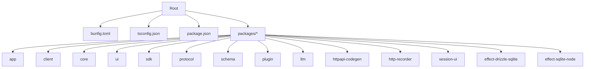
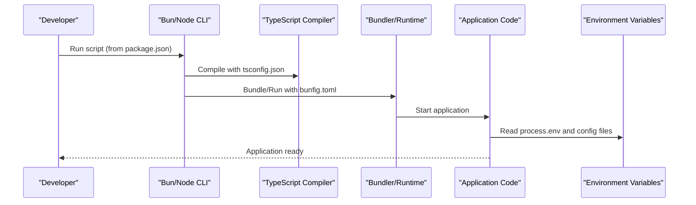
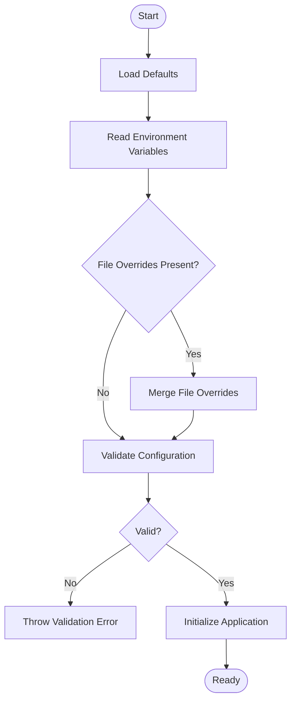
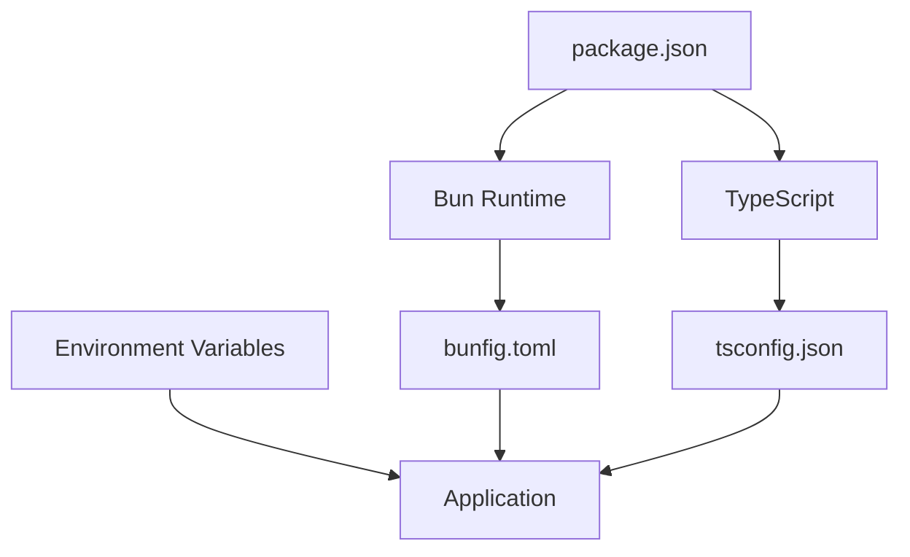

# Configuration Management

<cite>
**Referenced Files in This Document**
- [bunfig.toml](file://bunfig.toml)
- [tsconfig.json](file://tsconfig.json)
- [package.json](file://package.json)
- [README.md](file://README.md)
</cite>

## Table of Contents
1. [Introduction](#introduction)
2. [Project Structure](#project-structure)
3. [Core Components](#core-components)
4. [Architecture Overview](#architecture-overview)
5. [Detailed Component Analysis](#detailed-component-analysis)
6. [Dependency Analysis](#dependency-analysis)
7. [Performance Considerations](#performance-considerations)
8. [Troubleshooting Guide](#troubleshooting-guide)
9. [Conclusion](#conclusion)

## Introduction
This document explains the configuration management system for OpenCode Web UI, focusing on how runtime and build-time configurations are defined and applied. It covers:
- Bun runtime configuration via bunfig.toml
- TypeScript compilation settings via tsconfig.json
- Project metadata and scripts via package.json
- Environment variable handling, precedence rules, and validation strategies
- Examples of custom options, development vs production differences, and dynamic configuration loading patterns at runtime

The goal is to help developers understand where configuration lives, how it is consumed, and how to extend or override it safely across environments.

## Project Structure
At the repository root, configuration is centralized in three primary files:
- bunfig.toml: Bun runtime behavior (e.g., bundling, module resolution, environment variables)
- tsconfig.json: TypeScript compiler options and project references
- package.json: Scripts, dependencies, and metadata used by tooling and the runtime

**Diagram sources**
- [bunfig.toml](file://bunfig.toml)
- [tsconfig.json](file://tsconfig.json)
- [package.json](file://package.json)

**Section sources**
- [README.md](file://README.md)

## Core Components
- Bun runtime configuration (bunfig.toml): Controls bundler behavior, module resolution, environment variable exposure, and performance-related flags.
- TypeScript configuration (tsconfig.json): Defines compiler targets, module systems, path mappings, and strictness levels.
- Project metadata and scripts (package.json): Declares dependencies, dev/build scripts, and entry points that drive tooling and runtime execution.

These components work together to ensure consistent builds and predictable runtime behavior across development and production.

**Section sources**
- [bunfig.toml](file://bunfig.toml)
- [tsconfig.json](file://tsconfig.json)
- [package.json](file://package.json)

## Architecture Overview
Configuration flows from static files into both build-time and runtime phases:
- Build-time: TypeScript reads tsconfig.json; Bun uses bunfig.toml during bundling and execution.
- Runtime: The application reads environment variables and may load additional configuration dynamically based on environment or user input.

**Diagram sources**
- [package.json](file://package.json)
- [tsconfig.json](file://tsconfig.json)
- [bunfig.toml](file://bunfig.toml)

## Detailed Component Analysis

### Bun Runtime Configuration (bunfig.toml)
Purpose:
- Configure bundler behavior, module resolution, and environment variable exposure for Bun.
- Define optimizations and defaults for development and production runs.

Key aspects typically covered:
- Module resolution and aliasing
- Environment variable injection into bundles
- Performance flags and caching behavior
- Plugin hooks and loader overrides

Precedence and validation:
- Values in bunfig.toml apply globally unless overridden per-command or per-environment.
- Invalid keys or types will cause Bun to fail fast during startup or bundling.

Development vs production:
- Development often enables verbose logging and source maps.
- Production typically disables debugging features and optimizes output.

Dynamic configuration:
- At runtime, code can read environment variables exposed by Bun and adjust behavior accordingly.

**Section sources**
- [bunfig.toml](file://bunfig.toml)

### TypeScript Compilation (tsconfig.json)
Purpose:
- Define how TypeScript compiles the codebase, including target, module format, and strictness.
- Provide path mappings and project references for monorepo packages.

Key aspects typically covered:
- Target and lib settings for browser/node compatibility
- Module resolution strategy and paths
- Strict mode and type-checking options
- Include/exclude patterns for packages

Validation:
- TypeScript enforces schema-like constraints; invalid options result in compile errors.
- Path aliases must resolve to actual directories or files.

Development vs production:
- Development may enable incremental builds and richer diagnostics.
- Production builds often strip comments and optimize for size.

**Section sources**
- [tsconfig.json](file://tsconfig.json)

### Project Metadata and Scripts (package.json)
Purpose:
- Centralize dependency versions, scripts, and metadata consumed by tooling and CI.
- Orchestrate build, test, lint, and run commands across packages.

Key aspects typically covered:
- Scripts for development, building, testing, and publishing
- Dependency declarations for runtime and tooling
- Workspaces configuration for monorepo coordination

Environment handling:
- Scripts commonly rely on environment variables to switch modes (development/production).
- Tooling may read .env files or platform-specific variables.

Validation:
- npm/bun validate JSON structure and required fields.
- Missing dependencies or misconfigured scripts lead to immediate failures.

**Section sources**
- [package.json](file://package.json)

### Environment Variable Handling and Precedence
General principles:
- Environment variables are typically loaded from the OS, shell, or .env files before the process starts.
- Some tools support layered configuration (e.g., base, environment-specific, local overrides).

Recommended precedence order:
1. System-level environment variables
2. Shell-provided variables
3. .env files (if supported by tooling)
4. Defaults defined in configuration files

Validation rules:
- Validate critical variables early (e.g., presence, format, allowed values).
- Fail fast with clear error messages when required variables are missing or invalid.

Examples of common variables:
- Feature toggles (e.g., enable experimental APIs)
- API endpoints and credentials
- Logging verbosity and debug flags

**Section sources**
- [bunfig.toml](file://bunfig.toml)
- [package.json](file://package.json)

### Custom Configuration Options
Patterns:
- Define a typed configuration object with defaults and validators.
- Merge environment variables with file-based defaults.
- Expose a single source of truth for configuration access throughout the app.

Best practices:
- Keep configuration small and focused.
- Use environment-specific files or prefixes to avoid collisions.
- Document all options and their effects.

Example categories:
- Server ports and hostnames
- Database connection strings
- Third-party service keys and endpoints

**Section sources**
- [package.json](file://package.json)
- [bunfig.toml](file://bunfig.toml)

### Development vs Production Configurations
Differences:
- Development emphasizes speed, feedback, and debugging.
- Production emphasizes stability, performance, and security.

Typical switches:
- Enable/disable source maps
- Turn on/off verbose logging
- Adjust cache and optimization levels
- Set feature flags for experimental functionality

Implementation tips:
- Use environment variables to toggle behaviors.
- Separate configuration files per environment when necessary.
- Ensure CI pipelines set correct environment variables.

**Section sources**
- [package.json](file://package.json)
- [bunfig.toml](file://bunfig.toml)

### Dynamic Configuration Loading at Runtime
Approach:
- Load configuration from environment variables and optional config files at startup.
- Apply defaults and validate inputs before initializing core services.
- Allow hot-reloading or reconfiguration in development only.

Flow:
1. Initialize default configuration
2. Overlay environment variables
3. Optionally merge file-based overrides
4. Validate final configuration
5. Initialize application with validated config

[No sources needed since this diagram shows conceptual workflow, not actual code structure]

## Dependency Analysis
Configuration files interact with tooling and runtime:
- package.json scripts invoke Bun and TypeScript, which consume bunfig.toml and tsconfig.json respectively.
- Environment variables bridge between shell/runtime and application logic.

**Diagram sources**
- [package.json](file://package.json)
- [bunfig.toml](file://bunfig.toml)
- [tsconfig.json](file://tsconfig.json)

**Section sources**
- [package.json](file://package.json)
- [bunfig.toml](file://bunfig.toml)
- [tsconfig.json](file://tsconfig.json)

## Performance Considerations
- Minimize configuration complexity to reduce startup time.
- Avoid heavy runtime configuration parsing; prefer compile-time constants where possible.
- Use Bun’s built-in optimizations and caching effectively.
- Disable unnecessary logging and debugging in production.

[No sources needed since this section provides general guidance]

## Troubleshooting Guide
Common issues and resolutions:
- Missing environment variables: Ensure required variables are set in the correct environment and validated early.
- Invalid configuration keys: Check spelling and supported options in bunfig.toml and tsconfig.json.
- Script failures: Verify package.json scripts and dependencies; confirm toolchain versions match expectations.
- Path resolution errors: Confirm TypeScript path mappings and module resolution settings align with project layout.

Debugging steps:
- Print effective configuration at startup in development.
- Use verbose logging to trace configuration loading.
- Validate environment variables with simple checks before proceeding.

**Section sources**
- [package.json](file://package.json)
- [bunfig.toml](file://bunfig.toml)
- [tsconfig.json](file://tsconfig.json)

## Conclusion
OpenCode Web UI centralizes configuration across Bun runtime, TypeScript compilation, and project metadata. By following consistent patterns for environment variable handling, precedence, and validation, teams can maintain reliable builds and predictable runtime behavior across environments. Adopting typed configuration objects and clear separation between development and production settings further improves maintainability and performance.

[No sources needed since this section summarizes without analyzing specific files]