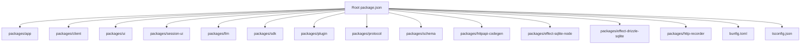
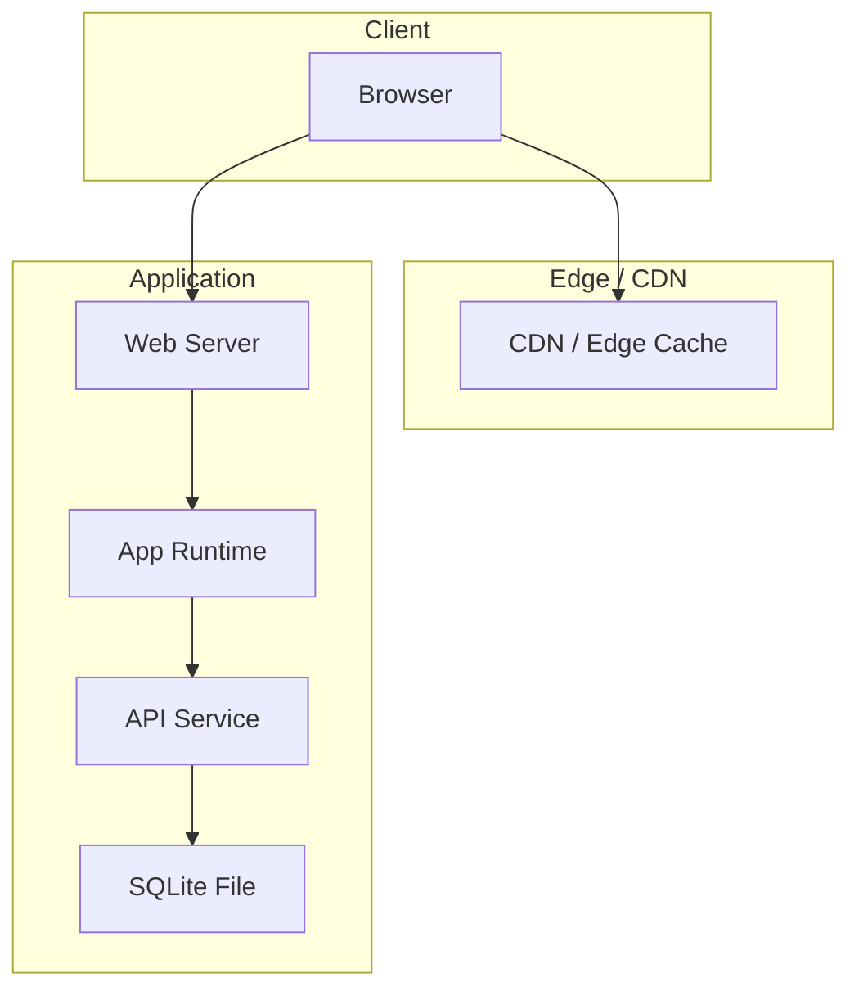
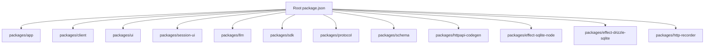
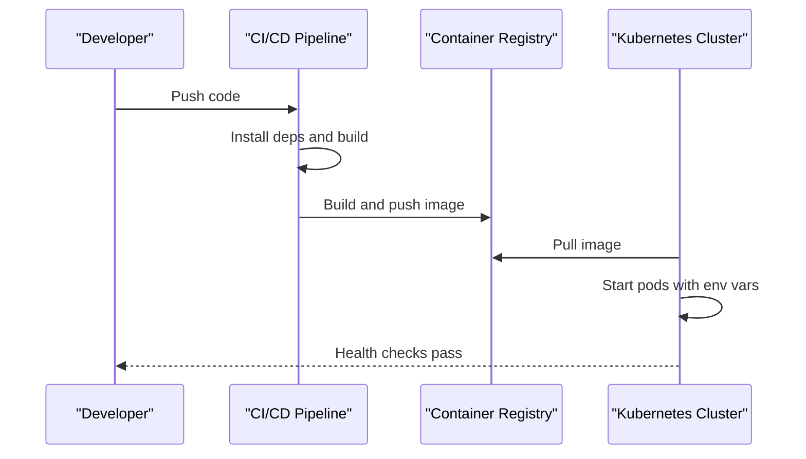
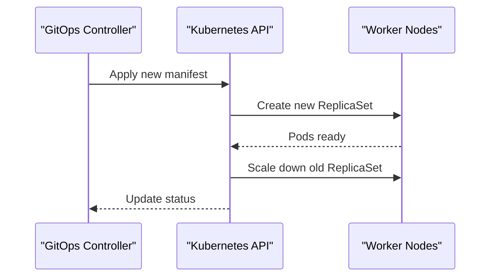

# Deployment Strategies

<cite>
**Referenced Files in This Document**
- [README.md](file://README.md)
- [package.json](file://package.json)
- [bunfig.toml](file://bunfig.toml)
- [tsconfig.json](file://tsconfig.json)
- [packages/app/package.json](file://packages/app/package.json)
- [packages/client/package.json](file://packages/client/package.json)
- [packages/ui/package.json](file://packages/ui/package.json)
- [packages/session-ui/package.json](file://packages/session-ui/package.json)
- [packages/httpapi-codegen/package.json](file://packages/httpapi-codegen/package.json)
- [packages/effect-sqlite-node/package.json](file://packages/effect-sqlite-node/package.json)
- [packages/effect-drizzle-sqlite/package.json](file://packages/effect-drizzle-sqlite/package.json)
- [packages/llm/package.json](file://packages/llm/package.json)
- [packages/sdk/package.json](file://packages/sdk/package.json)
- [packages/plugin/package.json](file://packages/plugin/package.json)
- [packages/protocol/package.json](file://packages/protocol/package.json)
- [packages/schema/package.json](file://packages/schema/package.json)
- [packages/http-recorder/package.json](file://packages/http-recorder/package.json)
</cite>

## Table of Contents
1. Introduction
2. Project Structure
3. Core Components
4. Architecture Overview
5. Detailed Component Analysis
6. Dependency Analysis
7. Performance Considerations
8. Troubleshooting Guide
9. Conclusion
10. Appendices

## Introduction
This document provides comprehensive deployment strategies for OpenCode Web UI applications. It covers production build optimization, containerization, cloud deployment options, environment-specific configuration, security considerations, scaling approaches, monitoring and logging, health checks, rollback strategies, and disaster recovery procedures. The guidance is tailored to the monorepo structure and tooling used by the project.

## Project Structure
OpenCode is a monorepo with multiple packages under packages/. Key areas relevant to deployment include:
- Application entry points and bundling configurations within app, client, ui, and session-ui packages
- Backend or runtime dependencies such as effect-sqlite-node and drizzle integration
- Code generation and SDKs for API interactions
- Build and runtime configuration at the repository root (package.json, bunfig.toml, tsconfig.json)

**Diagram sources**
- [package.json](file://package.json)
- [bunfig.toml](file://bunfig.toml)
- [tsconfig.json](file://tsconfig.json)
- [packages/app/package.json](file://packages/app/package.json)
- [packages/client/package.json](file://packages/client/package.json)
- [packages/ui/package.json](file://packages/ui/package.json)
- [packages/session-ui/package.json](file://packages/session-ui/package.json)
- [packages/llm/package.json](file://packages/llm/package.json)
- [packages/sdk/package.json](file://packages/sdk/package.json)
- [packages/plugin/package.json](file://packages/plugin/package.json)
- [packages/protocol/package.json](file://packages/protocol/package.json)
- [packages/schema/package.json](file://packages/schema/package.json)
- [packages/httpapi-codegen/package.json](file://packages/httpapi-codegen/package.json)
- [packages/effect-sqlite-node/package.json](file://packages/effect-sqlite-node/package.json)
- [packages/effect-drizzle-sqlite/package.json](file://packages/effect-drizzle-sqlite/package.json)
- [packages/http-recorder/package.json](file://packages/http-recorder/package.json)

**Section sources**
- [README.md](file://README.md)
- [package.json](file://package.json)
- [bunfig.toml](file://bunfig.toml)
- [tsconfig.json](file://tsconfig.json)

## Core Components
The following components are central to building and deploying the application:
- App and UI packages: Provide the web interface and client-side logic
- Client and SDK: Handle HTTP requests and protocol definitions
- LLM integration: Encapsulates language model interactions
- SQLite backend: Local data persistence via effect-sqlite-node and Drizzle ORM
- Code generation: Produces types and clients from API schemas
- Plugin system: Extends functionality through modular plugins

These components influence build targets, runtime dependencies, and container images.

**Section sources**
- [packages/app/package.json](file://packages/app/package.json)
- [packages/client/package.json](file://packages/client/package.json)
- [packages/ui/package.json](file://packages/ui/package.json)
- [packages/session-ui/package.json](file://packages/session-ui/package.json)
- [packages/llm/package.json](file://packages/llm/package.json)
- [packages/sdk/package.json](file://packages/sdk/package.json)
- [packages/plugin/package.json](file://packages/plugin/package.json)
- [packages/protocol/package.json](file://packages/protocol/package.json)
- [packages/schema/package.json](file://packages/schema/package.json)
- [packages/httpapi-codegen/package.json](file://packages/httpapi-codegen/package.json)
- [packages/effect-sqlite-node/package.json](file://packages/effect-sqlite-node/package.json)
- [packages/effect-drizzle-sqlite/package.json](file://packages/effect-drizzle-sqlite/package.json)
- [packages/http-recorder/package.json](file://packages/http-recorder/package.json)

## Architecture Overview
At a high level, the deployment architecture includes:
- Static assets served by a web server or CDN
- Optional backend services for API endpoints and database operations
- Environment variables controlling runtime behavior
- Health check endpoints for orchestration platforms
- Logging and metrics collection for observability

[No sources needed since this diagram shows conceptual workflow, not actual code structure]

## Detailed Component Analysis

### Production Build Optimization
- Use the repository’s package manager and build scripts to generate optimized static assets and bundles
- Enable tree-shaking, minification, and source maps for debugging in production
- Configure bundler settings to split chunks efficiently and preload critical resources
- Ensure environment variables are injected at build time where appropriate

Recommended steps:
- Run the production build command defined in the root or app package
- Validate output artifacts for size and performance
- Serve static files via a performant web server or CDN

**Section sources**
- [package.json](file://package.json)
- [bunfig.toml](file://bunfig.toml)
- [tsconfig.json](file://tsconfig.json)
- [packages/app/package.json](file://packages/app/package.json)

### Containerization Strategies
- Create a minimal base image suitable for serving static assets or running the Node/Bun runtime
- Copy only necessary build artifacts into the image
- Set environment variables for runtime configuration
- Expose the correct port and define health check commands
- Use multi-stage builds to reduce image size

Example approach:
- Stage 1: Install dependencies and build the application
- Stage 2: Serve the built artifacts with a lightweight server

**Section sources**
- [package.json](file://package.json)
- [bunfig.toml](file://bunfig.toml)

### Cloud Deployment Options
- Deploy static assets to object storage with CDN distribution
- Deploy full-stack apps to managed containers or serverless platforms
- Configure environment variables and secrets securely
- Use platform-native health checks and autoscaling features

Considerations:
- Region selection for latency and compliance
- Scaling policies based on traffic patterns
- Backup and restore strategies for persistent data

**Section sources**
- [package.json](file://package.json)

### Environment-Specific Configurations
- Separate development, staging, and production environments using environment variables
- Avoid committing sensitive values; use secret managers or platform-provided vaults
- Validate required variables at startup and fail fast if missing
- Provide defaults for non-sensitive settings

Common variables:
- API endpoints and feature flags
- Database paths or connection strings
- Logging levels and telemetry keys

**Section sources**
- [package.json](file://package.json)
- [bunfig.toml](file://bunfig.toml)

### Security Considerations
- Enforce HTTPS and secure headers
- Restrict CORS origins and methods
- Sanitize inputs and validate outputs
- Rotate secrets regularly and limit access scopes
- Audit dependencies and apply patches promptly

**Section sources**
- [package.json](file://package.json)

### Scaling Approaches
- Horizontal scaling by replicating stateless instances behind a load balancer
- Vertical scaling for single-instance deployments with more CPU/memory
- Cache frequently accessed data at edge or application layer
- Use read replicas or sharding if moving beyond local SQLite

**Section sources**
- [package.json](file://package.json)

### Monitoring Setup
- Emit structured logs with correlation IDs
- Export metrics for CPU, memory, request rates, and error rates
- Integrate with centralized log aggregation and alerting systems
- Define SLOs and dashboards for key user journeys

**Section sources**
- [package.json](file://package.json)

### Log Aggregation
- Stream logs to a centralized service (e.g., cloud logging or ELK stack)
- Include contextual metadata like tenant ID, request ID, and version
- Redact sensitive information before shipping logs

**Section sources**
- [package.json](file://package.json)

### Health Check Implementations
- Implement liveness and readiness probes
- Liveness: restart unhealthy instances automatically
- Readiness: route traffic only when fully initialized and connected to dependencies

Endpoints should return appropriate status codes and minimal payload.

**Section sources**
- [package.json](file://package.json)

### Rollback Strategies
- Maintain immutable artifacts tagged with versions
- Use blue/green or canary deployments to minimize risk
- Automate rollbacks on failed health checks or error rate thresholds
- Keep previous versions available for quick reversion

**Section sources**
- [package.json](file://package.json)

### Disaster Recovery Procedures
- Regularly back up persistent data (e.g., SQLite file)
- Test restoration procedures periodically
- Document runbooks for common failure scenarios
- Ensure cross-region replication for critical data

**Section sources**
- [package.json](file://package.json)

## Dependency Analysis
The monorepo contains many interdependent packages. Understanding these relationships helps optimize builds and avoid unnecessary bloat in production images.

**Diagram sources**
- [package.json](file://package.json)
- [packages/app/package.json](file://packages/app/package.json)
- [packages/client/package.json](file://packages/client/package.json)
- [packages/ui/package.json](file://packages/ui/package.json)
- [packages/session-ui/package.json](file://packages/session-ui/package.json)
- [packages/llm/package.json](file://packages/llm/package.json)
- [packages/sdk/package.json](file://packages/sdk/package.json)
- [packages/protocol/package.json](file://packages/protocol/package.json)
- [packages/schema/package.json](file://packages/schema/package.json)
- [packages/httpapi-codegen/package.json](file://packages/httpapi-codegen/package.json)
- [packages/effect-sqlite-node/package.json](file://packages/effect-sqlite-node/package.json)
- [packages/effect-drizzle-sqlite/package.json](file://packages/effect-drizzle-sqlite/package.json)
- [packages/http-recorder/package.json](file://packages/http-recorder/package.json)

**Section sources**
- [package.json](file://package.json)

## Performance Considerations
- Minimize bundle sizes by removing unused code and lazy-loading routes
- Enable compression and caching headers for static assets
- Prefer edge caching for API responses where safe
- Profile cold starts and optimize initialization sequences
- Use connection pooling and efficient queries for database operations

[No sources needed since this section provides general guidance]

## Troubleshooting Guide
Common issues and resolutions:
- Build failures due to missing dependencies: ensure all workspace packages are installed and linked
- Runtime errors from missing environment variables: validate required variables at startup
- Health check failures: verify dependency connectivity and resource availability
- High memory usage: inspect bundle size and enable streaming where possible

Checklist:
- Confirm correct environment variables and secrets
- Validate container image contents and permissions
- Review logs for stack traces and error context
- Reproduce locally with the same environment configuration

**Section sources**
- [package.json](file://package.json)

## Conclusion
Effective deployment of OpenCode Web UI requires careful attention to build optimization, containerization, environment configuration, security, scalability, observability, and resilience. By following the strategies outlined here and leveraging the monorepo’s structure and tooling, you can deliver reliable, performant, and secure applications across diverse platforms.

[No sources needed since this section summarizes without analyzing specific files]

## Appendices

### Example Deployment Flows

#### Docker Deployment Flow

[No sources needed since this diagram shows conceptual workflow, not actual code structure]

#### Kubernetes Rolling Update Flow

[No sources needed since this diagram shows conceptual workflow, not actual code structure]