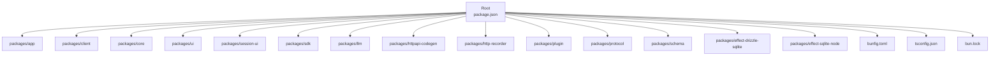
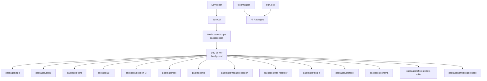
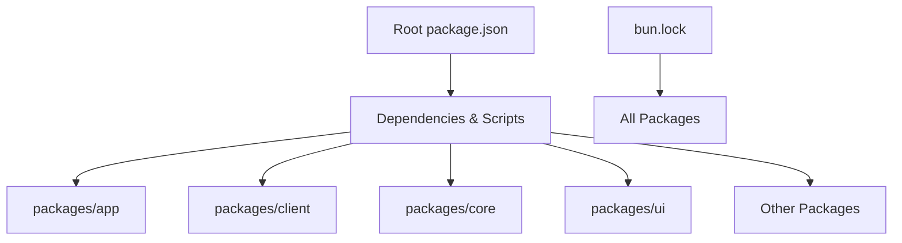

# Development Workflow

<cite>
**Referenced Files in This Document**
- [README.md](file://README.md)
- [package.json](file://package.json)
- [bunfig.toml](file://bunfig.toml)
- [tsconfig.json](file://tsconfig.json)
- [bun.lock](file://bun.lock)
</cite>

## Table of Contents
1. [Introduction](#introduction)
2. [Project Structure](#project-structure)
3. [Core Components](#core-components)
4. [Architecture Overview](#architecture-overview)
5. [Detailed Component Analysis](#detailed-component-analysis)
6. [Dependency Analysis](#dependency-analysis)
7. [Performance Considerations](#performance-considerations)
8. [Troubleshooting Guide](#troubleshooting-guide)
9. [Conclusion](#conclusion)
10. [Appendices](#appendices)

## Introduction
This document explains the complete development workflow for OpenCode Web UI. It covers local setup, hot reloading configuration, debugging techniques, testing strategies, IDE recommendations, code formatting and linting conventions, development server features, logging levels, performance profiling tools, and common monorepo tasks such as adding packages and running tests across packages.

## Project Structure
OpenCode Web UI is a Bun-based monorepo with multiple packages under packages/. The root configuration files define tooling, TypeScript settings, and dependency management. Key directories include:
- packages/app: Application entry and orchestration
- packages/client: Client-side runtime and utilities
- packages/core: Shared core logic
- packages/ui: UI components and design system
- packages/session-ui: Session-related UI
- packages/sdk: SDK abstractions
- packages/llm: LLM integrations
- packages/httpapi-codegen: API code generation
- packages/http-recorder: HTTP recording utilities
- packages/plugin: Plugin framework
- packages/protocol: Protocol definitions
- packages/schema: Schema definitions
- packages/effect-drizzle-sqlite and packages/effect-sqlite-node: Database integrations

**Diagram sources**
- [package.json:1-200](file://package.json#L1-L200)
- [bunfig.toml:1-200](file://bunfig.toml#L1-L200)
- [tsconfig.json:1-200](file://tsconfig.json#L1-L200)
- [bun.lock:1-200](file://bun.lock#L1-L200)

**Section sources**
- [README.md:1-200](file://README.md#L1-L200)
- [package.json:1-200](file://package.json#L1-L200)
- [bunfig.toml:1-200](file://bunfig.toml#L1-L200)
- [tsconfig.json:1-200](file://tsconfig.json#L1-L200)
- [bun.lock:1-200](file://bun.lock#L1-L200)

## Core Components
The monorepo uses Bun as the package manager and runtime. Configuration is centralized at the root:
- package.json defines scripts, workspaces, and dependencies
- bunfig.toml configures Bun behavior (e.g., dev server, bundling, aliases)
- tsconfig.json sets shared TypeScript options
- bun.lock locks dependency versions for deterministic builds

Key responsibilities:
- Workspaces orchestrate multi-package development
- Scripts provide consistent commands for building, testing, and running apps
- Tooling ensures consistent TypeScript and module resolution across packages

**Section sources**
- [package.json:1-200](file://package.json#L1-L200)
- [bunfig.toml:1-200](file://bunfig.toml#L1-L200)
- [tsconfig.json:1-200](file://tsconfig.json#L1-L200)
- [bun.lock:1-200](file://bun.lock#L1-L200)

## Architecture Overview
At a high level, the development experience is driven by Bun’s dev server and workspace scripts. The app package typically boots the application, while other packages provide libraries, UI components, and integrations. The following diagram shows how the root configuration influences the development workflow.

**Diagram sources**
- [package.json:1-200](file://package.json#L1-L200)
- [bunfig.toml:1-200](file://bunfig.toml#L1-L200)
- [tsconfig.json:1-200](file://tsconfig.json#L1-L200)
- [bun.lock:1-200](file://bun.lock#L1-L200)

## Detailed Component Analysis

### Local Setup and Environment
- Install Bun if not present, then install dependencies using the lockfile to ensure deterministic builds.
- Ensure Node/Bun compatibility matches the project’s requirements as defined in the root configuration.
- Verify that all workspace packages are linked and accessible from the root.

Recommended steps:
- Run the dependency installation command from the repository root.
- Validate environment by running a basic script or health check provided by the app package.

**Section sources**
- [package.json:1-200](file://package.json#L1-L200)
- [bun.lock:1-200](file://bun.lock#L1-L200)

### Hot Reloading Configuration
Hot reloading is enabled through Bun’s dev server configuration. The dev server watches source changes and rebuilds modules automatically.

Key aspects:
- File watching and incremental rebuilds
- Module aliasing and path mapping via TypeScript and Bun configuration
- Environment variables loaded during development

To customize hot reload behavior:
- Adjust watch patterns and ignore rules in the dev server configuration
- Configure module resolution and aliases to speed up rebuilds

**Section sources**
- [bunfig.toml:1-200](file://bunfig.toml#L1-L200)
- [tsconfig.json:1-200](file://tsconfig.json#L1-L200)

### Debugging Techniques
Useful techniques for debugging across the monorepo:
- Use the Bun debugger to attach to processes and set breakpoints
- Enable verbose logging in the dev server to trace module loading and rebuilds
- Inspect network requests using built-in browser devtools or HTTP recorder utilities

Common scenarios:
- Investigate slow rebuilds by analyzing watched files and dependencies
- Debug cross-package imports by verifying TypeScript paths and aliases
- Trace runtime errors using stack traces and log levels

**Section sources**
- [bunfig.toml:1-200](file://bunfig.toml#L1-L200)
- [package.json:1-200](file://package.json#L1-L200)

### Testing Strategies
Testing is organized per package with shared scripts at the root. Typical workflows:
- Run unit tests for a specific package using workspace-aware commands
- Execute integration tests that span multiple packages
- Generate test coverage reports to identify untested areas

Best practices:
- Keep tests co-located with source files where appropriate
- Mock external services and databases for fast, reliable tests
- Use fixtures and factories for consistent test data

**Section sources**
- [package.json:1-200](file://package.json#L1-L200)

### IDE Setup Recommendations
For an optimal development experience:
- Install extensions for TypeScript, Bun, and SolidJS if applicable
- Configure the IDE to use the workspace’s TypeScript version and tsconfig paths
- Enable automatic formatting on save and lint-on-save hooks

Suggested settings:
- Use the repository’s formatter and linter configurations
- Set up import sorting and auto-fixes
- Link the IDE to the Bun runtime for accurate diagnostics

**Section sources**
- [tsconfig.json:1-200](file://tsconfig.json#L1-L200)
- [package.json:1-200](file://package.json#L1-L200)

### Code Formatting Rules and Linting
Formatting and linting are enforced consistently across the monorepo:
- Formatter rules are defined in the root configuration and applied to all packages
- Linting checks run as part of CI and can be executed locally before committing
- Auto-fix capabilities reduce manual effort and maintain consistency

To apply formatting and linting:
- Run the format command from the root to fix issues across packages
- Run the lint command to detect violations and warnings

**Section sources**
- [package.json:1-200](file://package.json#L1-L200)

### Development Server Features
The dev server provides:
- Fast incremental builds and hot module replacement
- Module aliasing and path resolution
- Environment variable injection
- Optional middleware for intercepting requests and responses

Tuning tips:
- Reduce watched files to improve performance
- Configure caching for dependencies and build artifacts
- Use environment-specific configurations for local vs. CI environments

**Section sources**
- [bunfig.toml:1-200](file://bunfig.toml#L1-L200)

### Logging Levels
Logging levels help diagnose issues during development:
- Verbose logs expose detailed module loading and rebuild information
- Info logs summarize key events and state changes
- Error logs highlight failures and exceptions

Adjusting log levels:
- Set environment variables to control verbosity
- Filter logs by package or module name
- Redirect logs to files for long-running sessions

**Section sources**
- [bunfig.toml:1-200](file://bunfig.toml#L1-L200)
- [package.json:1-200](file://package.json#L1-L200)

### Performance Profiling Tools
Profiling helps identify bottlenecks:
- Use CPU profiling to analyze hot paths in the dev server and application code
- Memory profiling to detect leaks and excessive allocations
- Network profiling to inspect request/response times and payloads

Practical approaches:
- Profile critical user flows in the browser devtools
- Use Bun’s built-in profiler flags for server-side analysis
- Compare profiles across iterations to validate improvements

**Section sources**
- [package.json:1-200](file://package.json#L1-L200)

### Common Development Tasks

#### Adding a New Package
Steps to add a new package:
- Create a new directory under packages/
- Initialize package metadata and dependencies
- Add workspace references in the root configuration
- Link the package into existing packages that depend on it

Verification:
- Run type checks and tests for the new package
- Ensure imports resolve correctly across the monorepo

**Section sources**
- [package.json:1-200](file://package.json#L1-L200)

#### Running Tests Across the Monorepo
- Execute tests for all packages using the root script
- Filter tests by package name or pattern
- Generate coverage reports and review results

Tips:
- Parallelize test runs where possible
- Cache test dependencies to speed up repeated runs

**Section sources**
- [package.json:1-200](file://package.json#L1-L200)

#### Debugging Issues Across Packages
- Isolate the failing package and run its tests locally
- Check TypeScript compilation errors and module resolution
- Inspect runtime logs and stack traces for clues

Workflow:
- Reproduce the issue with minimal steps
- Add targeted logs or breakpoints
- Validate fixes with automated tests

**Section sources**
- [package.json:1-200](file://package.json#L1-L200)
- [bunfig.toml:1-200](file://bunfig.toml#L1-L200)

## Dependency Analysis
The monorepo manages dependencies centrally with a lockfile and workspace scripts. Each package declares its own dependencies, but the root ensures consistent versions and resolutions.

**Diagram sources**
- [package.json:1-200](file://package.json#L1-L200)
- [bun.lock:1-200](file://bun.lock#L1-L200)

**Section sources**
- [package.json:1-200](file://package.json#L1-L200)
- [bun.lock:1-200](file://bun.lock#L1-L200)

## Performance Considerations
- Prefer incremental builds and avoid unnecessary file watching
- Minimize bundle sizes by tree-shaking and lazy loading
- Use environment-specific configurations to optimize dev vs. production
- Profile cold starts and hot reload times to identify regressions

[No sources needed since this section provides general guidance]

## Troubleshooting Guide
Common issues and resolutions:
- Dependency resolution errors: Reinstall dependencies using the lockfile and verify workspace links
- TypeScript errors: Ensure tsconfig paths match actual module locations
- Dev server crashes: Check logs for module loading failures and adjust watch patterns
- Slow builds: Reduce dependencies and enable caching

Diagnostic steps:
- Run type checks and linting to catch issues early
- Use verbose logging to trace failures
- Isolate problematic packages and reproduce locally

**Section sources**
- [package.json:1-200](file://package.json#L1-L200)
- [bunfig.toml:1-200](file://bunfig.toml#L1-L200)

## Conclusion
This guide outlines the end-to-end development workflow for OpenCode Web UI, covering setup, hot reloading, debugging, testing, IDE configuration, formatting, linting, dev server features, logging, profiling, and common monorepo tasks. Following these practices will help you develop efficiently and maintain code quality across the entire project.

[No sources needed since this section summarizes without analyzing specific files]

## Appendices

### Quick Reference Commands
- Install dependencies: Use the root script to install packages deterministically
- Start dev server: Launch the development server with hot reloading enabled
- Run tests: Execute tests for all packages or filter by package name
- Format code: Apply formatting rules across the monorepo
- Lint code: Detect and fix linting issues

**Section sources**
- [package.json:1-200](file://package.json#L1-L200)