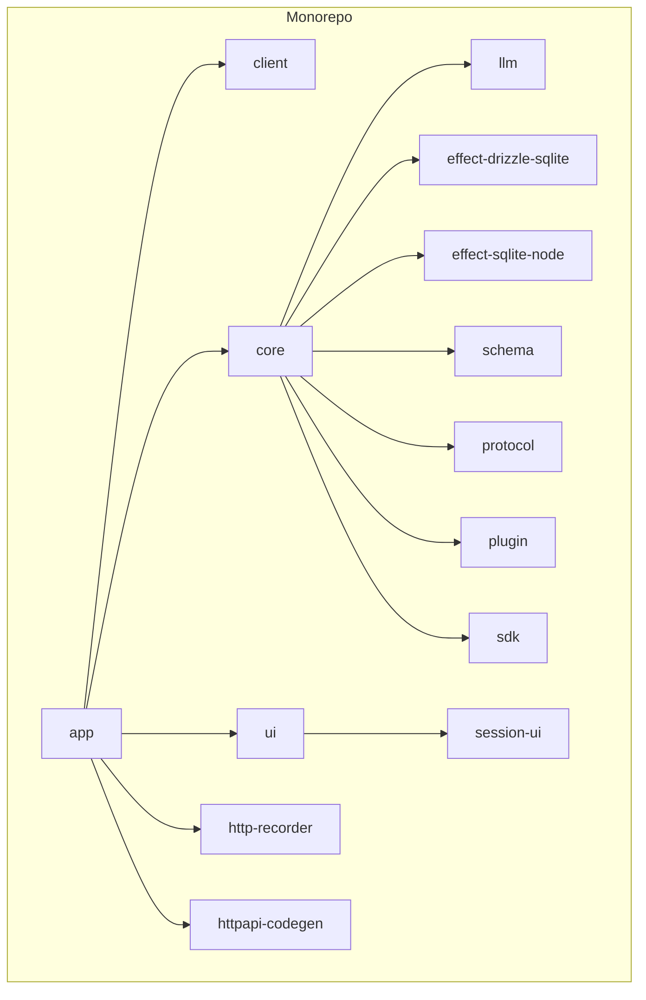
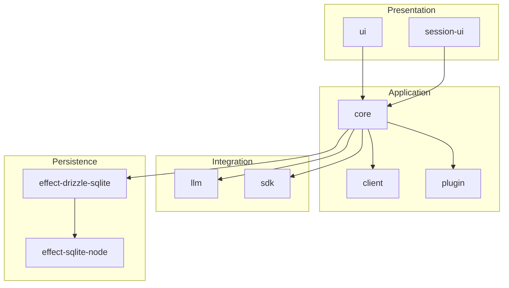
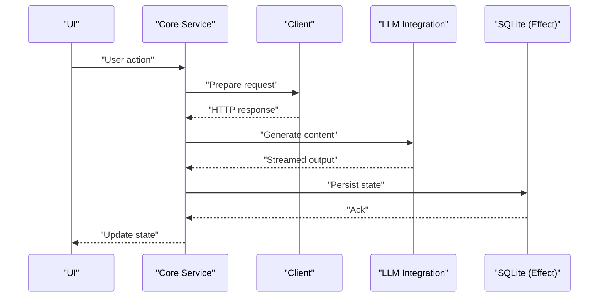
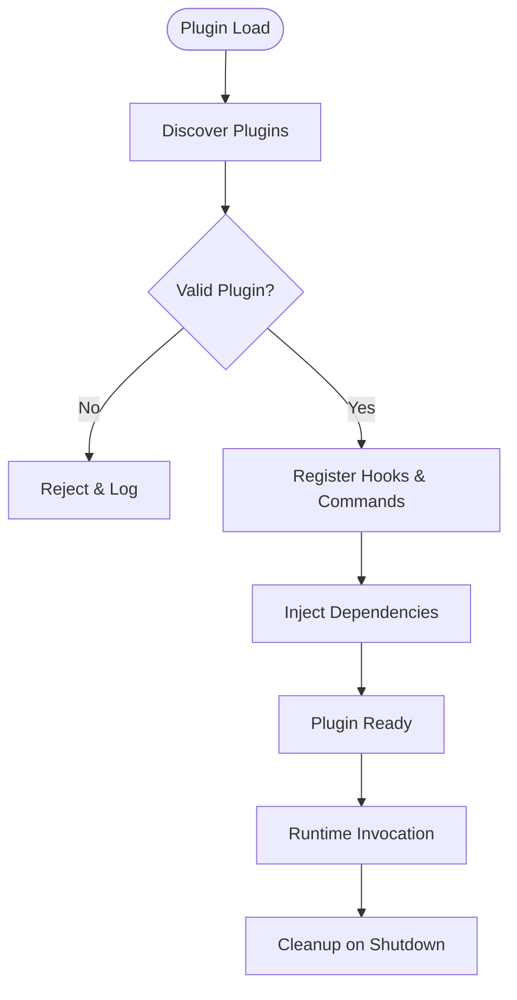
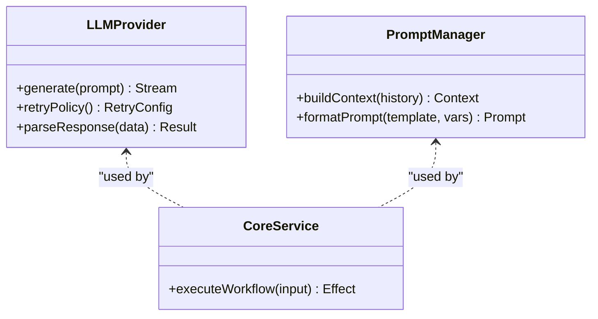
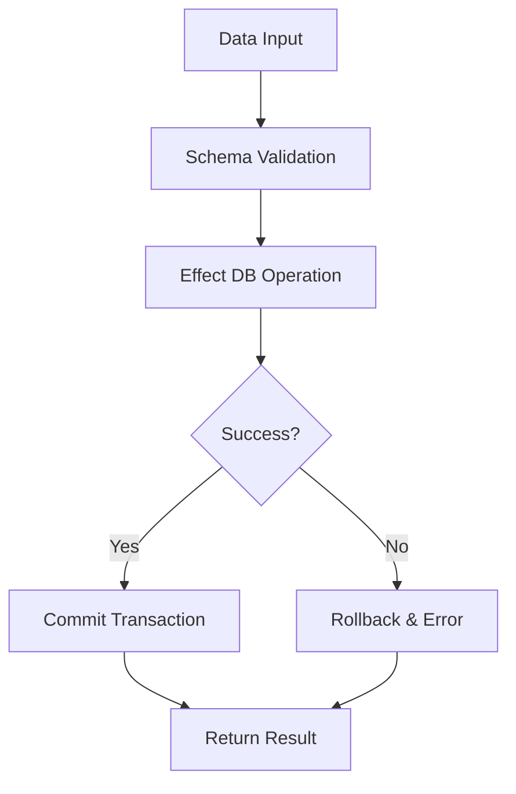
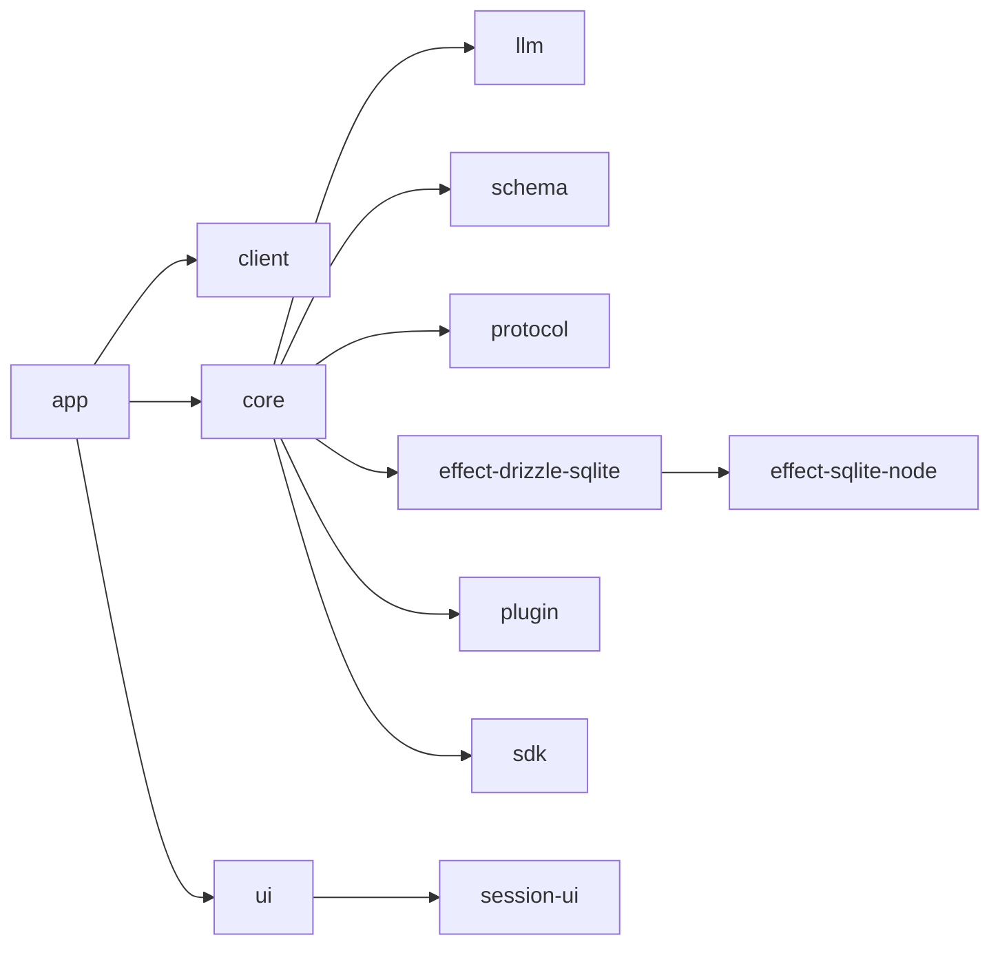

# Architecture Overview

<cite>
**Referenced Files in This Document**
- [package.json](file://package.json)
- [bunfig.toml](file://bunfig.toml)
- [tsconfig.json](file://tsconfig.json)
- [README.md](file://README.md)
</cite>

## Table of Contents
1. [Introduction](#introduction)
2. [Project Structure](#project-structure)
3. [Core Components](#core-components)
4. [Architecture Overview](#architecture-overview)
5. [Detailed Component Analysis](#detailed-component-analysis)
6. [Dependency Analysis](#dependency-analysis)
7. [Performance Considerations](#performance-considerations)
8. [Troubleshooting Guide](#troubleshooting-guide)
9. [Conclusion](#conclusion)
10. [Appendices](#appendices)

## Introduction
This document provides an architectural overview of the OpenCode Web UI monorepo. It explains the layered architecture, functional programming patterns using the Effect ecosystem, and how packages interact across client, core, UI, plugin, and LLM integration layers. It also describes data flow from user input through business logic to persistence and AI processing, outlines the plugin architecture and extensibility points, and addresses cross-cutting concerns such as error handling, state management, and real-time communication. Technology stack decisions and trade-offs are discussed to help readers understand design rationale.

## Project Structure
The repository is a monorepo organized under packages/, with each package encapsulating a specific concern:
- app: Application entry point and orchestration for the web UI runtime
- client: HTTP/protocol client abstractions used by the UI and core
- core: Business logic, domain models, and service orchestration
- ui: User interface components and presentation layer
- plugin: Plugin system definitions, loaders, and extension points
- llm: Language model integrations and prompts orchestration
- effect-drizzle-sqlite: Effect-based SQLite adapter using Drizzle ORM
- effect-sqlite-node: Node-specific SQLite runtime for Effect programs
- http-recorder: HTTP request/response recording utilities
- httpapi-codegen: Code generation for HTTP APIs
- protocol: Shared protocol definitions and schemas
- schema: Data validation and transformation schemas
- sdk: SDK abstractions for external services and tools
- session-ui: Session-oriented UI components and flows

[No sources needed since this diagram shows conceptual project structure]

## Core Components
- Layered architecture: The codebase separates concerns into clear layers—presentation (ui/session-ui), application/orchestration (core), integration (client, llm, sdk), and persistence (effect-drizzle-sqlite, effect-sqlite-node).
- Functional programming with Effect: Effect is used to manage side effects, errors, and asynchronous operations in a composable way. Services are implemented as Effect programs that can be composed, tested, and reasoned about deterministically.
- Package responsibilities:
  - core: Encapsulates domain logic, workflows, and service composition; uses Effect for programmatic control flow and error propagation.
  - client: Provides typed HTTP clients and protocol bindings consumed by core and UI.
  - ui: React/Solid-based UI components bound to state managed via Effect-driven stores or hooks.
  - plugin: Defines plugin interfaces, lifecycle hooks, and discovery mechanisms enabling extensibility.
  - llm: Integrates multiple LLM providers, manages prompts, streaming responses, and retries.
  - effect-drizzle-sqlite/effect-sqlite-node: Provide database access with Effect-compatible APIs and Node runtime specifics.
  - schema/protocol: Centralize data contracts, validation, and serialization.
  - sdk: Abstractions for third-party services and tooling.

**Section sources**
- [package.json:1-200](file://package.json#L1-L200)
- [bunfig.toml:1-100](file://bunfig.toml#L1-L100)
- [tsconfig.json:1-100](file://tsconfig.json#L1-L100)

## Architecture Overview
The system follows a layered architecture with strong separation between presentation, business logic, and infrastructure. Effect programs compose services declaratively, ensuring predictable error handling and testability. Real-time communication is handled via streaming protocols where applicable (e.g., LLM responses, server-sent events). Persistence is abstracted behind Effect-compatible adapters.

**Diagram sources**
- [package.json:1-200](file://package.json#L1-L200)

## Detailed Component Analysis

### Core Service Orchestration
Core coordinates workflows by composing Effect programs. It orchestrates client calls, LLM interactions, and persistence operations while maintaining consistent error handling and logging.

**Diagram sources**
- [package.json:1-200](file://package.json#L1-L200)

**Section sources**
- [package.json:1-200](file://package.json#L1-L200)

### Plugin Architecture
Plugins extend core functionality through well-defined interfaces. The plugin system supports discovery, lifecycle management, and dependency injection. Extensibility points include:
- Hook registration for pre/post processing
- Command/action extensions
- UI component injection
- Configuration overrides

**Diagram sources**
- [package.json:1-200](file://package.json#L1-L200)

**Section sources**
- [package.json:1-200](file://package.json#L1-L200)

### LLM Integration
LLM integration abstracts provider-specific details, offering a unified API for prompt generation, streaming responses, and retry policies. It integrates with core workflows to handle context, history, and result parsing.

**Diagram sources**
- [package.json:1-200](file://package.json#L1-L200)

**Section sources**
- [package.json:1-200](file://package.json#L1-L200)

### Persistence Layer
Persistence is implemented using Effect-compatible adapters over Drizzle ORM and SQLite. This ensures type safety, composability, and consistent error handling across database operations.

**Diagram sources**
- [package.json:1-200](file://package.json#L1-L200)

**Section sources**
- [package.json:1-200](file://package.json#L1-L200)

## Dependency Analysis
The monorepo leverages Bun for fast builds and runtime, TypeScript for type safety, and Effect for functional programming. Packages depend on shared schemas and protocols to maintain consistency.

**Diagram sources**
- [package.json:1-200](file://package.json#L1-L200)

**Section sources**
- [package.json:1-200](file://package.json#L1-L200)

## Performance Considerations
- Streaming responses: LLM integrations use streaming to reduce latency and improve UX.
- Database efficiency: Drizzle ORM with SQLite provides efficient queries and migrations.
- Effect composition: Minimizes unnecessary allocations and enables deterministic performance profiling.
- Build optimization: Bun accelerates development and production builds.

[No sources needed since this section provides general guidance]

## Troubleshooting Guide
Common issues and resolutions:
- Plugin loading failures: Check plugin manifests and dependency resolution logs.
- LLM timeouts: Adjust retry policies and network settings.
- Database errors: Verify schema migrations and connection configurations.
- State inconsistencies: Inspect Effect program traces and error boundaries.

**Section sources**
- [README.md:1-100](file://README.md#L1-L100)

## Conclusion
The OpenCode Web UI monorepo employs a layered architecture with functional programming patterns using Effect, enabling robust, testable, and scalable systems. The plugin architecture supports extensibility, while LLM and persistence integrations provide powerful capabilities. Clear separation of concerns and consistent error handling ensure maintainability and performance.

[No sources needed since this section summarizes without analyzing specific files]

## Appendices
- Technology stack: Bun, TypeScript, Effect, Drizzle ORM, SQLite, React/Solid UI frameworks.
- Development workflow: Monorepo management with Bun, shared schemas, and code generation.

[No sources needed since this section provides general guidance]