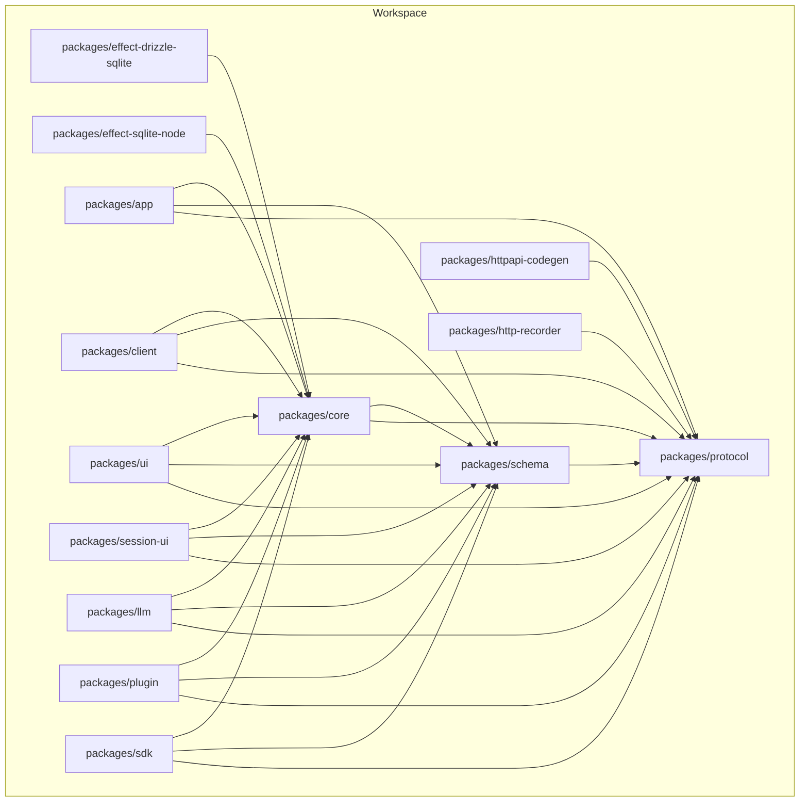
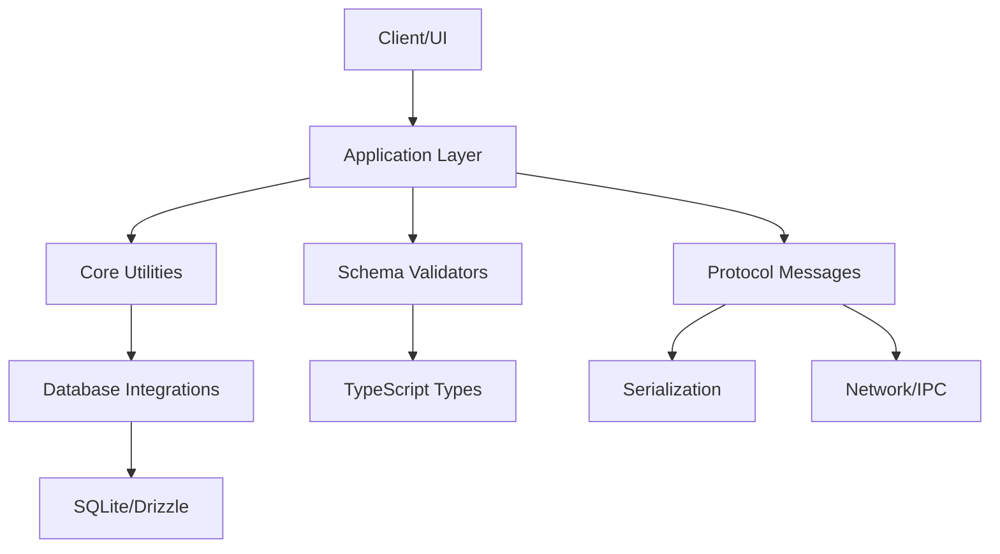
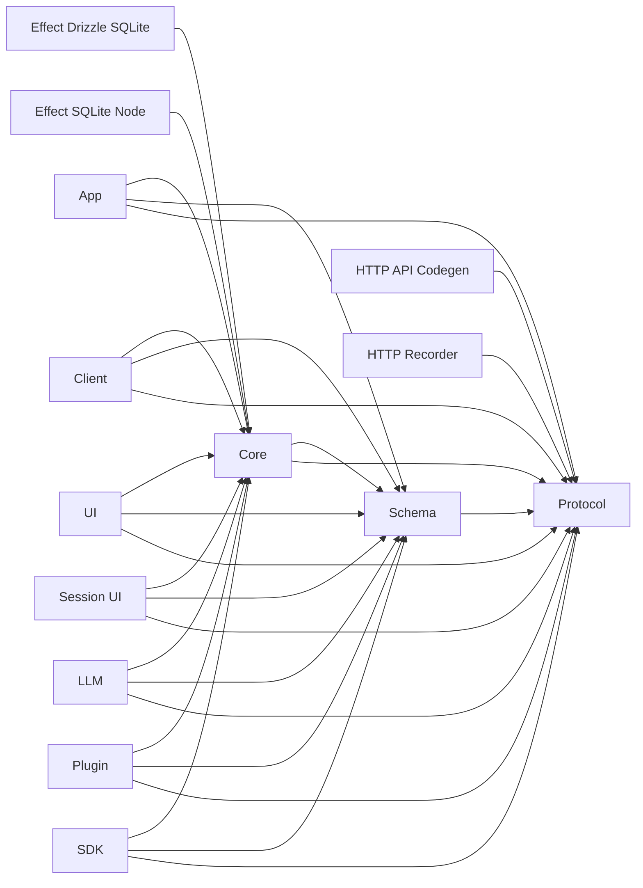

# Core Concepts

<cite>
**Referenced Files in This Document**
- [package.json](file://package.json)
- [tsconfig.json](file://tsconfig.json)
- [bunfig.toml](file://bunfig.toml)
- [packages/core/src/index.ts](file://packages/core/src/index.ts)
- [packages/schema/src/index.ts](file://packages/schema/src/index.ts)
- [packages/protocol/src/index.ts](file://packages/protocol/src/index.ts)
- [packages/effect-drizzle-sqlite/src/index.ts](file://packages/effect-drizzle-sqlite/src/index.ts)
- [packages/effect-sqlite-node/src/index.ts](file://packages/effect-sqlite-node/src/index.ts)
</cite>

## Table of Contents
1. [Introduction](#introduction)
2. [Project Structure](#project-structure)
3. [Core Components](#core-components)
4. [Architecture Overview](#architecture-overview)
5. [Detailed Component Analysis](#detailed-component-analysis)
6. [Dependency Analysis](#dependency-analysis)
7. [Performance Considerations](#performance-considerations)
8. [Troubleshooting Guide](#troubleshooting-guide)
9. [Conclusion](#conclusion)

## Introduction

This document explains the core concepts that power the opencode-web-ui project: Effect-driven functional programming, schema-first development, and protocol-based communication. It focuses on how error handling with Either, asynchronous operations with Task types, and reactive data flows with Stream types are used together to build robust, composable systems. It also documents the schema validation approach using Zod-like patterns integrated with TypeScript, and the message formats and serialization strategies used for inter-package communication.

## Project Structure

The repository is organized as a multi-package workspace with clear separation of concerns:
- packages/core: shared utilities and foundational abstractions
- packages/schema: schema definitions and validators
- packages/protocol: protocol messages and serialization
- packages/effect-drizzle-sqlite and packages/effect-sqlite-node: database integrations leveraging Effect
- packages/app, client, ui, session-ui: application layers and UI
- packages/httpapi-codegen, http-recorder, llm, plugin, sdk: feature modules

[No sources needed since this diagram shows conceptual structure]

## Core Components

This section introduces the foundational patterns used across the codebase:
- Effect functional programming: structured concurrency, error modeling, and resource management
- Schema-first development: type-safe schemas driving runtime validation and compile-time types
- Protocol-based communication: typed messages and serialization for inter-package interactions

Key building blocks:
- Either type for error handling
- Task types for async operations
- Stream types for reactive data flows
- Schema validation with Zod-like patterns
- Protocol message formats and serialization

**Section sources**
- [package.json:1-200](file://package.json#L1-L200)
- [tsconfig.json:1-200](file://tsconfig.json#L1-L200)
- [bunfig.toml:1-200](file://bunfig.toml#L1-L200)

## Architecture Overview

At a high level, the architecture combines Effect-driven logic with schema validation and protocol messaging:
- Schemas define contracts between packages and validate inputs/outputs at runtime
- Protocols define message shapes and serialization rules for cross-boundary communication
- Effect orchestrates async workflows, error propagation, and resource lifecycle
- Database integrations use Effect to manage connections and queries safely

[No sources needed since this diagram shows conceptual architecture]

## Detailed Component Analysis

### Effect Functional Programming Patterns

Effect provides a powerful abstraction for managing side effects, errors, and concurrency. In this project, Effect is used to:
- Model failures explicitly via Either or Result-like constructs
- Compose async operations with Task types
- Handle streams of events or data with Stream types
- Ensure resource cleanup and structured concurrency

Common patterns include:
- Using Either to represent success/failure without throwing exceptions
- Chaining Task computations with map, flatMap, and error recovery
- Building reactive pipelines with Stream transformations

Best practices:
- Keep pure logic separate from effectful operations
- Use small, composable Effect programs
- Centralize error handling and logging at boundaries

Pitfalls to avoid:
- Mixing synchronous and asynchronous error handling inconsistently
- Forgetting to run Effects in the correct runtime context
- Overusing IO in pure functions

**Section sources**
- [packages/core/src/index.ts:1-200](file://packages/core/src/index/index.ts#L1-L200)
- [packages/effect-drizzle-sqlite/src/index.ts:1-200](file://packages/effect-drizzle-sqlite/src/index.ts#L1-L200)
- [packages/effect-sqlite-node/src/index.ts:1-200](file://packages/effect-sqlite-node/src/index.ts#L1-L200)

### Schema-First Development with Zod-like Patterns

Schema-first development ensures that data contracts are defined once and enforced everywhere:
- Define schemas for request/response payloads, configuration objects, and domain entities
- Generate TypeScript types from schemas for compile-time safety
- Validate runtime inputs against schemas to catch errors early

Integration with TypeScript:
- Use schema inference to derive precise types
- Leverage branded types or discriminated unions where appropriate
- Keep schemas co-located with the features they describe

Validation flow:
- Parse raw input through schema validators
- Transform validated data into domain models
- Propagate validation errors consistently up the stack

Best practices:
- Prefer immutable schema definitions
- Reuse schemas across layers (API, storage, UI)
- Provide meaningful error messages for failed validations

Pitfalls to avoid:
- Duplicate schema definitions across packages
- Ignoring runtime validation in favor of type-only checks
- Overly permissive schemas that defeat their purpose

**Section sources**
- [packages/schema/src/index.ts:1-200](file://packages/schema/src/index.ts#L1-L200)
- [packages/protocol/src/index.ts:1-200](file://packages/protocol/src/index.ts#L1-L200)

### Protocol-Based Communication

Inter-package communication relies on well-defined protocols:
- Message types define the shape of requests and responses
- Serialization ensures consistent encoding/decoding across boundaries
- Error codes and status fields enable predictable failure modes

Message format design:
- Use versioned message schemas to support evolution
- Include correlation IDs for tracing and debugging
- Separate metadata from payload for clarity

Serialization patterns:
- Choose efficient encodings (JSON, MessagePack, etc.)
- Validate serialized data before transmission
- Handle partial updates and incremental changes when applicable

Best practices:
- Treat protocols as first-class contracts with tests
- Version messages explicitly and deprecate gracefully
- Log serialization/deserialization errors with context

Pitfalls to avoid:
- Implicit assumptions about message structure
- Not handling backward compatibility
- Missing validation after deserialization

**Section sources**
- [packages/protocol/src/index.ts:1-200](file://packages/protocol/src/index.ts#L1-L200)
- [packages/httpapi-codegen/src/index.ts:1-200](file://packages/httpapi-codegen/src/index.ts#L1-L200)

### Either Type for Error Handling

Either encapsulates two possible outcomes: Success or Failure. It enables explicit error modeling without exceptions:
- Left represents an error case; Right represents success
- Chain computations while preserving error information
- Combine multiple Either values with monadic operations

Usage patterns:
- Wrap potentially failing operations in Either
- Use map/flatMap to transform successful results
- Provide default values or fallbacks with merge or orElse

Error propagation:
- Short-circuit on first failure in chains
- Aggregate multiple errors when needed
- Convert Between Either and other error representations at boundaries

Best practices:
- Keep error types descriptive and actionable
- Avoid hiding errors behind generic types
- Test both success and failure paths

Pitfalls to avoid:
- Using Either for control flow instead of error handling
- Forgetting to handle all cases in pattern matching
- Mixing Either with throw/catch inconsistently

**Section sources**
- [packages/core/src/index.ts:1-200](file://packages/core/src/index.ts#L1-L200)
- [packages/schema/src/index.ts:1-200](file://packages/schema/src/index.ts#L1-L200)

### Task Types for Async Operations

Task represents asynchronous computations that may succeed or fail:
- Encapsulate promises with better error semantics
- Compose async workflows without callback hell
- Support cancellation and timeout mechanisms

Async patterns:
- Use map/flatMap to chain async operations
- Handle errors with recover or retry strategies
- Manage concurrency with parallel execution primitives

Resource management:
- Ensure proper cleanup with bracket patterns
- Avoid leaking resources in async contexts
- Use structured concurrency for predictable lifecycles

Best practices:
- Keep async logic pure where possible
- Fail fast and propagate errors explicitly
- Test async code with deterministic mocks

Pitfalls to avoid:
- Unhandled promise rejections
- Blocking the event loop with long-running tasks
- Incorrect error handling in async chains

**Section sources**
- [packages/effect-drizzle-sqlite/src/index.ts:1-200](file://packages/effect-drizzle-sqlite/src/index.ts#L1-L200)
- [packages/effect-sqlite-node/src/index.ts:1-200](file://packages/effect-sqlite-node/src/index.ts#L1-L200)

### Stream Types for Reactive Data Flows

Stream models sequences of values over time:
- Represents event streams, data pipelines, and real-time updates
- Supports transformation, filtering, and aggregation
- Integrates with backpressure and cancellation

Reactive patterns:
- Build pipelines with map, filter, and combine operators
- Handle stream completion and errors gracefully
- Subscribe and unsubscribe safely to prevent leaks

Use cases:
- Real-time UI updates and notifications
- Event sourcing and change tracking
- Streaming large datasets incrementally

Best practices:
- Design streams with clear boundaries and contracts
- Use buffering judiciously to balance memory and latency
- Test stream behavior with controlled inputs

Pitfalls to avoid:
- Creating unbounded streams without backpressure
- Ignoring stream errors and completions
- Overcomplicating simple synchronous flows

**Section sources**
- [packages/core/src/index.ts:1-200](file://packages/core/src/index.ts#L1-L200)
- [packages/http-recorder/src/index.ts:1-200](file://packages/http-recorder/src/index.ts#L1-L200)

### Schema Validation System Integration

The schema validation system integrates tightly with TypeScript:
- Schemas generate corresponding TypeScript types automatically
- Runtime validation complements compile-time type checking
- Custom validators extend built-in schema capabilities

Integration points:
- API endpoints validate incoming requests against schemas
- Database models enforce constraints via schemas
- UI components validate user input before submission

Validation workflow:
- Parse raw data through schema validators
- Transform validated data into domain objects
- Propagate validation errors with detailed context

Best practices:
- Co-locate schemas with the features they validate
- Use discriminated unions for polymorphic data
- Provide helpful error messages for failed validations

Pitfalls to avoid:
- Duplicating validation logic across layers
- Relying solely on TypeScript for runtime safety
- Overly complex schemas that hurt maintainability

**Section sources**
- [packages/schema/src/index.ts:1-200](file://packages/schema/src/index.ts#L1-L200)
- [packages/httpapi-codegen/src/index.ts:1-200](file://packages/httpapi-codegen/src/index.ts#L1-L200)

### Protocol Message Formats and Serialization

Protocol messages follow consistent formats:
- Message types define structure and constraints
- Serialization ensures reliable transmission
- Deserialization validates and transforms data

Message design principles:
- Version messages explicitly for compatibility
- Include metadata for routing and tracing
- Separate concerns between payload and control data

Serialization strategies:
- Choose encodings based on performance needs
- Validate data before and after serialization
- Handle partial failures gracefully

Best practices:
- Test serialization round-trips thoroughly
- Document message formats clearly
- Deprecate old versions gradually

Pitfalls to avoid:
- Assuming message stability across versions
- Ignoring security implications of serialization
- Missing validation after deserialization

**Section sources**
- [packages/protocol/src/index.ts:1-200](file://packages/protocol/src/index.ts#L1-L200)
- [packages/httpapi-codegen/src/index.ts:1-200](file://packages/httpapi-codegen/src/index.ts#L1-L200)

## Dependency Analysis

The dependency graph shows how packages interact through shared abstractions:
- Core provides foundational utilities used by all other packages
- Schema defines contracts consumed by protocol and application layers
- Protocol enables communication between independent packages
- Database integrations depend on core and schema abstractions

[No sources needed since this diagram shows conceptual dependencies]

**Section sources**
- [package.json:1-200](file://package.json#L1-L200)
- [tsconfig.json:1-200](file://tsconfig.json#L1-L200)

## Performance Considerations

When working with Effect, schemas, and protocols:
- Minimize object allocations in hot paths
- Use streaming for large datasets to reduce memory pressure
- Cache frequently accessed schema validators
- Optimize serialization formats based on payload size and frequency
- Profile async operations to identify bottlenecks

Recommendations:
- Batch database queries when possible
- Use connection pooling for database access
- Implement circuit breakers for external services
- Monitor memory usage in long-running processes

[No sources needed since this section provides general guidance]

## Troubleshooting Guide

Common issues and solutions:
- Schema validation failures: Check input data structure and update schemas accordingly
- Protocol deserialization errors: Verify message versions and serialization formats
- Effect runtime errors: Ensure proper context setup and error handling
- Async operation timeouts: Adjust timeouts and implement retry logic
- Memory leaks in streams: Properly dispose subscriptions and cancel operations

Debugging strategies:
- Enable detailed logging in development
- Use structured error messages with context
- Implement health checks for critical services
- Monitor metrics for performance regressions

**Section sources**
- [packages/core/src/index.ts:1-200](file://packages/core/src/index.ts#L1-L200)
- [packages/schema/src/index.ts:1-200](file://packages/schema/src/index.ts#L1-L200)
- [packages/protocol/src/index.ts:1-200](file://packages/protocol/src/index.ts#L1-L200)

## Conclusion

The opencode-web-ui project leverages Effect functional programming, schema-first development, and protocol-based communication to build robust, maintainable software. By combining Either for error handling, Task for async operations, and Stream for reactive flows, the system achieves strong guarantees about correctness and reliability. The schema validation system ensures type safety across boundaries, while protocol messages enable clean inter-package communication. Following the best practices outlined here will help developers work effectively with these patterns and avoid common pitfalls.

[No sources needed since this section summarizes without analyzing specific files]