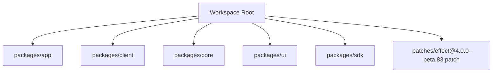
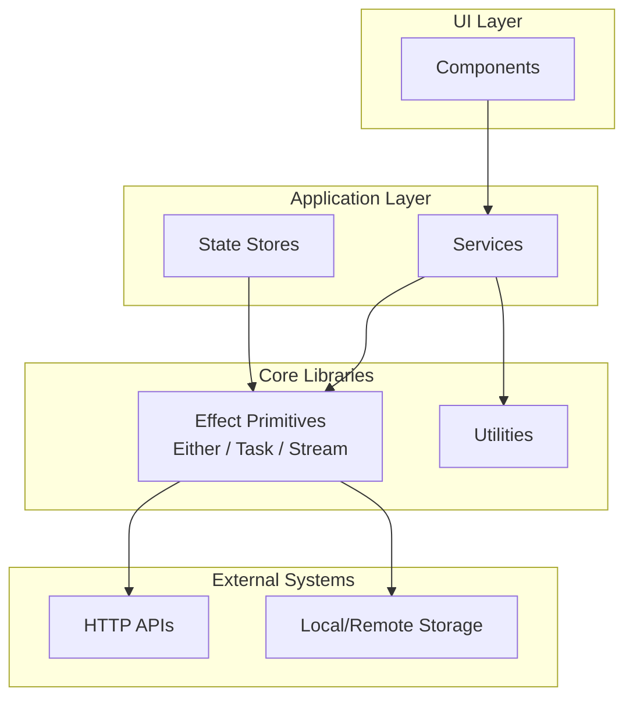
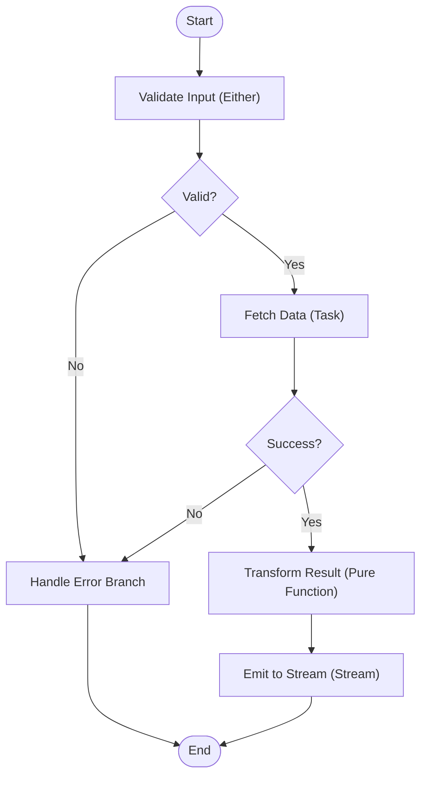
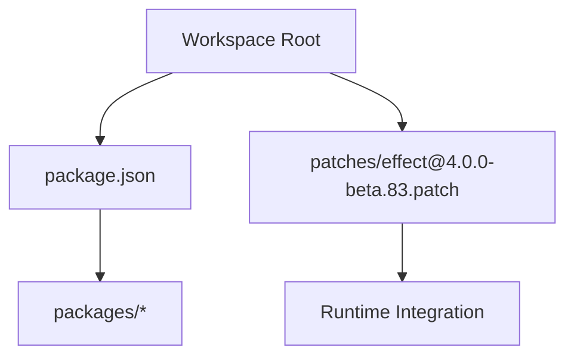

# Effect Functional Programming

<cite>
**Referenced Files in This Document**
- [package.json](file://package.json)
- [README.md](file://README.md)
- [effect@4.0.0-beta.83.patch](file://patches/effect@4.0.0-beta.83.patch)
</cite>

## Table of Contents
1. [Introduction](#introduction)
2. [Project Structure](#project-structure)
3. [Core Components](#core-components)
4. [Architecture Overview](#architecture-overview)
5. [Detailed Component Analysis](#detailed-component-analysis)
6. [Dependency Analysis](#dependency-analysis)
7. [Performance Considerations](#performance-considerations)
8. [Troubleshooting Guide](#troubleshooting Guide]
9. [Conclusion](#conclusion)

## Introduction
This document explains how the OpenCode Web UI uses Effect functional programming patterns to build robust, composable, and predictable code. It focuses on:
- Either type for explicit error handling with success and failure cases
- Task types for asynchronous operations and promise management
- Stream types for reactive data flows and event handling
It also covers how Effect enables composability, immutability, and predictable state management, along with common pitfalls and best practices for maintaining functional purity.

## Project Structure
The repository is a multi-package workspace that includes an application layer, client, core libraries, SDKs, and UI packages. The presence of an Effect patch indicates the project integrates Effect into its runtime and toolchain.

**Diagram sources**
- [package.json](file://package.json)
- [effect@4.0.0-beta.83.patch](file://patches/effect@4.0.0-beta.83.patch)

**Section sources**
- [package.json](file://package.json)
- [README.md](file://README.md)

## Core Components
Effect provides first-class support for:
- Either: Represents computations that can succeed or fail, enabling explicit error paths without exceptions.
- Task: Encapsulates asynchronous operations with typed results and errors, integrating cleanly with promises while preserving functional composition.
- Stream: Models reactive sequences of values over time, ideal for events, real-time updates, and backpressure-aware pipelines.

These primitives promote:
- Composability: Combine small, pure functions into larger workflows using combinators.
- Immutability: Avoid shared mutable state; transform data through pure transformations.
- Predictable state management: Derive UI state from streams and tasks, reducing side effects and race conditions.

**Section sources**
- [effect@4.0.0-beta.83.patch](file://patches/effect@4.0.0-beta.83.patch)

## Architecture Overview
At a high level, the UI layers consume Effect-based services and utilities. Tasks orchestrate async work (e.g., network calls), Streams model reactive inputs (e.g., user interactions), and Either handles both success and error outcomes consistently across layers.

[No sources needed since this diagram shows conceptual architecture, not specific source files]

## Detailed Component Analysis

### Either Type for Error Handling
Either models computations that may succeed or fail, allowing explicit handling of both branches without exceptions. Typical usage includes:
- Validating inputs and returning either a value or an error description
- Wrapping partial functions to make them total and safe
- Composing multiple validations by chaining failures

Common patterns:
- Map over success values without touching error branches
- Chain operations that return Either to propagate failures early
- Convert Either to other structures when rendering UI or logging

Best practices:
- Keep error information descriptive but minimal
- Prefer domain-specific error types over raw strings where possible
- Use combinators to avoid nested conditionals

Pitfalls:
- Forgetting to handle the failure branch leads to unhandled errors
- Mixing Either with exceptions undermines predictability

**Section sources**
- [effect@4.0.0-beta.83.patch](file://patches/effect@4.0.0-beta.83.patch)

### Task Types for Asynchronous Operations
Task encapsulates asynchronous computations with typed success and error outcomes. It integrates with promises while preserving functional composition. Typical usage includes:
- Fetching data from APIs
- Performing I/O operations
- Coordinating concurrent tasks

Common patterns:
- Transform successful results with map-like operations
- Handle errors explicitly without try/catch
- Compose multiple tasks sequentially or concurrently

Best practices:
- Keep tasks pure and free of hidden side effects
- Use concurrency combinators judiciously to avoid overwhelming resources
- Centralize error handling at boundaries (e.g., UI layer)

Pitfalls:
- Unhandled rejections bypass functional error channels
- Overusing concurrency can degrade performance

**Section sources**
- [effect@4.0.0-beta.83.patch](file://patches/effect@4.0.0-beta.83.patch)

### Stream Types for Reactive Data Flows
Stream models a sequence of values over time, suitable for events, real-time updates, and backpressure-aware processing. Typical usage includes:
- Reacting to user input changes
- Subscribing to external event sources
- Building reactive pipelines with filtering, mapping, and combining

Common patterns:
- Transform streams with pure functions
- Combine multiple streams to derive new behaviors
- Handle completion and errors explicitly

Best practices:
- Treat streams as immutable sequences of values
- Avoid long-lived subscriptions without cleanup
- Use operators to keep logic declarative and testable

Pitfalls:
- Memory leaks from unsubscribed streams
- Blocking operators that defeat reactivity

**Section sources**
- [effect@4.0.0-beta.83.patch](file://patches/effect@4.0.0-beta.83.patch)

### Composition Techniques
Effect encourages composing small, pure functions into larger workflows:
- Use Either to chain validations and transformations
- Compose Tasks to coordinate async steps
- Build Stream pipelines to react to changing data

Example composition flow:

**Section sources**
- [effect@4.0.0-beta.83.patch](file://patches/effect@4.0.0-beta.83.patch)

### Immutability and Predictable State Management
Effect promotes immutability by transforming data through pure functions rather than mutating existing objects. In the UI:
- Derive state from streams of events
- Update state via immutable snapshots
- Observe state changes reactively

Benefits:
- Easier debugging and testing
- Reduced side effects and race conditions
- Clearer data flow and traceability

**Section sources**
- [effect@4.0.0-beta.83.patch](file://patches/effect@4.0.0-beta.83.patch)

## Dependency Analysis
Effect is integrated via a patch, indicating customization or version alignment within the workspace. Dependencies are managed at the workspace root, ensuring consistent versions across packages.

**Diagram sources**
- [package.json](file://package.json)
- [effect@4.0.0-beta.83.patch](file://patches/effect@4.0.0-beta.83.patch)

**Section sources**
- [package.json](file://package.json)
- [effect@4.0.0-beta.83.patch](file://patches/effect@4.0.0-beta.83.patch)

## Performance Considerations
- Prefer lazy evaluation where possible to avoid unnecessary computation
- Use concurrency combinators carefully to balance throughput and resource usage
- Minimize allocations in hot paths by reusing immutable structures
- Debounce and throttle stream emissions for frequent events (e.g., typing)
- Profile Task execution to identify bottlenecks in async pipelines

[No sources needed since this section provides general guidance]

## Troubleshooting Guide
Common issues and resolutions:
- Unhandled errors in Either branches: Ensure every failure path is handled explicitly
- Promise rejections in Tasks: Attach proper error handlers and convert to Effect errors
- Memory leaks in Streams: Always unsubscribe or use scoped lifecycles
- Unexpected mutations: Verify that transformations return new immutable values
- Concurrency deadlocks: Review Task composition and resource contention

Diagnostic tips:
- Log error contexts with descriptive messages
- Isolate failing components using smaller tests
- Inspect stream subscriptions and ensure cleanup

**Section sources**
- [effect@4.0.0-beta.83.patch](file://patches/effect@4.0.0-beta.83.patch)

## Conclusion
Effect provides powerful primitives—Either, Task, and Stream—that enable functional, composable, and predictable code in the OpenCode Web UI. By embracing immutability, explicit error handling, and reactive data flows, teams can build robust applications with fewer bugs and clearer maintenance paths. Adhering to best practices and avoiding common pitfalls ensures reliable, performant, and maintainable software.

[No sources needed since this section summarizes without analyzing specific files]