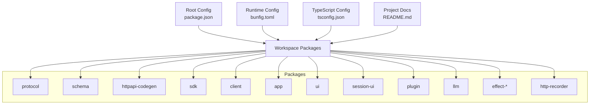
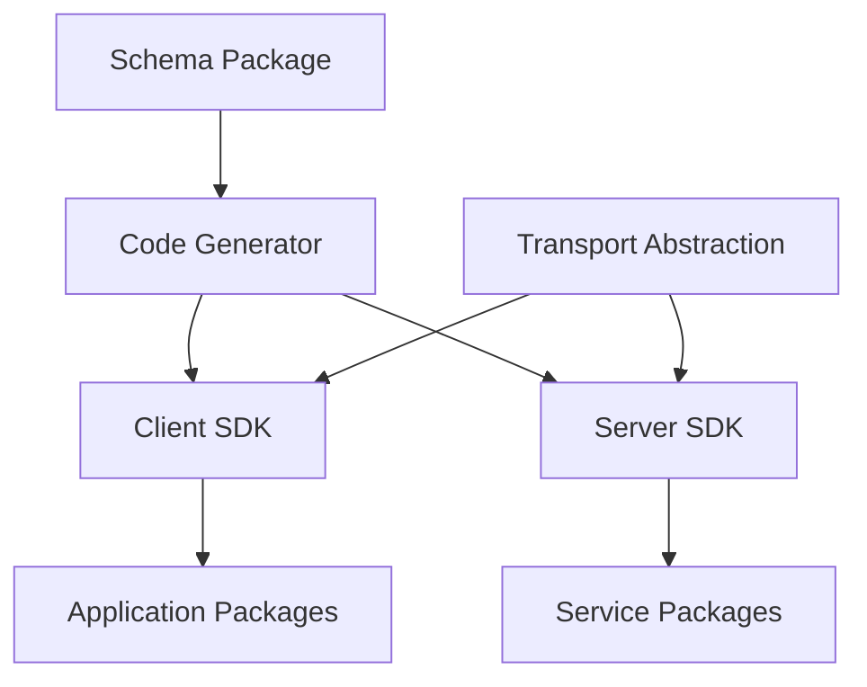
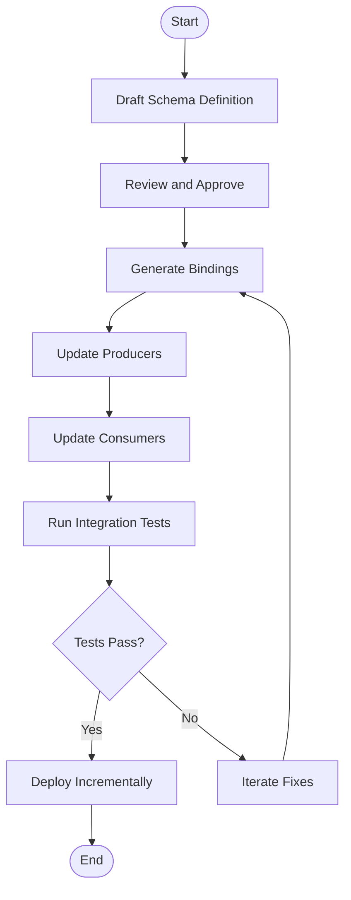

# Protocol-Based Communication

<cite>
**Referenced Files in This Document**
- [README.md](file://README.md)
- [package.json](file://package.json)
- [bunfig.toml](file://bunfig.toml)
- [tsconfig.json](file://tsconfig.json)
</cite>

## Table of Contents
1. [Introduction](#introduction)
2. [Project Structure](#project-structure)
3. [Core Components](#core-components)
4. [Architecture Overview](#architecture-overview)
5. [Detailed Component Analysis](#detailed-component-analysis)
6. [Dependency Analysis](#dependency-analysis)
7. [Performance Considerations](#performance-considerations)
8. [Troubleshooting Guide](#troubleshooting-guide)
9. [Conclusion](#conclusion)
10. [Appendices](#appendices)

## Introduction
This document explains protocol-based communication patterns for inter-package messaging within the project. It focuses on message serialization formats, request/response patterns, and event-driven communication. It also covers how to define new message types, handle different transport layers, implement custom protocols, manage versioning and backward compatibility, and address error handling, queuing, and debugging in distributed scenarios.

Where applicable, this guide references concrete files in the repository to ground recommendations in the actual codebase.

## Project Structure
The repository is a multi-package workspace with several packages that can participate in inter-process or inter-package messaging. The root configuration files provide essential context for build and runtime behavior that impacts communication:

- README.md: High-level project overview and usage guidance.
- package.json: Workspace metadata and scripts that may orchestrate builds or run services involved in messaging.
- bunfig.toml: Runtime configuration for the Bun environment, which can influence networking and process isolation.
- tsconfig.json: TypeScript compilation settings that affect how shared types and schemas are generated and consumed across packages.



**Diagram sources**
- [package.json](file://package.json)
- [bunfig.toml](file://bunfig.toml)
- [tsconfig.json](file://tsconfig.json)
- [README.md](file://README.md)

**Section sources**
- [README.md](file://README.md)
- [package.json](file://package.json)
- [bunfig.toml](file://bunfig.toml)
- [tsconfig.json](file://tsconfig.json)

## Core Components
Inter-package messaging typically involves these core components:

- Message Schema Definitions: Centralized definitions of message shapes used by producers and consumers.
- Serialization/Deserialization: Encoders and decoders for binary or text-based payloads (e.g., JSON, Protocol Buffers).
- Transport Layer: HTTP/WebSocket/gRPC or other transports that carry messages between packages.
- Request/Response Handlers: Routers and handlers that match incoming requests to handlers and produce responses.
- Event Bus/Queues: Pub/sub or queue abstractions for asynchronous, event-driven communication.
- Versioning and Compatibility: Strategies to evolve schemas without breaking existing clients.
- Error Handling and Diagnostics: Standardized error codes, retries, timeouts, and logging/tracing.

These components should be implemented consistently across packages to ensure interoperability and maintainability.

[No sources needed since this section provides general guidance]

## Architecture Overview
A typical architecture for inter-package messaging includes:

- Producers: Packages that generate messages (requests, commands, events).
- Consumers: Packages that receive and process messages.
- Transport: Network or IPC layer (HTTP, WebSocket, gRPC, queues).
- Schema Registry: Central source of truth for message types and versions.
- Middleware: Logging, validation, tracing, retry, and security policies.

```mermaid
graph TB
Producer["Producer Package"] --> Serializer["Serializer"]
Consumer["Consumer Package"] <-- Deserializer["Deserializer"]
Serializer --> Transport["Transport Layer"]
Transport --> Deserializer
Transport --> Queue["Message Queue / Event Bus"]
Queue --> Consumer
Schema["Schema Registry"] --> Serializer
Schema --> Deserializer
Logger["Logging & Tracing"] -.-> Transport
Logger -.-> Serializer
Logger -.-> Deserializer
```

[No sources needed since this diagram shows conceptual workflow, not actual code structure]

## Detailed Component Analysis

### Message Serialization Formats
- Choose a schema format suitable for your use case:
  - JSON: Human-readable, widely supported, good for HTTP APIs.
  - Protocol Buffers: Efficient binary format, strong typing, excellent for performance-critical paths.
  - Avro/FlatBuffers: Alternatives depending on streaming or zero-copy needs.
- Define schemas centrally and generate language bindings where possible.
- Validate payloads at boundaries (producer input, consumer output) to catch errors early.

Best practices:
- Use strict mode or equivalent to reject unknown fields when safe.
- Provide default values for optional fields to ease evolution.
- Keep field IDs stable; never reorder or reuse IDs.

[No sources needed since this section provides general guidance]

### Request/Response Patterns
Common patterns:
- Synchronous RPC: HTTP REST or gRPC with explicit request/response semantics.
- Asynchronous RPC: Fire-and-forget with callbacks or polling for status.
- Streaming: Server-sent events or bidirectional streams for real-time updates.

Guidelines:
- Always include correlation IDs to trace requests across services.
- Enforce timeouts and idempotency keys for reliability.
- Separate command (write) from query (read) models when appropriate.

[No sources needed since this section provides general guidance]

### Event-Driven Communication
Use an event bus or message queue for decoupled interactions:
- Publish events for state changes or domain actions.
- Subscribe to events to trigger side effects or update read models.
- Ensure at-least-once delivery semantics and handle duplicates gracefully.

Design tips:
- Name events in past tense (e.g., OrderPlaced).
- Include sufficient context in event payloads to avoid cross-service lookups.
- Version events alongside schemas to support migration.

[No sources needed since this section provides general guidance]

### Protocol Buffer Definitions and Versioning
When using Protocol Buffers:
- Place .proto definitions in a central location and generate client/server code per package.
- Assign unique field numbers and never change them.
- Add new fields as optional; mark deprecated fields appropriately.
- Maintain a versioned registry to track schema evolution.

Backward compatibility rules:
- Adding fields is safe if consumers ignore unknown fields.
- Removing fields requires deprecation and a migration window.
- Changing field types is generally unsafe; introduce new fields and migrate data.

[No sources needed since this section provides general guidance]

### Defining New Message Types
Steps:
- Draft the schema in the central schema package.
- Generate bindings for all consuming packages.
- Update producers and consumers to serialize/deserialize the new type.
- Add tests for round-trip encoding/decoding and edge cases.
- Roll out incrementally with feature flags if necessary.

[No sources needed since this section provides general guidance]

### Handling Different Transport Layers
- HTTP: Use REST endpoints or GraphQL for request/response; add middleware for auth, rate limiting, and tracing.
- WebSocket: For bidirectional, low-latency communication; manage connection lifecycle and reconnection logic.
- gRPC: Strongly typed RPC with streaming support; integrate with protobuf schemas.
- Queues: Use reliable brokers for async processing; configure retries and dead-letter queues.

Transport selection criteria:
- Latency requirements, payload size, streaming needs, and operational complexity.

[No sources needed since this section provides general guidance]

### Implementing Custom Protocols
If you need a custom protocol:
- Define a clear wire format and framing (e.g., length-prefixed messages).
- Implement robust serializers/deserializers with schema validation.
- Provide SDKs or code generators for each language.
- Instrument with metrics and logs for observability.

[No sources needed since this section provides general guidance]

### Error Handling in Distributed Scenarios
Standardize error responses:
- Use consistent error codes and messages.
- Include correlation IDs and timestamps.
- Distinguish transient vs permanent errors to guide retries.

Resilience strategies:
- Retry with exponential backoff for transient failures.
- Implement circuit breakers to prevent cascading failures.
- Use timeouts and deadlines to avoid hanging calls.

[No sources needed since this section provides general guidance]

### Message Queuing
Queue design:
- Choose durable queues for persistence.
- Configure partitioning and ordering guarantees as needed.
- Monitor lag and throughput; scale consumers accordingly.

Operational concerns:
- Dead-letter queues for poison messages.
- Idempotent consumers to handle duplicates.
- Backpressure handling to avoid overwhelming downstream systems.

[No sources needed since this section provides general guidance]

### Debugging Communication Issues
Diagnostic techniques:
- Enable structured logging with correlation IDs.
- Capture payloads in test environments only.
- Use distributed tracing to follow requests across boundaries.
- Inspect network traces and broker metrics.

Common pitfalls:
- Timeouts due to slow downstream services.
- Schema mismatches causing deserialization failures.
- Missing headers or authentication tokens.

[No sources needed since this section provides general guidance]

## Dependency Analysis
Inter-package dependencies for communication should be minimized and well-defined:

- Shared schema package: All packages depend on schema definitions.
- Transport abstraction: Common interfaces for HTTP/WebSocket/gRPC/queues.
- Code generation: Build steps generate bindings from schemas.



[No sources needed since this diagram shows conceptual workflow, not actual code structure]

## Performance Considerations
- Prefer binary formats (e.g., Protocol Buffers) for high-throughput paths.
- Minimize payload sizes by omitting unnecessary fields.
- Use connection pooling and keep-alive for HTTP/gRPC.
- Batch messages when possible to reduce overhead.
- Profile serialization/deserialization hotspots.

[No sources needed since this section provides general guidance]

## Troubleshooting Guide
Checklist:
- Verify schema versions match between producer and consumer.
- Confirm transport configuration (ports, TLS, proxies).
- Inspect logs for timeout, retry, and error codes.
- Validate payloads against schemas in staging environments.
- Use tracing to identify bottlenecks and failure points.

Common fixes:
- Align timezones and date formats.
- Normalize string encodings (UTF-8).
- Adjust retry/backoff parameters based on observed latency.

[No sources needed since this section provides general guidance]

## Conclusion
Robust inter-package communication relies on clear schemas, consistent serialization, resilient transports, and comprehensive observability. By adopting standardized patterns for request/response and event-driven messaging, and by enforcing versioning and compatibility rules, teams can evolve systems safely while maintaining reliability and performance.

[No sources needed since this section summarizes without analyzing specific files]

## Appendices

### Appendix A: Example Workflow for Adding a New Message Type


[No sources needed since this diagram shows conceptual workflow, not actual code structure]

### Appendix B: Transport Selection Matrix
- HTTP: Good for simple request/response, wide ecosystem support.
- WebSocket: Real-time bidirectional communication.
- gRPC: Strongly typed RPC with streaming and efficient serialization.
- Queues: Async processing with durability and scaling.

[No sources needed since this section provides general guidance]