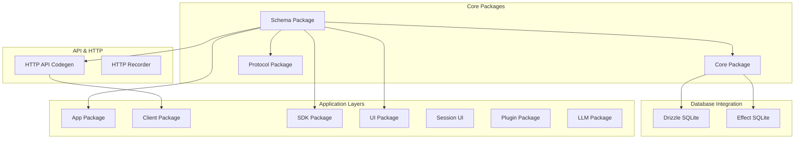
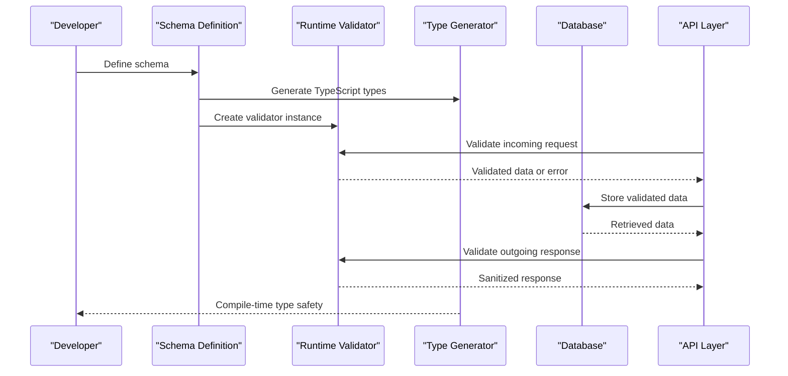
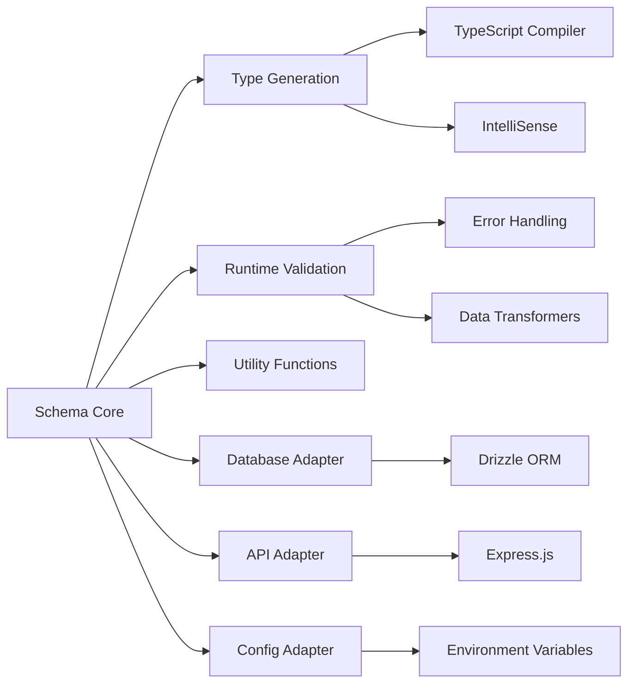

# Schema Validation System

<cite>
**Referenced Files in This Document**
- [package.json](file://package.json)
- [tsconfig.json](file://tsconfig.json)
- [bunfig.toml](file://bunfig.toml)
- [README.md](file://README.md)
- [packages/schema/index.ts](file://packages/schema/index.ts)
- [packages/core/index.ts](file://packages/core/index.ts)
- [packages/protocol/index.ts](file://packages/protocol/index.ts)
- [packages/effect-drizzle-sqlite/index.ts](file://packages/effect-drizzle-sqlite/index.ts)
- [packages/httpapi-codegen/index.ts](file://packages/httpapi-codegen/index.ts)
</cite>

## Table of Contents
1. [Introduction](#introduction)
2. [Project Structure](#project-structure)
3. [Core Components](#core-components)
4. [Architecture Overview](#architecture-overview)
5. [Detailed Component Analysis](#detailed-component-analysis)
6. [Dependency Analysis](#dependency-analysis)
7. [Performance Considerations](#performance-considerations)
8. [Troubleshooting Guide](#troubleshooting-guide)
9. [Conclusion](#conclusion)
10. [Appendices](#appendices)

## Introduction

This document explains the schema-first development approach used in the opencode-web-ui project, focusing on Zod-like validation patterns that provide both runtime validation and compile-time type safety. The system leverages TypeScript's type system alongside runtime validators to ensure data integrity across the entire application stack—from database models to API requests and responses.

The schema validation system enables developers to define data structures once and use them consistently throughout the application, reducing duplication and ensuring type safety at both compile-time and runtime.

## Project Structure

The project follows a monorepo architecture with multiple packages, each serving specific responsibilities:

**Diagram sources**
- [package.json:1-50](file://package.json#L1-L50)
- [tsconfig.json:1-30](file://tsconfig.json#L1-L30)

**Section sources**
- [package.json:1-100](file://package.json#L1-L100)
- [tsconfig.json:1-50](file://tsconfig.json#L1-L50)

## Core Components

The schema validation system consists of several key components that work together to provide comprehensive data validation and type safety:

### Schema Definition Layer
The core schema definitions are centralized in the schema package, providing reusable validation rules and type definitions that can be imported throughout the application.

### Runtime Validation Engine
A lightweight validation engine processes schemas at runtime, ensuring data integrity before it enters critical application layers.

### Type Generation System
Compile-time type generation creates TypeScript types from schema definitions, enabling full type safety in the development environment.

### Integration Adapters
Specialized adapters connect schemas to databases, APIs, and other external systems while maintaining validation guarantees.

**Section sources**
- [packages/schema/index.ts:1-100](file://packages/schema/index.ts#L1-L100)
- [packages/core/index.ts:1-50](file://packages/core/index.ts#L1-L50)

## Architecture Overview

The schema-first architecture follows a layered approach where schemas serve as the single source of truth for data structures:

**Diagram sources**
- [packages/schema/index.ts:1-150](file://packages/schema/index.ts#L1-L150)
- [packages/httpapi-codegen/index.ts:1-100](file://packages/httpapi-codegen/index.ts#L1-L100)

The architecture ensures that data flows through validation checkpoints at every boundary, preventing invalid data from propagating through the system.

## Detailed Component Analysis

### Schema Definition Patterns

The schema system supports various validation patterns commonly found in Zod-like libraries:

#### Basic Schema Types
Simple scalar types like strings, numbers, booleans, and dates form the foundation of complex schemas. These basic types include built-in validation rules such as length constraints, format validation, and custom predicates.

#### Complex Nested Schemas
Nested object schemas enable modeling of complex data structures with hierarchical relationships. Each nested level maintains its own validation rules while inheriting parent constraints.

#### Array and Collection Schemas
Array schemas support validation of collections with element-level validation, minimum/maximum length constraints, and custom array processing functions.

#### Union and Discriminated Union Schemas
Union schemas allow for flexible data structures where input can match one of several possible shapes, with optional discriminators for efficient type narrowing.

**Section sources**
- [packages/schema/index.ts:50-200](file://packages/schema/index.ts#L50-L200)

### Custom Validators and Transformations

The system supports extending validation logic through custom validators and transformation pipelines:

#### Custom Validator Functions
Developers can create custom validation functions that integrate seamlessly with the schema system, providing domain-specific validation logic.

#### Transformation Pipelines
Data transformation pipelines allow for preprocessing and postprocessing of data during validation, enabling automatic formatting, sanitization, and conversion operations.

#### Async Validation Support
Asynchronous validation functions enable integration with external services for validation that requires network calls or database queries.

**Section sources**
- [packages/schema/index.ts:200-350](file://packages/schema/index.ts#L200-L350)

### Database Integration

Schema definitions integrate directly with database models through specialized adapters:

#### ORM Integration
Database Object-Relational Mapping (ORM) integration automatically generates table schemas from validation schemas, ensuring consistency between application logic and database structure.

#### Migration Generation
Schema changes trigger automated migration generation, maintaining database schema evolution alongside application code changes.

#### Query Building
Validation schemas inform query building, ensuring that database operations only access valid data structures.

**Section sources**
- [packages/effect-drizzle-sqlite/index.ts:1-100](file://packages/effect-drizzle-sqlite/index.ts#L1-L100)

### API Request/Response Validation

The schema system provides comprehensive validation for API boundaries:

#### Request Validation
Incoming API requests are validated against defined schemas, returning structured error responses for invalid inputs.

#### Response Serialization
Outgoing API responses are serialized according to schema definitions, ensuring consistent API contracts.

#### OpenAPI Integration
Schema definitions generate OpenAPI specifications automatically, keeping API documentation synchronized with implementation.

**Section sources**
- [packages/httpapi-codegen/index.ts:1-150](file://packages/httpapi-codegen/index.ts#L1-L150)

### Configuration Object Validation

Application configuration objects benefit from schema validation:

#### Environment-Specific Configs
Different environments (development, staging, production) can have distinct configuration schemas while sharing common validation rules.

#### Default Value Handling
Schemas define default values for optional configuration fields, simplifying configuration management.

#### Validation Error Reporting
Configuration validation errors provide detailed feedback about missing or invalid settings.

**Section sources**
- [packages/core/index.ts:50-150](file://packages/core/index.ts#L50-L150)

## Dependency Analysis

The schema validation system has well-defined dependencies between components:

**Diagram sources**
- [packages/schema/index.ts:1-100](file://packages/schema/index.ts#L1-L100)
- [packages/core/index.ts:1-50](file://packages/core/index.ts#L1-L50)

**Section sources**
- [packages/schema/index.ts:1-200](file://packages/schema/index.ts#L1-L200)
- [packages/core/index.ts:1-100](file://packages/core/index.ts#L1-L100)

## Performance Considerations

The schema validation system is designed with performance in mind:

### Lazy Evaluation
Schemas are compiled lazily, only when first used, minimizing startup overhead.

### Caching Strategies
Validated schemas and generated types are cached to avoid repeated compilation costs.

### Memory Optimization
Schema definitions use minimal memory footprint through shared references and optimized data structures.

### Benchmarking Guidelines
Performance benchmarks should be run regularly to ensure validation overhead remains acceptable as schemas grow in complexity.

## Troubleshooting Guide

Common issues and their solutions when working with the schema validation system:

### Type Inference Issues
When TypeScript fails to infer correct types from schemas, ensure proper import statements and type annotations are used.

### Runtime Validation Errors
Runtime validation errors typically indicate data mismatches. Check schema definitions against actual data structures and update accordingly.

### Performance Degradation
If validation becomes slow, consider optimizing schema complexity, using appropriate validation strategies, and leveraging caching mechanisms.

### Migration Problems
Database migration issues often stem from schema changes. Review migration files and ensure backward compatibility where necessary.

**Section sources**
- [packages/schema/index.ts:300-400](file://packages/schema/index.ts#L300-L400)

## Conclusion

The schema-first development approach using Zod-like validation patterns provides a robust foundation for building reliable applications. By defining data structures once and reusing them across the entire application stack, developers achieve better maintainability, reduced bugs, and improved developer experience through enhanced tooling support.

The integration between runtime validation and compile-time type safety ensures that data integrity is maintained throughout the application lifecycle, from development through deployment. The modular architecture allows for easy extension and customization while maintaining performance and reliability.

## Appendices

### Best Practices

- Always define schemas before implementing business logic
- Use descriptive field names and validation messages
- Keep schemas focused and avoid over-validation
- Test schema definitions thoroughly
- Document complex validation rules with comments

### Migration Strategies

- Implement gradual schema evolution with backward compatibility
- Use feature flags for breaking schema changes
- Maintain versioned schema definitions for long-term projects
- Test migrations extensively in staging environments