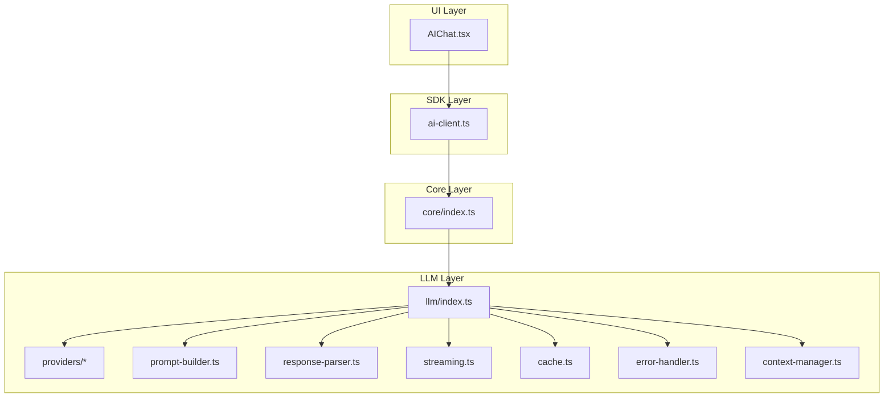
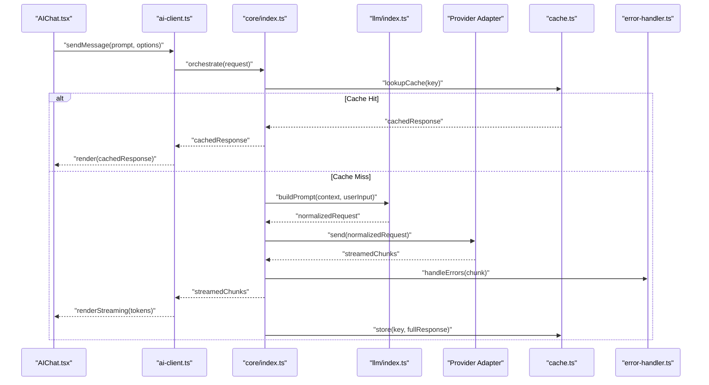
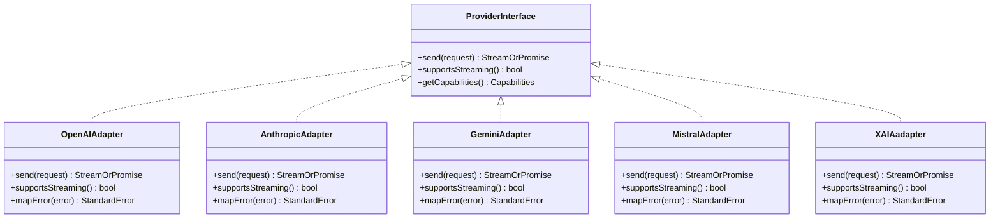
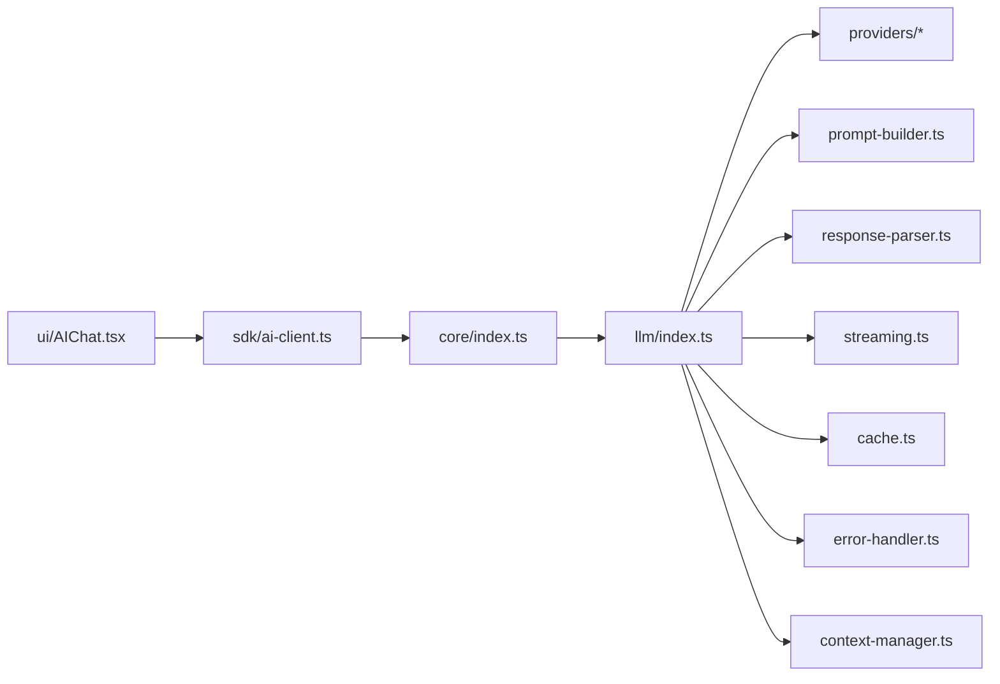

# AI Processing Pipeline

<cite>
**Referenced Files in This Document**
- [README.md](file://README.md)
- [package.json](file://package.json)
- [bunfig.toml](file://bunfig.toml)
- [tsconfig.json](file://tsconfig.json)
- [packages/llm/src/index.ts](file://packages/llm/src/index.ts)
- [packages/llm/src/providers/openai.ts](file://packages/llm/src/providers/openai.ts)
- [packages/llm/src/providers/anthropic.ts](file://packages/llm/src/providers/anthropic.ts)
- [packages/llm/src/providers/gemini.ts](file://packages/llm/src/providers/gemini.ts)
- [packages/llm/src/providers/mistral.ts](file://packages/llm/src/providers/mistral.ts)
- [packages/llm/src/providers/xai.ts](file://packages/llm/src/providers/xai.ts)
- [packages/llm/src/types.ts](file://packages/llm/src/types.ts)
- [packages/llm/src/prompt-builder.ts](file://packages/llm/src/prompt-builder.ts)
- [packages/llm/src/response-parser.ts](file://packages/llm/src/response-parser.ts)
- [packages/llm/src/streaming.ts](file://packages/llm/src/streaming.ts)
- [packages/llm/src/cache.ts](file://packages/llm/src/cache.ts)
- [packages/llm/src/error-handler.ts](file://packages/llm/src/error-handler.ts)
- [packages/llm/src/context-manager.ts](file://packages/llm/src/context-manager.ts)
- [packages/core/src/index.ts](file://packages/core/src/index.ts)
- [packages/ui/src/components/AIChat.tsx](file://packages/ui/src/components/AIChat.tsx)
- [packages/sdk/src/ai-client.ts](file://packages/sdk/src/ai-client.ts)
</cite>

## Table of Contents
1. [Introduction](#introduction)
2. [Project Structure](#project-structure)
3. [Core Components](#core-components)
4. [Architecture Overview](#architecture-overview)
5. [Detailed Component Analysis](#detailed-component-analysis)
6. [Dependency Analysis](#dependency-analysis)
7. [Performance Considerations](#performance-considerations)
8. [Troubleshooting Guide](#troubleshooting-guide)
9. [Conclusion](#conclusion)

## Introduction
This document explains the AI processing pipeline used by OpenCode Web UI to construct prompts, send them to multiple LLM providers, and process responses. It covers the multi-provider abstraction layer, context management, streaming support, prompt engineering patterns, response parsing, error handling (including API limits and rate limiting), caching strategies, and performance optimization techniques. The goal is to make the system understandable for both developers and non-technical users while providing actionable guidance for integration and troubleshooting.

## Project Structure
The AI pipeline spans several packages:
- llm: Core logic for provider abstraction, prompt building, response parsing, streaming, caching, and error handling.
- core: Shared utilities and orchestration glue between UI and SDK layers.
- ui: User-facing components that initiate requests and render streamed responses.
- sdk: Client-side SDK that encapsulates HTTP calls and integrates with the UI.

**Diagram sources**
- [packages/ui/src/components/AIChat.tsx](file://packages/ui/src/components/AIChat.tsx)
- [packages/sdk/src/ai-client.ts](file://packages/sdk/src/ai-client.ts)
- [packages/core/src/index.ts](file://packages/core/src/index.ts)
- [packages/llm/src/index.ts](file://packages/llm/src/index.ts)
- [packages/llm/src/providers/openai.ts](file://packages/llm/src/providers/openai.ts)
- [packages/llm/src/providers/anthropic.ts](file://packages/llm/src/providers/anthropic.ts)
- [packages/llm/src/providers/gemini.ts](file://packages/llm/src/providers/gemini.ts)
- [packages/llm/src/providers/mistral.ts](file://packages/llm/src/providers/mistral.ts)
- [packages/llm/src/providers/xai.ts](file://packages/llm/src/providers/xai.ts)
- [packages/llm/src/prompt-builder.ts](file://packages/llm/src/prompt-builder.ts)
- [packages/llm/src/response-parser.ts](file://packages/llm/src/response-parser.ts)
- [packages/llm/src/streaming.ts](file://packages/llm/src/streaming.ts)
- [packages/llm/src/cache.ts](file://packages/llm/src/cache.ts)
- [packages/llm/src/error-handler.ts](file://packages/llm/src/error-handler.ts)
- [packages/llm/src/context-manager.ts](file://packages/llm/src/context-manager.ts)

**Section sources**
- [README.md](file://README.md)
- [package.json](file://package.json)
- [bunfig.toml](file://bunfig.toml)
- [tsconfig.json](file://tsconfig.json)

## Core Components
- Provider Abstraction: A unified interface that normalizes request/response shapes across OpenAI, Anthropic, Gemini, Mistral, and xAI.
- Prompt Builder: Constructs structured prompts from user input, system instructions, and conversation history.
- Response Parser: Normalizes provider outputs into a consistent format for UI rendering and downstream processing.
- Streaming Engine: Handles incremental token delivery and reassembly for real-time UX.
- Context Manager: Maintains conversation state, memory windows, and tool-use context.
- Cache: Stores recent responses or tokens to reduce latency and cost.
- Error Handler: Centralizes retries, backoff, and provider-specific error mapping.

Key responsibilities:
- Constructing prompts with consistent structure and variable substitution.
- Sending requests via the selected provider with appropriate headers and payloads.
- Parsing and validating responses, including partial chunks during streaming.
- Managing context windows and truncation policies.
- Handling errors gracefully with retries and informative messages.

**Section sources**
- [packages/llm/src/index.ts](file://packages/llm/src/index.ts)
- [packages/llm/src/types.ts](file://packages/llm/src/types.ts)
- [packages/llm/src/prompt-builder.ts](file://packages/llm/src/prompt-builder.ts)
- [packages/llm/src/response-parser.ts](file://packages/llm/src/response-parser.ts)
- [packages/llm/src/streaming.ts](file://packages/llm/src/streaming.ts)
- [packages/llm/src/cache.ts](file://packages/llm/src/cache.ts)
- [packages/llm/src/error-handler.ts](file://packages/llm/src/error-handler.ts)
- [packages/llm/src/context-manager.ts](file://packages/llm/src/context-manager.ts)

## Architecture Overview
The pipeline follows a layered architecture:
- UI initiates chat interactions and renders streamed tokens.
- SDK handles network transport and integrates with the core orchestrator.
- Core coordinates provider selection, caching, and error handling.
- LLM layer implements provider-specific adapters and shared utilities.

**Diagram sources**
- [packages/ui/src/components/AIChat.tsx](file://packages/ui/src/components/AIChat.tsx)
- [packages/sdk/src/ai-client.ts](file://packages/sdk/src/ai-client.ts)
- [packages/core/src/index.ts](file://packages/core/src/index.ts)
- [packages/llm/src/index.ts](file://packages/llm/src/index.ts)
- [packages/llm/src/cache.ts](file://packages/llm/src/cache.ts)
- [packages/llm/src/error-handler.ts](file://packages/llm/src/error-handler.ts)

## Detailed Component Analysis

### Provider Abstraction Layer
The abstraction defines a common interface for all providers, ensuring consistent request/response shapes and streaming behavior. Each provider adapter translates its native payload into the normalized schema and maps provider-specific errors to standard codes.

**Diagram sources**
- [packages/llm/src/index.ts](file://packages/llm/src/index.ts)
- [packages/llm/src/providers/openai.ts](file://packages/llm/src/providers/openai.ts)
- [packages/llm/src/providers/anthropic.ts](file://packages/llm/src/providers/anthropic.ts)
- [packages/llm/src/providers/gemini.ts](file://packages/llm/src/providers/gemini.ts)
- [packages/llm/src/providers/mistral.ts](file://packages/llm/src/providers/mistral.ts)
- [packages/llm/src/providers/xai.ts](file://packages/llm/src/providers/xai.ts)

**Section sources**
- [packages/llm/src/index.ts](file://packages/llm/src/index.ts)
- [packages/llm/src/providers/openai.ts](file://packages/llm/src/providers/openai.ts)
- [packages/llm/src/providers/anthropic.ts](file://packages/llm/src/providers/anthropic.ts)
- [packages/llm/src/providers/gemini.ts](file://packages/llm/src/providers/gemini.ts)
- [packages/llm/src/providers/mistral.ts](file://packages/llm/src/providers/mistral.ts)
- [packages/llm/src/providers/xai.ts](file://packages/llm/src/providers/xai.ts)

### Prompt Construction and Engineering Patterns
Prompts are built using a structured approach:
- System instructions define model behavior and constraints.
- User input is combined with conversation history and tool results.
- Variables and templates enable reusable prompt segments.
- Context window management ensures only relevant history is included.

Patterns include:
- Role-based prompting (system, assistant, user).
- Few-shot examples embedded within context.
- Structured output schemas for deterministic parsing.
- Conditional inclusion of tools and files based on task type.

**Section sources**
- [packages/llm/src/prompt-builder.ts](file://packages/llm/src/prompt-builder.ts)
- [packages/llm/src/context-manager.ts](file://packages/llm/src/context-manager.ts)
- [packages/llm/src/types.ts](file://packages/llm/src/types.ts)

### Response Processing and Parsing
Responses are normalized across providers:
- Token streams are aggregated into coherent text or structured data.
- JSON-like outputs are validated against expected schemas.
- Partial responses are handled safely during streaming.
- Metadata (usage stats, model info) is extracted and attached.

Parsing strategies:
- Incremental JSON parsing with recovery on chunk boundaries.
- Regex-assisted extraction for code blocks and artifacts.
- Fallback parsers when structured output fails.

**Section sources**
- [packages/llm/src/response-parser.ts](file://packages/llm/src/response-parser.ts)
- [packages/llm/src/streaming.ts](file://packages/llm/src/streaming.ts)

### Streaming Responses
Streaming enables real-time feedback:
- Tokens arrive incrementally and are rendered immediately.
- Backpressure is managed to prevent UI lag.
- Errors during streaming trigger graceful fallbacks.
- Caching can store final responses for future reuse.

Implementation highlights:
- Event-driven token emission.
- Chunk buffering and reassembly.
- Timeout and cancellation support.

**Section sources**
- [packages/llm/src/streaming.ts](file://packages/llm/src/streaming.ts)

### Context Management
Context management maintains conversation state:
- Sliding window over message history.
- Summarization of older turns to preserve relevance.
- Tool-use context and file references tracked separately.
- Memory persistence across sessions when enabled.

Policies:
- Max tokens per context window.
- Priority-based retention (recent > important > old).
- Automatic trimming when limits are exceeded.

**Section sources**
- [packages/llm/src/context-manager.ts](file://packages/llm/src/context-manager.ts)

### Caching Strategies
Caching reduces latency and cost:
- Key generation based on prompt hash and parameters.
- TTL-based expiration for dynamic content.
- In-memory cache for hot responses.
- Optional disk or remote cache for team sharing.

Strategies:
- Exact match caching for deterministic prompts.
- Fuzzy matching for similar queries.
- Bypass cache for sensitive or time-critical data.

**Section sources**
- [packages/llm/src/cache.ts](file://packages/llm/src/cache.ts)

### Error Handling
Centralized error handling improves reliability:
- Retries with exponential backoff for transient failures.
- Rate limit detection and adaptive throttling.
- Provider-specific error mapping to standard codes.
- Graceful degradation when providers are unavailable.

Common scenarios:
- API quota exceeded: pause and notify user.
- Network timeouts: retry with jitter.
- Malformed responses: fallback parser or error message.

**Section sources**
- [packages/llm/src/error-handler.ts](file://packages/llm/src/error-handler.ts)

## Dependency Analysis
The pipeline has clear dependencies:
- UI depends on SDK for network operations.
- SDK depends on core for orchestration.
- Core depends on llm for provider abstraction and utilities.
- llm depends on providers, prompt builder, parser, streaming, cache, error handler, and context manager.

**Diagram sources**
- [packages/ui/src/components/AIChat.tsx](file://packages/ui/src/components/AIChat.tsx)
- [packages/sdk/src/ai-client.ts](file://packages/sdk/src/ai-client.ts)
- [packages/core/src/index.ts](file://packages/core/src/index.ts)
- [packages/llm/src/index.ts](file://packages/llm/src/index.ts)

**Section sources**
- [packages/ui/src/components/AIChat.tsx](file://packages/ui/src/components/AIChat.tsx)
- [packages/sdk/src/ai-client.ts](file://packages/sdk/src/ai-client.ts)
- [packages/core/src/index.ts](file://packages/core/src/index.ts)
- [packages/llm/src/index.ts](file://packages/llm/src/index.ts)

## Performance Considerations
- Use streaming to reduce perceived latency and improve UX.
- Implement caching for repeated prompts to save costs and time.
- Optimize context window size to minimize token usage.
- Batch requests where possible to reduce overhead.
- Monitor provider quotas and implement adaptive throttling.
- Profile parsing logic to avoid heavy regex operations on large responses.

[No sources needed since this section provides general guidance]

## Troubleshooting Guide
Common issues and resolutions:
- API Limits: Check quota status, implement backoff, and inform users.
- Rate Limiting: Adjust request frequency and use queueing.
- Provider Outages: Failover to alternative providers and log errors.
- Malformed Responses: Validate schemas and apply fallback parsers.
- Streaming Interruptions: Reconnect and resume from last checkpoint.

Debugging steps:
- Enable verbose logging for request/response payloads.
- Inspect cache keys and hit rates.
- Verify context window limits and trimming policies.
- Test with different providers to isolate issues.

**Section sources**
- [packages/llm/src/error-handler.ts](file://packages/llm/src/error-handler.ts)
- [packages/llm/src/cache.ts](file://packages/llm/src/cache.ts)
- [packages/llm/src/context-manager.ts](file://packages/llm/src/context-manager.ts)

## Conclusion
The AI processing pipeline in OpenCode Web UI provides a robust, extensible framework for interacting with multiple LLM providers. By abstracting provider differences, managing context efficiently, supporting streaming, and implementing comprehensive error handling and caching, the system delivers a responsive and reliable user experience. Following the patterns and guidelines outlined here will help maintain performance, scalability, and ease of integration as new providers and features are added.

[No sources needed since this section summarizes without analyzing specific files]