# API Request-Response Cycle

<cite>
**Referenced Files in This Document**
- [package.json](file://package.json)
- [bunfig.toml](file://bunfig.toml)
- [README.md](file://README.md)
- [packages/sdk/src/index.ts](file://packages/sdk/src/index.ts)
- [packages/sdk/src/client.ts](file://packages/sdk/src/client.ts)
- [packages/sdk/src/http.ts](file://packages/sdk/src/http.ts)
- [packages/sdk/src/ws.ts](file://packages/sdk/src/ws.ts)
- [packages/sdk/src/retry.ts](file://packages/sdk/src/retry.ts)
- [packages/sdk/src/cache.ts](file://packages/sdk/src/cache.ts)
- [packages/protocol/src/types.ts](file://packages/protocol/src/types.ts)
- [packages/protocol/src/schema.ts](file://packages/protocol/src/schema.ts)
- [packages/http-recorder/src/index.ts](file://packages/http-recorder/src/index.ts)
- [packages/ui/src/api/hooks.ts](file://packages/ui/src/api/hooks.ts)
- [packages/ui/src/api/middleware.ts](file://packages/ui/src/api/middleware.ts)
</cite>

## Table of Contents
1. [Introduction](#introduction)
2. [Project Structure](#project-structure)
3. [Core Components](#core-components)
4. [Architecture Overview](#architecture-overview)
5. [Detailed Component Analysis](#detailed-component-analysis)
6. [Dependency Analysis](#dependency-analysis)
7. [Performance Considerations](#performance-considerations)
8. [Troubleshooting Guide](#troubleshooting-guide)
9. [Conclusion](#conclusion)

## Introduction
This document explains how OpenCode Web UI generates HTTP requests, sends them through the SDK layer, and processes responses. It covers RESTful API calls, WebSocket connections, and real-time streaming. It also documents protocol definitions, message serialization, authentication mechanisms, request interception, response caching, retry logic, timeout handling, and network error recovery patterns.

## Project Structure
The project is a multi-package repository with clear separation of concerns:
- packages/sdk: HTTP client, WebSocket client, retry, cache, and core client orchestration
- packages/protocol: Shared types and schemas for request/response payloads
- packages/http-recorder: Interceptor to record outgoing requests and responses
- packages/ui: UI hooks and middleware that integrate with the SDK
- Root configuration files define tooling and build settings

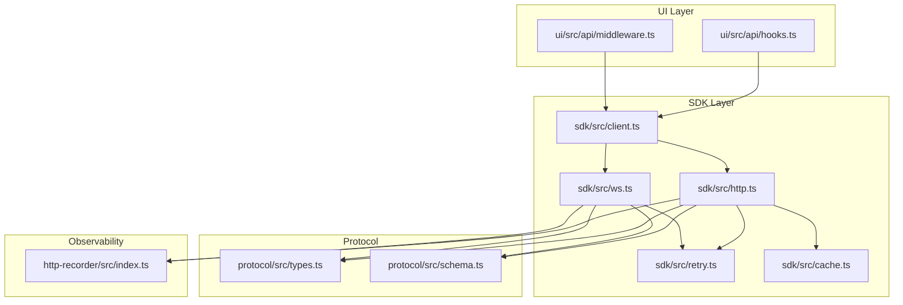

**Diagram sources**
- [packages/ui/src/api/hooks.ts](file://packages/ui/src/api/hooks.ts)
- [packages/ui/src/api/middleware.ts](file://packages/ui/src/api/middleware.ts)
- [packages/sdk/src/client.ts](file://packages/sdk/src/client.ts)
- [packages/sdk/src/http.ts](file://packages/sdk/src/http.ts)
- [packages/sdk/src/ws.ts](file://packages/sdk/src/ws.ts)
- [packages/sdk/src/retry.ts](file://packages/sdk/src/retry.ts)
- [packages/sdk/src/cache.ts](file://packages/sdk/src/cache.ts)
- [packages/protocol/src/types.ts](file://packages/protocol/src/types.ts)
- [packages/protocol/src/schema.ts](file://packages/protocol/src/schema.ts)
- [packages/http-recorder/src/index.ts](file://packages/http-recorder/src/index.ts)

**Section sources**
- [package.json](file://package.json)
- [bunfig.toml](file://bunfig.toml)
- [README.md](file://README.md)

## Core Components
- SDK Client: Central entry point for all network operations; composes HTTP and WebSocket transports with shared options (base URL, headers, timeouts).
- HTTP Transport: Serializes requests, handles JSON encoding/decoding, applies interceptors, retries, caching, and timeouts.
- WebSocket Transport: Establishes persistent connections, streams events, and manages reconnection and backoff.
- Retry Engine: Configurable exponential backoff with jitter, max attempts, and retryable status codes.
- Cache: In-memory or pluggable store for GET-like requests with TTL and invalidation strategies.
- Protocol Types/Schemas: Strictly typed request/response models and validation schemas used across SDK and UI.
- HTTP Recorder: Intercepts and records requests/responses for debugging and analytics.
- UI Hooks/Middleware: Declarative data fetching, loading/error states, and optional auth token injection.

**Section sources**
- [packages/sdk/src/client.ts](file://packages/sdk/src/client.ts)
- [packages/sdk/src/http.ts](file://packages/sdk/src/http.ts)
- [packages/sdk/src/ws.ts](file://packages/sdk/src/ws.ts)
- [packages/sdk/src/retry.ts](file://packages/sdk/src/retry.ts)
- [packages/sdk/src/cache.ts](file://packages/sdk/src/cache.ts)
- [packages/protocol/src/types.ts](file://packages/protocol/src/types.ts)
- [packages/protocol/src/schema.ts](file://packages/protocol/src/schema.ts)
- [packages/http-recorder/src/index.ts](file://packages/http-recorder/src/index.ts)
- [packages/ui/src/api/hooks.ts](file://packages/ui/src/api/hooks.ts)
- [packages/ui/src/api/middleware.ts](file://packages/ui/src/api/middleware.ts)

## Architecture Overview
The request lifecycle flows from UI hooks into the SDK client, which selects the appropriate transport (HTTP or WebSocket). Requests are serialized using protocol schemas, intercepted by the recorder, then executed with retry and caching policies. Responses are deserialized, validated, and returned to the UI layer.

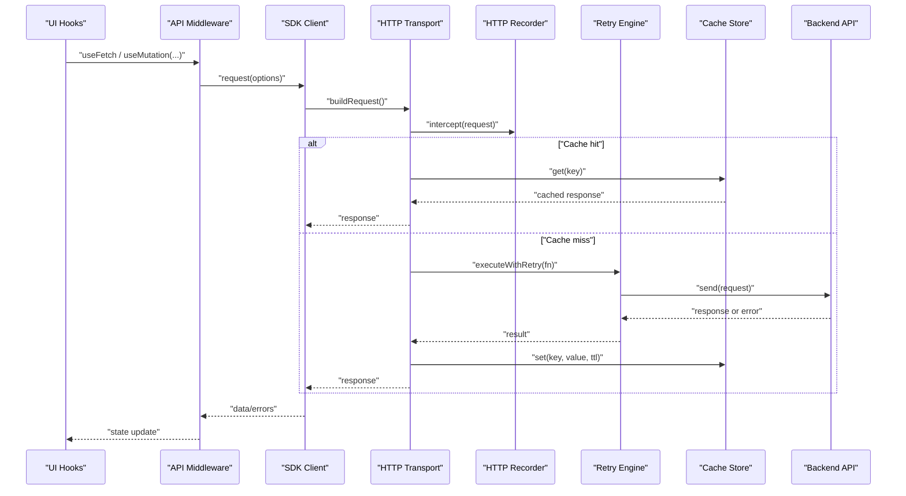

**Diagram sources**
- [packages/ui/src/api/hooks.ts](file://packages/ui/src/api/hooks.ts)
- [packages/ui/src/api/middleware.ts](file://packages/ui/src/api/middleware.ts)
- [packages/sdk/src/client.ts](file://packages/sdk/src/client.ts)
- [packages/sdk/src/http.ts](file://packages/sdk/src/http.ts)
- [packages/sdk/src/retry.ts](file://packages/sdk/src/retry.ts)
- [packages/sdk/src/cache.ts](file://packages/sdk/src/cache.ts)
- [packages/http-recorder/src/index.ts](file://packages/http-recorder/src/index.ts)

## Detailed Component Analysis

### HTTP Transport and Serialization
- Builds URLs from base path and route templates
- Encodes bodies as JSON and sets content-type headers
- Deserializes responses and validates against schema
- Applies global headers (e.g., authorization), query params, and abort signals
- Integrates with retry and cache layers

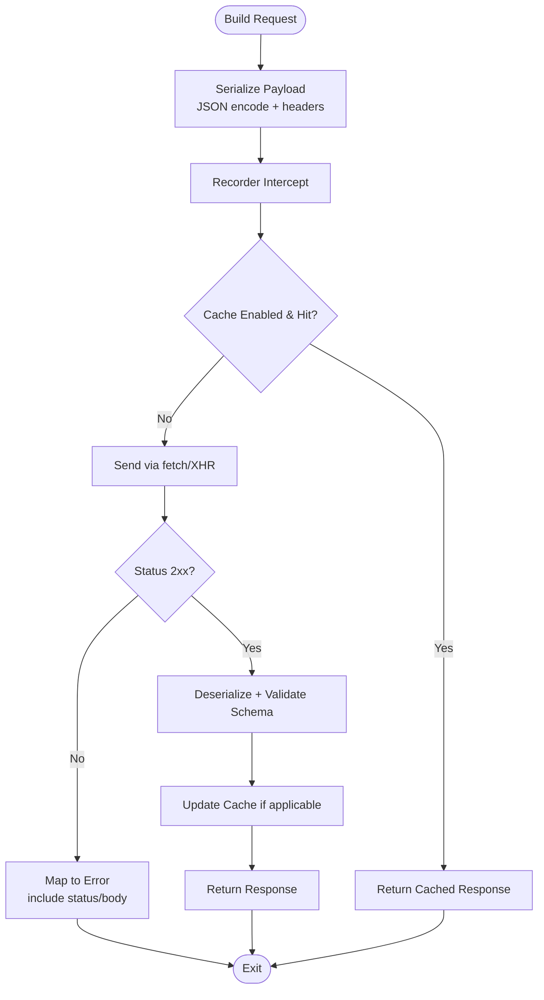

**Diagram sources**
- [packages/sdk/src/http.ts](file://packages/sdk/src/http.ts)
- [packages/sdk/src/cache.ts](file://packages/sdk/src/cache.ts)
- [packages/protocol/src/schema.ts](file://packages/protocol/src/schema.ts)

**Section sources**
- [packages/sdk/src/http.ts](file://packages/sdk/src/http.ts)
- [packages/protocol/src/schema.ts](file://packages/protocol/src/schema.ts)

### WebSocket Transport and Streaming
- Establishes WS connection with configurable parameters
- Streams server-sent events or messages
- Handles reconnects with backoff and jitter
- Emits typed events based on protocol schemas

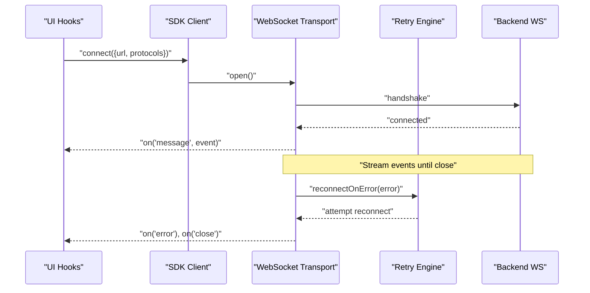

**Diagram sources**
- [packages/sdk/src/ws.ts](file://packages/sdk/src/ws.ts)
- [packages/sdk/src/retry.ts](file://packages/sdk/src/retry.ts)
- [packages/protocol/src/types.ts](file://packages/protocol/src/types.ts)

**Section sources**
- [packages/sdk/src/ws.ts](file://packages/sdk/src/ws.ts)
- [packages/protocol/src/types.ts](file://packages/protocol/src/types.ts)

### Retry Logic and Timeout Handling
- Exponential backoff with jitter
- Configurable max attempts and delay caps
- Retries on network errors and specific HTTP statuses
- Timeouts per request and overall operation

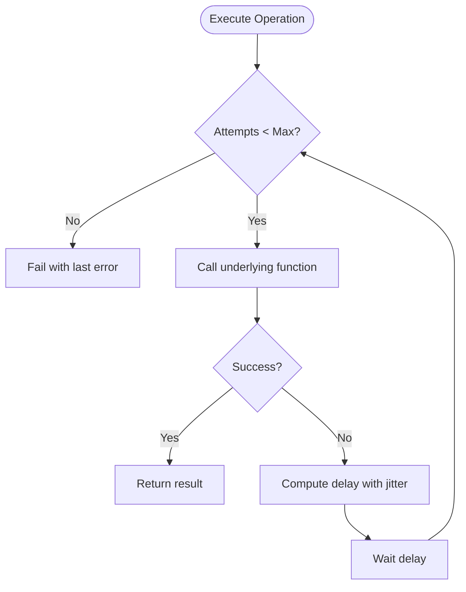

**Diagram sources**
- [packages/sdk/src/retry.ts](file://packages/sdk/src/retry.ts)

**Section sources**
- [packages/sdk/src/retry.ts](file://packages/sdk/src/retry.ts)

### Response Caching Strategy
- Cache keys derived from method, URL, and stable query params
- TTL-based expiration and manual invalidation
- Optional conditional caching for non-idempotent methods

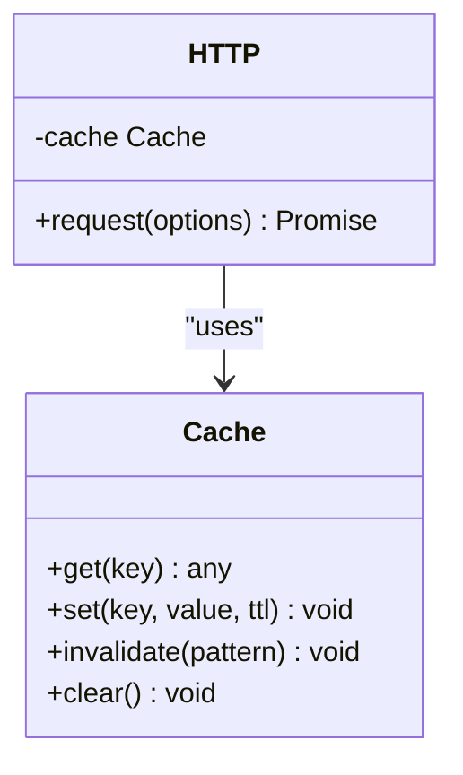

**Diagram sources**
- [packages/sdk/src/cache.ts](file://packages/sdk/src/cache.ts)
- [packages/sdk/src/http.ts](file://packages/sdk/src/http.ts)

**Section sources**
- [packages/sdk/src/cache.ts](file://packages/sdk/src/cache.ts)
- [packages/sdk/src/http.ts](file://packages/sdk/src/http.ts)

### Authentication and Request Interception
- Global header injection for tokens or session cookies
- Per-request overrides supported
- Recorder interceptor logs requests/responses for debugging

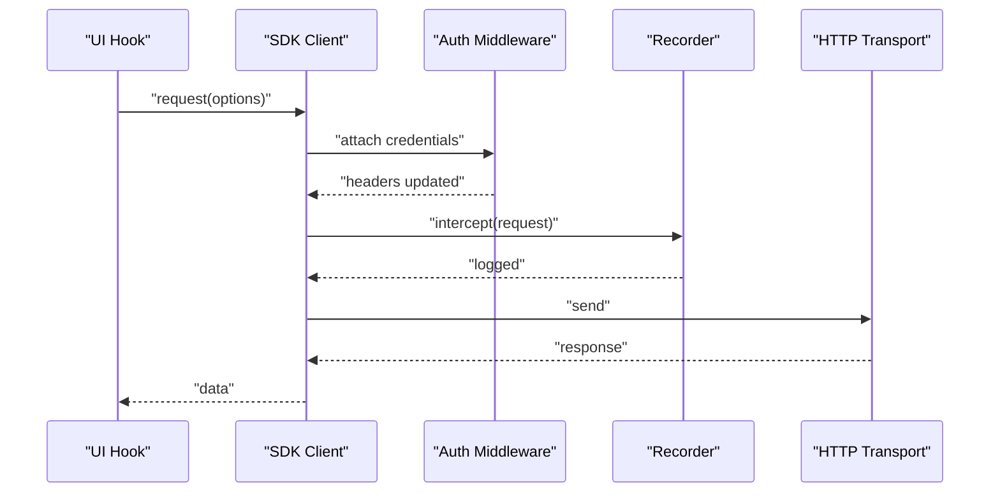

**Diagram sources**
- [packages/ui/src/api/middleware.ts](file://packages/ui/src/api/middleware.ts)
- [packages/http-recorder/src/index.ts](file://packages/http-recorder/src/index.ts)
- [packages/sdk/src/client.ts](file://packages/sdk/src/client.ts)

**Section sources**
- [packages/ui/src/api/middleware.ts](file://packages/ui/src/api/middleware.ts)
- [packages/http-recorder/src/index.ts](file://packages/http-recorder/src/index.ts)
- [packages/sdk/src/client.ts](file://packages/sdk/src/client.ts)

### Protocol Definitions and Message Serialization
- Centralized types for requests, responses, and events
- Schemas enforce structure and validate payloads
- Consistent serialization ensures interoperability between UI and backend

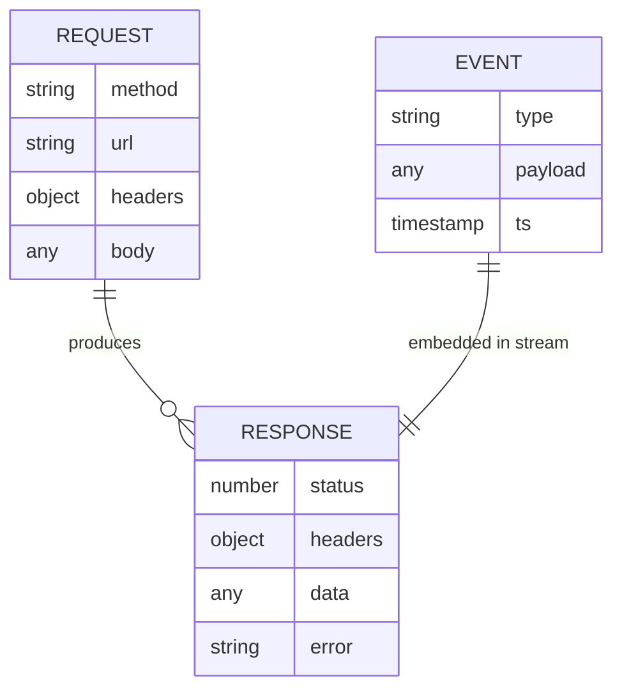

**Diagram sources**
- [packages/protocol/src/types.ts](file://packages/protocol/src/types.ts)
- [packages/protocol/src/schema.ts](file://packages/protocol/src/schema.ts)

**Section sources**
- [packages/protocol/src/types.ts](file://packages/protocol/src/types.ts)
- [packages/protocol/src/schema.ts](file://packages/protocol/src/schema.ts)

### Example Workflows

#### RESTful API Call
- UI hook triggers a GET/POST/PUT/DELETE
- SDK serializes and sends the request
- Retry engine wraps the call with backoff
- Cache stores successful GET responses
- Response is deserialized and returned to UI state

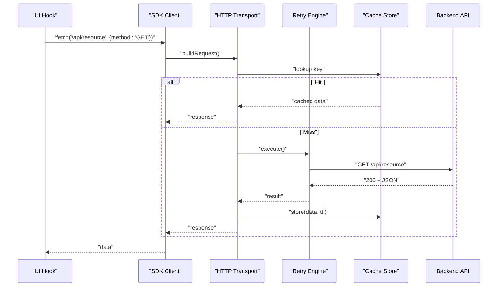

**Diagram sources**
- [packages/ui/src/api/hooks.ts](file://packages/ui/src/api/hooks.ts)
- [packages/sdk/src/client.ts](file://packages/sdk/src/client.ts)
- [packages/sdk/src/http.ts](file://packages/sdk/src/http.ts)
- [packages/sdk/src/retry.ts](file://packages/sdk/src/retry.ts)
- [packages/sdk/src/cache.ts](file://packages/sdk/src/cache.ts)

#### WebSocket Real-Time Streaming
- UI connects to a streaming endpoint
- Events are streamed and typed via protocol schemas
- Reconnection is handled automatically with backoff

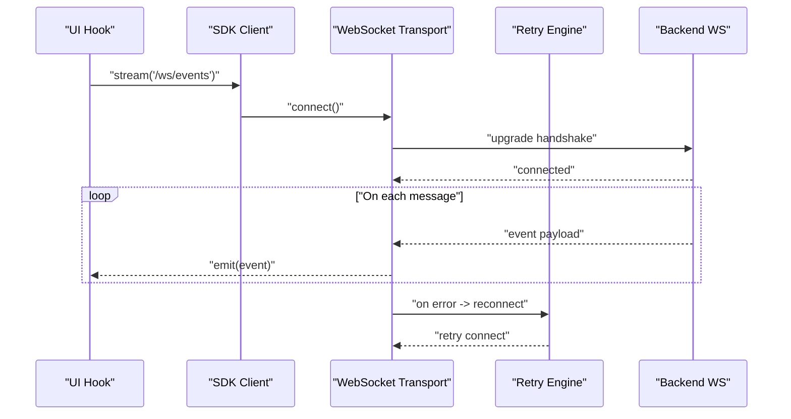

**Diagram sources**
- [packages/ui/src/api/hooks.ts](file://packages/ui/src/api/hooks.ts)
- [packages/sdk/src/ws.ts](file://packages/sdk/src/ws.ts)
- [packages/sdk/src/retry.ts](file://packages/sdk/src/retry.ts)

## Dependency Analysis
The SDK depends on protocol types/schemas for strict contracts, while the UI layer depends on the SDK client for declarative data access. The recorder is an optional dependency for observability.

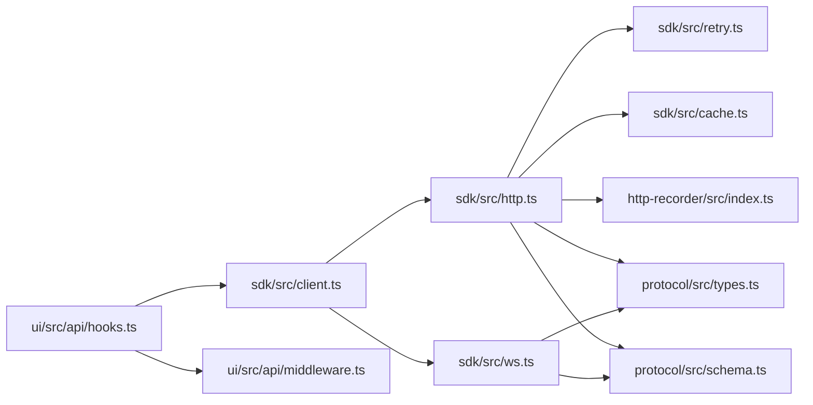

**Diagram sources**
- [packages/ui/src/api/hooks.ts](file://packages/ui/src/api/hooks.ts)
- [packages/ui/src/api/middleware.ts](file://packages/ui/src/api/middleware.ts)
- [packages/sdk/src/client.ts](file://packages/sdk/src/client.ts)
- [packages/sdk/src/http.ts](file://packages/sdk/src/http.ts)
- [packages/sdk/src/ws.ts](file://packages/sdk/src/ws.ts)
- [packages/sdk/src/retry.ts](file://packages/sdk/src/retry.ts)
- [packages/sdk/src/cache.ts](file://packages/sdk/src/cache.ts)
- [packages/http-recorder/src/index.ts](file://packages/http-recorder/src/index.ts)
- [packages/protocol/src/types.ts](file://packages/protocol/src/types.ts)
- [packages/protocol/src/schema.ts](file://packages/protocol/src/schema.ts)

**Section sources**
- [packages/ui/src/api/hooks.ts](file://packages/ui/src/api/hooks.ts)
- [packages/ui/src/api/middleware.ts](file://packages/ui/src/api/middleware.ts)
- [packages/sdk/src/client.ts](file://packages/sdk/src/client.ts)
- [packages/sdk/src/http.ts](file://packages/sdk/src/http.ts)
- [packages/sdk/src/ws.ts](file://packages/sdk/src/ws.ts)
- [packages/sdk/src/retry.ts](file://packages/sdk/src/retry.ts)
- [packages/sdk/src/cache.ts](file://packages/sdk/src/cache.ts)
- [packages/http-recorder/src/index.ts](file://packages/http-recorder/src/index.ts)
- [packages/protocol/src/types.ts](file://packages/protocol/src/types.ts)
- [packages/protocol/src/schema.ts](file://packages/protocol/src/schema.ts)

## Performance Considerations
- Prefer GET caching for idempotent reads to reduce latency and bandwidth
- Tune retry backoff and max attempts to balance responsiveness and server load
- Use WebSocket streams for high-frequency updates instead of polling
- Minimize payload sizes via selective fields and compression where supported
- Avoid unnecessary header mutations per request; batch updates when possible

[No sources needed since this section provides general guidance]

## Troubleshooting Guide
- Network Errors: Inspect recorder logs for failed requests and status codes; verify connectivity and CORS settings
- Timeouts: Increase timeout thresholds for slow endpoints; ensure server-side processing limits are adequate
- Retry Loops: Reduce max attempts or adjust backoff curve to prevent cascading failures
- Cache Staleness: Invalidate cache keys after mutations; verify TTL values
- Auth Issues: Confirm token presence and refresh strategy; check header injection order
- WebSocket Drops: Monitor reconnect attempts; inspect server-side keepalive and heartbeat settings

**Section sources**
- [packages/http-recorder/src/index.ts](file://packages/http-recorder/src/index.ts)
- [packages/sdk/src/retry.ts](file://packages/sdk/src/retry.ts)
- [packages/sdk/src/cache.ts](file://packages/sdk/src/cache.ts)
- [packages/ui/src/api/middleware.ts](file://packages/ui/src/api/middleware.ts)

## Conclusion
OpenCode Web UI’s SDK centralizes networking with strong typing, robust retry and caching, and extensible interception. By leveraging protocol schemas and consistent patterns across HTTP and WebSocket transports, the system delivers reliable, performant, and observable request-response cycles suitable for both REST APIs and real-time streaming.

[No sources needed since this section summarizes without analyzing specific files]