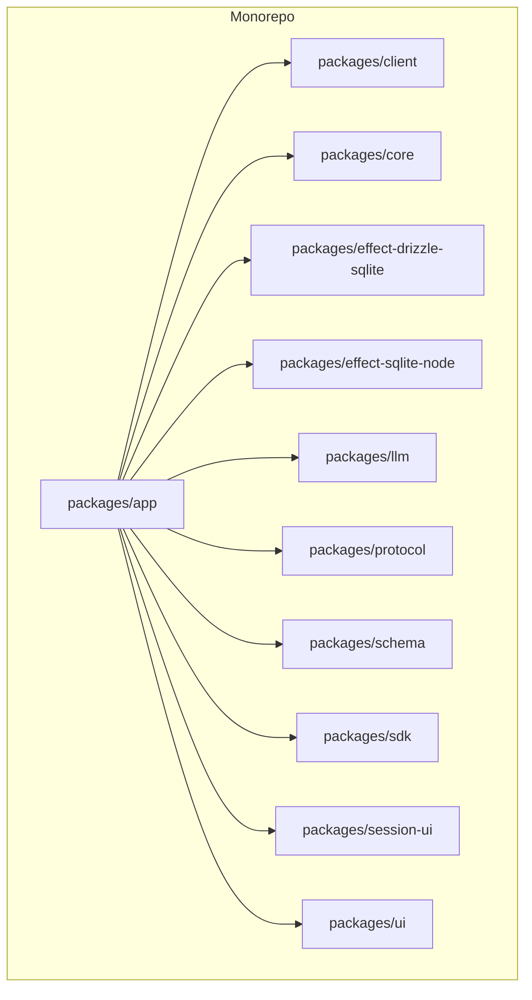
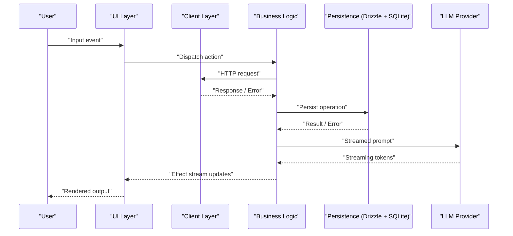
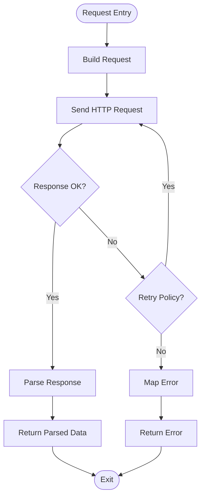
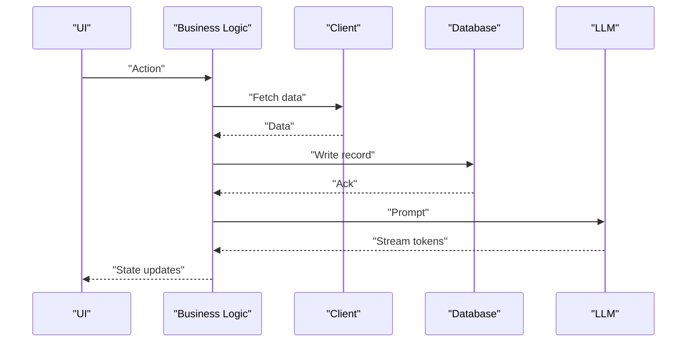
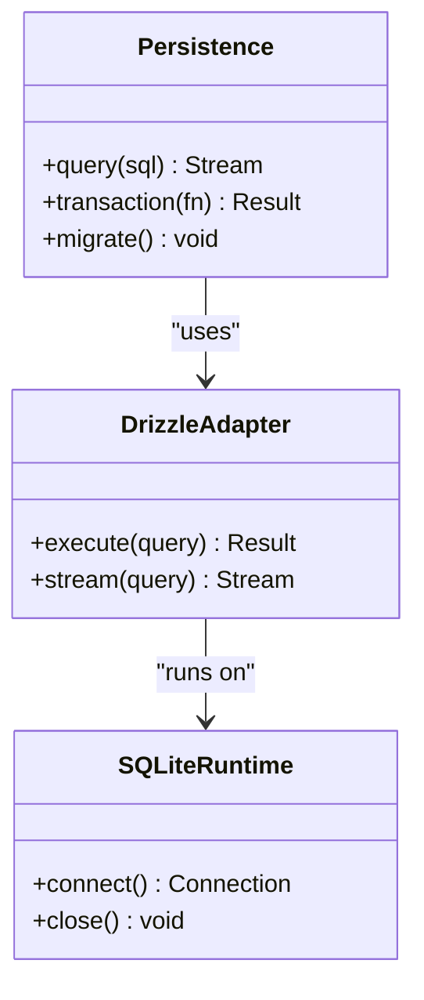
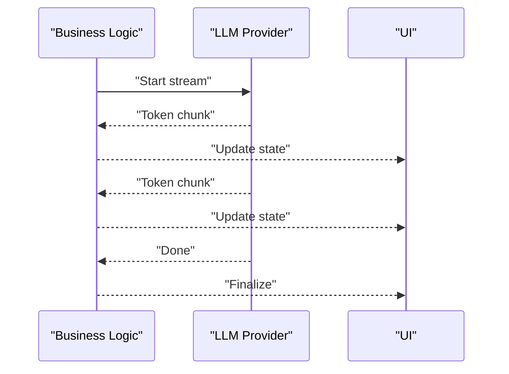
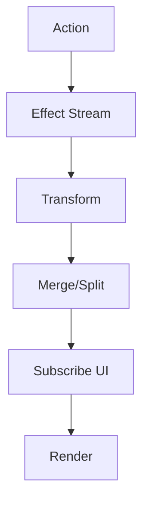
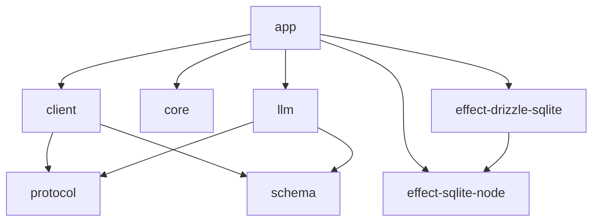

# Data Flow Architecture

<cite>
**Referenced Files in This Document**
- [README.md](file://README.md)
- [package.json](file://package.json)
- [bunfig.toml](file://bunfig.toml)
- [tsconfig.json](file://tsconfig.json)
</cite>

## Table of Contents
1. [Introduction](#introduction)
2. [Project Structure](#project-structure)
3. [Core Components](#core-components)
4. [Architecture Overview](#architecture-overview)
5. [Detailed Component Analysis](#detailed-component-analysis)
6. [Dependency Analysis](#dependency-analysis)
7. [Performance Considerations](#performance-considerations)
8. [Troubleshooting Guide](#troubleshooting-guide)
9. [Conclusion](#conclusion)

## Introduction
This document describes the data flow architecture of OpenCode Web UI, focusing on how user input traverses the client layer into business logic, persists to a database, and triggers AI processing. It explains state management using Effect streams, request-response cycles for APIs, database queries, and LLM interactions, as well as error handling and retry strategies. Performance considerations such as caching, lazy loading, and real-time updates are also covered.

## Project Structure
OpenCode Web UI is organized as a monorepo with multiple packages:
- app: Application entry points and orchestration
- client: HTTP client abstractions and API bindings
- core: Shared domain models and utilities
- effect-drizzle-sqlite: Drizzle ORM integration with SQLite via Effect
- effect-sqlite-node: Node-specific SQLite runtime for Effect
- llm: LLM provider integrations and streaming pipelines
- protocol: Protocol definitions and schemas
- schema: Data schemas used across layers
- sdk: SDKs for external services or tools
- session-ui: Session-related UI components and state
- ui: Reusable UI components and layouts

**Section sources**
- [README.md](file://README.md)
- [package.json](file://package.json)
- [bunfig.toml](file://bunfig.toml)
- [tsconfig.json](file://tsconfig.json)

## Core Components
- Client Layer: Encapsulates HTTP requests, response parsing, and retries. Provides typed APIs consumed by the application layer.
- Business Logic: Orchestrates workflows, composes Effect streams, and coordinates persistence and AI calls.
- Persistence Layer: Uses Drizzle with SQLite (Node runtime) through Effect for reactive, stream-based data access.
- AI Processing: Integrates LLM providers with streaming responses and backpressure handling.
- State Management: Leverages Effect streams to model asynchronous state changes and propagate updates reactively.
- UI Layer: Consumes streams and exposes them to SolidJS-based components for rendering and interaction.

[No sources needed since this section provides general guidance]

## Architecture Overview
The system follows a layered architecture with clear separation of concerns and reactive data flows driven by Effect streams.

**Diagram sources**
- [README.md](file://README.md)
- [package.json](file://package.json)
- [bunfig.toml](file://bunfig.toml)
- [tsconfig.json](file://tsconfig.json)

## Detailed Component Analysis

### Client Layer
Responsibilities:
- Construct typed HTTP requests
- Handle retries and timeouts
- Parse responses and map errors
- Expose Effect-based APIs for downstream consumers

Data Flow:
- UI actions trigger client methods
- Client composes Effect tasks for network operations
- Responses are transformed into domain types
- Errors are normalized and propagated

[No sources needed since this diagram shows conceptual workflow, not actual code structure]

### Business Logic
Responsibilities:
- Orchestrate multi-step workflows
- Compose Effect streams for async operations
- Coordinate persistence and AI calls
- Manage state transitions and side effects

Data Flow:
- Receives actions from UI
- Invokes client and persistence layers
- Streams LLM responses and merges with UI state
- Emits updates to UI via Effect streams

[No sources needed since this diagram shows conceptual workflow, not actual code structure]

### Persistence Layer
Responsibilities:
- Provide reactive database access via Drizzle and SQLite
- Model entities and relationships
- Execute transactions and migrations
- Stream results for real-time updates

Data Flow:
- Business logic issues commands
- Drizzle translates to SQL
- SQLite executes and returns results
- Results are wrapped in Effect streams for reactivity

[No sources needed since this diagram shows conceptual workflow, not actual code structure]

### AI Processing
Responsibilities:
- Integrate LLM providers
- Stream token responses efficiently
- Handle backpressure and cancellation
- Merge partial outputs with UI state

Data Flow:
- Business logic sends prompts
- LLM streams tokens
- Business logic aggregates and emits incremental updates
- UI renders streaming content

[No sources needed since this diagram shows conceptual workflow, not actual code structure]

### State Management with Effect Streams
Responsibilities:
- Model asynchronous state as streams
- Propagate changes reactively
- Combine multiple streams safely
- Handle lifecycle and cleanup

Patterns:
- Use Effect streams to represent evolving state
- Subscribe in UI components for reactive rendering
- Debounce/throttle where necessary
- Merge and split streams for complex interactions

[No sources needed since this diagram shows conceptual workflow, not actual code structure]

## Dependency Analysis
High-level dependencies between packages:
- app depends on client, core, persistence, and llm
- client depends on protocol and schema
- persistence uses effect-drizzle-sqlite and effect-sqlite-node
- llm integrates with external providers via protocol and schema

**Diagram sources**
- [README.md](file://README.md)
- [package.json](file://package.json)
- [bunfig.toml](file://bunfig.toml)
- [tsconfig.json](file://tsconfig.json)

**Section sources**
- [README.md](file://README.md)
- [package.json](file://package.json)
- [bunfig.toml](file://bunfig.toml)
- [tsconfig.json](file://tsconfig.json)

## Performance Considerations
- Caching: Cache frequent reads at the client and persistence layers; invalidate on writes.
- Lazy Loading: Load heavy modules and data on demand; use virtualization for large lists.
- Streaming: Prefer streaming for LLM responses and large datasets to reduce latency.
- Backpressure: Apply throttling and debouncing to prevent UI overload during rapid updates.
- Connection Pooling: Reuse database connections and HTTP clients to minimize overhead.
- Batch Operations: Group writes and queries to reduce round-trips.
- Real-time Updates: Use Effect streams to push incremental updates without full re-renders.

[No sources needed since this section provides general guidance]

## Troubleshooting Guide
Common issues and resolutions:
- Network Failures: Implement exponential backoff and circuit breakers; log detailed error context.
- Database Errors: Validate migrations and schema; wrap transactions with rollback on failure.
- LLM Timeouts: Set appropriate timeouts and fallback providers; cache partial results when safe.
- Memory Leaks: Ensure proper subscription cleanup and stream termination.
- State Inconsistencies: Normalize state updates and avoid concurrent mutations; use immutable patterns.

[No sources needed since this section provides general guidance]

## Conclusion
OpenCode Web UI employs a layered architecture with Effect-driven reactive state management. The client layer abstracts HTTP interactions, business logic orchestrates workflows, persistence leverages Drizzle and SQLite for reactive data access, and AI processing streams LLM responses efficiently. Robust error handling, retries, and performance optimizations ensure a responsive and reliable user experience.

[No sources needed since this section summarizes without analyzing specific files]