# Database Operations Flow

<cite>
**Referenced Files in This Document**
- [README.md](file://README.md)
- [package.json](file://package.json)
- [bunfig.toml](file://bunfig.toml)
- [tsconfig.json](file://tsconfig.json)
</cite>

## Table of Contents
1. [Introduction](#introduction)
2. [Project Structure](#project-structure)
3. [Core Components](#core-components)
4. [Architecture Overview](#architecture-overview)
5. [Detailed Component Analysis](#detailed-component-analysis)
6. [Dependency Analysis](#dependency-analysis)
7. [Performance Considerations](#performance-considerations)
8. [Troubleshooting Guide](#troubleshooting-guide)
9. [Conclusion](#conclusion)
10. [Appendices](#appendices)

## Introduction
This document explains how database operations are structured and executed using Drizzle ORM with SQLite in the project. It covers query construction, execution, result mapping to TypeScript types, transaction management, connection pooling, and optimization strategies. It also provides guidance for CRUD operations, complex joins, migration workflows, error handling, caching, lazy loading, and performance monitoring.

## Project Structure
The repository is a multi-package workspace that includes several packages related to application logic, HTTP APIs, SDKs, and utilities. The database layer typically resides within packages that integrate Drizzle ORM and SQLite drivers. Configuration files at the root define tooling and build settings used across packages.

```mermaid
graph TB
subgraph "Workspace Root"
PkgJSON["package.json"]
BunFig["bunfig.toml"]
TSConf["tsconfig.json"]
Readme["README.md"]
end
subgraph "Packages"
AppPkg["packages/app"]
ClientPkg["packages/client"]
CorePkg["packages/core"]
EffectDrizzleSQLite["packages/effect-drizzle-sqlite"]
EffectSQLiteNode["packages/effect-sqlite-node"]
SchemaPkg["packages/schema"]
HttpRecorder["packages/http-recorder"]
HttpApiCodegen["packages/httpapi-codegen"]
LlmPkg["packages/llm"]
PluginPkg["packages/plugin"]
ProtocolPkg["packages/protocol"]
SdkPkg["packages/sdk"]
SessionUI["packages/session-ui"]
UIPkg["packages/ui"]
end
Readme --> PkgJSON
PkgJSON --> BunFig
PkgJSON --> TSConf
PkgJSON --> AppPkg
PkgJSON --> ClientPkg
PkgJSON --> CorePkg
PkgJSON --> EffectDrizzleSQLite
PkgJSON --> EffectSQLiteNode
PkgJSON --> SchemaPkg
PkgJSON --> HttpRecorder
PkgJSON --> HttpApiCodegen
PkgJSON --> LlmPkg
PkgJSON --> PluginPkg
PkgJSON --> ProtocolPkg
PkgJSON --> SdkPkg
PkgJSON --> SessionUI
PkgJSON --> UIPkg
```

**Diagram sources**
- [package.json](file://package.json)
- [bunfig.toml](file://bunfig.toml)
- [tsconfig.json](file://tsconfig.json)
- [README.md](file://README.md)

**Section sources**
- [README.md](file://README.md)
- [package.json](file://package.json)
- [bunfig.toml](file://bunfig.toml)
- [tsconfig.json](file://tsconfig.json)

## Core Components
- Drizzle ORM schema definitions: Define tables, columns, constraints, and relations. These drive type generation and migrations.
- Database client initialization: Create a SQLite connection via an appropriate driver (e.g., better-sqlite or bun:sqlite), then wrap it with Drizzle’s drizzle function to obtain a typed DB instance.
- Query builders: Use Drizzle’s select, insert, update, delete APIs to construct queries safely with strong typing.
- Transactions: Wrap multiple operations in transactions to ensure atomicity and consistency.
- Migrations: Generate and apply schema changes through Drizzle migrations.
- Error handling: Catch constraint violations, connection errors, and timeouts; map them to domain-specific errors.
- Caching and lazy loading: Cache frequent reads and defer heavy data loads until needed.
- Performance monitoring: Instrument queries to capture durations and failure rates.

[No sources needed since this section provides general guidance]

## Architecture Overview
The database architecture centers on a Drizzle ORM layer over SQLite. Schema definitions generate TypeScript types and migrations. Application code constructs queries using Drizzle’s API, executes them against a pooled or single SQLite connection depending on runtime, and maps results back to strongly-typed entities.

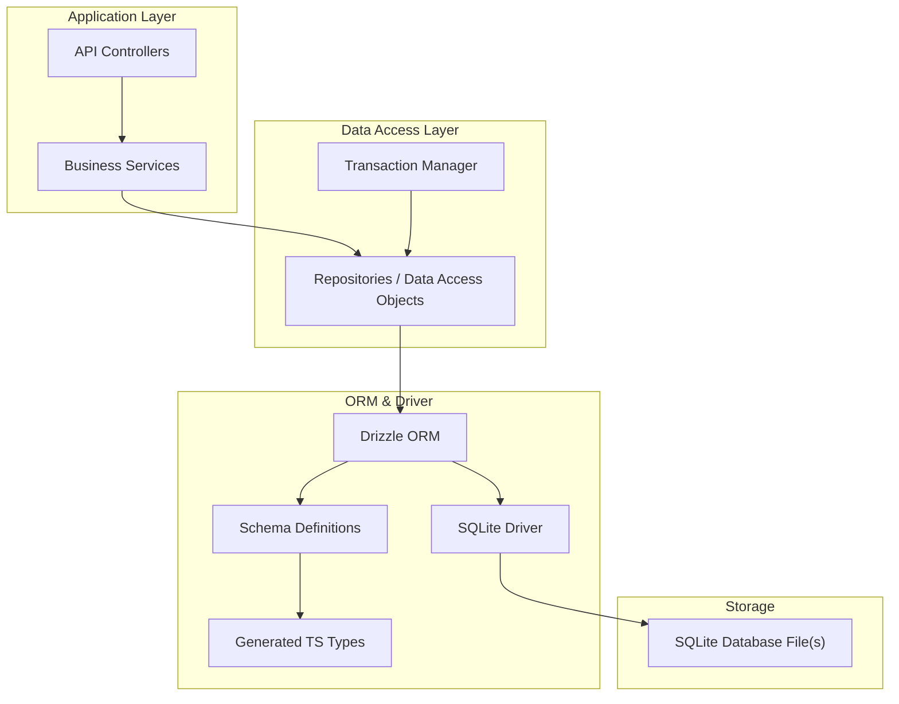

**Diagram sources**
- [package.json](file://package.json)
- [bunfig.toml](file://bunfig.toml)
- [tsconfig.json](file://tsconfig.json)

## Detailed Component Analysis

### Schema and Type Mapping
- Define tables and relations in schema files. Drizzle infers TypeScript types from these definitions.
- Use column types and constraints to enforce data integrity at both schema and runtime levels.
- Generated types flow into repositories and services, ensuring compile-time safety for queries and results.

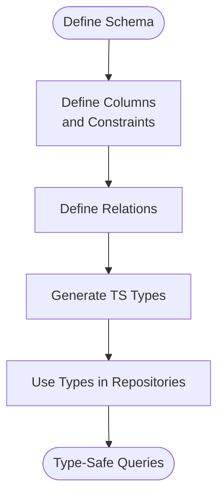

**Section sources**
- [package.json](file://package.json)
- [tsconfig.json](file://tsconfig.json)

### Query Construction and Execution
- Construct queries using Drizzle’s select, insert, update, and delete methods.
- Execute queries against the Drizzle DB instance bound to the SQLite driver.
- Map returned rows to TypeScript entities automatically via generated types.

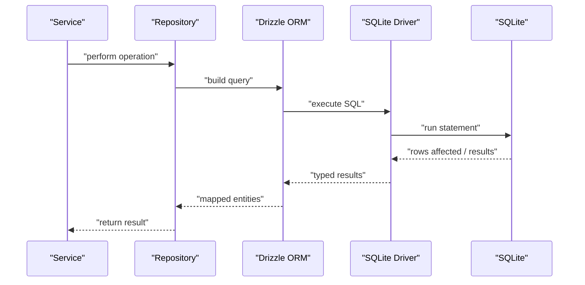

**Section sources**
- [package.json](file://package.json)
- [bunfig.toml](file://bunfig.toml)

### Transaction Management
- Wrap related operations in a transaction to ensure all-or-nothing semantics.
- Handle rollback on errors and commit on success.
- Avoid long-running transactions to minimize lock contention.

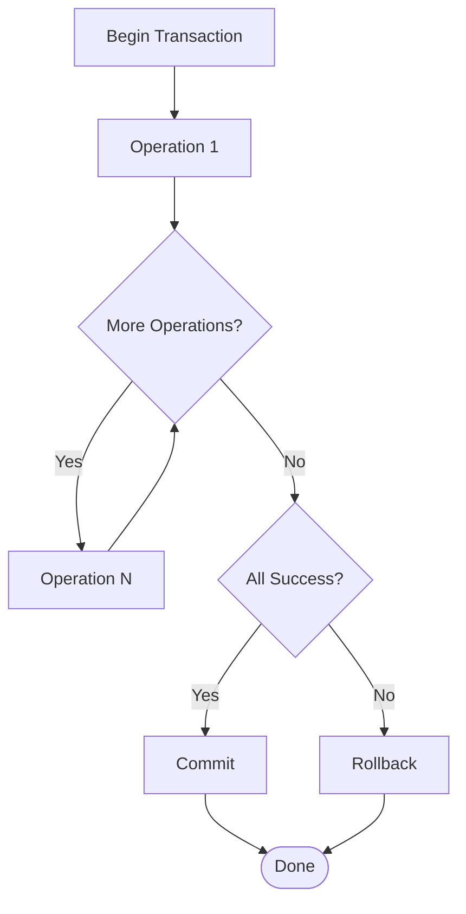

**Section sources**
- [package.json](file://package.json)

### Migration Workflows
- Generate migrations from schema changes.
- Apply migrations in development and production environments consistently.
- Version control migration files to track schema evolution.

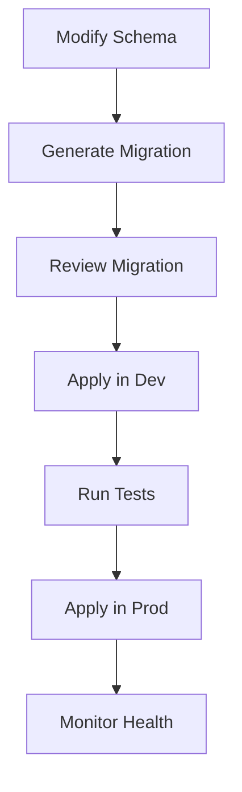

**Section sources**
- [package.json](file://package.json)

### Connection Pooling and Runtime
- For Node.js, use a driver that supports connection pooling if required by workload.
- For Bun runtime, prefer native bindings for performance.
- Configure pool size based on concurrency needs and SQLite characteristics.

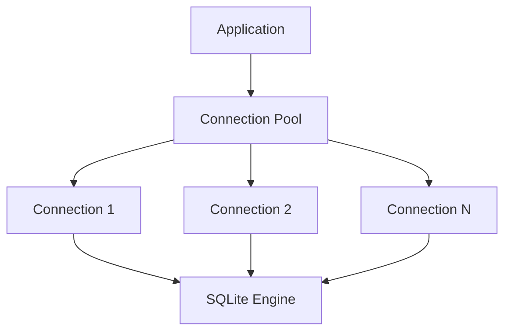

**Section sources**
- [bunfig.toml](file://bunfig.toml)
- [package.json](file://package.json)

### Error Handling Strategies
- Constraint violations: Detect unique key or foreign key errors; return user-friendly messages.
- Connection failures: Retry with backoff or fail fast depending on context.
- Query timeouts: Set statement timeouts and handle timeout exceptions gracefully.

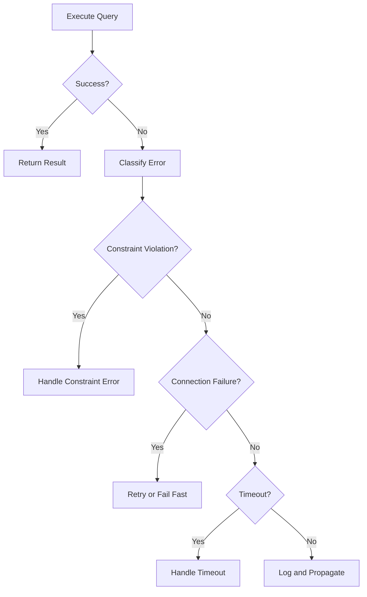

**Section sources**
- [package.json](file://package.json)

### Caching and Lazy Loading
- Cache read-heavy queries using in-memory caches or external stores.
- Implement lazy loading for large datasets or nested relations.
- Invalidate caches on writes or schedule periodic refreshes.

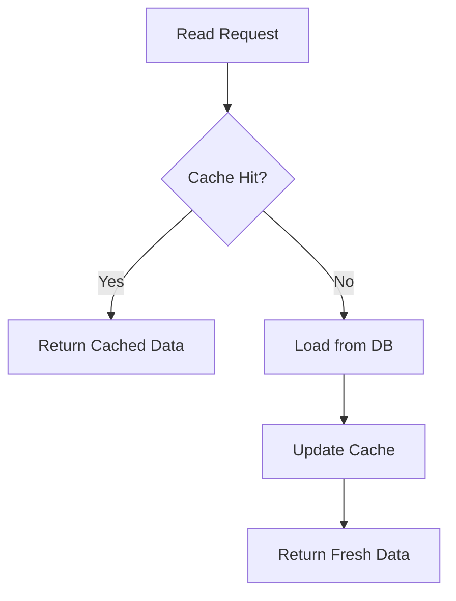

**Section sources**
- [package.json](file://package.json)

### Performance Monitoring
- Instrument query execution time and frequency.
- Track error rates and slow queries.
- Use logs and metrics to identify bottlenecks.

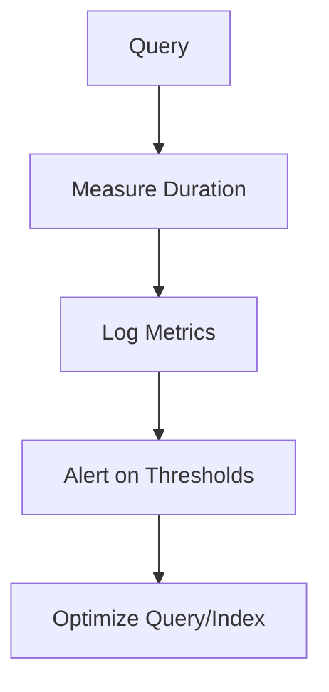

**Section sources**
- [package.json](file://package.json)

## Dependency Analysis
The database layer depends on Drizzle ORM and a SQLite driver. Package configuration defines dependencies and runtime behavior. Ensure consistent versions across packages to avoid incompatibilities.

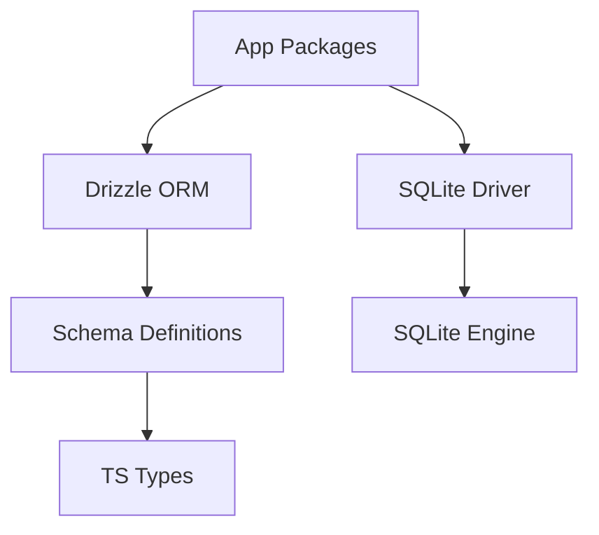

**Diagram sources**
- [package.json](file://package.json)

**Section sources**
- [package.json](file://package.json)

## Performance Considerations
- Prefer batched inserts and updates to reduce round trips.
- Use indexes strategically for frequently filtered columns.
- Limit SELECT * and fetch only necessary columns.
- Keep transactions short to reduce lock contention.
- Tune connection pool size according to workload patterns.
- Monitor slow queries and optimize with EXPLAIN plans where applicable.

[No sources needed since this section provides general guidance]

## Troubleshooting Guide
- Constraint violations: Inspect error codes/messages and adjust input validation or schema constraints.
- Connection failures: Verify file permissions, disk space, and driver compatibility; implement retries with exponential backoff.
- Timeouts: Increase statement timeouts cautiously; analyze query complexity and add indexes.
- Deadlocks: Reduce transaction scope and order resource access consistently.
- Memory pressure: Stream large results and avoid loading entire tables into memory.

**Section sources**
- [package.json](file://package.json)

## Conclusion
This guide outlines how to structure and optimize database operations using Drizzle ORM and SQLite. By leveraging strong typing, robust transactions, careful error handling, and performance monitoring, you can build reliable and efficient data layers tailored to your application’s needs.

[No sources needed since this section summarizes without analyzing specific files]

## Appendices

### Example Patterns (Conceptual)
- CRUD operations: Use insert, select, update, delete with typed schemas.
- Complex joins: Compose joins using Drizzle’s join helpers while maintaining type safety.
- Migration workflow: Generate, review, and apply migrations in CI/CD pipelines.

[No sources needed since this section provides conceptual examples]