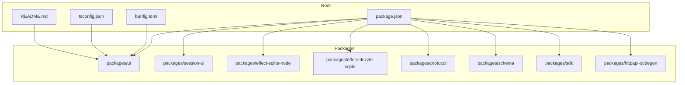
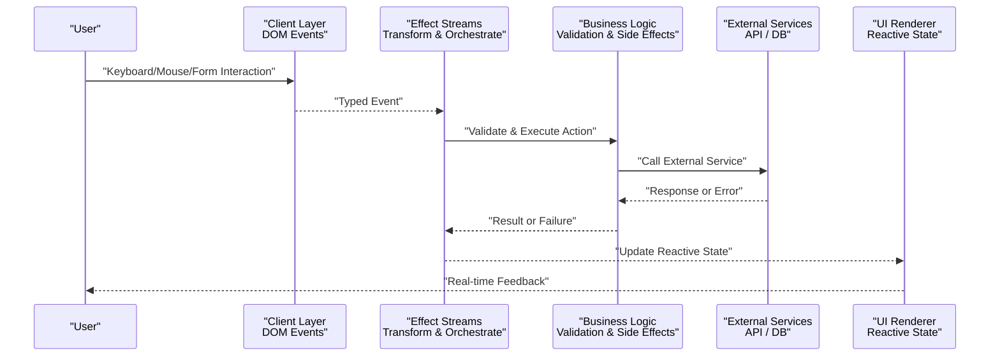
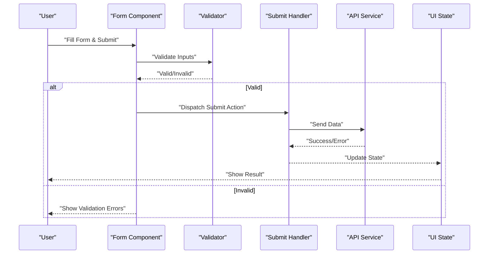
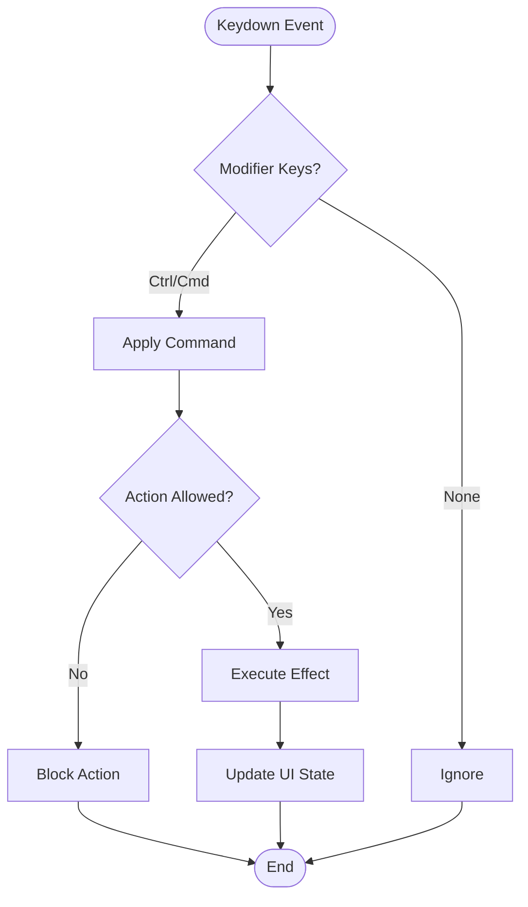
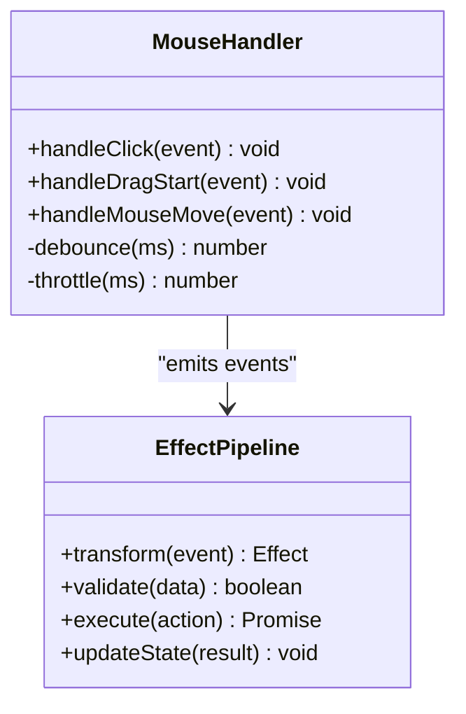
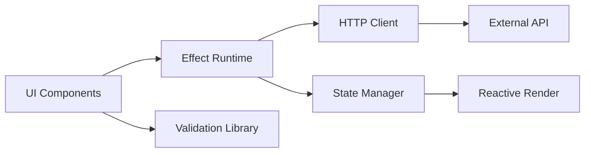

# User Input Flow

<cite>
**Referenced Files in This Document**
- [package.json](file://package.json)
- [bunfig.toml](file://bunfig.toml)
- [tsconfig.json](file://tsconfig.json)
- [README.md](file://README.md)
</cite>

## Table of Contents
1. [Introduction](#introduction)
2. [Project Structure](#project-structure)
3. [Core Components](#core-components)
4. [Architecture Overview](#architecture-overview)
5. [Detailed Component Analysis](#detailed-component-analysis)
6. [Dependency Analysis](#dependency-analysis)
7. [Performance Considerations](#performance-considerations)
8. [Troubleshooting Guide](#troubleshooting-guide)
9. [Conclusion](#conclusion)

## Introduction
This document explains the user input flow in the OpenCode Web UI, focusing on how interactions are captured at the client layer, processed through Effect streams, and transformed into business logic operations. It covers event handling patterns, state updates, real-time feedback mechanisms, validation layers, error propagation, and performance considerations such as debouncing, throttling, and efficient re-rendering. The goal is to provide a clear mental model for both new contributors and experienced developers working with the UI’s reactive architecture.

## Project Structure
The repository is organized as a multi-package workspace with distinct responsibilities:
- packages/ui: Client-side UI components and interactions
- packages/session-ui: Session-oriented UI features
- packages/effect-*: Effect runtime integrations (e.g., SQLite backends)
- packages/protocol, packages/schema: API contracts and data schemas
- packages/sdk, packages/httpapi-codegen: SDK and code generation utilities
- Root configuration files define tooling and build settings

**Diagram sources**
- [package.json](file://package.json)
- [bunfig.toml](file://bunfig.toml)
- [tsconfig.json](file://tsconfig.json)
- [README.md](file://README.md)

**Section sources**
- [package.json](file://package.json)
- [bunfig.toml](file://bunfig.toml)
- [tsconfig.json](file://tsconfig.json)
- [README.md](file://README.md)

## Core Components
The user input flow spans several layers:
- Client Layer: Captures DOM events (keyboard, mouse, form submissions) and emits typed events
- Effect Streams: Transform and orchestrate events using Effect primitives (e.g., stream composition, error handling, concurrency control)
- Business Logic: Validates inputs, performs side effects (API calls, persistence), and updates application state
- UI Feedback: Renders real-time feedback, loading states, and errors based on stream outcomes

Key patterns include:
- Event-to-Effect pipelines that convert DOM events into typed actions
- Validation layers at multiple points (client-side schema checks, server-side validations)
- Error propagation from downstream services back to the UI via Effect’s error channels
- Real-time updates driven by stream emissions and reactive state bindings

[No sources needed since this section provides general guidance]

## Architecture Overview
The following diagram illustrates the high-level flow from user interaction to UI updates:

**Diagram sources**
- [package.json](file://package.json)
- [README.md](file://README.md)

[No sources needed since this diagram shows conceptual workflow, not actual code structure]

## Detailed Component Analysis

### Client Layer Event Capture
- Keyboard Interactions: Global key listeners capture shortcuts and input modifiers; events are normalized and emitted as typed actions
- Mouse Interactions: Clicks, drags, and hover events are bound to components and converted into domain-specific events
- Form Submissions: Forms are validated before submission; values are serialized and dispatched as structured payloads

Patterns:
- Centralized event bus or store for cross-component communication
- Debounced input handlers for search fields and live previews
- Throttled scroll or resize handlers to limit expensive operations

[No sources needed since this section provides general guidance]

### Effect Streams Processing
- Stream Composition: Combine multiple event sources into unified pipelines using Effect combinators
- Error Handling: Use try/catch-like constructs within Effect to handle failures gracefully and propagate errors upstream
- Concurrency Control: Manage parallel requests and ensure consistent state updates under concurrent conditions
- Resource Management: Ensure proper cleanup of subscriptions and timers

Patterns:
- Pipeline style: map -> filter -> validate -> execute -> update
- Backpressure handling for high-frequency inputs
- Cancellation support for long-running operations

[No sources needed since this section provides general guidance]

### Business Logic Operations
- Validation Layers: Schema-based validation ensures data integrity before side effects
- Side Effects: API calls, file operations, and database writes are encapsulated as Effect computations
- State Updates: Immutable updates trigger minimal re-renders via reactive bindings

Patterns:
- Pure functions for transformations
- Memoization for expensive computations
- Retry and fallback strategies for transient failures

[No sources needed since this section provides general guidance]

### Real-Time Feedback Mechanisms
- Loading States: Indicate ongoing operations with spinners or progress bars
- Error Messages: Display contextual errors near affected fields or globally
- Success Notifications: Provide confirmation messages for completed actions

Patterns:
- Optimistic updates with rollback on failure
- Incremental rendering for large datasets
- Accessibility considerations for screen readers

[No sources needed since this section provides general guidance]

### Example Scenarios

#### Form Submission Flow

**Diagram sources**
- [package.json](file://package.json)
- [README.md](file://README.md)

#### Keyboard Shortcut Handling

**Diagram sources**
- [package.json](file://package.json)
- [README.md](file://README.md)

#### Mouse Interaction Pattern

**Diagram sources**
- [package.json](file://package.json)
- [README.md](file://README.md)

**Section sources**
- [package.json](file://package.json)
- [README.md](file://README.md)

## Dependency Analysis
The user input flow depends on several packages:
- UI Framework: React/Solid/Vue components for rendering
- Effect Runtime: For reactive streams and side effect management
- Validation Libraries: Schema validators for input sanitization
- HTTP Clients: For API communication
- State Management: For reactive state updates

**Diagram sources**
- [package.json](file://package.json)
- [README.md](file://README.md)

**Section sources**
- [package.json](file://package.json)
- [README.md](file://README.md)

## Performance Considerations
- Debouncing: Apply to search inputs and live filters to reduce unnecessary computations
- Throttling: Limit frequency of scroll, resize, and animation handlers
- Efficient Re-rendering: Use memoization and selective updates to minimize DOM mutations
- Stream Optimization: Leverage Effect’s built-in optimizations for memory and CPU usage
- Virtualization: Implement virtual scrolling for large lists and tables

Best Practices:
- Avoid heavy computations in render cycles
- Use requestAnimationFrame for smooth animations
- Implement proper cleanup for event listeners and subscriptions

[No sources needed since this section provides general guidance]

## Troubleshooting Guide
Common Issues:
- Memory Leaks: Ensure proper cleanup of event listeners and subscriptions
- Race Conditions: Handle concurrent requests with proper cancellation
- Validation Errors: Verify schema definitions and error propagation paths
- Performance Bottlenecks: Profile slow operations and optimize critical paths

Debugging Tips:
- Enable detailed logging in development mode
- Use browser dev tools to inspect network requests and state changes
- Implement error boundaries to catch and display unexpected errors

[No sources needed since this section provides general guidance]

## Conclusion
The OpenCode Web UI implements a robust user input flow through a combination of client-side event capture, Effect-based stream processing, and reactive state management. By following established patterns for validation, error handling, and performance optimization, the system delivers responsive and reliable user experiences. Contributors should focus on maintaining clear separation of concerns and leveraging Effect’s powerful abstractions for complex workflows.

[No sources needed since this section summarizes without analyzing specific files]