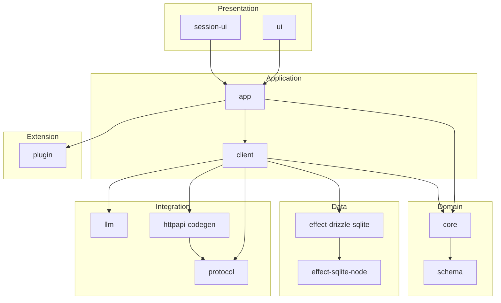
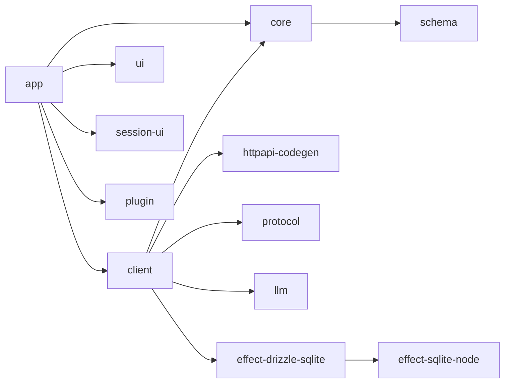

# Monorepo Structure

<cite>
**Referenced Files in This Document**
- [package.json](file://package.json)
- [bunfig.toml](file://bunfig.toml)
- [tsconfig.json](file://tsconfig.json)
- [README.md](file://README.md)
</cite>

## Table of Contents
1. [Introduction](#introduction)
2. [Project Structure](#project-structure)
3. [Core Components](#core-components)
4. [Architecture Overview](#architecture-overview)
5. [Detailed Component Analysis](#detailed-component-analysis)
6. [Dependency Analysis](#dependency-analysis)
7. [Performance Considerations](#performance-considerations)
8. [Troubleshooting Guide](#troubleshooting-guide)
9. [Conclusion](#conclusion)
10. [Appendices](#appendices)

## Introduction
This document explains the monorepo structure for OpenCode Web UI, focusing on how packages are organized and how they interact. It covers the purpose and responsibilities of each package, workspace configuration with Bun and TypeScript, cross-package imports, build processes, development workflows, and publishing strategies. The goal is to make it easy for both new and experienced contributors to understand where code lives and how to work across packages effectively.

## Project Structure
The repository is a Bun-managed monorepo under the packages directory. Each subdirectory represents a package with its own source code, dependencies, and build configuration. Root-level configuration files define workspace behavior, TypeScript settings, and shared tooling.

```mermaid
graph TB
root["Repository Root"] --> pkg_app["packages/app"]
root --> pkg_client["packages/client"]
root --> pkg_core["packages/core"]
root --> pkg_ui["packages/ui"]
root --> pkg_session_ui["packages/session-ui"]
root --> pkg_sdk["packages/sdk"]
root --> pkg_llm["packages/llm"]
root --> pkg_plugin["packages/plugin"]
root --> pkg_schema["packages/schema"]
root --> pkg_protocol["packages/protocol"]
root --> pkg_httpapi_codegen["packages/httpapi-codegen"]
root --> pkg_effect_drizzle_sqlite["packages/effect-drizzle-sqlite"]
root --> pkg_effect_sqlite_node["packages/effect-sqlite-node"]
root --> patches_dir["patches/"]
root --> bun_lock["bun.lock"]
root --> bunfig["bunfig.toml"]
root --> tsconfig["tsconfig.json"]
root --> readme["README.md"]
```

**Diagram sources**
- [package.json](file://package.json)
- [bunfig.toml](file://bunfig.toml)
- [tsconfig.json](file://tsconfig.json)
- [README.md](file://README.md)

**Section sources**
- [package.json](file://package.json)
- [bunfig.toml](file://bunfig.toml)
- [tsconfig.json](file://tsconfig.json)
- [README.md](file://README.md)

## Core Components
Below is a summary of each package’s purpose and responsibilities within the OpenCode Web UI monorepo. These descriptions reflect typical roles for these package names in a web application monorepo and should be validated against each package’s README or entry points.

- app: Application shell that orchestrates features, routes, and environment setup; integrates client, ui, session-ui, sdk, llm, plugin, protocol, schema, and HTTP API clients.
- client: Browser-facing runtime client for interacting with backend services, handling authentication, state synchronization, and network requests.
- core: Shared business logic, domain models, utilities, and platform-agnostic abstractions used by multiple packages.
- ui: Reusable UI components, design tokens, theming, and layout primitives consumed by app and session-ui.
- session-ui: Session-specific UI flows, panels, and interactions (e.g., chat sessions, history views).
- sdk: Public SDK surface exposing typed APIs for consumers to integrate OpenCode capabilities into other applications.
- llm: LLM integration layer providing model adapters, streaming responses, and prompt orchestration.
- plugin: Plugin system for extending functionality at runtime, including discovery, lifecycle management, and extension points.
- schema: Data schemas, validation rules, and type definitions used across the stack for consistency.
- protocol: Message formats, serialization, and transport protocols for inter-service communication.
- httpapi-codegen: Code generator that produces typed HTTP clients from OpenAPI or similar specs.
- effect-drizzle-sqlite: Effect-based Drizzle ORM adapter for SQLite, enabling reactive database access.
- effect-sqlite-node: Node.js SQLite bindings optimized for use with Effect, providing low-level DB operations.

These packages collaborate to deliver a modular, type-safe, and extensible web application.

[No sources needed since this section provides general guidance]

## Architecture Overview
At a high level, the application follows a layered architecture:
- Presentation layer: ui and session-ui provide user interfaces.
- Application layer: app composes features and manages routing/state.
- Integration layer: client, httpapi-codegen, protocol, and llm handle external integrations.
- Domain layer: core and schema define reusable business logic and data contracts.
- Extension layer: plugin enables dynamic feature composition.
- Data layer: effect-drizzle-sqlite and effect-sqlite-node provide reactive SQLite access.

**Diagram sources**
- [package.json](file://package.json)
- [bunfig.toml](file://bunfig.toml)
- [tsconfig.json](file://tsconfig.json)

**Section sources**
- [package.json](file://package.json)
- [bunfig.toml](file://bunfig.toml)
- [tsconfig.json](file://tsconfig.json)

## Detailed Component Analysis

### Workspace Configuration with Bun and TypeScript
- Workspace definition: The root package.json declares the monorepo workspace and lists all packages. This enables unified dependency management and scripts across packages.
- Bun configuration: bunfig.toml centralizes Bun settings such as aliasing, bundling options, and environment variables.
- TypeScript configuration: tsconfig.json defines shared compiler options, path mappings, and module resolution for consistent types across packages.

Practical tips:
- Use workspace-scoped dependencies to avoid duplication.
- Configure path aliases in tsconfig.json to simplify imports between packages.
- Leverage Bun’s fast dev server and bundler for rapid iteration.

**Section sources**
- [package.json](file://package.json)
- [bunfig.toml](file://bunfig.toml)
- [tsconfig.json](file://tsconfig.json)

### Cross-Package Imports and Usage Examples
- Importing shared types: Use workspace-relative paths or aliases defined in tsconfig.json to import types from core or schema packages.
- Using the SDK: Import the public SDK surface from the sdk package to call typed APIs in your app or client code.
- Integrating LLMs: Use the llm package to configure model providers and stream responses through the client layer.
- Database access: Use effect-drizzle-sqlite for reactive queries backed by effect-sqlite-node.

Example patterns:
- In app or client code, import domain models from core and validate payloads using schema.
- Generate HTTP clients via httpapi-codegen and consume them in client for API calls.
- Extend functionality by registering plugins through the plugin package.

[No sources needed since this section provides general guidance]

### Build Processes and Development Workflows
- Local development: Run the dev server per package using Bun commands defined in each package’s package.json.
- Building: Use Bun’s build pipeline to bundle and optimize assets; ensure shared packages are built first if necessary.
- Type checking: Run TypeScript checks across the workspace to catch errors early.
- Testing: Execute tests per package; consider running integration tests that span client, protocol, and llm layers.

Recommended workflow:
- Start with core and schema changes, then update dependent packages.
- Use workspace scripts to run tasks across all packages consistently.
- Validate generated code from httpapi-codegen before committing.

[No sources needed since this section provides general guidance]

### Package Publishing Strategies
- Internal packages: Keep internal packages private and reference them via workspace paths.
- Public SDK: Publish the sdk package as a public npm package with stable APIs and clear versioning.
- Versioning: Use a consistent versioning strategy across packages; consider tools like changesets for coordinated releases.
- Dependencies: Pin critical versions and apply patches in the patches directory when necessary.

Best practices:
- Maintain backward compatibility in public APIs.
- Document breaking changes and migration steps.
- Automate publishing with CI/CD pipelines.

[No sources needed since this section provides general guidance]

## Dependency Analysis
The monorepo enforces clear boundaries between layers while allowing controlled cross-package dependencies. Typical relationships include:
- app depends on client, ui, session-ui, plugin, and core.
- client depends on httpapi-codegen, protocol, llm, core, and data layer packages.
- core and schema are foundational and consumed widely.
- effect-drizzle-sqlite depends on effect-sqlite-node.

**Diagram sources**
- [package.json](file://package.json)
- [bunfig.toml](file://bunfig.toml)
- [tsconfig.json](file://tsconfig.json)

**Section sources**
- [package.json](file://package.json)
- [bunfig.toml](file://bunfig.toml)
- [tsconfig.json](file://tsconfig.json)

## Performance Considerations
- Minimize cross-package imports to reduce bundle size; prefer lazy loading for heavy modules.
- Use tree-shaking and code splitting in Bun builds to eliminate unused code.
- Cache frequently accessed data in memory or IndexedDB where appropriate.
- Stream LLM responses efficiently to improve perceived performance.
- Optimize database queries using indexes and pagination.

[No sources needed since this section provides general guidance]

## Troubleshooting Guide
Common issues and resolutions:
- Circular dependencies: Ensure core and schema do not depend on higher layers; refactor shared logic into lower layers.
- Type mismatches: Align schema definitions across packages; regenerate types from protocol specs when APIs change.
- Build failures: Verify Bun configuration and TypeScript paths; rebuild dependent packages in order.
- Runtime errors: Check network requests and error handling in client and httpapi-codegen outputs.
- Plugin conflicts: Validate plugin interfaces and lifecycle hooks; isolate plugin environments.

[No sources needed since this section provides general guidance]

## Conclusion
OpenCode Web UI’s monorepo organizes functionality into well-defined packages that collaborate through clear interfaces. By leveraging Bun and TypeScript, the project achieves fast development, strong typing, and scalable architecture. Following the recommended workflows and best practices will help maintain consistency and performance as the codebase grows.

[No sources needed since this section summarizes without analyzing specific files]

## Appendices

### Practical Import Patterns Across Packages
- Import shared types from core or schema using workspace aliases.
- Use the sdk package for public APIs in consumer applications.
- Integrate llm adapters through the client layer for model interactions.
- Access databases reactively with effect-drizzle-sqlite and effect-sqlite-node.

[No sources needed since this section provides general guidance]