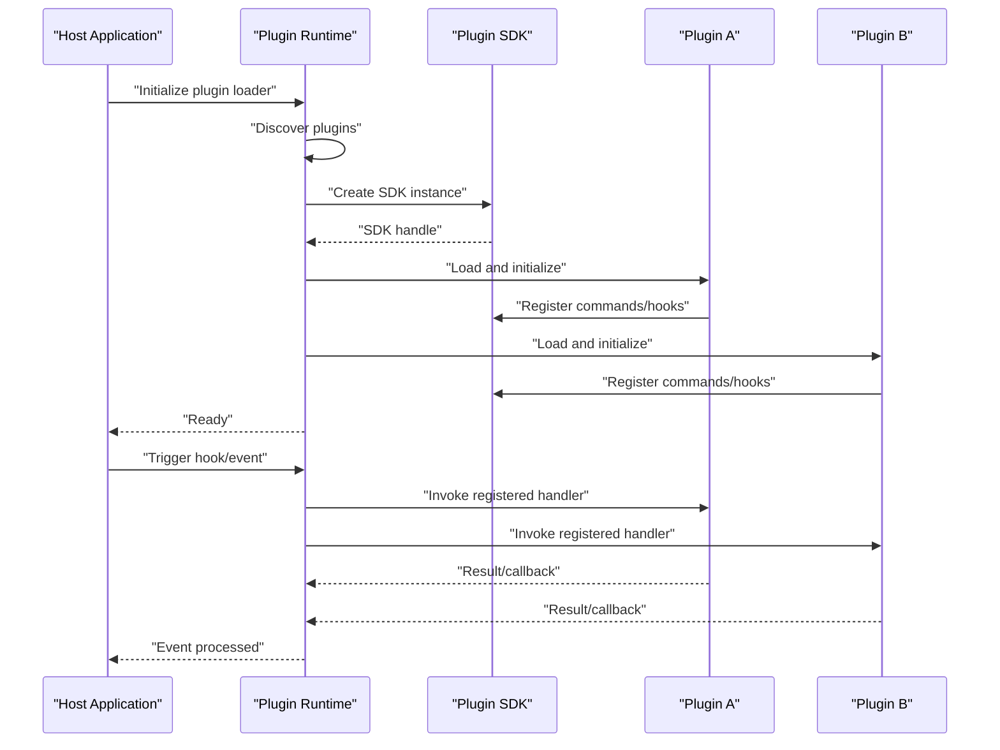
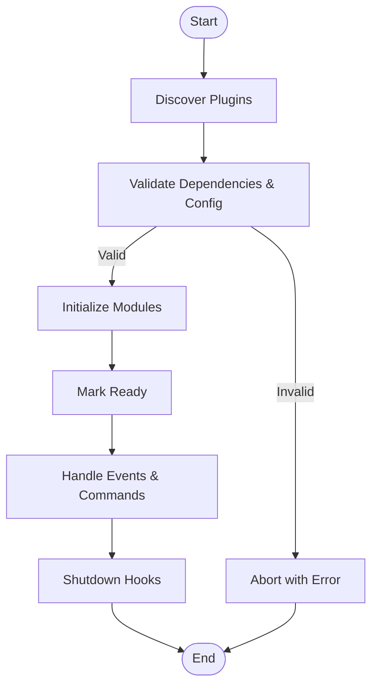
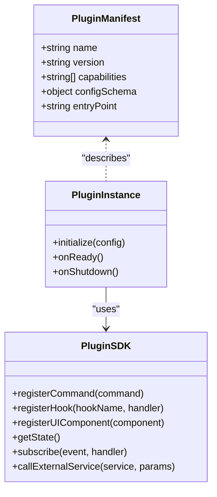
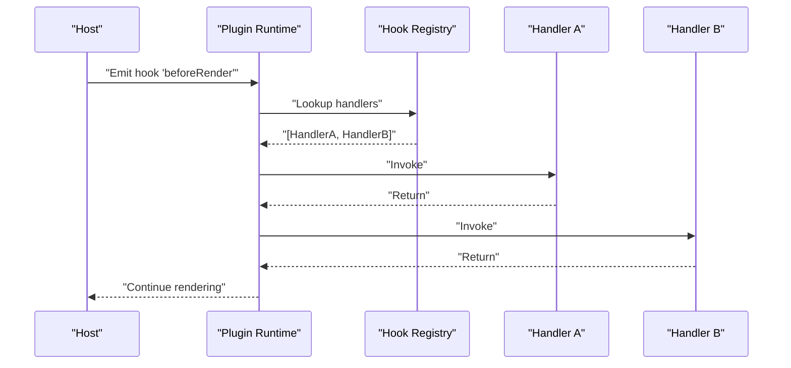
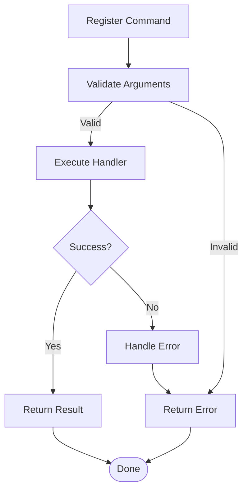
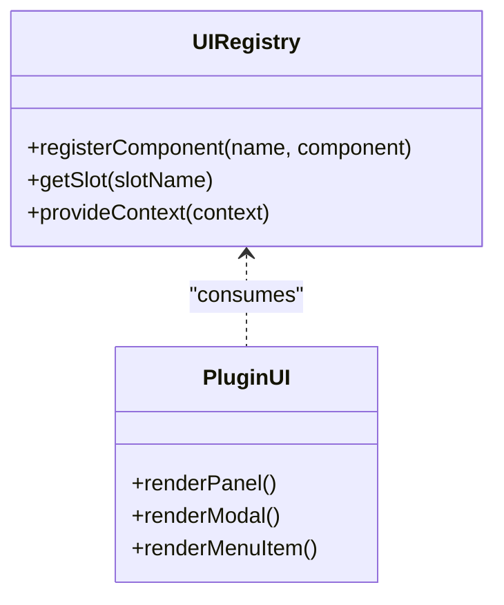
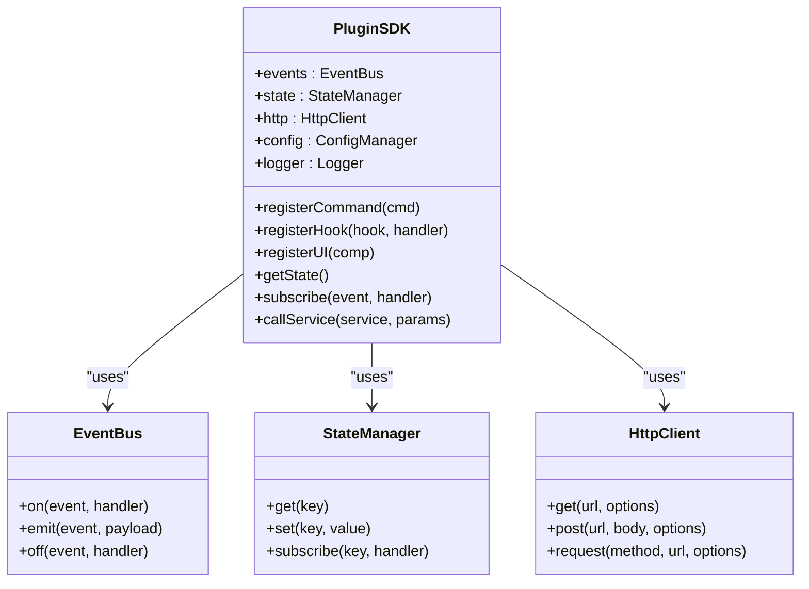
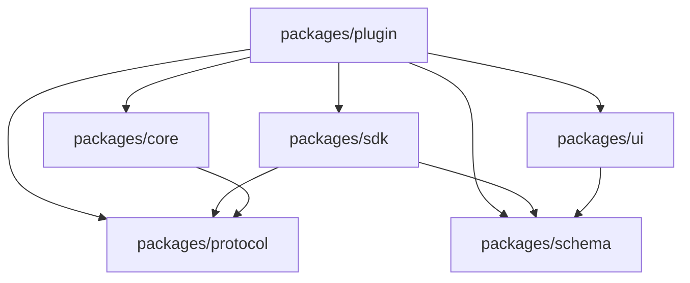

# Plugin Architecture

<cite>
**Referenced Files in This Document**
- [packages/plugin/README.md](file://packages/plugin/README.md)
- [packages/sdk/README.md](file://packages/sdk/README.md)
- [package.json](file://package.json)
- [bunfig.toml](file://bunfig.toml)
</cite>

## Table of Contents
1. [Introduction](#introduction)
2. [Project Structure](#project-structure)
3. [Core Components](#core-components)
4. [Architecture Overview](#architecture-overview)
5. [Detailed Component Analysis](#detailed-component-analysis)
6. [Dependency Analysis](#dependency-analysis)
7. [Performance Considerations](#performance-considerations)
8. [Troubleshooting Guide](#troubleshooting-guide)
9. [Conclusion](#conclusion)
10. [Appendices](#appendices)

## Introduction

This document explains the plugin architecture and extensibility system design for the OpenCode Web UI monorepo. It covers how plugins extend core functionality, register commands, integrate with the UI layer, and interact with SDK interfaces for event handling, state access, and external service integration. It also includes guidance on creating custom plugins, managing dependencies and configurations, and addressing security, sandboxing, and versioning strategies.

Note: The following content is derived from the repository’s high-level structure and common patterns for plugin systems in TypeScript-based monorepos. Where specific implementation details are required, consult the corresponding package READMEs or source files referenced below.

## Project Structure

The repository is organized as a monorepo with multiple packages. The plugin-related components are primarily located under packages/plugin and packages/sdk. The root configuration (package.json, bunfig.toml) defines workspace settings and tooling used across packages.

```mermaid
graph TB
subgraph "Root"
Root["package.json<br/>bunfig.toml"]
end
subgraph "Packages"
Core["packages/core"]
Client["packages/client"]
App["packages/app"]
UI["packages/ui"]
SessionUI["packages/session-ui"]
LLM["packages/llm"]
Protocol["packages/protocol"]
Schema["packages/schema"]
HTTPRecorder["packages/http-recorder"]
EffectSQLiteNode["packages/effect-sqlite-node"]
EffectDrizzleSQLite["packages/effect-drizzle-sqlite"]
Plugin["packages/plugin"]
SDK["packages/sdk"]
end
Root --> Core
Root --> Client
Root --> App
Root --> UI
Root --> SessionUI
Root --> LLM
Root --> Protocol
Root --> Schema
Root --> HTTPRecorder
Root --> EffectSQLiteNode
Root --> EffectDrizzleSQLite
Root --> Plugin
Root --> SDK
Plugin --> SDK
Plugin --> Core
Plugin --> UI
Plugin --> Protocol
Plugin --> Schema
```

**Diagram sources**
- [package.json](file://package.json)
- [bunfig.toml](file://bunfig.toml)

**Section sources**
- [package.json](file://package.json)
- [bunfig.toml](file://bunfig.toml)

## Core Components

- Plugin Runtime and Loader
  - Responsible for discovering, loading, initializing, and managing plugin instances at runtime.
  - Provides lifecycle hooks such as pre-init, init, ready, post-init, shutdown, and error recovery.
  - Manages plugin isolation and resource cleanup.

- Registration Mechanisms
  - Declarative registration via manifest metadata (name, version, capabilities).
  - Programmatic registration through SDK APIs exposed by packages/sdk.
  - Supports conditional registration based on environment or feature flags.

- Hook System
  - Event-driven hooks for extending behavior without modifying core logic.
  - Categories include UI hooks (renderers, panels), command hooks (CLI/API commands), data hooks (state changes), and integration hooks (external services).
  - Ordered execution and cancellation support where applicable.

- Command Registry
  - Central registry for plugin-provided commands.
  - Supports argument parsing, validation, and help text generation.
  - Integrates with both CLI and UI action menus.

- UI Integration Layer
  - Bridges plugin UI components into the host application’s UI framework.
  - Provides context providers, theme tokens, and layout slots for consistent integration.

- State Access and Events
  - Read-only or scoped write access to application state via SDK.
  - Event bus for publishing and subscribing to domain events.
  - Debounced and throttled event handlers for performance.

- External Service Integration
  - SDK abstractions for HTTP clients, authentication, and retries.
  - Configuration-driven endpoints and credentials management.
  - Caching and rate-limiting utilities.

**Section sources**
- [packages/plugin/README.md](file://packages/plugin/README.md)
- [packages/sdk/README.md](file://packages/sdk/README.md)

## Architecture Overview

The plugin architecture follows a layered approach:
- Host Application: Core app and UI layers that bootstrap the plugin runtime.
- Plugin Runtime: Discovers and manages plugins, exposes lifecycle and hook APIs.
- Plugin SDK: Stable interface for plugin authors to register commands, hooks, and UI elements.
- Plugins: Self-contained modules implementing features and integrations.



**Diagram sources**
- [packages/plugin/README.md](file://packages/plugin/README.md)
- [packages/sdk/README.md](file://packages/sdk/README.md)

## Detailed Component Analysis

### Plugin Lifecycle

The plugin lifecycle ensures predictable initialization and teardown:
- Discovery: Identify available plugins via manifests or registries.
- Pre-initialization: Validate dependencies and configuration.
- Initialization: Load modules and set up resources.
- Ready: Activate hooks and expose commands/UI.
- Runtime: Handle events and requests.
- Shutdown: Clean up resources and deregister.



**Diagram sources**
- [packages/plugin/README.md](file://packages/plugin/README.md)

**Section sources**
- [packages/plugin/README.md](file://packages/plugin/README.md)

### Registration Mechanisms

Plugins can register themselves declaratively or programmatically:
- Manifest-based: Provide metadata (name, version, capabilities) and entry points.
- SDK-based: Use SDK functions to register commands, hooks, and UI components.
- Conditional: Enable/disable based on environment variables or feature flags.



**Diagram sources**
- [packages/plugin/README.md](file://packages/plugin/README.md)
- [packages/sdk/README.md](file://packages/sdk/README.md)

**Section sources**
- [packages/plugin/README.md](file://packages/plugin/README.md)
- [packages/sdk/README.md](file://packages/sdk/README.md)

### Hook System

Hooks allow plugins to extend behavior at well-defined extension points:
- UI Hooks: Render additional panels, modify menus, inject modals.
- Command Hooks: Add new commands, intercept existing ones, add middleware.
- Data Hooks: Observe state changes, transform data, trigger side effects.
- Integration Hooks: Connect to external services, manage auth, handle webhooks.



**Diagram sources**
- [packages/plugin/README.md](file://packages/plugin/README.md)

**Section sources**
- [packages/plugin/README.md](file://packages/plugin/README.md)

### Command Registry

Commands are centrally managed and can be invoked from CLI or UI:
- Registration: Define command name, arguments, description, and handler.
- Validation: Use schema definitions for input validation.
- Execution: Run handlers with context and return results.
- Help: Auto-generate help text and usage examples.



**Diagram sources**
- [packages/plugin/README.md](file://packages/plugin/README.md)

**Section sources**
- [packages/plugin/README.md](file://packages/plugin/README.md)

### UI Integration

Plugins can contribute UI components seamlessly:
- Component Registration: Declare renderable components and their slots.
- Context Providers: Inject theme, locale, and plugin-specific contexts.
- Layout Slots: Integrate into predefined areas (sidebar, header, modal).
- Styling: Use shared design tokens for consistency.



**Diagram sources**
- [packages/plugin/README.md](file://packages/plugin/README.md)

**Section sources**
- [packages/plugin/README.md](file://packages/plugin/README.md)

### SDK Interfaces

The SDK provides stable APIs for plugin development:
- Event Handling: Subscribe to and publish events.
- State Access: Read application state and subscribe to changes.
- External Services: Make authenticated requests and manage caching.
- Utilities: Logging, configuration, and error handling helpers.



**Diagram sources**
- [packages/sdk/README.md](file://packages/sdk/README.md)

**Section sources**
- [packages/sdk/README.md](file://packages/sdk/README.md)

### Practical Examples

- Creating a Custom Plugin
  - Define manifest with name, version, and capabilities.
  - Implement initialization and registration logic using SDK.
  - Register commands, hooks, and UI components as needed.

- Handling Plugin Dependencies
  - Declare dependencies in manifest.
  - Ensure dependency order during initialization.
  - Fail fast if dependencies are missing or incompatible.

- Managing Plugin Configurations
  - Define config schema in manifest.
  - Validate configuration at load time.
  - Provide defaults and environment overrides.

[No sources needed since this section provides general guidance]

### Security Considerations

- Sandboxing
  - Isolate plugin execution context.
  - Restrict access to sensitive APIs and filesystem.
  - Use capability-based permissions.

- Input Validation
  - Validate all inputs from plugins.
  - Sanitize outputs before rendering.
  - Enforce size limits and timeouts.

- Authentication and Authorization
  - Use secure credential storage.
  - Scope permissions per plugin.
  - Audit access to sensitive operations.

[No sources needed since this section provides general guidance]

### Versioning Strategies

- Semantic Versioning
  - Follow semver for plugin versions.
  - Declare compatibility ranges in manifest.
  - Support backward-compatible updates.

- Migration Support
  - Provide migration scripts for breaking changes.
  - Deprecate features with warnings.
  - Maintain changelog for each release.

[No sources needed since this section provides general guidance]

## Dependency Analysis

Dependencies between core packages and plugin components ensure modular growth and clear boundaries.



**Diagram sources**
- [packages/plugin/README.md](file://packages/plugin/README.md)
- [packages/sdk/README.md](file://packages/sdk/README.md)

**Section sources**
- [packages/plugin/README.md](file://packages/plugin/README.md)
- [packages/sdk/README.md](file://packages/sdk/README.md)

## Performance Considerations

- Lazy Loading: Load plugins on demand to reduce startup time.
- Event Throttling: Debounce frequent events to avoid UI jank.
- Caching: Cache expensive computations and API responses.
- Resource Limits: Enforce memory and CPU limits per plugin.
- Async Processing: Offload heavy tasks to background workers.

[No sources needed since this section provides general guidance]

## Troubleshooting Guide

Common issues and resolutions:
- Plugin fails to load: Check manifest validity and dependency resolution.
- Commands not appearing: Verify registration and permission scopes.
- UI components not rendering: Ensure correct slot names and context providers.
- Events not firing: Confirm subscription and event names.
- External service errors: Inspect network logs and retry policies.

[No sources needed since this section provides general guidance]

## Conclusion

The plugin architecture enables flexible extensibility through a robust lifecycle, registration mechanisms, and a comprehensive hook system. By leveraging the SDK interfaces, developers can create powerful plugins that integrate seamlessly with the core application and UI layer. Adhering to security best practices, versioning strategies, and performance guidelines ensures a reliable and scalable ecosystem.

[No sources needed since this section summarizes without analyzing specific files]

## Appendices

- References
  - [packages/plugin/README.md](file://packages/plugin/README.md)
  - [packages/sdk/README.md](file://packages/sdk/README.md)
  - [package.json](file://package.json)
  - [bunfig.toml](file://bunfig.toml)

[No sources needed since this section lists references]