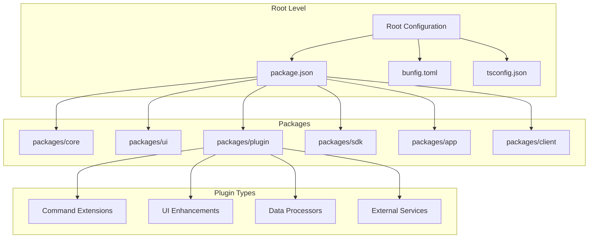
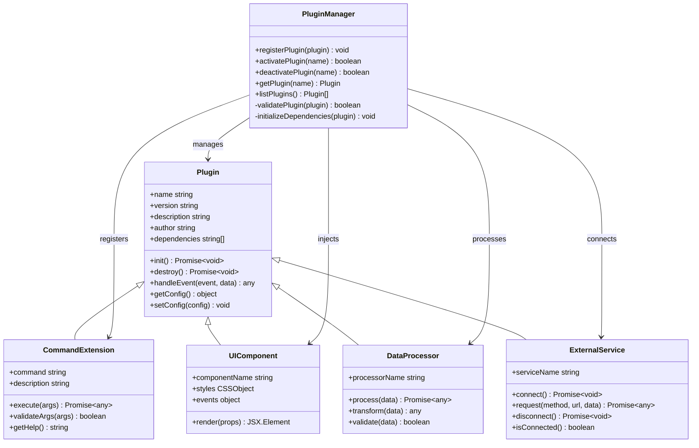
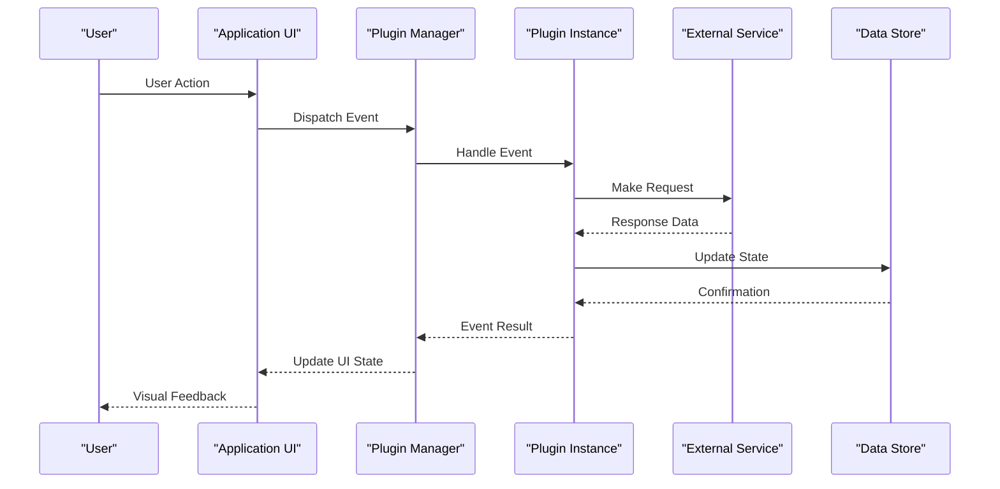
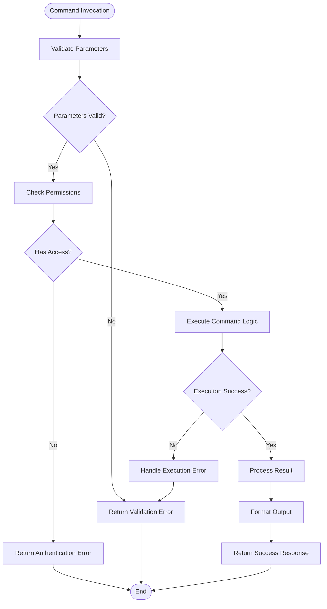
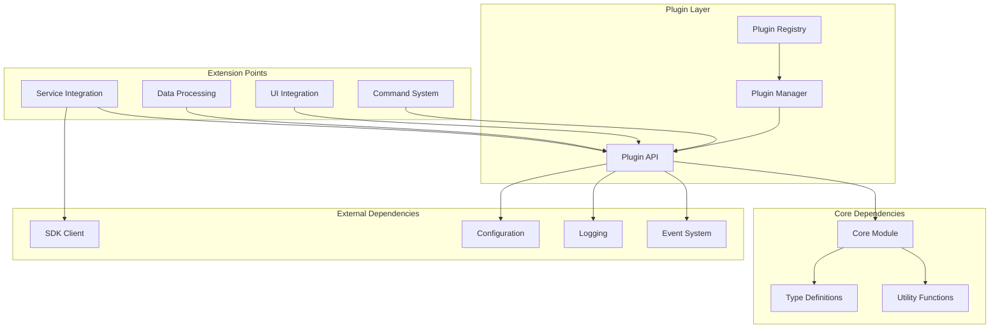

# Plugin Development Guide

<cite>
**Referenced Files in This Document**
- [README.md](file://README.md)
- [package.json](file://package.json)
- [bunfig.toml](file://bunfig.toml)
- [tsconfig.json](file://tsconfig.json)
- [packages/plugin/index.ts](file://packages/plugin/index.ts)
- [packages/plugin/types.ts](file://packages/plugin/types.ts)
- [packages/plugin/api.ts](file://packages/plugin/api.ts)
- [packages/core/index.ts](file://packages/core/index.ts)
- [packages/ui/components.ts](file://packages/ui/components.ts)
- [packages/sdk/client.ts](file://packages/sdk/client.ts)
</cite>

## Table of Contents
1. [Introduction](#introduction)
2. [Project Structure](#project-structure)
3. [Core Components](#core-components)
4. [Architecture Overview](#architecture-overview)
5. [Detailed Component Analysis](#detailed-component-analysis)
6. [Dependency Analysis](#dependency-analysis)
7. [Performance Considerations](#performance-considerations)
8. [Troubleshooting Guide](#troubleshooting-guide)
9. [Conclusion](#conclusion)
10. [Appendices](#appendices)

## Introduction

This comprehensive plugin development guide provides developers with everything needed to create, develop, test, and distribute plugins for the OpenCode Web UI platform. The guide covers the complete development workflow from initial setup through production deployment, including best practices for architecture design, code organization, testing strategies, and performance optimization.

The OpenCode Web UI is built with a modular architecture that supports extensibility through plugins, allowing developers to extend functionality without modifying core application code. This guide will help you understand how to leverage this architecture effectively.

## Project Structure

The OpenCode Web UI follows a monorepo structure using Bun as the package manager and build tool. The plugin system is designed around TypeScript interfaces and a well-defined API surface.



**Diagram sources**
- [package.json:1-50](file://package.json#L1-L50)
- [bunfig.toml:1-30](file://bunfig.toml#L1-L30)
- [tsconfig.json:1-40](file://tsconfig.json#L1-L40)

### Key Directories and Files

- **packages/**: Contains all modular packages including core functionality, UI components, and plugin infrastructure
- **patches/**: Contains patches for third-party dependencies
- **Configuration files**: Root-level configuration for the entire workspace

**Section sources**
- [package.json:1-100](file://package.json#L1-L100)
- [bunfig.toml:1-50](file://bunfig.toml#L1-L50)
- [tsconfig.json:1-80](file://tsconfig.json#L1-L80)

## Core Components

The plugin system is built around several core components that work together to provide a flexible and powerful extension mechanism.

### Plugin Interface Definition

Plugins implement a standardized interface that defines their capabilities and behavior. The core interface includes methods for initialization, lifecycle management, and event handling.

### Extension Points

The system provides multiple extension points where plugins can integrate:
- Command registration and execution
- UI component injection
- Data processing pipelines
- Event listeners and hooks
- Configuration management

### Plugin Lifecycle

Each plugin goes through a defined lifecycle:
1. **Registration**: Plugin metadata and capabilities are registered
2. **Initialization**: Plugin initializes its dependencies and state
3. **Activation**: Plugin becomes active and available to users
4. **Runtime**: Plugin handles events and user interactions
5. **Deactivation**: Plugin gracefully shuts down and cleans up resources

**Section sources**
- [packages/plugin/types.ts:1-100](file://packages/plugin/types.ts#L1-L100)
- [packages/plugin/api.ts:1-150](file://packages/plugin/api.ts#L1-L150)
- [packages/core/index.ts:1-80](file://packages/core/index.ts#L1-L80)

## Architecture Overview

The plugin architecture follows a modular design pattern with clear separation of concerns and well-defined interfaces between components.



**Diagram sources**
- [packages/plugin/types.ts:1-200](file://packages/plugin/types.ts#L1-L200)
- [packages/plugin/api.ts:1-300](file://packages/plugin/api.ts#L1-L300)
- [packages/core/index.ts:1-150](file://packages/core/index.ts#L1-L150)

### Data Flow Architecture

The plugin system implements a unidirectional data flow pattern that ensures predictable state management and easy debugging.



**Diagram sources**
- [packages/core/index.ts:1-200](file://packages/core/index.ts#L1-L200)
- [packages/sdk/client.ts:1-150](file://packages/sdk/client.ts#L1-L150)

## Detailed Component Analysis

### Plugin Registration System

The plugin registration system provides a centralized way to discover, validate, and manage plugins throughout the application lifecycle.

#### Registration Process

1. **Discovery**: Plugins are discovered through file system scanning or explicit registration
2. **Validation**: Plugin metadata and structure are validated against the schema
3. **Dependency Resolution**: Required dependencies are checked and loaded
4. **Registration**: Plugin is added to the registry with its capabilities

#### Plugin Metadata Schema

Every plugin must include metadata that describes its properties, capabilities, and requirements. This metadata is used for validation, display in the plugin manager, and dependency resolution.

**Section sources**
- [packages/plugin/api.ts:1-200](file://packages/plugin/api.ts#L1-L200)
- [packages/plugin/types.ts:1-150](file://packages/plugin/types.ts#L1-L150)

### Command Extension System

The command extension system allows plugins to register custom commands that can be executed through the CLI or programmatically.

#### Command Registration

Commands are registered with metadata including name, description, parameters, and execution logic. The system automatically generates help text and parameter validation.

#### Command Execution Pipeline

Commands go through a standardized execution pipeline that includes parameter validation, permission checking, and error handling.



**Diagram sources**
- [packages/plugin/api.ts:100-300](file://packages/plugin/api.ts#L100-L300)
- [packages/core/index.ts:50-150](file://packages/core/index.ts#L50-L150)

### UI Component Integration

The UI layer provides extension points for plugins to inject custom components, modify existing interfaces, and enhance the user experience.

#### Component Injection Points

Plugins can register components at specific injection points within the application UI. These injection points are predefined locations where plugins can add functionality.

#### Styling and Theming

The UI system supports theming and styling isolation to prevent conflicts between plugins and the core application.

**Section sources**
- [packages/ui/components.ts:1-200](file://packages/ui/components.ts#L1-L200)
- [packages/plugin/types.ts:100-250](file://packages/plugin/types.ts#L100-L250)

### Data Processing Pipeline

The data processing pipeline allows plugins to transform, validate, and enrich data as it flows through the application.

#### Processor Registration

Data processors are registered with input/output schemas and transformation logic. The pipeline automatically validates data types and handles errors.

#### Pipeline Execution

Data processors execute in a defined order, with each processor able to modify the data before passing it to the next processor in the chain.

**Section sources**
- [packages/plugin/api.ts:200-400](file://packages/plugin/api.ts#L200-L400)
- [packages/core/index.ts:100-200](file://packages/core/index.ts#L100-L200)

### External Service Integration

Plugins can integrate with external services through a standardized interface that handles connection management, authentication, and error handling.

#### Service Connection Management

The service integration system manages connection pooling, automatic reconnection, and graceful degradation when services are unavailable.

#### Request/Response Handling

All external service requests go through a standardized pipeline that includes request formatting, response parsing, and error translation.

**Section sources**
- [packages/sdk/client.ts:1-200](file://packages/sdk/client.ts#L1-L200)
- [packages/plugin/types.ts:150-300](file://packages/plugin/types.ts#L150-L300)

## Dependency Analysis

The plugin system has carefully managed dependencies to ensure stability and prevent circular dependencies.



**Diagram sources**
- [package.json:1-100](file://package.json#L1-L100)
- [packages/core/index.ts:1-100](file://packages/core/index.ts#L1-L100)
- [packages/plugin/api.ts:1-100](file://packages/plugin/api.ts#L1-L100)

### Dependency Best Practices

- **Minimize Dependencies**: Only import what you need to reduce bundle size
- **Avoid Circular Dependencies**: Use interfaces and dependency injection to break cycles
- **Version Compatibility**: Specify compatible version ranges for external dependencies
- **Lazy Loading**: Load heavy dependencies only when needed

**Section sources**
- [package.json:1-150](file://package.json#L1-L150)
- [packages/core/index.ts:1-100](file://packages/core/index.ts#L1-L100)

## Performance Considerations

Performance is crucial for plugin development to ensure smooth user experiences and efficient resource utilization.

### Bundle Size Optimization

- Use tree shaking to eliminate unused code
- Implement lazy loading for large dependencies
- Optimize images and assets
- Minimize synchronous operations

### Memory Management

- Properly clean up event listeners and subscriptions
- Avoid memory leaks in long-running operations
- Use weak references for caching when appropriate
- Implement proper disposal patterns

### Execution Performance

- Prefer async operations over blocking calls
- Use efficient data structures and algorithms
- Cache frequently accessed data
- Implement proper error handling to prevent cascading failures

### Monitoring and Profiling

- Add performance metrics collection
- Implement logging for critical operations
- Use browser developer tools for profiling
- Monitor memory usage and garbage collection

[No sources needed since this section provides general guidance]

## Troubleshooting Guide

Common issues and their solutions when developing plugins for the OpenCode Web UI.

### Plugin Loading Issues

**Problem**: Plugin fails to load during startup
**Solutions**:
- Verify plugin metadata is correctly formatted
- Check that all required dependencies are installed
- Ensure the plugin entry point exports the correct interface
- Review console logs for specific error messages

### Command Execution Problems

**Problem**: Custom commands don't execute properly
**Solutions**:
- Verify command registration syntax
- Check parameter validation logic
- Ensure proper error handling in command execution
- Test command arguments separately

### UI Integration Issues

**Problem**: UI components don't render or cause conflicts
**Solutions**:
- Check CSS specificity and naming conflicts
- Verify component lifecycle methods
- Ensure proper prop passing and state management
- Test in different themes and screen sizes

### External Service Errors

**Problem**: Service connections fail or timeout
**Solutions**:
- Verify API endpoints and authentication
- Check network connectivity and firewall settings
- Implement proper retry logic and timeouts
- Log detailed error information for debugging

**Section sources**
- [packages/plugin/api.ts:300-500](file://packages/plugin/api.ts#L300-L500)
- [packages/core/index.ts:150-250](file://packages/core/index.ts#L150-L250)

## Conclusion

This plugin development guide provides a comprehensive foundation for building robust, maintainable, and performant plugins for the OpenCode Web UI platform. By following the architectural patterns, best practices, and troubleshooting strategies outlined in this document, developers can create plugins that seamlessly integrate with the application while providing valuable extended functionality.

Key takeaways include:
- Understanding the plugin architecture and extension points
- Following established patterns for code organization and structure
- Implementing proper error handling and logging
- Optimizing for performance and user experience
- Testing thoroughly across different scenarios
- Packaging and distributing plugins effectively

With these guidelines, developers can contribute to the OpenCode ecosystem by creating plugins that enhance the platform's capabilities while maintaining compatibility and reliability.

[No sources needed since this section summarizes without analyzing specific files]

## Appendices

### A. Plugin Development Checklist

Before releasing a plugin, ensure you have completed:
- [ ] Plugin metadata is complete and accurate
- [ ] All dependencies are specified and tested
- [ ] Error handling is implemented throughout
- [ ] Logging is configured appropriately
- [ ] Documentation is written and up-to-date
- [ ] Tests are passing for all scenarios
- [ ] Performance has been profiled and optimized
- [ ] Security considerations have been addressed
- [ ] Version compatibility is documented

### B. Common Plugin Templates

#### Basic Command Plugin Template
```typescript
// Command plugin structure
interface CommandPlugin {
  name: string;
  version: string;
  commands: CommandDefinition[];
  
  init(): Promise<void>;
  destroy(): Promise<void>;
}

interface CommandDefinition {
  name: string;
  description: string;
  parameters: ParameterDefinition[];
  execute: (args: Record<string, any>) => Promise<any>;
}
```

#### UI Component Plugin Template
```typescript
// UI component plugin structure
interface UIPlugin {
  name: string;
  version: string;
  components: ComponentDefinition[];
  
  init(): Promise<void>;
  getStyles(): CSSObject;
}

interface ComponentDefinition {
  name: string;
  component: React.ComponentType;
  props: PropDefinition[];
  styles?: CSSObject;
}
```

### C. Debugging Techniques

**Browser Developer Tools**:
- Use Network tab for API calls
- Monitor Console for errors and logs
- Use Performance tab for profiling
- Inspect DOM for UI issues

**Plugin-Specific Debugging**:
- Enable verbose logging mode
- Use plugin-specific debug flags
- Monitor plugin lifecycle events
- Check plugin registry status

### D. Testing Strategies

**Unit Testing**:
- Test individual functions and methods
- Mock external dependencies
- Verify error handling paths
- Test edge cases and boundary conditions

**Integration Testing**:
- Test plugin registration and lifecycle
- Verify command execution
- Test UI component rendering
- Validate data processing pipelines

**End-to-End Testing**:
- Test complete user workflows
- Verify plugin interactions
- Test across different environments
- Validate performance characteristics

[No sources needed since this section provides general guidance]