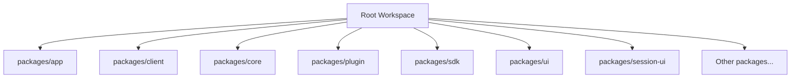
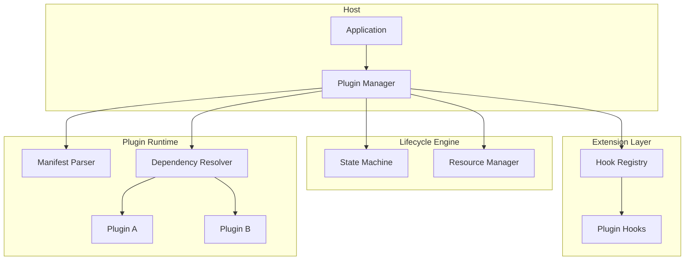
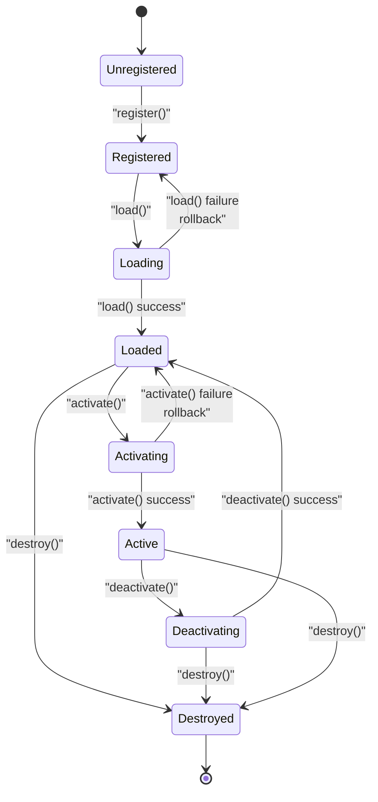
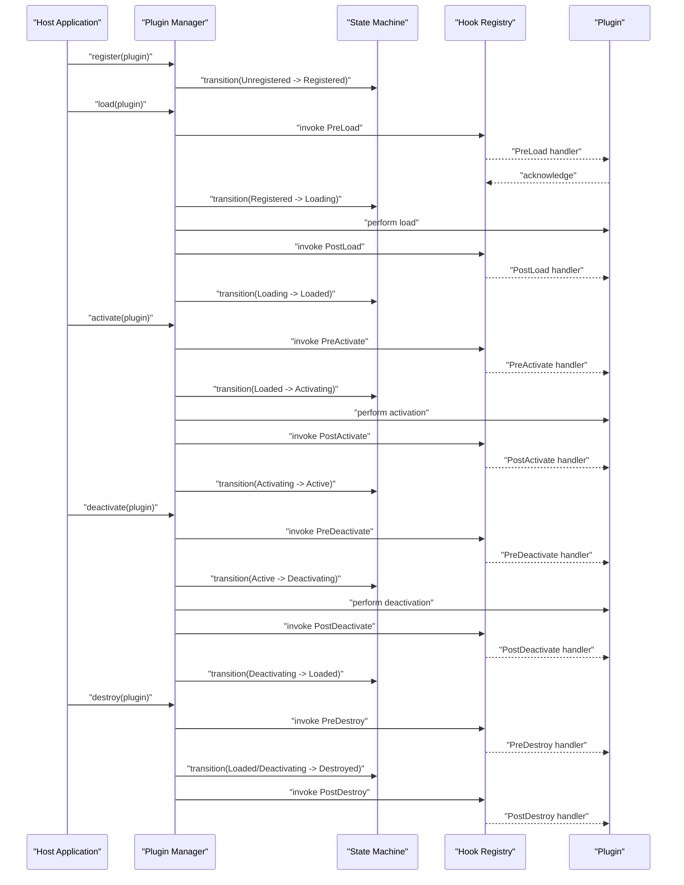
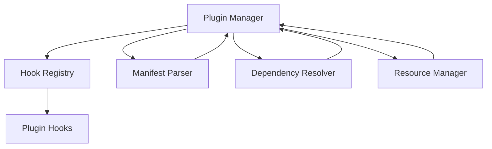

# Plugin Lifecycle Management

<cite>
**Referenced Files in This Document**
- [README.md](file://README.md)
- [package.json](file://package.json)
- [bunfig.toml](file://bunfig.toml)
- [tsconfig.json](file://tsconfig.json)
</cite>

## Table of Contents
1. [Introduction](#introduction)
2. [Project Structure](#project-structure)
3. [Core Components](#core-components)
4. [Architecture Overview](#architecture-overview)
5. [Detailed Component Analysis](#detailed-component-analysis)
6. [Dependency Analysis](#dependency-analysis)
7. [Performance Considerations](#performance-considerations)
8. [Troubleshooting Guide](#troubleshooting-guide)
9. [Conclusion](#conclusion)
10. [Appendices](#appendices)

## Introduction
This document explains the plugin lifecycle management system for the project, covering initialization, registration, loading, activation, and destruction phases. It also documents the hook system that allows plugins to intercept and extend core functionality at different lifecycle points, the plugin manifest structure, configuration options, dependency resolution mechanisms, and practical guidance for implementing custom hooks, handling state transitions, resource allocation, error handling, and debugging techniques.

## Project Structure
The repository is a multi-package workspace with a dedicated plugin package under packages/plugin. The root configuration files define the workspace setup, build tooling, and TypeScript configuration used across packages.

[No sources needed since this diagram shows conceptual project layout]

**Section sources**
- [README.md](file://README.md)
- [package.json](file://package.json)
- [bunfig.toml](file://bunfig.toml)
- [tsconfig.json](file://tsconfig.json)

## Core Components
- Plugin Manager: Orchestrates the entire lifecycle, including discovery, validation, dependency resolution, registration, loading, activation, and teardown.
- Hook System: Provides extension points where plugins can register handlers for lifecycle events (e.g., before/after load, activate/deactivate).
- Manifest Parser: Validates and normalizes plugin manifests, resolving metadata, version constraints, and configuration schemas.
- Dependency Resolver: Computes load order based on declared dependencies and ensures compatibility.
- State Machine: Tracks per-plugin states such as Unregistered, Registered, Loading, Loaded, Activating, Active, Deactivating, Deactivated, Destroyed.
- Resource Manager: Manages allocations and cleanup for plugin-scoped resources (timers, connections, file handles).

[No sources needed since this section provides general component descriptions]

## Architecture Overview
The plugin architecture separates concerns into distinct layers:
- Entry Points: Host application initializes the Plugin Manager and exposes lifecycle APIs.
- Lifecycle Engine: Drives state transitions and invokes hooks at each phase.
- Hook Registry: Stores and dispatches registered handlers for lifecycle events.
- Manifest & Config: Defines plugin contracts, capabilities, and runtime configuration.
- Dependency Graph: Ensures correct ordering and conflict resolution.

[No sources needed since this diagram shows conceptual architecture]

## Detailed Component Analysis

### Plugin Lifecycle States and Transitions
The lifecycle engine enforces strict state transitions to ensure predictable behavior during registration, loading, activation, and destruction.

[No sources needed since this diagram shows conceptual state transitions]

### Hook System Design
Plugins can register handlers for lifecycle events to extend or modify behavior. Typical hooks include:
- PreLoad / PostLoad: Prepare or finalize resources during loading.
- PreActivate / PostActivate: Validate environment and initialize runtime features.
- PreDeactivate / PostDeactivate: Gracefully release external dependencies.
- PreDestroy / PostDestroy: Clean up persistent state and free memory.

[No sources needed since this diagram shows conceptual flow]

### Plugin Manifest Structure
A plugin manifest defines metadata, capabilities, configuration schema, and dependencies. Key fields typically include:
- id: Unique identifier for the plugin.
- name: Human-readable name.
- version: Semantic version string.
- description: Short description of functionality.
- author: Author or organization.
- license: License type.
- main: Entry point module path.
- configSchema: JSON Schema describing required and optional configuration keys.
- dependencies: Map of plugin IDs to version constraints.
- hooks: List of supported lifecycle hooks.
- permissions: Required runtime permissions or capabilities.

Validation rules:
- id must be unique across all loaded plugins.
- version must satisfy semantic versioning.
- dependencies must resolve without cycles.
- configSchema must be valid JSON Schema.
- main must resolve to an existing module.

[No sources needed since this section describes conceptual manifest fields]

### Configuration Options
Configuration is provided per plugin and validated against the manifest’s configSchema. Common options include:
- enabled: Boolean flag to enable/disable the plugin.
- settings: Nested object for feature toggles and parameters.
- secrets: Sensitive values injected securely at runtime.
- overrides: Environment-specific overrides.

Best practices:
- Use defaults defined in configSchema.
- Validate configuration early in PreLoad.
- Avoid mutating shared global state; prefer plugin-scoped contexts.

[No sources needed since this section provides general guidance]

### Dependency Resolution Mechanisms
The dependency resolver builds a directed acyclic graph (DAG) from plugin dependencies and computes a topological order for loading. Key behaviors:
- Cycle detection: Rejects graphs with circular dependencies.
- Version constraints: Enforces minimum/maximum versions.
- Conflict resolution: Detects incompatible capability requirements.
- Lazy loading: Supports optional dependencies resolved at runtime.

Algorithm overview:
1. Parse manifests and collect dependency edges.
2. Build adjacency list and compute in-degrees.
3. Perform Kahn’s algorithm or DFS-based topological sort.
4. Validate version constraints and capability compatibility.
5. Return ordered list or error with details.

[No sources needed since this section explains conceptual algorithm]

### Practical Examples of Implementing Custom Lifecycle Hooks
- Registering a hook:
  - Define a handler function that receives context and returns a promise.
  - Attach it to the appropriate lifecycle event via the hook registry API.
- Handling state transitions:
  - Ensure handlers are idempotent and handle partial failures gracefully.
  - Use rollback strategies when pre-hooks fail after side effects.
- Managing resource allocation:
  - Allocate resources in PreLoad or PreActivate.
  - Release them in PostDeactivate or PreDestroy.
  - Use try/finally patterns to guarantee cleanup.

Example scenarios:
- Database connection pool initialization in PreActivate and closure in PostDeactivate.
- Event listener registration in PostActivate and deregistration in PreDeactivate.
- Temporary file creation in PreLoad and deletion in PostDestroy.

[No sources needed since this section provides general implementation guidance]

### Error Handling During Lifecycle Events
Error handling strategies:
- Validation errors: Fail fast during manifest parsing and configuration validation.
- Load-time errors: Roll back state to previous safe state and log diagnostics.
- Activation errors: Prevent transition to Active and expose actionable messages.
- Destruction errors: Attempt best-effort cleanup and report remaining issues.

Recommended practices:
- Wrap hook invocations in try/catch blocks.
- Aggregate multiple errors and return structured error objects.
- Provide stack traces only in debug mode.
- Log contextual information such as plugin id, phase, and input data.

[No sources needed since this section provides general guidance]

### Debugging Techniques for Lifecycle Issues
- Enable verbose logging for lifecycle transitions and hook invocations.
- Inspect plugin state machine snapshots at failure points.
- Use dependency graph visualization tools to detect cycles or missing edges.
- Isolate problematic plugins by disabling non-critical ones.
- Capture heap dumps and resource usage metrics during activation.

[No sources needed since this section provides general guidance]

## Dependency Analysis
The plugin system depends on several core modules:
- Plugin Manager orchestrates lifecycle and coordinates other components.
- Hook Registry manages event subscriptions and dispatch.
- Manifest Parser validates and normalizes plugin metadata.
- Dependency Resolver computes load order and checks compatibility.
- Resource Manager tracks allocations and ensures cleanup.

[No sources needed since this diagram shows conceptual dependencies]

**Section sources**
- [README.md](file://README.md)
- [package.json](file://package.json)
- [bunfig.toml](file://bunfig.toml)
- [tsconfig.json](file://tsconfig.json)

## Performance Considerations
- Minimize synchronous work in hooks; prefer asynchronous operations.
- Batch resource allocations to reduce overhead.
- Cache computed dependency graphs across sessions when possible.
- Avoid heavy computations during activation; defer to lazy initialization.
- Monitor memory usage and set limits for plugin-scoped resources.

[No sources needed since this section provides general guidance]

## Troubleshooting Guide
Common issues and resolutions:
- Circular dependencies detected: Review manifest dependencies and remove cycles.
- Configuration validation failed: Update configSchema or fix provided values.
- Hook handler threw an exception: Inspect handler logic and add defensive checks.
- Resource leak detected: Ensure all allocations have corresponding cleanup calls.
- Activation timeout: Investigate long-running operations and consider timeouts.

Debug steps:
- Enable detailed logs for lifecycle events.
- Export plugin state snapshots for analysis.
- Reproduce issues in isolation with minimal plugins.
- Use profiling tools to identify bottlenecks.

[No sources needed since this section provides general guidance]

## Conclusion
The plugin lifecycle management system provides a robust framework for extending core functionality through well-defined phases, hooks, and dependency resolution. By adhering to the documented patterns for manifest structure, configuration validation, and error handling, developers can create reliable and maintainable plugins. Proper debugging and performance optimization techniques further enhance stability and scalability.

[No sources needed since this section summarizes without analyzing specific files]

## Appendices
- Glossary: Definitions of key terms such as lifecycle, hook, manifest, dependency resolution.
- References: Links to related documentation and external resources.

[No sources needed since this section provides general content]