# Plugin SDK and APIs

<cite>
**Referenced Files in This Document**
- [package.json](file://package.json)
- [README.md](file://README.md)
- [bunfig.toml](file://bunfig.toml)
- [tsconfig.json](file://tsconfig.json)
</cite>

## Table of Contents
1. [Introduction](#introduction)
2. [Project Structure](#project-structure)
3. [Core Components](#core-components)
4. [Architecture Overview](#architecture-overview)
5. [Detailed Component Analysis](#detailed-component-analysis)
6. [Dependency Analysis](#dependency-analysis)
7. [Performance Considerations](#performance-considerations)
8. [Troubleshooting Guide](#troubleshooting-guide)
9. [Conclusion](#conclusion)
10. [Appendices](#appendices)

## Introduction
This document provides a comprehensive guide to the Plugin SDK and available APIs for extending the application. It explains how plugins can register commands, create UI components, interact with the core application, and communicate with other plugins via a messaging system. It also covers authentication mechanisms, permission models, security boundaries, common usage patterns (file operations, database access, HTTP requests), troubleshooting tips, and performance optimization guidance.

## Project Structure
The repository is organized as a monorepo with multiple packages under packages/. The plugin and SDK functionality are primarily located within:
- packages/plugin: Plugin runtime and host integration
- packages/sdk: Public SDK interfaces and utilities for plugin authors
- packages/core: Core application services and abstractions exposed to plugins
- packages/ui: UI primitives and composition used by plugins to build interfaces
- packages/protocol: Shared types and message contracts for inter-plugin communication
- packages/schema: Schema definitions used across the system

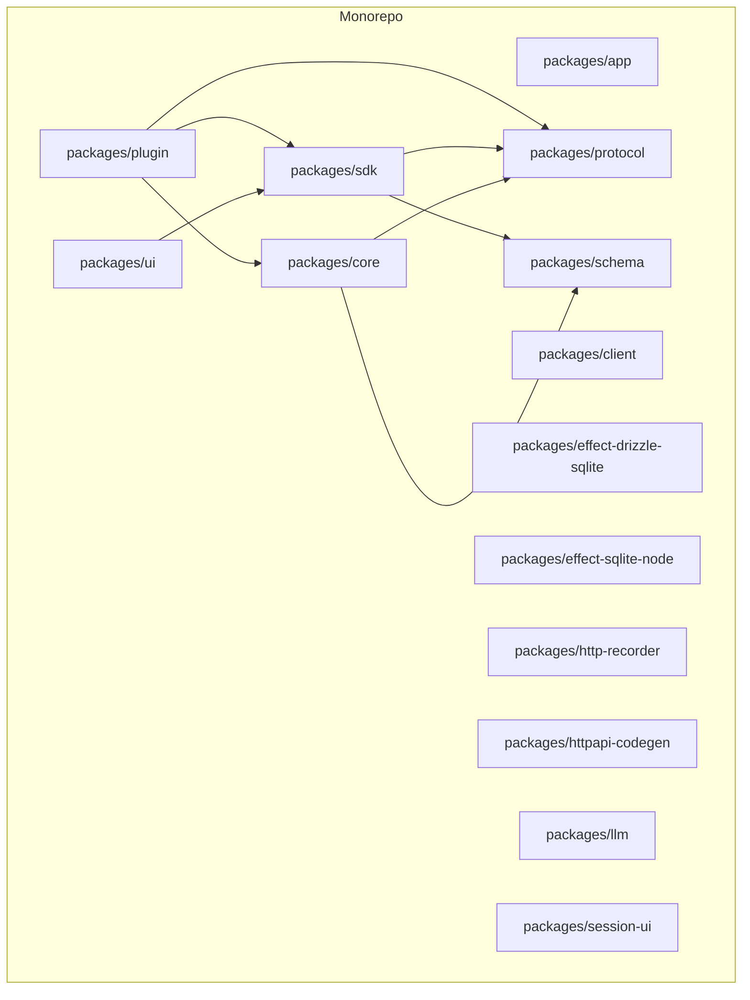

**Diagram sources**
- [package.json](file://package.json)
- [bunfig.toml](file://bunfig.toml)

**Section sources**
- [package.json](file://package.json)
- [README.md](file://README.md)
- [bunfig.toml](file://bunfig.toml)
- [tsconfig.json](file://tsconfig.json)

## Core Components
This section outlines the primary building blocks that plugins use to integrate with the application.

- Plugin Host and Runtime
  - Responsible for loading, isolating, and managing plugin lifecycle.
  - Provides hooks for initialization, event subscription, command registration, and teardown.

- SDK Interfaces
  - Exposes typed APIs for interacting with core services (state, file system, HTTP client, database).
  - Defines event bus contracts for publishing and subscribing to domain events.
  - Includes helpers for creating UI components and composing them into views.

- Messaging System
  - Enables inter-plugin communication through typed messages and channels.
  - Supports request/response patterns and pub/sub semantics.

- Security and Permissions
  - Enforces capability-based permissions for plugin actions.
  - Isolates plugin execution contexts and restricts access to sensitive resources.

- State Access Patterns
  - Provides reactive state slices and selectors for reading and updating application state.
  - Ensures consistent updates through immutable patterns and change notifications.

**Section sources**
- [package.json](file://package.json)
- [README.md](file://README.md)

## Architecture Overview
The plugin architecture follows a layered design where plugins interact with the SDK, which abstracts core services and enforces security policies.

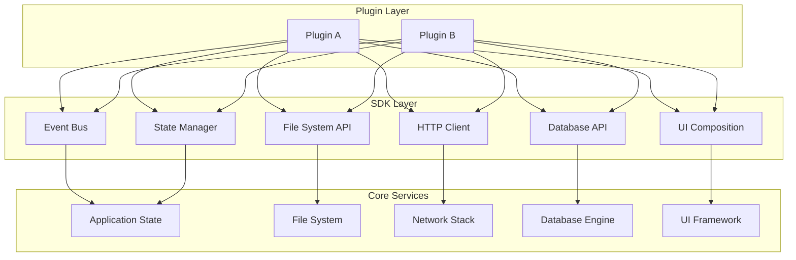

**Diagram sources**
- [package.json](file://package.json)
- [bunfig.toml](file://bunfig.toml)

## Detailed Component Analysis

### Event Handling
Plugins subscribe to and publish events using the SDK’s event bus. Events are strongly typed and scoped to domains such as user actions, system changes, and plugin lifecycle.

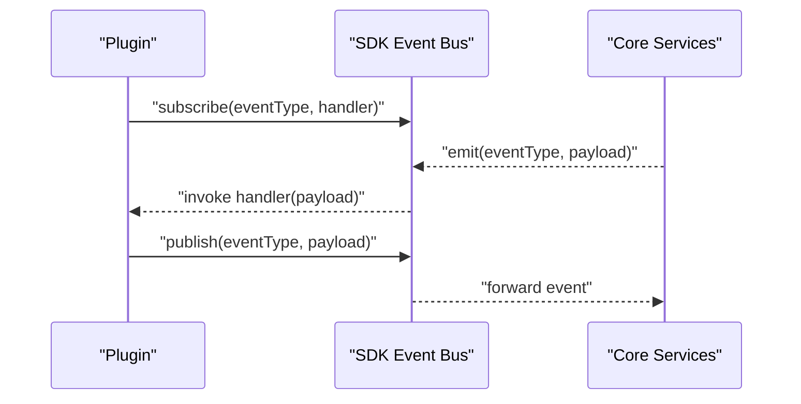

**Diagram sources**
- [package.json](file://package.json)
- [README.md](file://README.md)

**Section sources**
- [package.json](file://package.json)
- [README.md](file://README.md)

### State Access Patterns
The SDK exposes reactive state slices. Plugins read state via selectors and update state through controlled mutations. Change notifications propagate to subscribers.

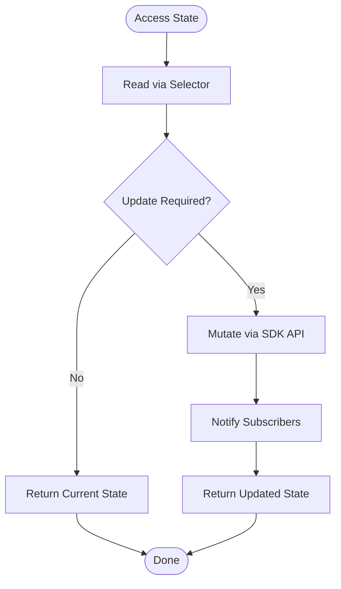

**Diagram sources**
- [package.json](file://package.json)
- [README.md](file://README.md)

**Section sources**
- [package.json](file://package.json)
- [README.md](file://README.md)

### Command Registration
Plugins register commands to extend application behavior. Commands are invoked from UI or programmatic triggers and may return results or side effects.

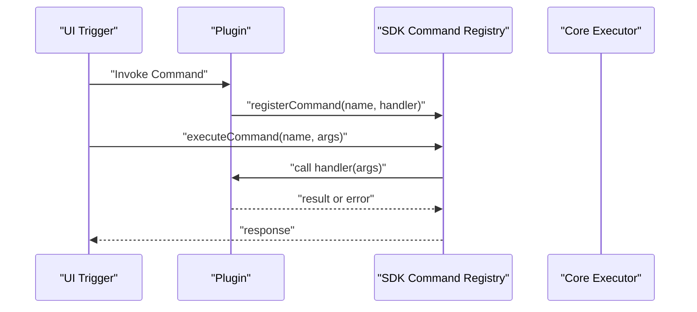

**Diagram sources**
- [package.json](file://package.json)
- [README.md](file://README.md)

**Section sources**
- [package.json](file://package.json)
- [README.md](file://README.md)

### UI Component Creation
Plugins compose UI elements using the SDK’s UI layer. Components are declarative and integrate with the core UI framework.

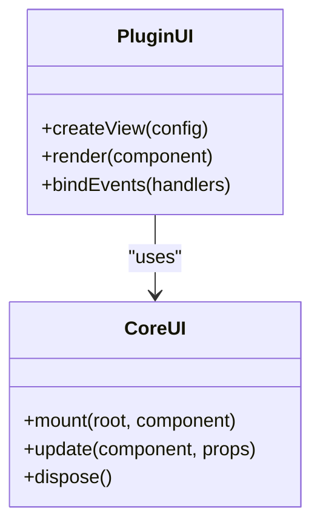

**Diagram sources**
- [package.json](file://package.json)
- [README.md](file://README.md)

**Section sources**
- [package.json](file://package.json)
- [README.md](file://README.md)

### Inter-Plugin Messaging
Plugins communicate via a typed messaging system supporting pub/sub and request/response patterns. Messages are routed through channels and validated against schemas.

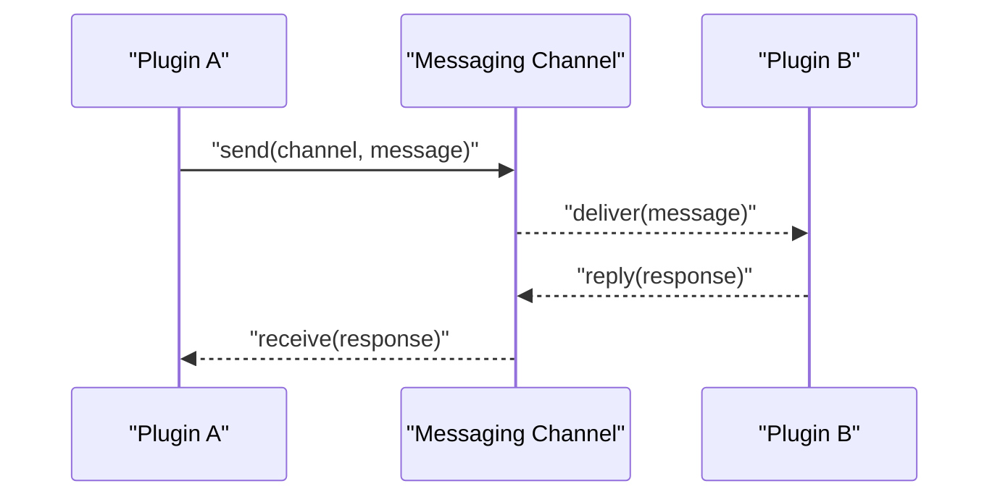

**Diagram sources**
- [package.json](file://package.json)
- [README.md](file://README.md)

**Section sources**
- [package.json](file://package.json)
- [README.md](file://README.md)

### Authentication and Permissions
Authentication is handled centrally; plugins receive an authenticated context with capabilities. Permission checks enforce boundaries around sensitive operations.

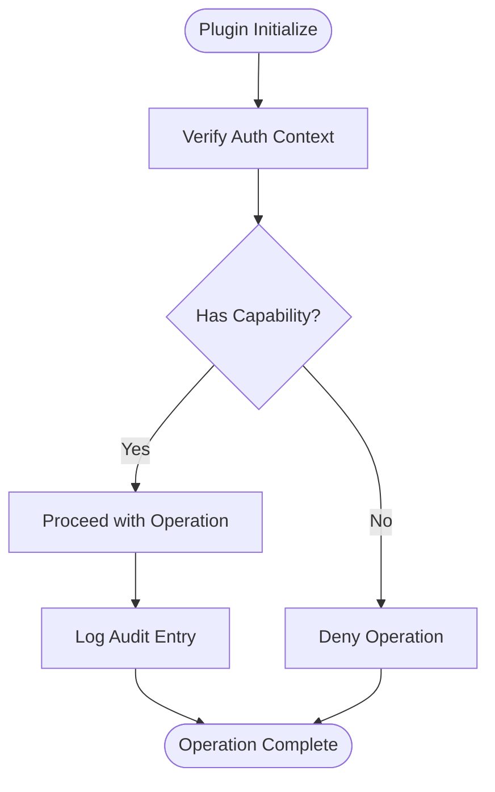

**Diagram sources**
- [package.json](file://package.json)
- [README.md](file://README.md)

**Section sources**
- [package.json](file://package.json)
- [README.md](file://README.md)

### Common Usage Patterns

#### File Operations
Use the SDK’s file system API to read, write, and watch files securely. Validate paths and respect sandboxing rules.

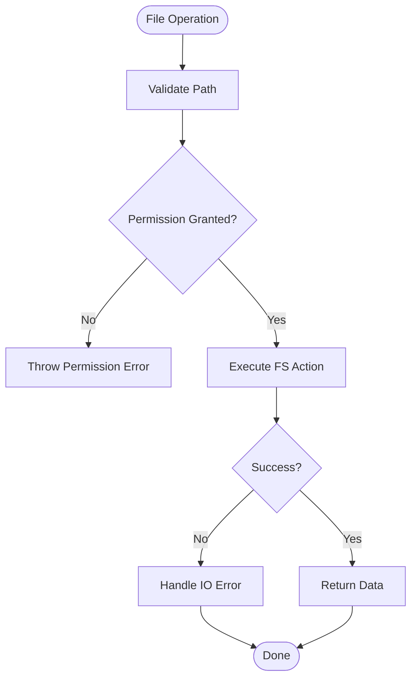

**Diagram sources**
- [package.json](file://package.json)
- [README.md](file://README.md)

**Section sources**
- [package.json](file://package.json)
- [README.md](file://README.md)

#### Database Access
Interact with databases through the SDK’s database API. Use transactions and parameterized queries to ensure safety and performance.

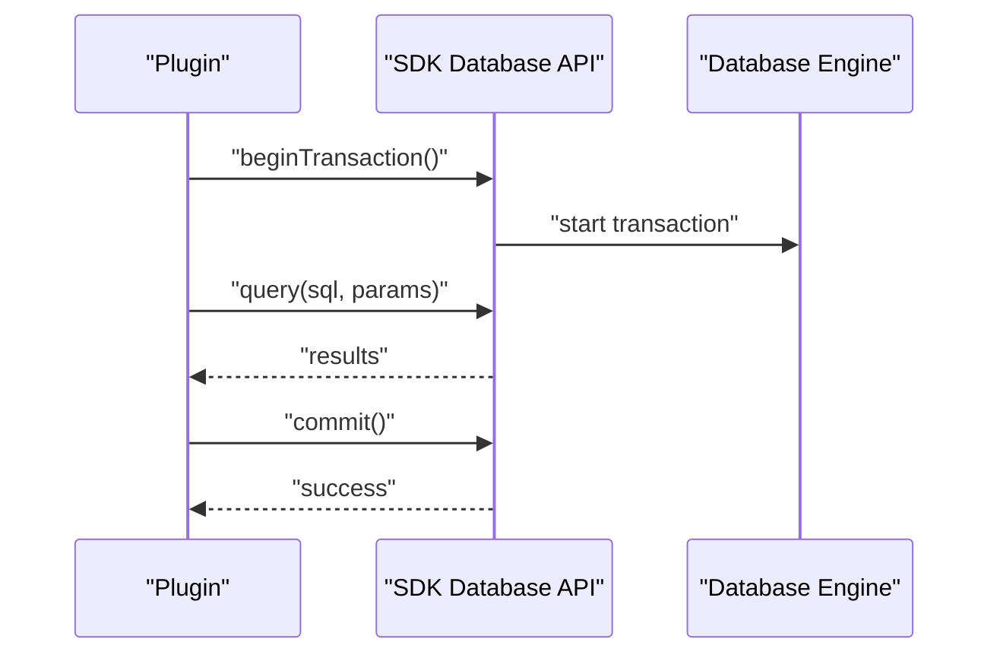

**Diagram sources**
- [package.json](file://package.json)
- [README.md](file://README.md)

**Section sources**
- [package.json](file://package.json)
- [README.md](file://README.md)

#### HTTP Requests
Make outbound HTTP calls using the SDK’s HTTP client. Configure timeouts, retries, and headers securely.

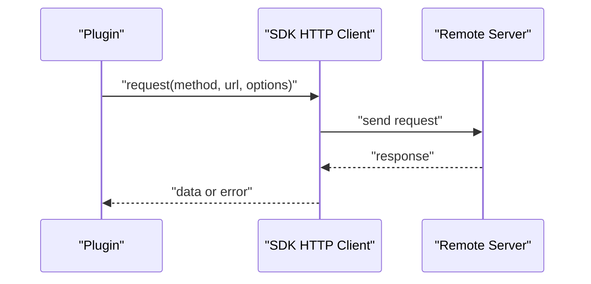

**Diagram sources**
- [package.json](file://package.json)
- [README.md](file://README.md)

**Section sources**
- [package.json](file://package.json)
- [README.md](file://README.md)

## Dependency Analysis
The plugin ecosystem depends on shared protocols and schemas to ensure compatibility and type safety across modules.

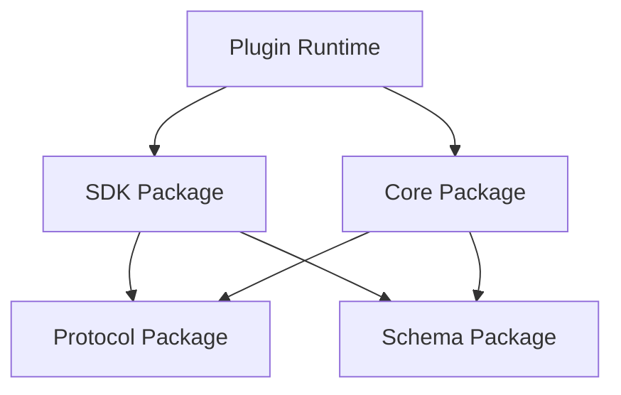

**Diagram sources**
- [package.json](file://package.json)
- [bunfig.toml](file://bunfig.toml)

**Section sources**
- [package.json](file://package.json)
- [bunfig.toml](file://bunfig.toml)

## Performance Considerations
- Minimize event subscriptions and unsubscribe when no longer needed to avoid memory leaks.
- Batch state updates to reduce re-renders and propagation overhead.
- Use streaming APIs for large datasets instead of loading everything into memory.
- Cache frequently accessed data at appropriate layers (in-memory, disk, network).
- Prefer parameterized queries and prepared statements for database operations.
- Set sensible timeouts and retry limits for HTTP requests to prevent blocking.

[No sources needed since this section provides general guidance]

## Troubleshooting Guide
Common issues and resolutions:
- Event handlers not firing: Ensure correct event types and proper subscription scope. Verify that events are emitted from the expected source.
- Permission denied errors: Confirm that the plugin has the required capabilities and that the operation falls within allowed boundaries.
- UI components not rendering: Check component lifecycle methods and ensure proper mounting and binding of events.
- Messaging failures: Validate message schemas and channel configurations. Inspect routing rules and error responses.
- Slow database queries: Analyze query plans, add indexes, and avoid N+1 query patterns. Use transactions judiciously.
- Network timeouts: Adjust timeout settings, implement retries with backoff, and handle transient errors gracefully.

**Section sources**
- [package.json](file://package.json)
- [README.md](file://README.md)

## Conclusion
The Plugin SDK provides a robust foundation for extending the application with secure, performant, and interoperable plugins. By following the documented patterns for event handling, state access, command registration, UI composition, and messaging, developers can build powerful integrations while maintaining strong security boundaries. Adhering to performance best practices and leveraging the troubleshooting guidance ensures reliable and efficient plugin ecosystems.

[No sources needed since this section summarizes without analyzing specific files]

## Appendices

### Installation and Setup
- Install dependencies using the project’s package manager.
- Configure environment variables for external services and permissions.
- Build and run the application to validate plugin loading.

**Section sources**
- [package.json](file://package.json)
- [README.md](file://README.md)
- [bunfig.toml](file://bunfig.toml)
- [tsconfig.json](file://tsconfig.json)