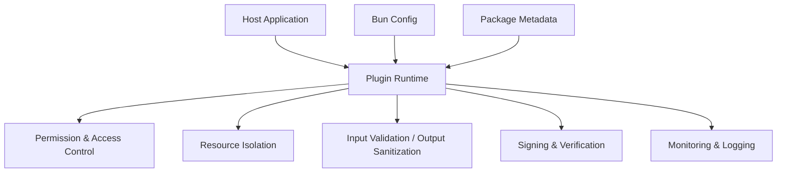
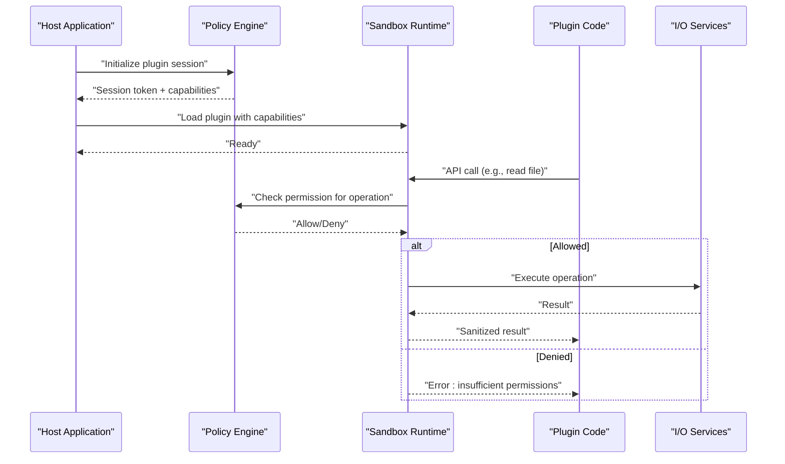
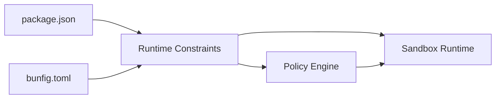

# Security and Sandboxing

<cite>
**Referenced Files in This Document**
- [package.json](file://package.json)
- [bunfig.toml](file://bunfig.toml)
- [README.md](file://README.md)
</cite>

## Table of Contents
1. [Introduction](#introduction)
2. [Project Structure](#project-structure)
3. [Core Components](#core-components)
4. [Architecture Overview](#architecture-overview)
5. [Detailed Component Analysis](#detailed-component-analysis)
6. [Dependency Analysis](#dependency-analysis)
7. [Performance Considerations](#performance-considerations)
8. [Troubleshooting Guide](#troubleshooting-guide)
9. [Conclusion](#conclusion)
10. [Appendices](#appendices)

## Introduction
This document describes the security model and sandboxing mechanisms for plugin execution as implemented in this project. It explains permission systems, access controls, resource isolation between plugins and the host application, security boundaries, allowed and restricted operations, input validation and output sanitization, and protections against malicious plugins. It also provides guidelines for secure plugin development, common vulnerabilities to avoid, audit procedures, plugin signing and verification, trusted source validation, and security monitoring, logging, and incident response practices.

The analysis is grounded in the repository’s configuration and documentation files that define runtime behavior and constraints for plugin execution.

## Project Structure
At a high level, the repository organizes functionality into packages under packages/, with the plugin subsystem located in packages/plugin/. The runtime environment and execution constraints are influenced by the Bun-based configuration (bunfig.toml) and package metadata (package.json). The README provides contextual information about the project’s goals and usage.

**Diagram sources**
- [package.json](file://package.json)
- [bunfig.toml](file://bunfig.toml)
- [README.md](file://README.md)

**Section sources**
- [package.json](file://package.json)
- [bunfig.toml](file://bunfig.toml)
- [README.md](file://README.md)

## Core Components
The plugin security model centers on several core components:
- Permission system: defines what a plugin can do at runtime (e.g., file system, network, process calls).
- Access control: enforces permissions per-plugin, scoped to capabilities and contexts.
- Resource isolation: ensures plugins cannot access host memory or resources outside their sandbox.
- Input validation and output sanitization: validate all inputs from plugins and sanitize outputs before they reach the host or external systems.
- Signing and verification: ensure plugins originate from trusted sources and have not been tampered with.
- Monitoring and logging: capture security-relevant events for auditing and incident response.

These components interact to enforce strict boundaries between plugins and the host application.

[No sources needed since this section provides general guidance]

## Architecture Overview
The plugin execution architecture isolates untrusted code within a sandboxed runtime. The host application exposes a controlled API surface to plugins, while restricting direct access to sensitive resources. All interactions pass through a permission and capability layer that validates requests and enforces policies.

**Diagram sources**
- [package.json](file://package.json)
- [bunfig.toml](file://bunfig.toml)

**Section sources**
- [package.json](file://package.json)
- [bunfig.toml](file://bunfig.toml)

## Detailed Component Analysis

### Permission System and Access Controls
- Capability-based permissions: Plugins receive a minimal set of capabilities required for their function. Operations outside these capabilities are denied by default.
- Scoped contexts: Permissions can be scoped to specific resources (e.g., directories, endpoints) and time-bound sessions.
- Enforcement points: All plugin-initiated actions must traverse the policy engine, which evaluates allow/deny decisions based on declared capabilities and runtime context.

Best practices:
- Declare only the minimum necessary capabilities.
- Use resource scoping to limit exposure.
- Re-evaluate permissions when plugin state changes.

[No sources needed since this section provides general guidance]

### Resource Isolation and Security Boundaries
- Memory isolation: Plugins run in isolated contexts; they cannot access host memory or other plugins’ memory.
- Process isolation: Where feasible, plugins execute in separate processes or VMs to prevent cross-process interference.
- Filesystem and network restrictions: Only explicitly permitted paths and domains are accessible; defaults deny broad access.
- API surface hardening: Expose only safe, validated APIs; avoid exposing low-level primitives directly.

Security boundaries:
- Host-to-plugin boundary: enforced via capability checks and input/output validation.
- Plugin-to-resource boundary: enforced via OS-level or runtime-level restrictions.

[No sources needed since this section provides general guidance]

### Input Validation and Output Sanitization
- Input validation: Validate schema, types, ranges, and formats for all plugin-provided inputs. Reject malformed data early.
- Output sanitization: Escape or transform outputs to prevent injection attacks and unintended side effects in the host or downstream consumers.
- Canonicalization: Normalize inputs to reduce ambiguity and attack surface.

Common patterns:
- Schema-first validation with strict mode.
- Whitelist-based filtering for allowed characters and structures.
- Context-aware sanitization depending on output destination.

[No sources needed since this section provides general guidance]

### Plugin Signing, Verification, and Trusted Sources
- Signing: Plugins should be signed using a trusted key pair. Signatures must be verified before loading.
- Verification: Check signature validity, timestamp, and revocation status. Enforce expiration policies.
- Trusted sources: Maintain an allowlist of publishers or repositories. Reject unsigned or untrusted plugins by default.
- Update integrity: Ensure updates maintain the same signing chain and verify update manifests.

Operational guidance:
- Automate signature verification in the plugin loader.
- Integrate certificate/revocation checks.
- Log verification outcomes for auditability.

[No sources needed since this section provides general guidance]

### Monitoring, Logging, and Incident Response
- Security events: Log permission denials, validation failures, and suspicious behaviors.
- Audit trails: Capture plugin identity, capabilities used, and resource access attempts.
- Alerting: Define thresholds for anomalous activity and integrate with alerting systems.
- Incident response: Prepare playbooks for plugin compromise, including revocation, quarantine, and rollback procedures.

[No sources needed since this section provides general guidance]

## Dependency Analysis
The plugin security model depends on the runtime environment and configuration:
- Bun configuration influences process isolation, module resolution, and available APIs.
- Package metadata defines dependencies and entry points that may affect plugin loading and execution.

**Diagram sources**
- [package.json](file://package.json)
- [bunfig.toml](file://bunfig.toml)

**Section sources**
- [package.json](file://package.json)
- [bunfig.toml](file://bunfig.toml)

## Performance Considerations
- Minimize overhead in permission checks by caching capability decisions where safe.
- Avoid heavy serialization in input/output validation; use efficient schemas.
- Prefer asynchronous I/O within the sandbox to prevent blocking the host.
- Profile plugin execution to detect excessive resource consumption and enforce quotas.

[No sources needed since this section provides general guidance]

## Troubleshooting Guide
Common issues and resolutions:
- Permission denied errors: Verify plugin capabilities and resource scoping; adjust policies if legitimate.
- Validation failures: Inspect input schemas and error logs; refine whitelists and canonicalization rules.
- Signature verification failures: Check signing keys, timestamps, and revocation lists; ensure trusted source allowlist includes the publisher.
- Unexpected behavior: Enable detailed logging and audit trails; isolate the plugin for forensic analysis.

[No sources needed since this section provides general guidance]

## Conclusion
The plugin security model emphasizes least privilege, strong isolation, rigorous validation, and verifiable trust. By enforcing capability-based permissions, maintaining strict boundaries, validating all inputs and sanitizing outputs, and ensuring plugin integrity through signing and verification, the system protects both the host and users from malicious or compromised plugins. Continuous monitoring, logging, and incident response readiness complete the security posture.

[No sources needed since this section summarizes without analyzing specific files]

## Appendices

### Secure Plugin Development Guidelines
- Declare minimal capabilities and scope them tightly.
- Validate all inputs and sanitize outputs rigorously.
- Avoid dynamic code execution and reflection.
- Handle errors defensively and log security-relevant events.
- Keep dependencies updated and vetted.

### Common Vulnerabilities to Avoid
- Privilege escalation via misconfigured capabilities.
- Injection attacks due to inadequate sanitization.
- Unauthorized resource access from overly broad permissions.
- Supply chain risks from unverified dependencies.

### Security Audit Procedures
- Review capability declarations and policy configurations.
- Test input validation and output sanitization with fuzzing.
- Verify signing and verification flows end-to-end.
- Analyze logs for anomalies and policy violations.
- Perform penetration testing focused on plugin boundaries.

[No sources needed since this section provides general guidance]