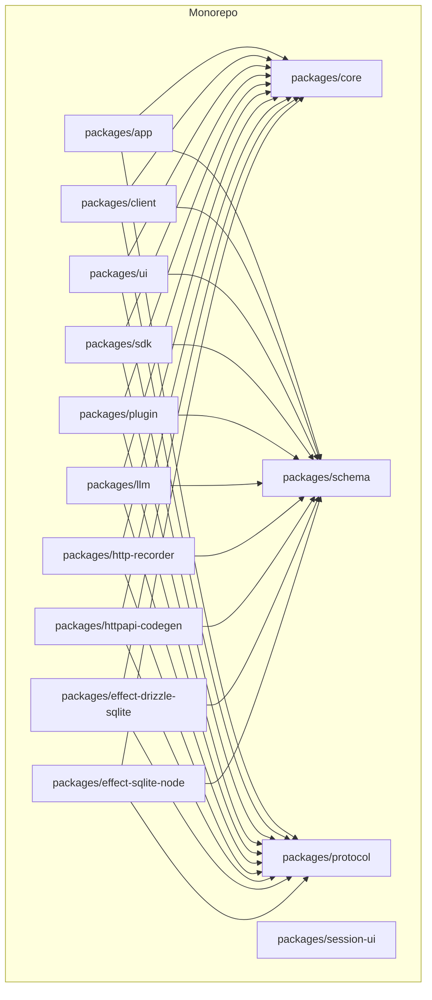
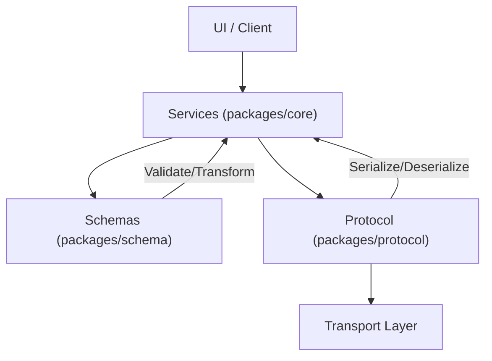
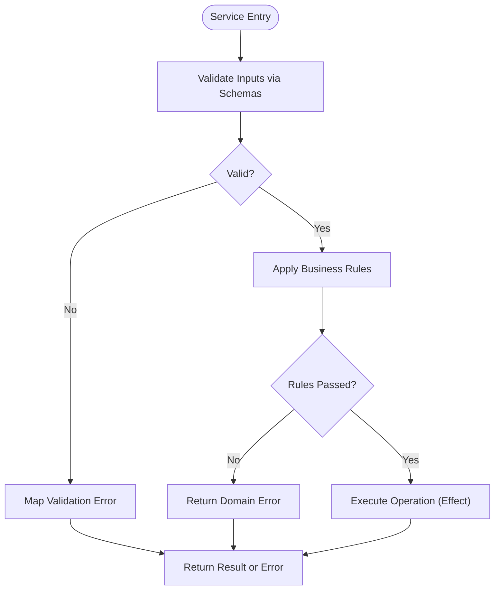
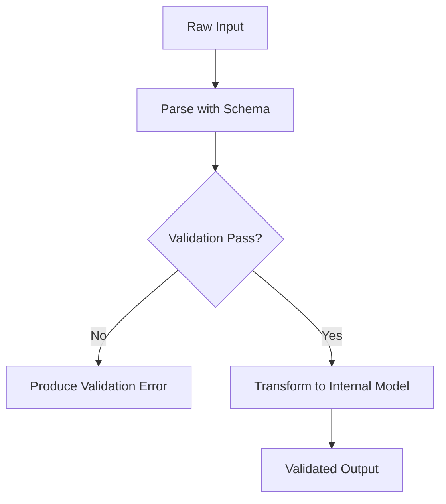
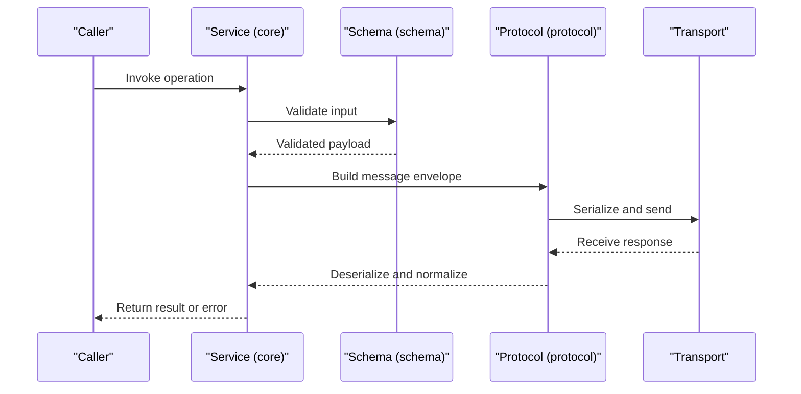
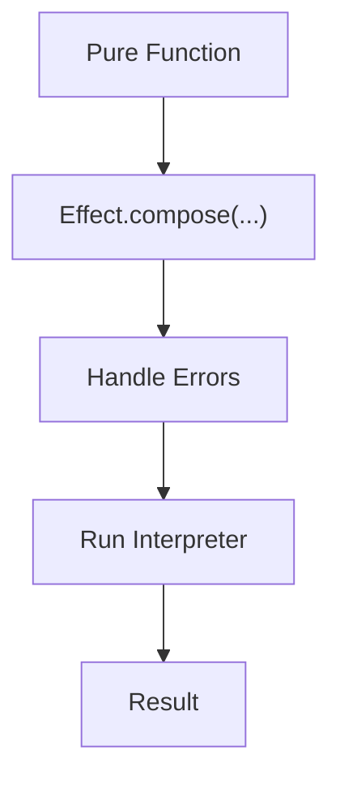
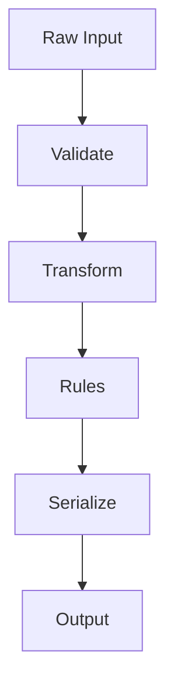
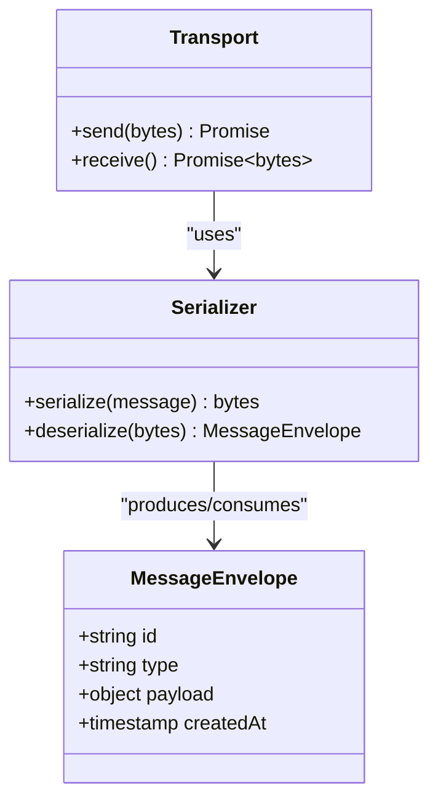
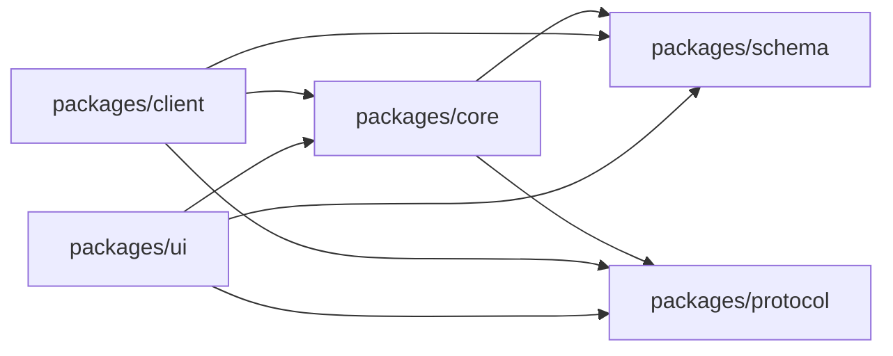

# Business Logic Layer

<cite>
**Referenced Files in This Document**
- [package.json](file://package.json)
- [bunfig.toml](file://bunfig.toml)
- [tsconfig.json](file://tsconfig.json)
- [README.md](file://README.md)
</cite>

## Table of Contents
1. [Introduction](#introduction)
2. [Project Structure](#project-structure)
3. [Core Components](#core-components)
4. [Architecture Overview](#architecture-overview)
5. [Detailed Component Analysis](#detailed-component-analysis)
6. [Dependency Analysis](#dependency-analysis)
7. [Performance Considerations](#performance-considerations)
8. [Troubleshooting Guide](#troubleshooting-guide)
9. [Conclusion](#conclusion)
10. [Appendices](#appendices)

## Introduction
This document describes the business logic layer across packages/core, packages/schema, and packages/protocol. It explains domain models, schema validation, protocol handling, functional programming patterns using Effect types, error handling strategies, async operation management, data validation workflows, transformation pipelines, business rule enforcement, communication protocols, message serialization, API contracts, testing strategies, mocking techniques, and integration testing approaches.

## Project Structure
The repository is a monorepo with multiple packages under packages/. The business logic layer spans:
- packages/core: Core domain models, services, and business rules.
- packages/schema: Schema definitions, validators, and type transformations.
- packages/protocol: Protocol definitions, message formats, serialization, and transport abstractions.

[No sources needed since this diagram shows conceptual structure]

## Core Components
- Domain Models (packages/core): Central entities representing business concepts, their relationships, and invariants. These are consumed by services and UI layers to enforce consistent state and behavior.
- Services (packages/core): Encapsulate business operations, orchestrate domain models, and coordinate with external systems via protocol abstractions.
- Validation and Transformation (packages/schema): Define schemas for inputs and outputs, perform runtime validation, and transform between internal and external representations.
- Protocol Abstractions (packages/protocol): Define message shapes, serialization/deserialization, and transport-agnostic interfaces for inter-component communication.

Key responsibilities:
- Enforce business rules within services and domain models.
- Validate all external inputs against schemas before processing.
- Serialize messages according to protocol contracts.
- Manage asynchronous operations using Effect types for predictable error handling and composition.

**Section sources**
- [README.md](file://README.md)

## Architecture Overview
The business logic layer follows a layered architecture:
- Presentation/UI consumes services and schemas.
- Services implement business logic and use protocol clients to communicate.
- Schemas validate and transform data at boundaries.
- Protocols define contracts for messages and transports.

[No sources needed since this diagram shows conceptual architecture]

## Detailed Component Analysis

### Domain Models and Business Rules (packages/core)
- Purpose: Define core entities and invariants; encapsulate business rules.
- Patterns:
  - Immutable updates where appropriate.
  - Pure functions for transformations.
  - Composition of effects for side-effectful operations.
- Error Handling:
  - Use Effect types to represent success/failure paths explicitly.
  - Centralized error mapping from protocol or IO errors to domain errors.

**Section sources**
- [README.md](file://README.md)

### Schema Validation and Type Definitions (packages/schema)
- Purpose: Provide runtime validation and type-safe transformations for all data crossing boundaries.
- Responsibilities:
  - Define schemas for requests, responses, and internal payloads.
  - Parse and coerce input values safely.
  - Produce deterministic error messages for invalid data.
- Integration:
  - Used by services to guard entry points.
  - Used by protocol layer to serialize/deserialize messages consistently.

**Section sources**
- [README.md](file://README.md)

### Protocol Handling and Message Contracts (packages/protocol)
- Purpose: Define message shapes, serialization formats, and transport-agnostic APIs.
- Responsibilities:
  - Define request/response envelopes and event streams.
  - Implement serializers/deserializers aligned with schemas.
  - Abstract over transports (HTTP, WebSocket, etc.) while preserving contract consistency.
- Error Handling:
  - Normalize transport-level errors into domain-friendly errors.
  - Preserve context for retries and observability.

**Section sources**
- [README.md](file://README.md)

### Functional Programming Patterns with Effect Types
- Patterns:
  - Represent computations as Effects that can be composed.
  - Separate pure logic from side effects.
  - Compose async operations with explicit error channels.
- Benefits:
  - Predictable error propagation.
  - Easy testability through effect interpreters.
  - Clear separation of concerns between business logic and infrastructure.

**Section sources**
- [README.md](file://README.md)

### Data Validation Workflows and Transformation Pipelines
- Workflow:
  - Accept raw input.
  - Validate against schema.
  - Transform to internal model.
  - Apply business rules.
  - Serialize output via protocol.
- Pipeline Characteristics:
  - Each stage returns an Effect for uniform error handling.
  - Fail-fast on validation errors.
  - Deterministic transformations.

**Section sources**
- [README.md](file://README.md)

### Communication Protocols, Serialization, and API Contracts
- Contracts:
  - Request/response envelopes defined in protocol.
  - Payloads validated by schemas.
- Serialization:
  - Consistent encoding/decoding across components.
  - Versioning considerations for evolving contracts.
- API Surface:
  - Typed endpoints exposed to clients and services.
  - Error codes standardized for consumers.

**Section sources**
- [README.md](file://README.md)

## Dependency Analysis
- packages/core depends on:
  - packages/schema for validation and transformation.
  - packages/protocol for message contracts and serialization.
- packages/schema is largely independent but may be used by other packages for shared validation.
- packages/protocol abstracts transport details and relies on schemas for payload typing.

[No sources needed since this diagram shows conceptual dependencies]

## Performance Considerations
- Minimize allocations in hot paths by reusing validated structures where safe.
- Prefer streaming for large payloads in protocol serialization.
- Cache frequently accessed configuration or static schemas.
- Avoid unnecessary deep cloning; prefer immutable updates selectively.
- Profile async chains to prevent contention and ensure backpressure handling.

[No sources needed since this section provides general guidance]

## Troubleshooting Guide
Common issues and resolutions:
- Validation failures: Inspect schema error messages and ensure input conforms to expected types.
- Protocol mismatches: Verify envelope fields and payload versions match the current contract.
- Async errors: Trace Effect chains to identify failing stages; log normalized errors with context.
- Serialization errors: Confirm consistent encoders/decoders and handle version drift gracefully.

[No sources needed since this section provides general guidance]

## Conclusion
The business logic layer combines robust domain modeling, strict schema validation, and well-defined protocol contracts to deliver reliable, testable, and maintainable functionality. Using Effect types ensures clear error handling and composable async operations. Adhering to these patterns yields predictable behavior across components and simplifies testing and integration.

[No sources needed since this section summarizes without analyzing specific files]

## Appendices

### Testing Strategies for Business Logic
- Unit Testing:
  - Test pure functions and Effect compositions directly.
  - Mock protocol transports and IO effects.
- Integration Testing:
  - Validate end-to-end flows with real transports in controlled environments.
  - Assert schema validations and protocol contracts.
- Mocking Techniques:
  - Replace protocol clients with deterministic stubs.
  - Inject fake time and random generators for reproducibility.

[No sources needed since this section provides general guidance]