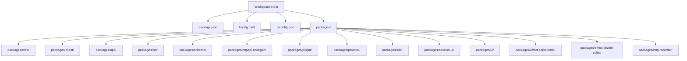
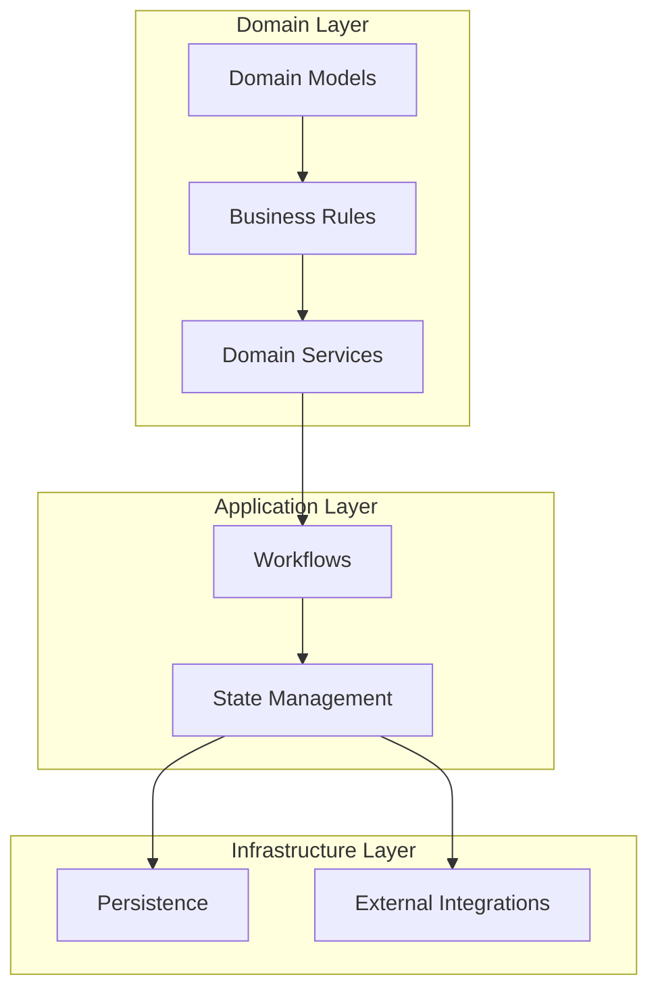
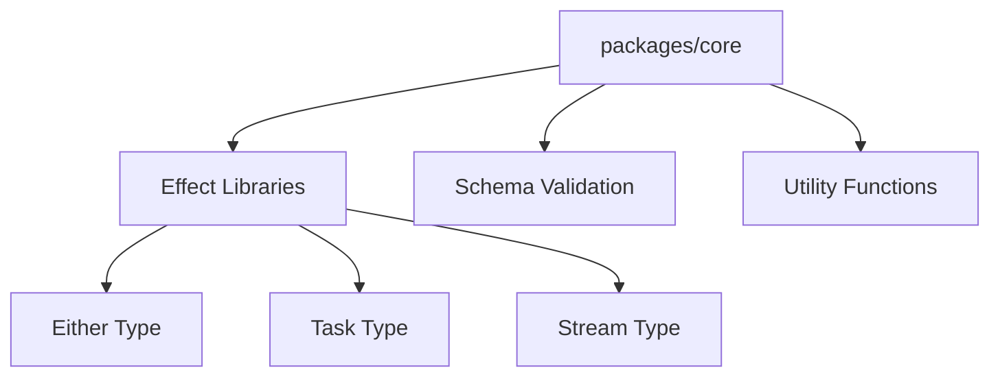

# Core Domain Models

<cite>
**Referenced Files in This Document**
- [package.json](file://package.json)
- [bunfig.toml](file://bunfig.toml)
- [tsconfig.json](file://tsconfig.json)
</cite>

## Table of Contents
1. [Introduction](#introduction)
2. [Project Structure](#project-structure)
3. [Core Components](#core-components)
4. [Architecture Overview](#architecture-overview)
5. [Detailed Component Analysis](#detailed-component-analysis)
6. [Dependency Analysis](#dependency-analysis)
7. [Performance Considerations](#performance-considerations)
8. [Troubleshooting Guide](#troubleshooting-guide)
9. [Conclusion](#conclusion)
10. [Appendices](#appendices)

## Introduction
This document provides comprehensive documentation for the core domain models and business logic within the packages/core directory. It explains fundamental data structures, business entities, and domain rules that underpin the application. The guide emphasizes functional programming patterns using Effect types (Either, Task, Stream) to model error handling and asynchronous operations. It also details business workflows, state management patterns, domain-specific transformations, and strategies for extending domain models and implementing new business rules. Finally, it outlines testing strategies for business logic, including mocking techniques and integration testing approaches.

## Project Structure
The repository is a multi-package workspace managed by Bun. The root configuration files define tooling and project settings, while individual packages encapsulate distinct responsibilities. The core package contains the domain models and business logic relevant to this document.

**Diagram sources**
- [package.json:1-200](file://package.json#L1-L200)
- [bunfig.toml:1-200](file://bunfig.toml#L1-L200)
- [tsconfig.json:1-200](file://tsconfig.json#L1-L200)

**Section sources**
- [package.json:1-200](file://package.json#L1-L200)
- [bunfig.toml:1-200](file://bunfig.toml#L1-L200)
- [tsconfig.json:1-200](file://tsconfig.json#L1-L200)

## Core Components
The core package defines the foundational domain models and business logic. Key aspects include:
- Data models representing business entities with strict schemas and validation.
- Business services orchestrating workflows using Effect types for safe async operations and error modeling.
- Domain rules encoded as pure functions and validators ensuring consistency across the system.
- State management patterns leveraging immutable updates and effectful transitions.

To implement new business rules:
- Define or extend domain models with clear schemas and constraints.
- Compose effects using Either for error paths and Task for async boundaries.
- Use Stream for event-driven processing where appropriate.
- Validate inputs early and propagate errors through typed channels.

To extend existing domain models:
- Introduce new fields with default values and migration strategies if needed.
- Add validators and transformation functions to maintain invariants.
- Update dependent services to handle new cases without breaking existing flows.

For complex business scenarios:
- Decompose workflows into smaller, testable units.
- Combine effects with sequencing and branching to represent conditional logic.
- Centralize error handling and logging at service boundaries.

[No sources needed since this section provides general guidance]

## Architecture Overview
The architecture centers around a layered design where domain models are isolated from infrastructure concerns. Services orchestrate domain logic using Effect primitives, while persistence and external integrations are abstracted behind interfaces.

[No sources needed since this diagram shows conceptual architecture, not actual code structure]

## Detailed Component Analysis
This section analyzes key components within the core package, focusing on data structures, business logic, and Effect-based patterns.

### Domain Models
Domain models encapsulate entity definitions, validation rules, and transformation utilities. They serve as the single source of truth for business data.

Key characteristics:
- Immutable representations with explicit field types.
- Validation functions ensuring data integrity.
- Transformation helpers for mapping between internal and external formats.

Best practices:
- Keep models focused and cohesive.
- Avoid side effects in model definitions.
- Provide clear error messages for validation failures.

[No sources needed since this section provides general guidance]

### Business Services
Business services implement workflows by composing domain models and rules. They use Effect types to manage errors and async operations.

Patterns:
- Use Either to represent success and failure outcomes.
- Wrap async operations with Task for predictable execution.
- Leverage Stream for processing sequences of events.

Example workflow:
- Validate input using Either.
- Execute async operation using Task.
- Handle errors and return typed results.

[No sources needed since this section provides general guidance]

### State Management
State management in the core package follows functional principles with immutable updates and effectful transitions.

Approach:
- Represent state as plain data structures.
- Use reducers or update functions to transform state.
- Encapsulate side effects in services and expose them via effects.

Benefits:
- Predictable state changes.
- Easy testing and debugging.
- Clear separation of concerns.

[No sources needed since this section provides general guidance]

### Testing Strategies
Testing business logic involves unit tests for pure functions and integration tests for workflows.

Unit testing:
- Mock dependencies using factories or stubs.
- Test both success and error paths.
- Verify state transitions and output formats.

Integration testing:
- Use test databases or in-memory stores.
- Simulate external service responses.
- Validate end-to-end workflows.

Mocking techniques:
- Replace async dependencies with deterministic implementations.
- Capture and assert side effects.
- Isolate business logic from infrastructure.

[No sources needed since this section provides general guidance]

## Dependency Analysis
The core package depends on Effect libraries for functional programming constructs. Dependencies are managed through the workspace configuration and package manifests.

**Diagram sources**
- [package.json:1-200](file://package.json#L1-L200)
- [bunfig.toml:1-200](file://bunfig.toml#L1-L200)

**Section sources**
- [package.json:1-200](file://package.json#L1-L200)
- [bunfig.toml:1-200](file://bunfig.toml#L1-L200)

## Performance Considerations
Optimizing performance in the core package involves:
- Minimizing unnecessary allocations in hot paths.
- Using efficient data structures for large datasets.
- Batching async operations to reduce overhead.
- Implementing caching strategies for expensive computations.

Recommendations:
- Profile critical workflows to identify bottlenecks.
- Prefer lazy evaluation for large streams.
- Avoid deep object cloning when possible.

[No sources needed since this section provides general guidance]

## Troubleshooting Guide
Common issues and solutions:
- Validation errors: Check input schemas and provide meaningful error messages.
- Async failures: Ensure proper error handling in Task and Stream operations.
- State inconsistencies: Verify immutability and update functions.

Debugging tips:
- Log effect execution paths with detailed context.
- Use type assertions to catch mismatches early.
- Write failing tests to reproduce issues.

[No sources needed since this section provides general guidance]

## Conclusion
The core package establishes a robust foundation for domain modeling and business logic using functional programming patterns. By leveraging Effect types, the system achieves reliable error handling and async operation management. Following the guidelines in this document ensures maintainable, testable, and scalable domain implementations.

[No sources needed since this section summarizes without analyzing specific files]

## Appendices
Additional resources and references:
- Effect documentation for advanced usage patterns.
- Schema validation best practices.
- Testing frameworks and utilities for functional code.

[No sources needed since this section provides general guidance]