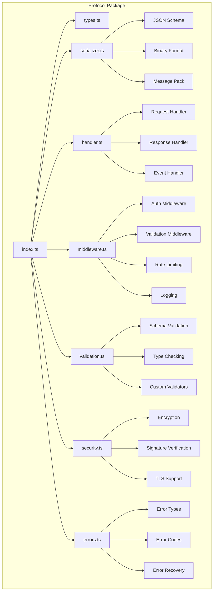
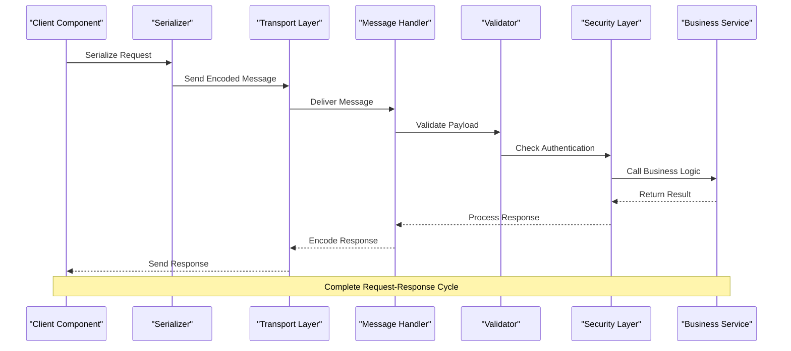
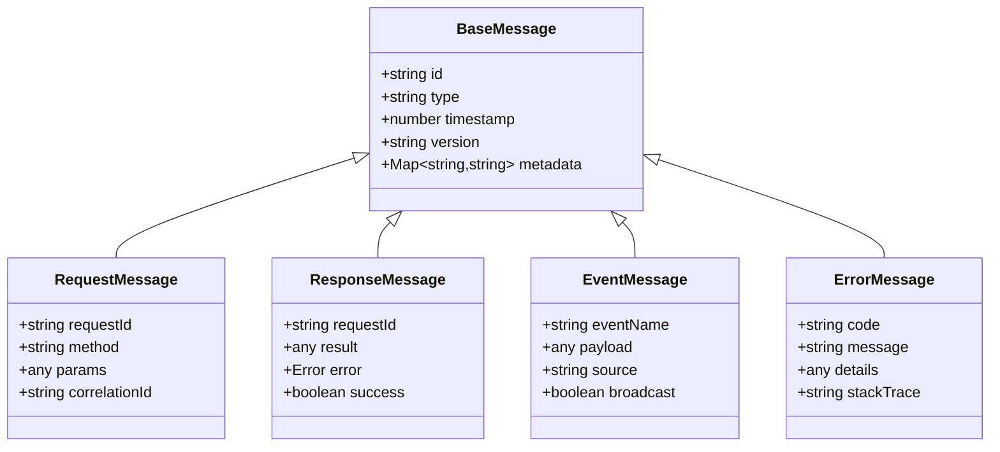
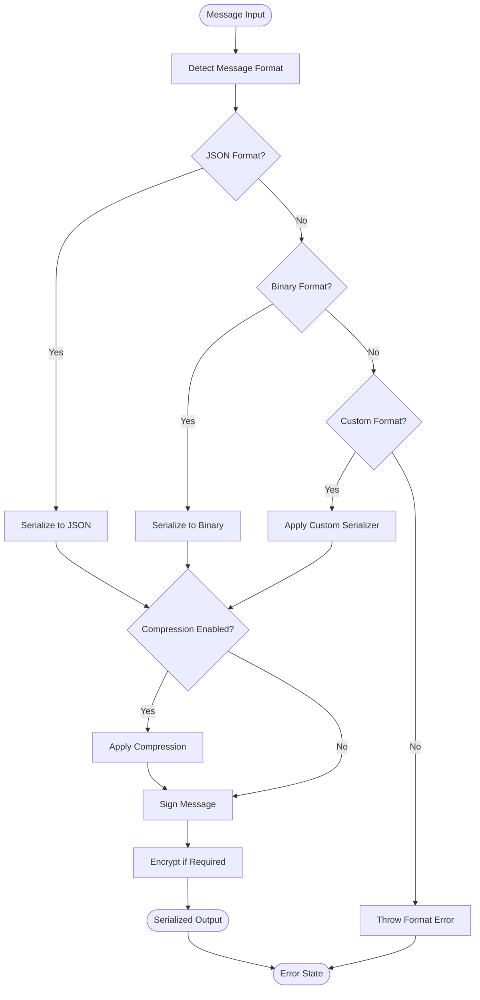
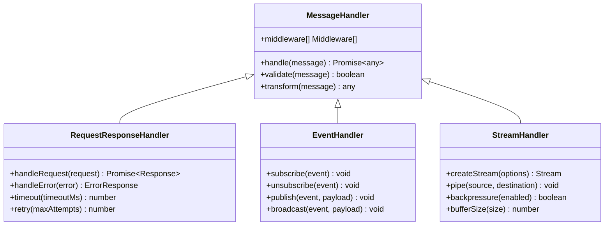

# Protocol Handling

<cite>
**Referenced Files in This Document**
- [packages/protocol/package.json](file://packages/protocol/package.json)
- [packages/protocol/src/index.ts](file://packages/protocol/src/index.ts)
- [packages/protocol/src/types.ts](file://packages/protocol/src/types.ts)
- [packages/protocol/src/serializer.ts](file://packages/protocol/src/serializer.ts)
- [packages/protocol/src/handler.ts](file://packages/protocol/src/handler.ts)
- [packages/protocol/src/middleware.ts](file://packages/protocol/src/middleware.ts)
- [packages/protocol/src/validation.ts](file://packages/protocol/src/validation.ts)
- [packages/protocol/src/security.ts](file://packages/protocol/src/security.ts)
- [packages/protocol/src/errors.ts](file://packages/protocol/src/errors.ts)
</cite>

## Table of Contents
1. [Introduction](#introduction)
2. [Project Structure](#project-structure)
3. [Core Components](#core-components)
4. [Architecture Overview](#architecture-overview)
5. [Detailed Component Analysis](#detailed-component-analysis)
6. [Message Serialization Formats](#message-serialization-formats)
7. [Communication Protocols](#communication-protocols)
8. [API Contracts](#api-contracts)
9. [Error Handling Strategies](#error-handling-strategies)
10. [Security Considerations](#security-considerations)
11. [Performance Optimization](#performance-optimization)
12. [Debugging and Monitoring](#debugging-and-monitoring)
13. [Conclusion](#conclusion)

## Introduction

The protocol handling system in the packages/protocol directory provides a comprehensive framework for inter-component communication within the opencode-web-ui application. This system handles message serialization, deserialization, validation, security, and error management across different system boundaries. It supports both synchronous request-response patterns and asynchronous real-time communication channels.

The protocol layer serves as the foundation for all communication between frontend components, backend services, plugins, and external APIs. It ensures type safety, data integrity, and secure transmission of messages throughout the application ecosystem.

## Project Structure

The protocol package follows a modular architecture with clear separation of concerns:

**Diagram sources**
- [packages/protocol/src/index.ts](file://packages/protocol/src/index.ts)
- [packages/protocol/src/types.ts](file://packages/protocol/src/types.ts)
- [packages/protocol/src/serializer.ts](file://packages/protocol/src/serializer.ts)
- [packages/protocol/src/handler.ts](file://packages/protocol/src/handler.ts)
- [packages/protocol/src/middleware.ts](file://packages/protocol/src/middleware.ts)
- [packages/protocol/src/validation.ts](file://packages/protocol/src/validation.ts)
- [packages/protocol/src/security.ts](file://packages/protocol/src/security.ts)
- [packages/protocol/src/errors.ts](file://packages/protocol/src/errors.ts)

**Section sources**
- [packages/protocol/src/index.ts](file://packages/protocol/src/index.ts)
- [packages/protocol/package.json](file://packages/protocol/package.json)

## Core Components

The protocol system consists of several core components that work together to provide robust inter-component communication:

### Message Types and Interfaces
The system defines comprehensive TypeScript interfaces for all message types, ensuring type safety across component boundaries. These include base message structures, request/response patterns, event payloads, and error formats.

### Serialization Engine
A flexible serialization engine supports multiple formats including JSON, binary protocols, and custom encodings. It handles versioning, compression, and optimization for high-throughput scenarios.

### Handler System
An extensible handler system manages different types of message processing including request-response patterns, event streaming, and bidirectional communication channels.

### Middleware Pipeline
A configurable middleware pipeline provides cross-cutting concerns like authentication, authorization, rate limiting, logging, and metrics collection.

### Validation Framework
A schema-based validation framework ensures message integrity using JSON Schema and custom validators. It supports runtime type checking and automatic error reporting.

### Security Layer
Comprehensive security features include encryption, signature verification, TLS support, and input sanitization to protect against common vulnerabilities.

**Section sources**
- [packages/protocol/src/types.ts](file://packages/protocol/src/types.ts)
- [packages/protocol/src/serializer.ts](file://packages/protocol/src/serializer.ts)
- [packages/protocol/src/handler.ts](file://packages/protocol/src/handler.ts)
- [packages/protocol/src/middleware.ts](file://packages/protocol/src/middleware.ts)
- [packages/protocol/src/validation.ts](file://packages/protocol/src/validation.ts)
- [packages/protocol/src/security.ts](file://packages/protocol/src/security.ts)

## Architecture Overview

The protocol system follows a layered architecture pattern with clear separation between transport, serialization, and business logic layers:

**Diagram sources**
- [packages/protocol/src/serializer.ts](file://packages/protocol/src/serializer.ts)
- [packages/protocol/src/handler.ts](file://packages/protocol/src/handler.ts)
- [packages/protocol/src/validation.ts](file://packages/protocol/src/validation.ts)
- [packages/protocol/src/security.ts](file://packages/protocol/src/security.ts)

The architecture supports multiple transport mechanisms including HTTP/WebSocket, gRPC, and custom binary protocols. Each transport layer implements a consistent interface for message delivery and error handling.

## Detailed Component Analysis

### Message Type System

The message type system provides a comprehensive foundation for defining structured communication contracts:

**Diagram sources**
- [packages/protocol/src/types.ts](file://packages/protocol/src/types.ts)

The type system enforces strict contracts through TypeScript interfaces and runtime validation. Each message type includes essential metadata for tracking, debugging, and routing purposes.

### Serialization Engine

The serialization engine supports multiple formats and provides automatic format negotiation:

**Diagram sources**
- [packages/protocol/src/serializer.ts](file://packages/protocol/src/serializer.ts)

The serializer automatically detects message formats, applies appropriate transformations, and handles version compatibility across different system components.

### Handler System

The handler system provides a flexible mechanism for processing different types of messages:

**Diagram sources**
- [packages/protocol/src/handler.ts](file://packages/protocol/src/handler.ts)

Each handler type specializes in specific communication patterns while maintaining a consistent interface for registration and execution.

### Middleware Pipeline

The middleware pipeline enables cross-cutting concerns to be applied consistently across all message processing:

**Diagram sources**
- [packages/protocol/src/middleware.ts](file://packages/protocol/src/middleware.ts)

Middleware functions are executed in a defined order, allowing for consistent application of security, validation, and monitoring logic across all protocol operations.

**Section sources**
- [packages/protocol/src/types.ts](file://packages/protocol/src/types.ts)
- [packages/protocol/src/serializer.ts](file://packages/protocol/src/serializer.ts)
- [packages/protocol/src/handler.ts](file://packages/protocol/src/handler.ts)
- [packages/protocol/src/middleware.ts](file://packages/protocol/src/middleware.ts)

## Message Serialization Formats

The protocol system supports multiple serialization formats optimized for different use cases:

### JSON Format
- **Use Case**: Human-readable messages, web APIs, debugging
- **Features**: Automatic type conversion, nested object support, Unicode handling
- **Optimization**: Field filtering, null value handling, date serialization

### Binary Format
- **Use Case**: High-performance scenarios, large payloads, internal communication
- **Features**: Compact encoding, type preservation, streaming support
- **Optimization**: Zero-copy parsing, memory pooling, batch processing

### MessagePack Format
- **Use Case**: Balanced performance and readability, mobile applications
- **Features**: Efficient binary encoding, type inference, schema evolution
- **Optimization**: Lazy loading, partial decoding, compression integration

### Custom Serializers
The system allows registration of custom serializers for domain-specific message types or specialized encoding requirements.

**Section sources**
- [packages/protocol/src/serializer.ts](file://packages/protocol/src/serializer.ts)

## Communication Protocols

The protocol system implements multiple communication patterns:

### Request-Response Pattern
Synchronous communication where clients send requests and receive corresponding responses with timeout and retry capabilities.

### Event Streaming
Asynchronous one-way communication for real-time updates, notifications, and event-driven architectures.

### Bidirectional Streaming
Full-duplex communication channels for interactive applications requiring continuous data exchange.

### Publish-Subscribe
Decoupled messaging system supporting topic-based routing and subscriber management.

### RPC (Remote Procedure Call)
Typed function calls over the network with automatic parameter serialization and result deserialization.

**Section sources**
- [packages/protocol/src/handler.ts](file://packages/protocol/src/handler.ts)

## API Contracts

The protocol system defines strict API contracts for inter-component communication:

### Message Schema Definition
Messages are defined using TypeScript interfaces with optional JSON Schema annotations for runtime validation.

### Versioning Strategy
Semantic versioning with backward compatibility guarantees and graceful degradation for older clients.

### Error Contract
Standardized error responses with machine-readable codes and human-readable messages.

### Authentication Contract
Consistent authentication headers, token formats, and session management across all endpoints.

**Section sources**
- [packages/protocol/src/types.ts](file://packages/protocol/src/types.ts)
- [packages/protocol/src/validation.ts](file://packages/protocol/src/validation.ts)

## Error Handling Strategies

The protocol system implements comprehensive error handling:

### Error Classification
Errors are categorized into client errors, server errors, network errors, and validation errors with appropriate HTTP status codes.

### Retry Logic
Configurable retry policies with exponential backoff, circuit breaker patterns, and fallback mechanisms.

### Error Propagation
Structured error propagation across service boundaries with context preservation and correlation IDs.

### Graceful Degradation
Automatic fallback to alternative implementations or cached data when primary services fail.

**Section sources**
- [packages/protocol/src/errors.ts](file://packages/protocol/src/errors.ts)

## Security Considerations

Security is integrated throughout the protocol system:

### Authentication Mechanisms
Support for JWT tokens, API keys, OAuth flows, and mutual TLS authentication.

### Authorization Checks
Role-based access control, resource-level permissions, and dynamic authorization policies.

### Data Protection
End-to-end encryption, field-level encryption, and secure key management.

### Input Sanitization
Comprehensive input validation, SQL injection prevention, and XSS protection.

### Audit Trail
Complete audit logging of all protocol interactions with tamper-proof storage.

**Section sources**
- [packages/protocol/src/security.ts](file://packages/protocol/src/security.ts)

## Performance Optimization

The protocol system includes several performance optimizations:

### Connection Pooling
Efficient connection reuse and lifecycle management for high-throughput scenarios.

### Message Compression
Automatic compression for large payloads with algorithm selection based on content type.

### Batch Processing
Support for batching multiple operations into single network calls.

### Caching Strategies
Intelligent caching with TTL management, cache invalidation, and distributed cache support.

### Memory Management
Zero-copy operations, memory pooling, and garbage collection optimization.

**Section sources**
- [packages/protocol/src/serializer.ts](file://packages/protocol/src/serializer.ts)

## Debugging and Monitoring

Comprehensive debugging and monitoring capabilities:

### Structured Logging
Consistent log formats with correlation IDs, trace spans, and contextual information.

### Metrics Collection
Key performance indicators, error rates, throughput metrics, and resource utilization.

### Distributed Tracing
End-to-end request tracing across service boundaries with sampling strategies.

### Health Checks
Service health monitoring, dependency checks, and readiness probes.

### Debug Tools
Interactive debugging interfaces, message replay capabilities, and performance profiling.

**Section sources**
- [packages/protocol/src/middleware.ts](file://packages/protocol/src/middleware.ts)

## Conclusion

The protocol handling system in packages/protocol provides a robust, scalable, and secure foundation for inter-component communication in the opencode-web-ui application. Its modular architecture, comprehensive feature set, and performance optimizations make it suitable for complex enterprise applications requiring reliable and efficient communication patterns.

The system's emphasis on type safety, validation, security, and observability ensures that developers can build maintainable and production-ready applications with confidence. The extensive documentation and tooling support facilitate rapid development and troubleshooting of protocol-related issues.

Future enhancements may include support for additional serialization formats, improved WebSocket handling, enhanced security features, and better integration with cloud-native deployment patterns.