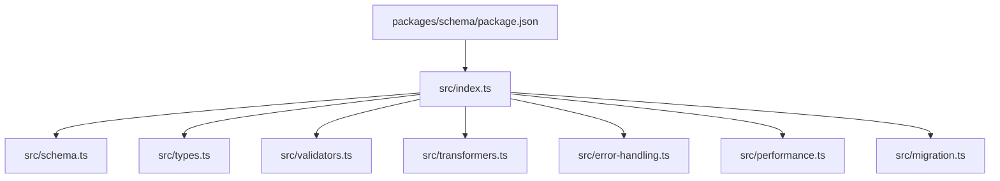
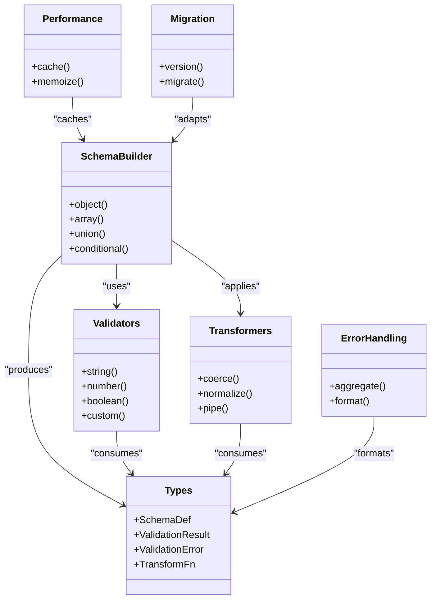
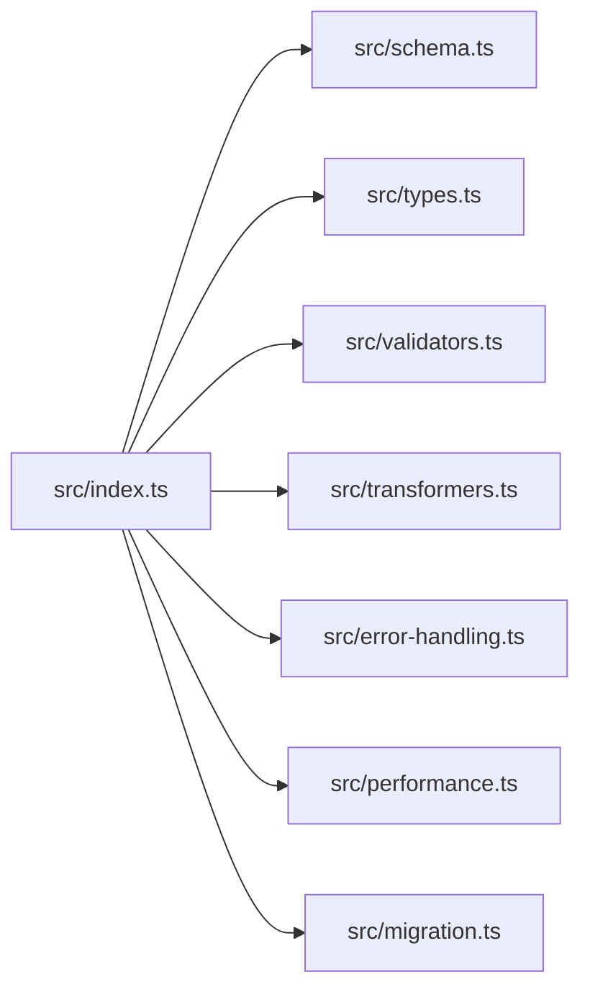

# Schema Validation

<cite>
**Referenced Files in This Document**
- [package.json](file://packages/schema/package.json)
- [index.ts](file://packages/schema/src/index.ts)
- [schema.ts](file://packages/schema/src/schema.ts)
- [types.ts](file://packages/schema/src/types.ts)
- [validators.ts](file://packages/schema/src/validators.ts)
- [transformers.ts](file://packages/schema/src/transformers.ts)
- [error-handling.ts](file://packages/schema/src/error-handling.ts)
- [performance.ts](file://packages/schema/src/performance.ts)
- [migration.ts](file://packages/schema/src/migration.ts)
</cite>

## Table of Contents
1. [Introduction](#introduction)
2. [Project Structure](#project-structure)
3. [Core Components](#core-components)
4. [Architecture Overview](#architecture-overview)
5. [Detailed Component Analysis](#detailed-component-analysis)
6. [Dependency Analysis](#dependency-analysis)
7. [Performance Considerations](#performance-considerations)
8. [Troubleshooting Guide](#troubleshooting-guide)
9. [Conclusion](#conclusion)
10. [Appendices](#appendices)

## Introduction
This document explains the schema validation system implemented in packages/schema. It covers how schemas are defined with TypeScript types, validated at runtime, and transformed into target formats. You will learn how to create custom validators, handle nested objects, implement conditional rules, and align compile-time types with runtime checks. Guidance is provided for performance optimization, caching strategies, schema design best practices, and migrating between schema versions while maintaining backward compatibility.

## Project Structure
The schema package organizes functionality into focused modules:
- Public API entrypoint that re-exports core primitives and utilities
- Core type definitions and schema builder APIs
- Built-in validators and combinators
- Data transformation pipelines
- Error handling and reporting
- Performance helpers and caching utilities
- Migration utilities for versioned schemas

**Diagram sources**
- [package.json](file://packages/schema/package.json)
- [index.ts](file://packages/schema/src/index.ts)
- [schema.ts](file://packages/schema/src/schema.ts)
- [types.ts](file://packages/schema/src/types.ts)
- [validators.ts](file://packages/schema/src/validators.ts)
- [transformers.ts](file://packages/schema/src/transformers.ts)
- [error-handling.ts](file://packages/schema/src/error-handling.ts)
- [performance.ts](file://packages/schema/src/performance.ts)
- [migration.ts](file://packages/schema/src/migration.ts)

**Section sources**
- [package.json](file://packages/schema/package.json)
- [index.ts](file://packages/schema/src/index.ts)

## Core Components
- Type definitions: Centralized TypeScript interfaces and utility types that describe schema shapes and validation results.
- Schema builder: Declarative APIs to compose primitive validators, object schemas, arrays, unions, and conditionals.
- Validators: Built-in checks (e.g., string length, numeric ranges, enums), plus a mechanism to register custom validators.
- Transformers: Pipelines to coerce or normalize data during validation, enabling safe transformations alongside checks.
- Error handling: Structured error aggregation and path-aware messages for complex inputs.
- Performance: Caching and memoization utilities to reduce repeated validation overhead on large datasets.
- Migration: Versioned schema adapters and migration functions to evolve schemas without breaking consumers.

Key responsibilities:
- Compile-time safety via strict TypeScript types
- Runtime enforcement via validator execution
- Transformation pipelines integrated with validation
- Clear, actionable errors
- Efficient processing for large payloads

**Section sources**
- [types.ts](file://packages/schema/src/types.ts)
- [schema.ts](file://packages/schema/src/schema.ts)
- [validators.ts](file://packages/schema/src/validators.ts)
- [transformers.ts](file://packages/schema/src/transformers.ts)
- [error-handling.ts](file://packages/schema/src/error-handling.ts)
- [performance.ts](file://packages/schema/src/performance.ts)
- [migration.ts](file://packages/schema/src/migration.ts)

## Architecture Overview
The system follows a layered architecture:
- Types layer defines shared interfaces and result shapes
- Schema composition layer builds declarative structures
- Validation engine executes validators and transformers
- Error aggregator collects and formats issues
- Performance layer caches results and optimizes hot paths
- Migration layer bridges schema versions

**Diagram sources**
- [types.ts](file://packages/schema/src/types.ts)
- [schema.ts](file://packages/schema/src/schema.ts)
- [validators.ts](file://packages/schema/src/validators.ts)
- [transformers.ts](file://packages/schema/src/transformers.ts)
- [error-handling.ts](file://packages/schema/src/error-handling.ts)
- [performance.ts](file://packages/schema/src/performance.ts)
- [migration.ts](file://packages/schema/src/migration.ts)

## Detailed Component Analysis

### Type Definitions and Result Models
- Centralized types define schema descriptors, validation outcomes, and error nodes.
- Strong typing ensures compile-time alignment with runtime behavior.
- Utility types support path resolution and partial updates.

Best practices:
- Prefer immutable result shapes to simplify caching and diffing
- Use discriminated unions for variant schemas
- Keep error node structures consistent across versions

**Section sources**
- [types.ts](file://packages/schema/src/types.ts)

### Schema Builder and Composition
- Declarative APIs allow composing primitives, objects, arrays, unions, and conditionals.
- Object schemas map fields to validators and optional transformers.
- Union schemas select among alternatives based on input or context.
- Conditional schemas apply rules based on sibling values or external state.

Design patterns:
- Factory functions for each primitive and composite
- Fluent composition for readability
- Lazy evaluation for expensive validators

**Section sources**
- [schema.ts](file://packages/schema/src/schema.ts)

### Validators and Custom Rules
- Built-in validators cover common constraints (type, format, range, enum).
- Custom validators can be registered and composed with built-ins.
- Validators return success or structured errors with path information.

Creating custom validators:
- Implement a function that accepts input and returns a typed result
- Integrate with the registry to reuse across schemas
- Combine with transformers to normalize before validation

Nested object validation:
- Compose object schemas recursively
- Use path-aware errors to pinpoint failing fields
- Apply field-level transformers early to ensure consistent inputs

Conditional validation:
- Define conditions based on sibling fields or environment
- Short-circuit when conditions are not met
- Provide clear messages explaining why a rule was skipped or applied

**Section sources**
- [validators.ts](file://packages/schema/src/validators.ts)

### Data Transformation Pipelines
- Transformers run alongside validators to coerce and normalize data.
- Pipelines can chain multiple transforms safely.
- Transform failures are reported as validation errors.

Common patterns:
- Coerce strings to numbers/dates
- Normalize whitespace and casing
- Flatten or reshape nested structures

Integration points:
- Field-level transforms execute before validators
- Array/object transforms operate element-wise or key-wise
- Errors preserve original path context

**Section sources**
- [transformers.ts](file://packages/schema/src/transformers.ts)

### Error Handling and Reporting
- Aggregates all validation issues into a single result.
- Provides path-based messages for precise feedback.
- Supports formatting for logs, UIs, and APIs.

Strategies:
- Limit message depth for very large payloads
- Include code identifiers for machine parsing
- Offer human-readable summaries for user-facing displays

**Section sources**
- [error-handling.ts](file://packages/schema/src/error-handling.ts)

### Performance and Caching
- Memoization reduces repeated validation costs for identical inputs.
- Cache keys incorporate schema fingerprint and input hash.
- Configurable cache sizes and TTLs prevent memory growth.

Guidelines:
- Cache pure validations only
- Invalidate caches on schema changes
- Profile hot paths and prefer lazy validators where possible

**Section sources**
- [performance.ts](file://packages/schema/src/performance.ts)

### Migration Between Schema Versions
- Versioned schemas enable gradual rollout and rollback.
- Migration functions transform old payloads to new shapes.
- Backward-compatible defaults minimize breaking changes.

Approach:
- Tag schemas with version metadata
- Provide explicit migrate(input, fromVersion, toVersion)
- Validate after migration to ensure correctness

**Section sources**
- [migration.ts](file://packages/schema/src/migration.ts)

## Dependency Analysis
The public index re-exports core modules, establishing the package’s contract. Internal dependencies flow from schema composition to validators, transformers, and utilities.

**Diagram sources**
- [index.ts](file://packages/schema/src/index.ts)
- [schema.ts](file://packages/schema/src/schema.ts)
- [types.ts](file://packages/schema/src/types.ts)
- [validators.ts](file://packages/schema/src/validators.ts)
- [transformers.ts](file://packages/schema/src/transformers.ts)
- [error-handling.ts](file://packages/schema/src/error-handling.ts)
- [performance.ts](file://packages/schema/src/performance.ts)
- [migration.ts](file://packages/schema/src/migration.ts)

**Section sources**
- [index.ts](file://packages/schema/src/index.ts)

## Performance Considerations
- Batch validation for large arrays to avoid per-item overhead where possible
- Use lazy validators to skip expensive checks until necessary
- Enable caching for stable inputs and frequently reused schemas
- Avoid deep cloning; prefer structural sharing and immutable updates
- Monitor memory usage and set appropriate cache limits

[No sources needed since this section provides general guidance]

## Troubleshooting Guide
Common issues and resolutions:
- Unexpected validation failures: Inspect transformer order and ensure normalization occurs before constraint checks
- Missing path context: Verify that nested schemas propagate path segments correctly
- High CPU usage: Profile validator chains and introduce memoization or short-circuit logic
- Memory growth: Tune cache size and TTL; ensure schema fingerprints change when definitions update
- Migration errors: Validate post-migration outputs and add explicit version guards

**Section sources**
- [error-handling.ts](file://packages/schema/src/error-handling.ts)
- [performance.ts](file://packages/schema/src/performance.ts)
- [migration.ts](file://packages/schema/src/migration.ts)

## Conclusion
The schema validation system combines strong TypeScript types with robust runtime checks and flexible transformations. By composing validators, applying targeted transformers, and leveraging caching and migration utilities, teams can maintain reliable data contracts across evolving APIs and services. Follow the design patterns and performance guidelines outlined here to build scalable, maintainable validation layers.

[No sources needed since this section summarizes without analyzing specific files]

## Appendices

### Creating Custom Validators
Steps:
- Define a validator function returning a typed result
- Register it with the validator registry
- Compose with built-ins and transformers as needed

**Section sources**
- [validators.ts](file://packages/schema/src/validators.ts)

### Handling Nested Objects
Patterns:
- Recursively compose object schemas
- Use path-aware errors to identify failing fields
- Apply field-level transformers early

**Section sources**
- [schema.ts](file://packages/schema/src/schema.ts)
- [error-handling.ts](file://packages/schema/src/error-handling.ts)

### Implementing Conditional Rules
Approach:
- Define conditions based on sibling fields or external state
- Short-circuit when conditions are not met
- Provide clear messages for skipped or applied rules

**Section sources**
- [schema.ts](file://packages/schema/src/schema.ts)
- [validators.ts](file://packages/schema/src/validators.ts)

### Relationship Between Compile-Time Types and Runtime Validation
- Types define the shape and constraints expected by validators
- Runtime validation enforces these constraints and reports errors
- Transformers bridge gaps between raw input and typed expectations

**Section sources**
- [types.ts](file://packages/schema/src/types.ts)
- [schema.ts](file://packages/schema/src/schema.ts)
- [transformers.ts](file://packages/schema/src/transformers.ts)

### Migrating Between Schema Versions
Guidelines:
- Tag schemas with version metadata
- Provide explicit migration functions
- Validate post-migration outputs
- Maintain backward-compatible defaults

**Section sources**
- [migration.ts](file://packages/schema/src/migration.ts)