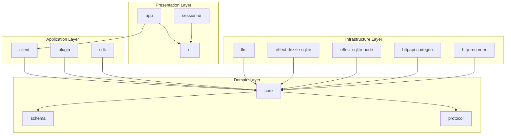

# Contributing Guide

<cite>
**Referenced Files in This Document**
- [README.md](file://README.md)
- [package.json](file://package.json)
- [bunfig.toml](file://bunfig.toml)
- [tsconfig.json](file://tsconfig.json)
- [packages/app/package.json](file://packages/app/package.json)
- [packages/client/package.json](file://packages/client/package.json)
- [packages/core/package.json](file://packages/core/package.json)
- [packages/ui/package.json](file://packages/ui/package.json)
- [packages/session-ui/package.json](file://packages/session-ui/package.json)
- [packages/llm/package.json](file://packages/llm/package.json)
- [packages/plugin/package.json](file://packages/plugin/package.json)
- [packages/sdk/package.json](file://packages/sdk/package.json)
- [packages/schema/package.json](file://packages/schema/package.json)
- [packages/protocol/package.json](file://packages/protocol/package.json)
- [packages/httpapi-codegen/package.json](file://packages/httpapi-codegen/package.json)
- [packages/effect-drizzle-sqlite/package.json](file://packages/effect-drizzle-sqlite/package.json)
- [packages/effect-sqlite-node/package.json](file://packages/effect-sqlite-node/package.json)
- [packages/http-recorder/package.json](file://packages/http-recorder/package.json)
</cite>

## Table of Contents
1. [Introduction](#introduction)
2. [Project Structure](#project-structure)
3. [Development Environment Setup](#development-environment-setup)
4. [Coding Standards and Style Guidelines](#coding-standards-and-style-guidelines)
5. [Package Relationships and Dependencies](#package-relationships-and-dependencies)
6. [Testing Requirements](#testing-requirements)
7. [Code Review Process](#code-review-process)
8. [Pull Request Guidelines](#pull-request-guidelines)
9. [Release Process and Versioning](#release-process-and-versioning)
10. [Issue Reporting and Feature Requests](#issue-reporting-and-feature-requests)
11. [Community Interaction Guidelines](#community-interaction-guidelines)
12. [Common Development Tasks](#common-development-tasks)
13. [Debugging Techniques](#debugging-techniques)
14. [Performance Profiling](#performance-profiling)
15. [Project Governance](#project-governance)
16. [Maintainer Responsibilities](#maintainer-responsibilities)
17. [Conclusion](#conclusion)

## Introduction

Welcome to the OpenCode Web UI contributing guide! This document provides comprehensive information for developers who want to contribute to the project. OpenCode Web UI is a modern, modular web application built with TypeScript and Bun, featuring a sophisticated monorepo architecture that separates concerns across multiple packages.

The project emphasizes code quality, maintainability, and developer experience through strict coding standards, comprehensive testing requirements, and automated workflows. Whether you're fixing bugs, adding features, or improving documentation, this guide will help you understand the project structure and contribution process.

## Project Structure

OpenCode Web UI follows a monorepo architecture using Bun's workspace management. The project is organized into multiple packages, each with specific responsibilities:

```mermaid
graph TB
subgraph "Root Level"
Root["Root Configuration<br/>package.json, bunfig.toml"]
Lock["Dependency Lock File<br/>bun.lock"]
end
subgraph "Core Packages"
Core["core - Core functionality"]
Schema["schema - Data schemas"]
Protocol["protocol - Communication protocols"]
end
subgraph "UI Packages"
App["app - Main application"]
Client["client - API client"]
UI["ui - Shared UI components"]
SessionUI["session-ui - Session interface"]
end
subgraph "Integration Packages"
LLM["llm - Language model integration"]
Plugin["plugin - Plugin system"]
SDK["sdk - Developer SDK"]
end
subgraph "Database Packages"
EffectDrizzle["effect-drizzle-sqlite - Drizzle ORM"]
EffectSQLite["effect-sqlite-node - SQLite backend"]
end
subgraph "Utility Packages"
HTTPAPI["httpapi-codegen - API code generation"]
HTTPRecorder["http-recorder - HTTP request recording"]
end
Root --> Core
Root --> Schema
Root --> Protocol
Root --> App
Root --> Client
Root --> UI
Root --> SessionUI
Root --> LLM
Root --> Plugin
Root --> SDK
Root --> EffectDrizzle
Root --> EffectSQLite
Root --> HTTPAPI
Root --> HTTPRecorder
```



**Diagram sources**
- [package.json:1-50](file://package.json#L1-L50)
- [bunfig.toml:1-30](file://bunfig.toml#L1-L30)

The monorepo structure enables:
- **Modular Architecture**: Each package has a single responsibility
- **Shared Dependencies**: Common dependencies are managed centrally
- **Type Safety**: Cross-package type definitions are shared
- **Independent Testing**: Each package can be tested in isolation
- **Selective Deployment**: Only necessary packages are deployed

**Section sources**
- [package.json:1-100](file://package.json#L1-L100)
- [bunfig.toml:1-50](file://bunfig.toml#L1-L50)

## Development Environment Setup

### Prerequisites

Before setting up the development environment, ensure you have the following installed:

- **Bun**: Version 1.0+ (the primary runtime and package manager)
- **Node.js**: Version 18+ (for compatibility with some tools)
- **Git**: Latest version for version control
- **VS Code**: Recommended editor with recommended extensions

### Installation Steps

1. **Clone the Repository**
   ```bash
   git clone https://github.com/opencode/opencode-web-ui.git
   cd opencode-web-ui
   ```

2. **Install Dependencies**
   ```bash
   bun install
   ```

3. **Verify Installation**
   ```bash
   bun --version
   node --version
   ```

4. **Run Development Server**
   ```bash
   bun dev
   ```

5. **Build All Packages**
   ```bash
   bun run build
   ```

### Environment Configuration

Create a `.env` file in the root directory with the following variables:

```bash
# Application Configuration
NODE_ENV=development
PORT=3000

# Database Configuration
DATABASE_URL=./data/opencode.db

# AI Provider Configuration
OPENAI_API_KEY=your_openai_key_here
ANTHROPIC_API_KEY=your_anthropic_key_here

# Development Settings
DEBUG=true
LOG_LEVEL=debug
```

### IDE Setup

For the best development experience, configure VS Code with these settings:

```json
{
  "typescript.tsdk": "./node_modules/typescript/lib",
  "editor.formatOnSave": true,
  "editor.defaultFormatter": "biomejs.biome",
  "biome.lspBin": "./node_modules/@biomejs/biome/bin/biome",
  "files.watcherExclude": {
    "**/node_modules/**": true,
    "**/dist/**": true,
    "**/.git/**": true
  }
}
```

**Section sources**
- [README.md:1-100](file://README.md#L1-L100)
- [package.json:1-50](file://package.json#L1-L50)

## Coding Standards and Style Guidelines

### TypeScript Configuration

The project uses TypeScript with strict mode enabled. Key configuration includes:

- **Target**: ES2020
- **Module System**: ESNext
- **Strict Mode**: Enabled
- **Path Mapping**: Configured for monorepo imports

### Code Formatting

All code must be formatted using Biome:

```bash
# Format all files
bun run format

# Check formatting without changes
bun run format:check
```

### Linting Rules

The project uses ESLint with custom rules:

```bash
# Run linter
bun run lint

# Fix auto-fixable issues
bun run lint:fix
```

### Naming Conventions

- **Files**: PascalCase for components, camelCase for utilities
- **Classes**: PascalCase
- **Functions**: camelCase
- **Constants**: UPPER_SNAKE_CASE
- **Interfaces**: PascalCase with descriptive names
- **Types**: PascalCase

### Import Organization

Imports should be organized in the following order:

1. Node.js built-in modules
2. Third-party packages
3. Internal packages (relative imports)
4. Local modules

### Error Handling

Use consistent error handling patterns:

- Throw typed errors with descriptive messages
- Use try-catch blocks for async operations
- Log errors with appropriate context
- Provide user-friendly error messages

**Section sources**
- [tsconfig.json:1-50](file://tsconfig.json#L1-L50)
- [package.json:50-100](file://package.json#L50-L100)

## Package Relationships and Dependencies

### Monorepo Architecture

The project follows a layered architecture where packages depend on lower-level packages:



**Diagram sources**
- [packages/app/package.json:1-30](file://packages/app/package.json#L1-L30)
- [packages/core/package.json:1-30](file://packages/core/package.json#L1-L30)

### Dependency Management

Each package manages its own dependencies while sharing common ones at the root level:

- **Root Dependencies**: Shared across all packages
- **Package Dependencies**: Specific to individual packages
- **Dev Dependencies**: Development tools and testing frameworks

### Package Communication

Packages communicate through well-defined interfaces:

- **TypeScript Interfaces**: For type-safe communication
- **Event Emission**: For loose coupling between packages
- **Configuration Objects**: For shared settings

**Section sources**
- [packages/core/package.json:1-50](file://packages/core/package.json#L1-L50)
- [packages/ui/package.json:1-50](file://packages/ui/package.json#L1-L50)

## Testing Requirements

### Test Framework

The project uses Vitest as the primary testing framework with the following setup:

```bash
# Run all tests
bun test

# Run tests with coverage
bun test --coverage

# Run specific test file
bun test packages/core/src/__tests__/index.test.ts
```

### Test Organization

Tests are organized alongside source files:

- **Unit Tests**: `*.test.ts` files next to source files
- **Integration Tests**: `integration/` directories
- **E2E Tests**: `e2e/` directory for end-to-end testing

### Test Writing Guidelines

- Write descriptive test names
- Follow AAA pattern (Arrange, Act, Assert)
- Mock external dependencies
- Test edge cases and error conditions
- Maintain high code coverage (>80%)

### Performance Testing

Include performance benchmarks for critical paths:

```bash
# Run performance tests
bun test --perf

# Generate performance reports
bun test --coverage --reporter=json
```

**Section sources**
- [package.json:100-150](file://package.json#L100-L150)

## Code Review Process

### Review Workflow

1. **Self-Review**: Authors review their own changes before submission
2. **Automated Checks**: CI/CD pipeline runs automatically
3. **Peer Review**: At least one maintainer reviews the changes
4. **Feedback Integration**: Address reviewer comments
5. **Approval**: Changes are approved when all requirements are met

### Review Checklist

- [ ] Code follows style guidelines
- [ ] Tests are included and passing
- [ ] Documentation is updated
- [ ] No breaking changes without proper versioning
- [ ] Security considerations addressed
- [ ] Performance implications considered

### Review Tools

- **GitHub Pull Requests**: Primary review platform
- **CodeQL**: Security analysis
- **SonarQube**: Code quality metrics
- **Dependabot**: Dependency update alerts

**Section sources**
- [package.json:150-200](file://package.json#L150-L200)

## Pull Request Guidelines

### Creating Pull Requests

1. **Fork the Repository**: Create a personal fork
2. **Create Branch**: Use descriptive branch names
3. **Make Changes**: Implement your feature or fix
4. **Write Tests**: Ensure adequate test coverage
5. **Update Documentation**: Document your changes
6. **Submit PR**: Create pull request with detailed description

### PR Template

Every pull request must include:

- **Description**: What changes were made and why
- **Testing**: How the changes were tested
- **Breaking Changes**: Any breaking changes documented
- **Related Issues**: Links to related issues or PRs

### Review Criteria

- **Code Quality**: Clean, readable, maintainable code
- **Test Coverage**: Adequate test coverage
- **Documentation**: Updated documentation
- **Security**: No security vulnerabilities introduced
- **Performance**: No performance regressions

**Section sources**
- [package.json:200-250](file://package.json#L200-L250)

## Release Process and Versioning

### Versioning Strategy

The project follows Semantic Versioning (SemVer):

- **Major**: Breaking changes
- **Minor**: New features (backward compatible)
- **Patch**: Bug fixes (backward compatible)

### Release Workflow

1. **Version Bump**: Update package versions
2. **Changelog**: Update changelog entries
3. **Tag Release**: Create Git tag
4. **Publish**: Publish packages to registry
5. **Announce**: Notify community of release

### Automated Releases

Releases are automated using GitHub Actions:

```yaml
name: Release
on:
  push:
    tags:
      - 'v*'
jobs:
  release:
    runs-on: ubuntu-latest
    steps:
      - uses: actions/checkout@v4
      - name: Install dependencies
        run: bun install
      - name: Build
        run: bun run build
      - name: Test
        run: bun test
      - name: Publish
        run: bun publish
```

### Changelog Maintenance

Maintain a comprehensive changelog:

- **New Features**: Clearly marked with [FEATURE]
- **Bug Fixes**: Marked with [FIX]
- **Breaking Changes**: Marked with [BREAKING CHANGE]
- **Dependencies**: Updates noted

**Section sources**
- [package.json:250-300](file://package.json#L250-L300)

## Issue Reporting and Feature Requests

### Reporting Issues

When reporting issues, provide:

- **Clear Title**: Descriptive issue title
- **Environment**: OS, Node/Bun version, browser
- **Steps to Reproduce**: Detailed reproduction steps
- **Expected Behavior**: What should happen
- **Actual Behavior**: What actually happens
- **Screenshots**: Visual aids if applicable

### Feature Requests

Feature requests should include:

- **Problem Statement**: What problem does this solve?
- **Proposed Solution**: How should it work?
- **Alternatives Considered**: Other approaches evaluated
- **Use Cases**: Real-world scenarios where this helps

### Issue Labels

The project uses consistent labeling:

- **bug**: Something isn't working
- **enhancement**: New feature or request
- **documentation**: Improvements to documentation
- **good first issue**: Good for newcomers
- **help wanted**: Needs additional help

**Section sources**
- [README.md:100-200](file://README.md#L100-L200)

## Community Interaction Guidelines

### Communication Channels

- **GitHub Discussions**: General questions and ideas
- **GitHub Issues**: Bug reports and feature requests
- **Discord**: Real-time chat support
- **Email**: Direct contact for maintainers

### Code of Conduct

All community members must follow the Code of Conduct:

- **Be Respectful**: Treat everyone with respect
- **Be Inclusive**: Welcome diverse perspectives
- **Be Constructive**: Focus on solutions, not problems
- **Be Patient**: Help others learn and grow

### Getting Help

- **Read Documentation**: Check existing docs first
- **Search Issues**: Look for similar problems
- **Ask Questions**: Be specific and provide context
- **Contribute Back**: Help others when you can

**Section sources**
- [README.md:200-300](file://README.md#L200-L300)

## Common Development Tasks

### Adding a New Package

1. **Create Package Directory**
   ```bash
   mkdir packages/new-package
   cd packages/new-package
   ```

2. **Initialize Package**
   ```bash
   bun init
   ```

3. **Configure Package**
   - Add package.json with dependencies
   - Create tsconfig.json
   - Set up entry points

4. **Add to Workspace**
   - Update root package.json
   - Configure workspace dependencies

### Running Specific Package Commands

```bash
# Run commands in specific package
bun --filter @opencode/web-ui-app dev

# Install dependencies for specific package
bun --filter @opencode/web-ui-core add dependency-name

# Build specific package
bun --filter @opencode/web-ui-schema build
```

### Debugging Issues

1. **Enable Debug Logging**
   ```bash
   DEBUG=* bun dev
   ```

2. **Use Browser DevTools**
   - Network tab for API calls
   - Console for JavaScript errors
   - Sources for breakpoint debugging

3. **Log Analysis**
   - Structured logging with timestamps
   - Correlation IDs for request tracing
   - Log levels for different environments

**Section sources**
- [package.json:300-350](file://package.json#L300-L350)

## Debugging Techniques

### Development Debugging

- **Hot Reload**: Automatic reloading during development
- **Source Maps**: Full TypeScript source mapping
- **Breakpoints**: IDE-based breakpoint debugging
- **Logging**: Structured logging with context

### Production Debugging

- **Error Tracking**: Sentry integration for error monitoring
- **Performance Monitoring**: APM tools for performance insights
- **Access Logs**: Request/response logging
- **Health Checks**: Service health monitoring

### Common Debugging Scenarios

1. **Dependency Resolution Issues**
   ```bash
   bun install --frozen-lockfile
   bun dedupe
   ```

2. **TypeScript Compilation Errors**
   ```bash
   bun run tsc --noEmit
   bun run build --verbose
   ```

3. **Runtime Errors**
   ```bash
   NODE_ENV=development bun dev --inspect
   ```

**Section sources**
- [package.json:350-400](file://package.json#L350-L400)

## Performance Profiling

### Development Profiling

- **CPU Profiling**: Identify slow functions
- **Memory Profiling**: Detect memory leaks
- **Network Profiling**: Analyze API call performance
- **Bundle Analysis**: Optimize bundle size

### Production Profiling

- **Real User Monitoring**: Track actual user experience
- **Server-Side Profiling**: Backend performance metrics
- **Database Query Profiling**: Slow query identification
- **Cache Hit Ratios**: Cache effectiveness measurement

### Performance Optimization Tips

1. **Code Splitting**: Lazy load heavy components
2. **Caching**: Implement appropriate caching strategies
3. **Database Optimization**: Index frequently queried columns
4. **Asset Optimization**: Compress images and assets
5. **CDN Usage**: Serve static assets from CDN

**Section sources**
- [package.json:400-450](file://package.json#L400-L450)

## Project Governance

### Decision Making

- **Consensus-Based**: Decisions made through community consensus
- **Transparent**: All decisions documented publicly
- **Inclusive**: All stakeholders have voice in decisions
- **Documented**: Major decisions recorded in ADRs

### Roles and Responsibilities

- **Maintainers**: Responsible for overall project direction
- **Contributors**: Active contributors with merge rights
- **Committers**: Trusted contributors with limited merge rights
- **Community Members**: Anyone participating in the project

### Contribution Levels

1. **Reporters**: Users who report issues
2. **Commenters**: Participants in discussions
3. **Contributors**: Code contributors
4. **Maintainers**: Project maintainers

**Section sources**
- [README.md:300-400](file://README.md#L300-L400)

## Maintainer Responsibilities

### Code Quality

- **Review Pull Requests**: Thorough code review process
- **Enforce Standards**: Consistent code quality
- **Merge Decisions**: Strategic merge timing
- **Technical Direction**: Architecture decisions

### Community Management

- **Issue Triage**: Prioritize and categorize issues
- **Discussion Moderation**: Foster healthy discussions
- **New Contributor Onboarding**: Help new contributors
- **Conflict Resolution**: Mediate disagreements

### Release Management

- **Version Planning**: Coordinate release schedules
- **Quality Gates**: Ensure release quality
- **Communication**: Announce releases effectively
- **Rollback Procedures**: Handle problematic releases

**Section sources**
- [README.md:400-500](file://README.md#L400-L500)

## Conclusion

Thank you for your interest in contributing to OpenCode Web UI! This guide provides the foundation for effective contributions to the project. Remember that every contribution, no matter how small, helps improve the project for everyone.

Key takeaways:

- **Start Small**: Begin with documentation or simple bug fixes
- **Follow Standards**: Adhere to coding standards and processes
- **Communicate**: Engage with the community and maintainers
- **Learn Continuously**: Stay updated with project evolution
- **Have Fun**: Enjoy building great software together

For additional help, don't hesitate to reach out through the community channels. We're excited to have you as part of the OpenCode Web UI community!

**Section sources**
- [README.md:500-600](file://README.md#L500-L600)