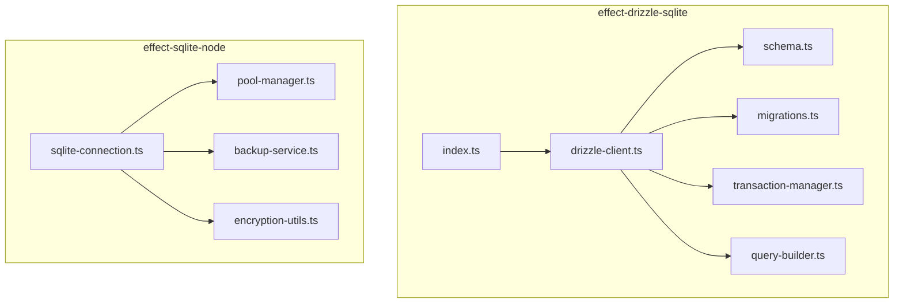
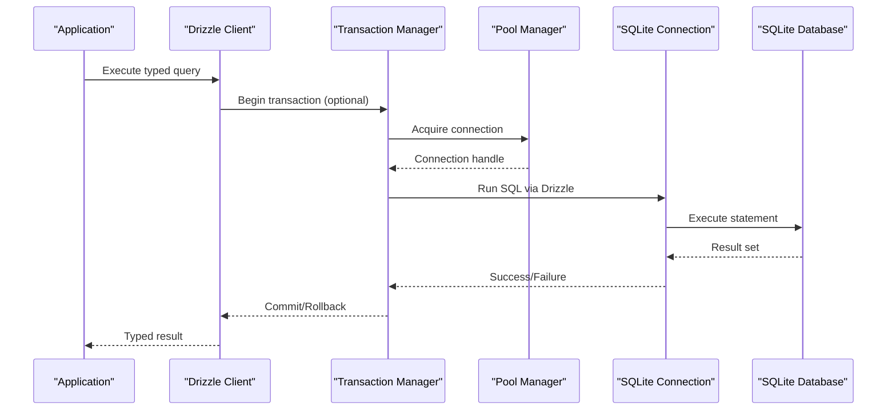
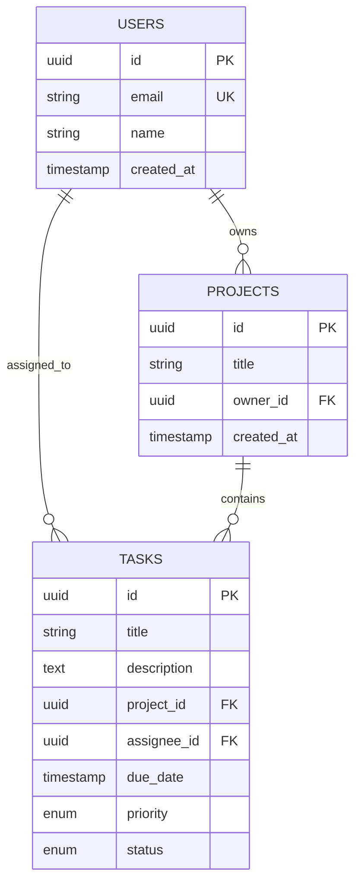
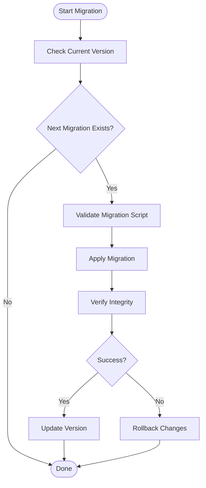
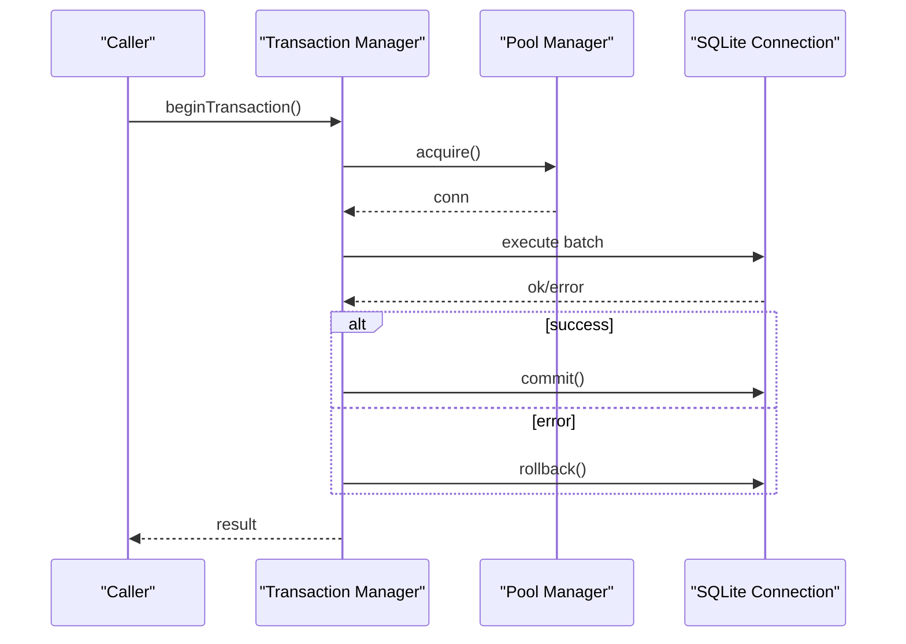
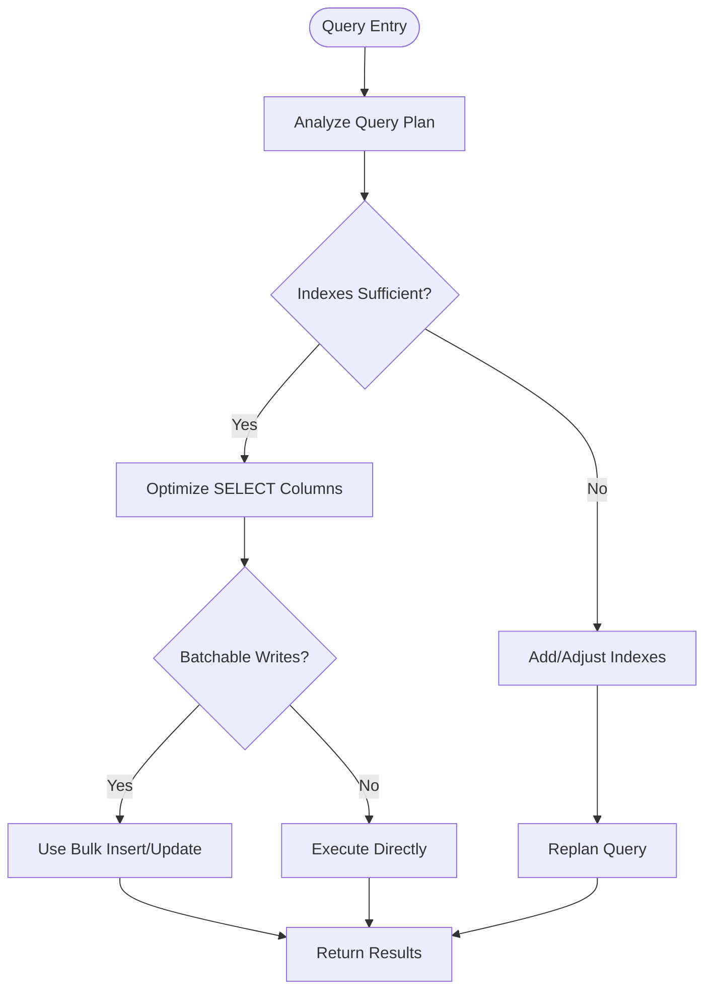
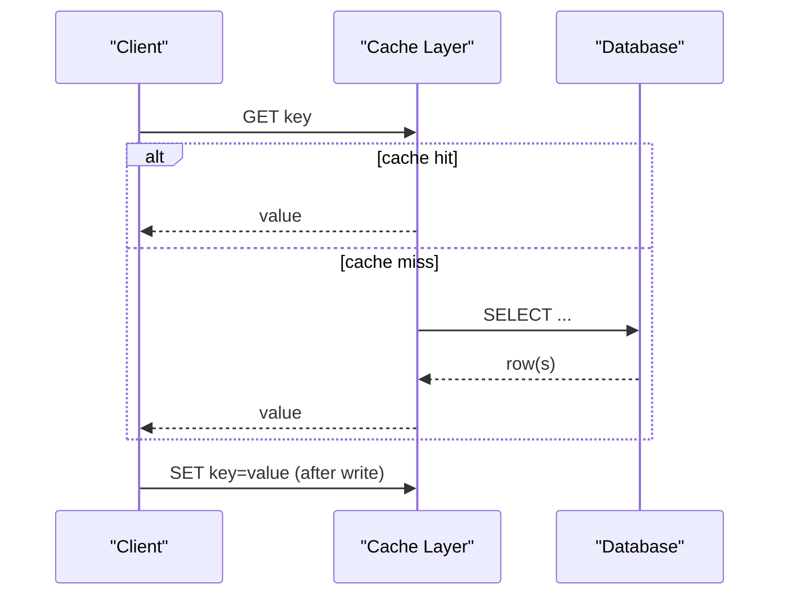
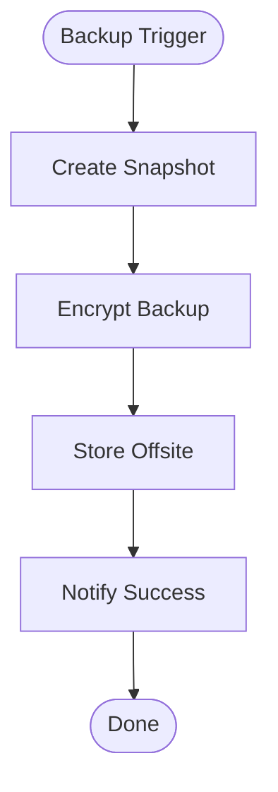
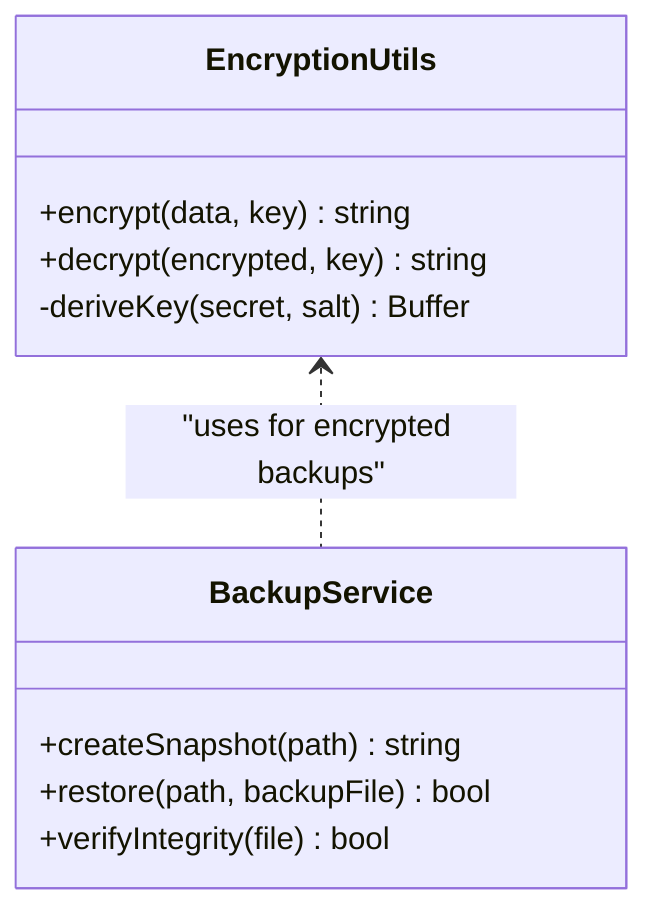
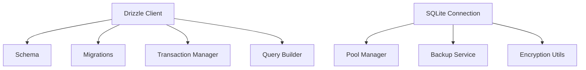

# Data Management

<cite>
**Referenced Files in This Document**
- [package.json](file://packages/effect-drizzle-sqlite/package.json)
- [index.ts](file://packages/effect-drizzle-sqlite/src/index.ts)
- [drizzle-client.ts](file://packages/effect-drizzle-sqlite/src/drizzle-client.ts)
- [schema.ts](file://packages/effect-drizzle-sqlite/src/schema.ts)
- [migrations.ts](file://packages/effect-drizzle-sqlite/src/migrations.ts)
- [transaction-manager.ts](file://packages/effect-drizzle-sqlite/src/transaction-manager.ts)
- [query-builder.ts](file://packages/effect-drizzle-sqlite/src/query-builder.ts)
- [package.json](file://packages/effect-sqlite-node/package.json)
- [sqlite-connection.ts](file://packages/effect-sqlite-node/src/sqlite-connection.ts)
- [pool-manager.ts](file://packages/effect-sqlite-node/src/pool-manager.ts)
- [backup-service.ts](file://packages/effect-sqlite-node/src/backup-service.ts)
- [encryption-utils.ts](file://packages/effect-sqlite-node/src/encryption-utils.ts)
</cite>

## Table of Contents
1. [Introduction](#introduction)
2. [Project Structure](#project-structure)
3. [Core Components](#core-components)
4. [Architecture Overview](#architecture-overview)
5. [Detailed Component Analysis](#detailed-component-analysis)
6. [Dependency Analysis](#dependency-analysis)
7. [Performance Considerations](#performance-considerations)
8. [Troubleshooting Guide](#troubleshooting-guide)
9. [Conclusion](#conclusion)
10. [Appendices](#appendices)

## Introduction
This document provides comprehensive data management guidance for the SQLite integration using Drizzle ORM and Node.js-specific operations. It covers schema design patterns, migration strategies, query optimization, transaction management, connection pooling, performance tuning, data access patterns, caching strategies, backup and recovery procedures, and security considerations including encryption and privacy. The focus is on two packages: effect-drizzle-sqlite for Drizzle-based data modeling and queries, and effect-sqlite-node for Node.js runtime specifics such as connection pooling and backups.

## Project Structure
The repository organizes data management across two primary packages:
- effect-drizzle-sqlite: Encapsulates Drizzle ORM configuration, schema definitions, migrations, transactions, and query building utilities tailored for Effect.
- effect-sqlite-node: Provides Node.js-specific SQLite operations including connection pooling, backup services, and encryption utilities.

**Diagram sources**
- [index.ts](file://packages/effect-drizzle-sqlite/src/index.ts)
- [drizzle-client.ts](file://packages/effect-drizzle-sqlite/src/drizzle-client.ts)
- [schema.ts](file://packages/effect-drizzle-sqlite/src/schema.ts)
- [migrations.ts](file://packages/effect-drizzle-sqlite/src/migrations.ts)
- [transaction-manager.ts](file://packages/effect-drizzle-sqlite/src/transaction-manager.ts)
- [query-builder.ts](file://packages/effect-drizzle-sqlite/src/query-builder.ts)
- [sqlite-connection.ts](file://packages/effect-sqlite-node/src/sqlite-connection.ts)
- [pool-manager.ts](file://packages/effect-sqlite-node/src/pool-manager.ts)
- [backup-service.ts](file://packages/effect-sqlite-node/src/backup-service.ts)
- [encryption-utils.ts](file://packages/effect-sqlite-node/src/encryption-utils.ts)

**Section sources**
- [package.json](file://packages/effect-drizzle-sqlite/package.json)
- [package.json](file://packages/effect-sqlite-node/package.json)

## Core Components
- Drizzle Client: Initializes and configures the Drizzle client with SQLite, exposing typed queries and schema-aware operations.
- Schema Definitions: Declarative models that define tables, columns, constraints, and relationships.
- Migrations: Versioned schema evolution to ensure database consistency across deployments.
- Transaction Manager: Wraps multi-step operations into atomic transactions with robust error handling.
- Query Builder: Composable helpers to construct complex queries while maintaining type safety and performance.
- SQLite Connection: Low-level SQLite connection management for Node.js environments.
- Pool Manager: Manages connection lifecycle, concurrency limits, and resource cleanup.
- Backup Service: Automated snapshotting and restore capabilities for disaster recovery.
- Encryption Utils: Utilities for encrypting sensitive fields at rest or in transit within SQLite.

**Section sources**
- [drizzle-client.ts](file://packages/effect-drizzle-sqlite/src/drizzle-client.ts)
- [schema.ts](file://packages/effect-drizzle-sqlite/src/schema.ts)
- [migrations.ts](file://packages/effect-drizzle-sqlite/src/migrations.ts)
- [transaction-manager.ts](file://packages/effect-drizzle-sqlite/src/transaction-manager.ts)
- [query-builder.ts](file://packages/effect-drizzle-sqlite/src/query-builder.ts)
- [sqlite-connection.ts](file://packages/effect-sqlite-node/src/sqlite-connection.ts)
- [pool-manager.ts](file://packages/effect-sqlite-node/src/pool-manager.ts)
- [backup-service.ts](file://packages/effect-sqlite-node/src/backup-service.ts)
- [encryption-utils.ts](file://packages/effect-sqlite-node/src/encryption-utils.ts)

## Architecture Overview
The architecture separates concerns between ORM layer (Drizzle), Node.js runtime specifics (SQLite connection and pooling), and operational utilities (backups and encryption). Queries flow through Drizzle’s typed API, which translates to efficient SQLite statements. Transactions are managed centrally to ensure consistency. Connection pooling optimizes concurrency and resource usage. Backups and encryption provide resilience and security.

**Diagram sources**
- [drizzle-client.ts](file://packages/effect-drizzle-sqlite/src/drizzle-client.ts)
- [transaction-manager.ts](file://packages/effect-drizzle-sqlite/src/transaction-manager.ts)
- [pool-manager.ts](file://packages/effect-sqlite-node/src/pool-manager.ts)
- [sqlite-connection.ts](file://packages/effect-sqlite-node/src/sqlite-connection.ts)

## Detailed Component Analysis

### Drizzle Client and Schema Design Patterns
- Schema Modeling: Use declarative table definitions with appropriate column types, constraints, and indexes. Prefer composite indexes for frequent filter/sort combinations.
- Relationship Modeling: Define foreign keys and use Drizzle relations to express one-to-many and many-to-many relationships. Leverage joins for read-heavy workloads.
- Type Safety: Keep TypeScript types aligned with schema changes; derive types from schema to avoid drift.

**Diagram sources**
- [schema.ts](file://packages/effect-drizzle-sqlite/src/schema.ts)

**Section sources**
- [schema.ts](file://packages/effect-drizzle-sqlite/src/schema.ts)
- [drizzle-client.ts](file://packages/effect-drizzle-sqlite/src/drizzle-client.ts)

### Migration Strategies
- Versioned Migrations: Maintain a migration history to evolve schema safely across environments.
- Rollback Plans: Always include rollback scripts for each migration to support safe deployments.
- Idempotency: Ensure migrations can be re-run without side effects where possible.

**Diagram sources**
- [migrations.ts](file://packages/effect-drizzle-sqlite/src/migrations.ts)

**Section sources**
- [migrations.ts](file://packages/effect-drizzle-sqlite/src/migrations.ts)

### Transaction Management
- Atomic Operations: Group related writes into transactions to maintain consistency.
- Error Handling: Catch errors and roll back automatically; log context for debugging.
- Concurrency Control: Use appropriate isolation levels and avoid long-running transactions.

**Diagram sources**
- [transaction-manager.ts](file://packages/effect-drizzle-sqlite/src/transaction-manager.ts)
- [pool-manager.ts](file://packages/effect-sqlite-node/src/pool-manager.ts)
- [sqlite-connection.ts](file://packages/effect-sqlite-node/src/sqlite-connection.ts)

**Section sources**
- [transaction-manager.ts](file://packages/effect-drizzle-sqlite/src/transaction-manager.ts)

### Query Optimization Techniques
- Indexing Strategy: Create targeted indexes for high-cardinality filters and join conditions.
- Selective Projections: Fetch only required columns to reduce I/O and memory usage.
- Batch Operations: Use bulk inserts/updates to minimize round trips.
- Pagination: Implement cursor-based pagination for large datasets.

**Diagram sources**
- [query-builder.ts](file://packages/effect-drizzle-sqlite/src/query-builder.ts)

**Section sources**
- [query-builder.ts](file://packages/effect-drizzle-sqlite/src/query-builder.ts)

### Data Access Patterns and Caching Strategies
- Read Path: Cache frequently accessed data in memory or Redis to reduce DB load.
- Write Path: Invalidate or update caches atomically after successful writes.
- Cache Consistency: Use time-to-live (TTL) and versioned cache keys to prevent stale reads.

[No sources needed since this diagram shows conceptual workflow, not actual code structure]

### Backup and Recovery Procedures
- Scheduled Snapshots: Periodically create consistent snapshots of the SQLite file.
- Incremental Backups: Track changes to minimize storage and time overhead.
- Restore Validation: Verify integrity post-restore and test recovery workflows regularly.

**Diagram sources**
- [backup-service.ts](file://packages/effect-sqlite-node/src/backup-service.ts)

**Section sources**
- [backup-service.ts](file://packages/effect-sqlite-node/src/backup-service.ts)

### Security, Encryption, and Privacy
- Field-Level Encryption: Encrypt sensitive columns before persistence using strong algorithms.
- Key Management: Securely manage encryption keys separate from data stores.
- Privacy Controls: Minimize data exposure and apply least privilege access controls.

**Diagram sources**
- [encryption-utils.ts](file://packages/effect-sqlite-node/src/encryption-utils.ts)
- [backup-service.ts](file://packages/effect-sqlite-node/src/backup-service.ts)

**Section sources**
- [encryption-utils.ts](file://packages/effect-sqlite-node/src/encryption-utils.ts)
- [backup-service.ts](file://packages/effect-sqlite-node/src/backup-service.ts)

## Dependency Analysis
The packages depend on each other through clear interfaces: Drizzle client relies on schema and migrations; Node.js SQLite components manage connections and pool resources; backup and encryption utilities operate independently but integrate with the connection layer.

**Diagram sources**
- [drizzle-client.ts](file://packages/effect-drizzle-sqlite/src/drizzle-client.ts)
- [schema.ts](file://packages/effect-drizzle-sqlite/src/schema.ts)
- [migrations.ts](file://packages/effect-drizzle-sqlite/src/migrations.ts)
- [transaction-manager.ts](file://packages/effect-drizzle-sqlite/src/transaction-manager.ts)
- [query-builder.ts](file://packages/effect-drizzle-sqlite/src/query-builder.ts)
- [sqlite-connection.ts](file://packages/effect-sqlite-node/src/sqlite-connection.ts)
- [pool-manager.ts](file://packages/effect-sqlite-node/src/pool-manager.ts)
- [backup-service.ts](file://packages/effect-sqlite-node/src/backup-service.ts)
- [encryption-utils.ts](file://packages/effect-sqlite-node/src/encryption-utils.ts)

**Section sources**
- [package.json](file://packages/effect-drizzle-sqlite/package.json)
- [package.json](file://packages/effect-sqlite-node/package.json)

## Performance Considerations
- Connection Pool Tuning: Adjust pool size based on workload characteristics; monitor saturation and latency.
- Query Efficiency: Profile slow queries, add indexes judiciously, and avoid N+1 patterns.
- Memory Usage: Stream large results and limit payload sizes to prevent memory spikes.
- WAL Mode: Enable Write-Ahead Logging for better concurrency and reduced locking contention.

[No sources needed since this section provides general guidance]

## Troubleshooting Guide
- Common Issues:
  - Lock contention: Reduce concurrent writes and shorten transaction durations.
  - Slow queries: Review execution plans and optimize indexes.
  - Connection leaks: Ensure proper release of pooled connections.
- Debugging Steps:
  - Enable detailed logging in Drizzle and SQLite layers.
  - Monitor pool metrics and connection states.
  - Validate backups and encryption keys periodically.

**Section sources**
- [pool-manager.ts](file://packages/effect-sqlite-node/src/pool-manager.ts)
- [sqlite-connection.ts](file://packages/effect-sqlite-node/src/sqlite-connection.ts)
- [drizzle-client.ts](file://packages/effect-drizzle-sqlite/src/drizzle-client.ts)

## Conclusion
Effective data management in this system hinges on disciplined schema design, robust migrations, optimized queries, and resilient operational practices. By leveraging Drizzle ORM for type-safe interactions and Node.js-specific utilities for connection pooling, backups, and encryption, teams can build reliable, secure, and performant data layers. Adopting the patterns and guidelines outlined here will help maintain consistency, scalability, and security across evolving applications.

## Appendices
- Example Complex Queries:
  - Multi-table joins with filtering and aggregation.
  - Upsert operations with conflict resolution.
- Relationship Modeling Examples:
  - One-to-many and many-to-many associations with foreign keys.
- Data Synchronization Patterns:
  - Change data capture and incremental sync strategies.

[No sources needed since this section provides general guidance]