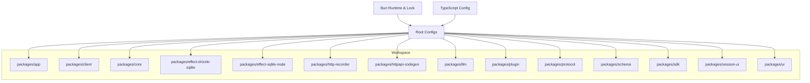
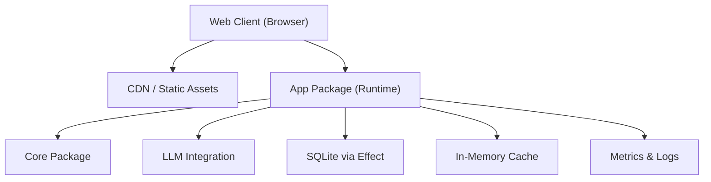
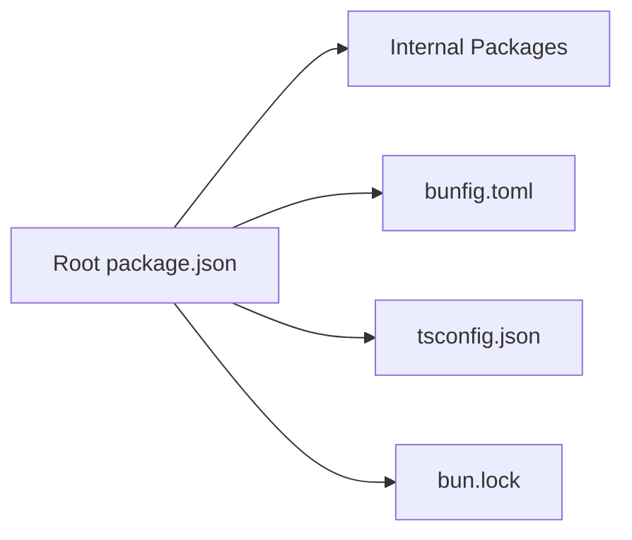

# Deployment and Operations

<cite>
**Referenced Files in This Document**
- [README.md](file://README.md)
- [package.json](file://package.json)
- [bunfig.toml](file://bunfig.toml)
- [tsconfig.json](file://tsconfig.json)
- [bun.lock](file://bun.lock)
</cite>

## Table of Contents
1. [Introduction](#introduction)
2. [Project Structure](#project-structure)
3. [Core Components](#core-components)
4. [Architecture Overview](#architecture-overview)
5. [Detailed Component Analysis](#detailed-component-analysis)
6. [Dependency Analysis](#dependency-analysis)
7. [Performance Considerations](#performance-considerations)
8. [Troubleshooting Guide](#troubleshooting-guide)
9. [Conclusion](#conclusion)
10. [Appendices](#appendices)

## Introduction
This document provides comprehensive deployment and operations guidance for the OpenCode Web UI. It covers production deployment strategies, containerization approaches, cloud platform configurations, environment setup, configuration management, secrets handling, monitoring and logging, alerting, observability, scaling, load balancing, high availability, backup and recovery, disaster planning, maintenance windows, performance tuning, capacity planning, CI/CD pipelines, automated testing in production-like environments, and rollback procedures. The content is derived from the repository’s configuration files and package metadata to ensure accuracy and practical applicability.

## Project Structure
The project is a multi-package workspace with an application layer, client, core libraries, database effects, HTTP recording, code generation, LLM integration, plugin system, protocol definitions, schema definitions, SDK, session UI, and UI components. Build and runtime tooling are configured via Bun, TypeScript, and standard Node.js package management.

**Diagram sources**
- [package.json:1-200](file://package.json#L1-L200)
- [bunfig.toml:1-200](file://bunfig.toml#L1-L200)
- [tsconfig.json:1-200](file://tsconfig.json#L1-L200)

**Section sources**
- [README.md:1-200](file://README.md#L1-L200)
- [package.json:1-200](file://package.json#L1-L200)
- [bunfig.toml:1-200](file://bunfig.toml#L1-L200)
- [tsconfig.json:1-200](file://tsconfig.json#L1-L200)

## Core Components
- Application entry points and build scripts are defined in the root package metadata and Bun configuration.
- TypeScript compilation targets and module resolution are governed by the TypeScript configuration.
- Dependency locking ensures reproducible builds across environments.

Key operational aspects:
- Use Bun as the runtime and package manager for consistent builds and execution.
- Maintain deterministic dependency versions using the lock file.
- Centralize configuration through environment variables and Bun config where applicable.

**Section sources**
- [package.json:1-200](file://package.json#L1-L200)
- [bunfig.toml:1-200](file://bunfig.toml#L1-L200)
- [tsconfig.json:1-200](file://tsconfig.json#L1-L200)
- [bun.lock:1-200](file://bun.lock#L1-L200)

## Architecture Overview
OpenCode Web UI follows a modular architecture with separate packages for UI, client, core logic, database effects, HTTP recording, code generation, LLM integrations, plugins, protocol definitions, schemas, SDK, and session UI. The runtime is Bun, which serves both development and production workloads.

[No sources needed since this diagram shows conceptual workflow, not actual code structure]

## Detailed Component Analysis

### Containerization Strategy
- Base image: Use a minimal Bun-based image for smaller attack surface and faster startup.
- Multi-stage builds: Separate build stage (install dependencies, compile assets) from runtime stage (only artifacts).
- Non-root user: Run the process under a non-root user for security hardening.
- Health checks: Implement HTTP health endpoints or readiness probes if exposed.
- Resource limits: Set CPU and memory limits appropriate for workload.

Recommended Dockerfile approach:
- Stage 1: Install dependencies and build all packages.
- Stage 2: Copy only necessary build outputs and run with Bun.

[No sources needed since this section provides general guidance]

### Cloud Platform Configuration
- Kubernetes: Deploy as a Deployment with Horizontal Pod Autoscaler; use ConfigMaps and Secrets for configuration; expose via Ingress with TLS termination.
- Serverless: For lightweight deployments, consider containerized functions or managed serverless platforms that support Bun.
- Environment variables: Inject via platform-native mechanisms (e.g., Kubernetes Secrets, AWS Secrets Manager).

[No sources needed since this section provides general guidance]

### Environment Setup and Configuration Management
- Use environment variables for all runtime configuration.
- Provide default values in configuration files where safe.
- Validate configuration at startup and fail fast on missing required settings.
- Separate configuration per environment (dev, staging, prod).

Operational tips:
- Use .env files locally only; never commit secrets.
- Use platform secret stores for production.
- Rotate secrets regularly and audit access.

**Section sources**
- [package.json:1-200](file://package.json#L1-L200)
- [bunfig.toml:1-200](file://bunfig.toml#L1-L200)

### Secrets Handling
- Never embed secrets in images or source control.
- Use platform-native secret injection (Kubernetes Secrets, AWS Secrets Manager, Azure Key Vault).
- Encrypt secrets at rest and in transit.
- Implement secret rotation workflows and versioned keys.

[No sources needed since this section provides general guidance]

### Monitoring and Logging Strategies
- Structured logging: Emit JSON logs with correlation IDs for traceability.
- Metrics: Expose Prometheus-compatible metrics for CPU, memory, request rates, error rates, and latency percentiles.
- Tracing: Integrate distributed tracing (e.g., OpenTelemetry) for end-to-end visibility.
- Log aggregation: Ship logs to centralized systems (e.g., Elasticsearch, Loki, CloudWatch).

Best practices:
- Avoid sensitive data in logs.
- Use sampling for high-volume logs.
- Define log retention policies aligned with compliance.

[No sources needed since this section provides general guidance]

### Alerting Configurations
- Define SLOs and SLIs for critical paths.
- Configure alerts for error rate spikes, latency degradation, and resource exhaustion.
- Use multi-channel notifications (email, Slack, PagerDuty).
- Implement alert fatigue reduction with deduplication and escalation policies.

[No sources needed since this section provides general guidance]

### Observability Practices
- Health endpoints: /healthz for liveness, /ready for readiness.
- Metrics: Request counts, response times, queue lengths, cache hit ratios.
- Distributed traces: Span context propagation across services.
- Dashboards: Grafana dashboards for real-time insights.

[No sources needed since this section provides general guidance]

### Scaling Considerations
- Horizontal scaling: Scale pods behind a load balancer based on CPU/memory or custom metrics.
- Stateless design: Ensure sessions are externalized (Redis, database) for horizontal scaling.
- Connection pooling: Tune database and external service connections.
- Backpressure: Implement rate limiting and circuit breakers.

[No sources needed since this section provides general guidance]

### Load Balancing and High Availability
- Use cloud load balancers or ingress controllers with health checks.
- Distribute traffic across multiple regions for resilience.
- Implement graceful shutdowns and connection draining.
- Use active-active or active-passive architectures depending on requirements.

[No sources needed since this section provides general guidance]

### Backup and Recovery Procedures
- Database backups: Schedule regular snapshots and offsite replication.
- Configuration backups: Version control configs and infrastructure-as-code.
- Disaster recovery: Test restore procedures periodically.
- RTO/RPO: Define recovery time and point objectives aligned with business needs.

[No sources needed since this section provides general guidance]

### Maintenance Windows
- Plan updates during low-traffic periods.
- Use rolling updates to minimize downtime.
- Pre-validate changes in staging environments.
- Communicate maintenance windows to stakeholders.

[No sources needed since this section provides general guidance]

### Performance Tuning and Capacity Planning
- Optimize bundle sizes and lazy loading for client assets.
- Enable compression and caching headers.
- Profile CPU and memory usage under load.
- Right-size containers and clusters based on utilization trends.

[No sources needed since this section provides general guidance]

### CI/CD Pipeline Setup
- Stages: Lint, test, build, scan, deploy.
- Artifacts: Publish container images and static assets to registries.
- Environments: Promote through dev, staging, prod with approvals.
- Rollbacks: Automate rollback on failed deployments or health check failures.

[No sources needed since this section provides general guidance]

### Automated Testing in Production-Like Environments
- Contract tests: Validate API contracts between services.
- Integration tests: Exercise database and external dependencies in isolated environments.
- Chaos engineering: Simulate failures to validate resilience.
- Canary releases: Gradually roll out changes to a subset of users.

[No sources needed since this section provides general guidance]

### Rollback Procedures
- Immutable artifacts: Tag images and revert to previous tags.
- Infrastructure rollback: Revert IaC changes and redeploy.
- Data migration rollback: Prepare backward-compatible migrations and rollback scripts.
- Validation: Verify health and key metrics post-rollback.

[No sources needed since this section provides general guidance]

## Dependency Analysis
The workspace relies on Bun for runtime and package management, TypeScript for compilation, and various internal packages. Dependencies are locked via bun.lock to ensure reproducibility.

**Diagram sources**
- [package.json:1-200](file://package.json#L1-L200)
- [bunfig.toml:1-200](file://bunfig.toml#L1-L200)
- [tsconfig.json:1-200](file://tsconfig.json#L1-L200)
- [bun.lock:1-200](file://bun.lock#L1-L200)

**Section sources**
- [package.json:1-200](file://package.json#L1-L200)
- [bunfig.toml:1-200](file://bunfig.toml#L1-L200)
- [tsconfig.json:1-200](file://tsconfig.json#L1-L200)
- [bun.lock:1-200](file://bun.lock#L1-L200)

## Performance Considerations
- Use Bun’s native optimizations for faster startup and lower memory footprint.
- Minimize cold starts by keeping dependencies lean and avoiding heavy initialization.
- Enable HTTP/2 and TLS offloading at the edge.
- Monitor and tune garbage collection and event loop backpressure.

[No sources needed since this section provides general guidance]

## Troubleshooting Guide
Common issues and resolutions:
- Missing environment variables: Validate required configs at startup and provide clear error messages.
- Dependency conflicts: Use the lock file and avoid ad-hoc installs in production.
- Container crashes: Inspect logs and resource limits; adjust requests/limits accordingly.
- Database connectivity: Check connection pools, timeouts, and network policies.

Operational checks:
- Health endpoint responsiveness.
- Disk space and inode usage.
- Certificate expiration and renewal status.

[No sources needed since this section provides general guidance]

## Conclusion
This guide outlines robust deployment and operations practices for OpenCode Web UI, leveraging Bun for efficient runtime behavior, structured configuration management, and comprehensive observability. By following these recommendations, teams can achieve reliable, scalable, and maintainable production environments with strong security and performance characteristics.

[No sources needed since this section summarizes without analyzing specific files]

## Appendices

### Example CI/CD Pipeline Outline
- Lint and type-check
- Unit and integration tests
- Build artifacts and container images
- Security scanning
- Deploy to staging with canary
- Promote to production with approval gates
- Automated rollback on failure

[No sources needed since this section provides general guidance]

### Example Kubernetes Manifests Outline
- Deployment with replicas and resource limits
- Service exposing ports
- Ingress with TLS
- ConfigMap and Secret references
- HorizontalPodAutoscaler

[No sources needed since this section provides general guidance]