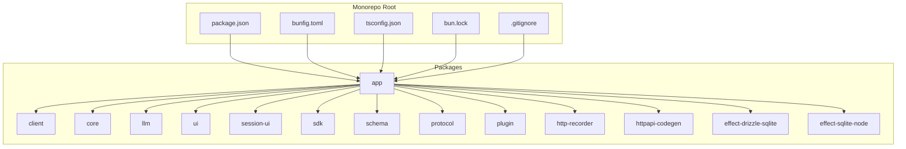
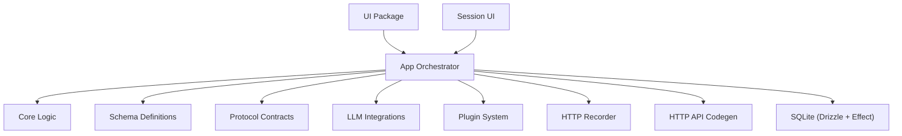
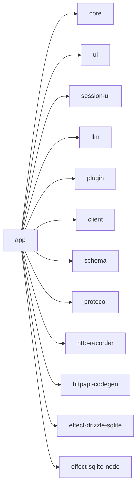

# Getting Started

<cite>
**Referenced Files in This Document**
- [README.md](file://README.md)
- [package.json](file://package.json)
- [bunfig.toml](file://bunfig.toml)
- [tsconfig.json](file://tsconfig.json)
- [bun.lock](file://bun.lock)
- [.gitignore](file://.gitignore)
</cite>

## Table of Contents
1. [Introduction](#introduction)
2. [Project Structure](#project-structure)
3. [Core Components](#core-components)
4. [Architecture Overview](#architecture-overview)
5. [Detailed Component Analysis](#detailed-component-analysis)
6. [Dependency Analysis](#dependency-analysis)
7. [Performance Considerations](#performance-considerations)
8. [Troubleshooting Guide](#troubleshooting-guide)
9. [Conclusion](#conclusion)
10. [Appendices](#appendices)

## Introduction
OpenCode Web UI is an AI-powered development environment and code editor interface designed to streamline coding workflows with intelligent assistance. It provides a modern web-based interface for interacting with language models, managing sessions, and editing code within a unified workspace. The project follows a monorepo architecture that separates concerns across multiple packages, enabling modular development and clear boundaries between UI, core logic, SDKs, and integrations.

This guide helps you set up the development environment, understand the monorepo structure, create your first project, configure basic options, and verify that everything works correctly.

## Project Structure
The repository is organized as a monorepo using Bun. Key top-level files include:
- package.json: Root configuration and scripts
- bunfig.toml: Bun-specific configuration
- tsconfig.json: TypeScript configuration shared across packages
- bun.lock: Lockfile for deterministic installs
- .gitignore: Ignored files and directories

Packages under packages/:
- app: Application entry point and orchestration
- client: Client-side utilities and API clients
- core: Shared core logic and abstractions
- effect-drizzle-sqlite: Drizzle ORM integration with SQLite via Effect
- effect-sqlite-node: SQLite persistence layer for Node environments
- http-recorder: HTTP request/response recording utilities
- httpapi-codegen: Code generation for HTTP APIs
- llm: Language model integrations and prompts
- plugin: Plugin system and extensions
- protocol: Protocol definitions and schemas
- schema: Shared data schemas and validation
- sdk: SDK for programmatic access
- session-ui: Session management UI components
- ui: Reusable UI components and design system

**Diagram sources**
- [package.json:1-50](file://package.json#L1-L50)
- [bunfig.toml:1-50](file://bunfig.toml#L1-L50)
- [tsconfig.json:1-50](file://tsconfig.json#L1-L50)
- [bun.lock:1-50](file://bun.lock#L1-L50)
- [.gitignore:1-50](file://.gitignore#L1-L50)

**Section sources**
- [package.json:1-50](file://package.json#L1-L50)
- [bunfig.toml:1-50](file://bunfig.toml#L1-L50)
- [tsconfig.json:1-50](file://tsconfig.json#L1-L50)
- [bun.lock:1-50](file://bun.lock#L1-L50)
- [.gitignore:1-50](file://.gitignore#L1-L50)

## Core Components
- app: Main application orchestrator that wires together UI, core services, and integrations
- client: HTTP and WebSocket clients for communicating with backend services
- core: Shared business logic, state management, and utilities
- llm: Integrations with language models, prompt templates, and streaming responses
- ui: Reusable UI components, theming, and layout primitives
- session-ui: Session lifecycle UI, chat interfaces, and history views
- sdk: Programmatic SDK for extending functionality or integrating externally
- schema: Data models and validation schemas used across packages
- protocol: Message formats and API contracts
- plugin: Extension points and plugin loader
- http-recorder: Captures HTTP traffic for debugging and replay
- httpapi-codegen: Generates typed clients from OpenAPI specs
- effect-drizzle-sqlite: Database operations using Drizzle ORM with SQLite
- effect-sqlite-node: Node-compatible SQLite driver for persistence

These components are orchestrated by the app package, which initializes services, configures dependencies, and exposes the runtime environment for both development and production.

**Section sources**
- [package.json:1-50](file://package.json#L1-L50)
- [bunfig.toml:1-50](file://bunfig.toml#L1-L50)

## Architecture Overview
OpenCode Web UI follows a layered architecture:
- Presentation Layer: UI and session-ui packages provide the user interface
- Application Layer: app package coordinates workflows and service initialization
- Domain Layer: core, schema, and protocol define business rules and contracts
- Integration Layer: llm, http-recorder, httpapi-codegen, and plugin handle external systems
- Persistence Layer: effect-drizzle-sqlite and effect-sqlite-node manage data storage

**Diagram sources**
- [package.json:1-50](file://package.json#L1-L50)
- [bunfig.toml:1-50](file://bunfig.toml#L1-L50)

## Detailed Component Analysis

### Installation Requirements
Before setting up OpenCode Web UI, ensure your system meets the following requirements:
- Node.js: Version compatible with the project’s toolchain (check package.json engines field)
- Bun: Latest stable version recommended for optimal performance
- System Dependencies: Platform-specific native dependencies may be required for SQLite and other modules

Verify installations:
- node --version
- bun --version

If either command fails, install the respective tools before proceeding.

**Section sources**
- [package.json:1-50](file://package.json#L1-L50)

### Step-by-Step Setup Instructions
1. Clone the repository
   - git clone <repository-url>
   - cd opencode-web-ui

2. Install dependencies
   - bun install
   - This reads bun.lock for deterministic dependency resolution

3. Configure environment variables
   - Create a .env file in the root directory
   - Add required variables such as API keys, database paths, and feature flags
   - Refer to package.json scripts and bunfig.toml for expected variable names

4. Build the project
   - bun run build
   - This compiles TypeScript and bundles assets across packages

5. Start the development server
   - bun run dev
   - The app will be available at the configured local address

6. Verify installation
   - Open the local URL in your browser
   - Check the console for any errors
   - Confirm that the UI loads and connects to services

**Section sources**
- [package.json:1-50](file://package.json#L1-L50)
- [bunfig.toml:1-50](file://bunfig.toml#L1-L50)

### Initial Project Creation Workflow
After setup, create your first project:
1. Launch the development server
2. Navigate to the project creation interface in the UI
3. Select a template or start from scratch
4. Configure project settings such as name, description, and dependencies
5. Initialize the project structure
6. Open the editor and begin coding

The app package orchestrates this workflow by initializing the session manager, loading plugins, and preparing the workspace.

**Section sources**
- [package.json:1-50](file://package.json#L1-L50)

### Basic Configuration Options
Common configuration options include:
- API Keys: For LLM providers and external services
- Database Path: Location of SQLite database file
- Feature Flags: Enable/disable experimental features
- Port and Host: Development server binding settings
- Logging Level: Control verbosity of logs

These options are typically defined in .env and referenced by bunfig.toml and package.json scripts.

**Section sources**
- [bunfig.toml:1-50](file://bunfig.toml#L1-L50)
- [package.json:1-50](file://package.json#L1-L50)

### First-Time User Guidance
- Explore the UI: Familiarize yourself with the editor, session panel, and settings
- Create a simple project: Test basic functionality like file creation and editing
- Try AI assistance: Use built-in prompts and completions
- Customize settings: Adjust themes, keyboard shortcuts, and preferences
- Review documentation: Check README.md and inline comments for additional guidance

**Section sources**
- [README.md:1-50](file://README.md#L1-L50)

## Dependency Analysis
The monorepo uses Bun for dependency management and script execution. Key relationships:
- app depends on core, ui, session-ui, llm, and plugin
- client provides HTTP and WebSocket utilities used by app and session-ui
- schema and protocol define shared types and contracts
- effect-drizzle-sqlite and effect-sqlite-node provide database persistence
- http-recorder and httpapi-codegen support development and testing workflows

**Diagram sources**
- [package.json:1-50](file://package.json#L1-L50)

**Section sources**
- [package.json:1-50](file://package.json#L1-L50)

## Performance Considerations
- Use Bun for faster installs and builds compared to traditional npm/yarn
- Leverage TypeScript strict mode for better type safety and fewer runtime errors
- Optimize bundle size by tree-shaking unused modules
- Cache dependencies and build artifacts to speed up iterative development
- Monitor memory usage when working with large projects or extensive AI interactions

[No sources needed since this section provides general guidance]

## Troubleshooting Guide
Common setup issues and solutions:
- Node.js version mismatch: Ensure your Node.js version matches the engines field in package.json
- Bun not found: Install Bun globally or use npx bun if not installed
- Permission errors: Run commands with appropriate permissions or use sudo on Unix-like systems
- SQLite compilation errors: Install system dependencies for native modules (e.g., sqlite3 headers)
- Port conflicts: Change the port in bunfig.toml or environment variables
- Missing environment variables: Populate .env with required values before starting the server

Verification steps:
- Run bun install and check for successful completion
- Execute bun run build and verify no compilation errors
- Start the dev server and confirm the UI loads without console errors
- Test basic functionality like creating a file or sending a message

**Section sources**
- [package.json:1-50](file://package.json#L1-L50)
- [bunfig.toml:1-50](file://bunfig.toml#L1-L50)

## Conclusion
You now have a solid foundation for working with OpenCode Web UI. The monorepo structure enables modular development, while Bun provides fast and reliable tooling. Follow the setup instructions, explore the UI, and customize configurations to suit your needs. For advanced usage, dive into the individual packages and extend functionality through the plugin system.

[No sources needed since this section summarizes without analyzing specific files]

## Appendices

### Monorepo Navigation Tips
- Use bun workspaces to navigate between packages
- Run commands in specific packages using bun --filter <package-name>
- Share common configurations via tsconfig.json and bunfig.toml
- Coordinate versions across packages using the root package.json

**Section sources**
- [package.json:1-50](file://package.json#L1-L50)
- [tsconfig.json:1-50](file://tsconfig.json#L1-L50)
- [bunfig.toml:1-50](file://bunfig.toml#L1-L50)