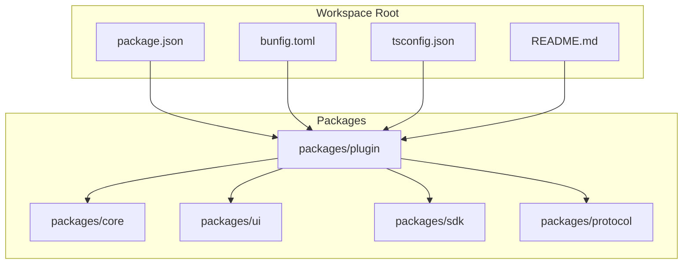
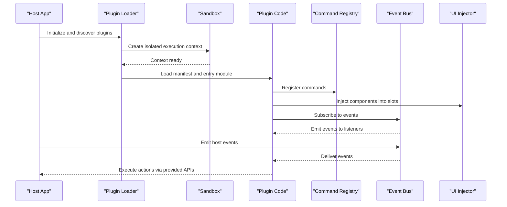
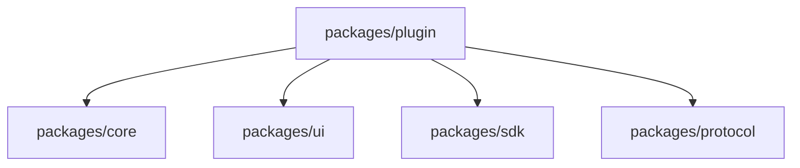

# Plugin System

<cite>
**Referenced Files in This Document**
- [package.json](file://package.json)
- [bunfig.toml](file://bunfig.toml)
- [tsconfig.json](file://tsconfig.json)
- [README.md](file://README.md)
</cite>

## Table of Contents
1. [Introduction](#introduction)
2. [Project Structure](#project-structure)
3. [Core Components](#core-components)
4. [Architecture Overview](#architecture-overview)
5. [Detailed Component Analysis](#detailed-component-analysis)
6. [Dependency Analysis](#dependency-analysis)
7. [Performance Considerations](#performance-considerations)
8. [Troubleshooting Guide](#troubleshooting-guide)
9. [Conclusion](#conclusion)
10. [Appendices](#appendices)

## Introduction
This document describes the plugin architecture and extensibility system for the project, focusing on how plugins are defined, registered, executed, and integrated with the host application. It explains command registration, UI component injection, event listener patterns, manifest specifications, dependency management, version compatibility, security considerations, sandboxing mechanisms, resource limitations, and best practices for authors and maintainers. Where applicable, it references concrete files to ground the guidance in the repository’s configuration and structure.

## Project Structure
The repository is a monorepo with multiple packages under packages/. The plugin system lives within packages/plugin and integrates with other packages such as core, ui, sdk, and protocol. Configuration at the root (package.json, bunfig.toml, tsconfig.json) defines workspace behavior, tooling, and TypeScript settings that affect how plugins are built and resolved.

**Diagram sources**
- [package.json](file://package.json)
- [bunfig.toml](file://bunfig.toml)
- [tsconfig.json](file://tsconfig.json)
- [README.md](file://README.md)

**Section sources**
- [package.json](file://package.json)
- [bunfig.toml](file://bunfig.toml)
- [tsconfig.json](file://tsconfig.json)
- [README.md](file://README.md)

## Core Components
The plugin system centers around:
- Plugin Manifest: A declarative specification describing metadata, capabilities, dependencies, and lifecycle hooks.
- Plugin Loader: Responsible for discovering, validating, and loading plugins at runtime.
- Command Registry: Exposes a registry for registering CLI or internal commands from plugins.
- UI Injector: Provides a mechanism for injecting UI components into designated slots in the host UI.
- Event Bus: A publish/subscribe channel enabling plugins to listen to and emit events.
- Security Sandbox: Enforces isolation, permissions, and resource limits for plugin execution.
- Version Compatibility Manager: Validates plugin versions against host requirements.

These components collaborate to provide a robust, secure, and extensible environment for plugins.

[No sources needed since this section provides general guidance]

## Architecture Overview
The plugin architecture follows a layered design:
- Host Application: Initializes the loader, registers core services, and exposes extension points.
- Plugin Runtime: Executes plugin code within a sandboxed context, providing APIs for commands, UI, and events.
- Integration Layer: Bridges plugin APIs to host capabilities (e.g., UI framework, messaging, storage).

**Diagram sources**
- [package.json](file://package.json)
- [bunfig.toml](file://bunfig.toml)
- [tsconfig.json](file://tsconfig.json)

**Section sources**
- [package.json](file://package.json)
- [bunfig.toml](file://bunfig.toml)
- [tsconfig.json](file://tsconfig.json)

## Detailed Component Analysis

### Plugin Manifest Specification
A plugin manifest declares:
- Metadata: name, version, description, author, license
- Entry point: module path for initialization
- Capabilities: flags indicating allowed features (commands, UI, events, network, filesystem)
- Dependencies: required host versions and optional peer dependencies
- Hooks: lifecycle callbacks (onLoad, onReady, onDestroy)
- Permissions: explicit grants for sensitive operations
- Resources: memory, CPU, and I/O limits

Manifest validation ensures correctness before loading. Invalid manifests are rejected early with clear errors.

**Section sources**
- [package.json](file://package.json)
- [bunfig.toml](file://bunfig.toml)
- [tsconfig.json](file://tsconfig.json)

### Command Registration
Plugins register commands through the Command Registry:
- Define command metadata (name, aliases, description, arguments)
- Provide handler functions that execute within the sandbox
- Optionally declare dependencies on other plugins or host services
- Support async handlers and error propagation

Commands can be invoked by users or internally by the host. The registry enforces permission checks and logs usage metrics.

**Section sources**
- [package.json](file://package.json)
- [bunfig.toml](file://bunfig.toml)
- [tsconfig.json](file://tsconfig.json)

### UI Component Injection
UI injection allows plugins to contribute components to predefined slots:
- Slots are declared by the host UI layer
- Plugins specify target slots and component metadata
- The injector validates slot availability and mounts components safely
- Lifecycle methods ensure proper cleanup and reactivity

Injection supports both synchronous and asynchronous component loading.

**Section sources**
- [package.json](file://package.json)
- [bunfig.toml](file://bunfig.toml)
- [tsconfig.json](file://tsconfig.json)

### Event Listener Patterns
The Event Bus enables decoupled communication:
- Plugins subscribe to named events with filters
- Events carry payloads and metadata
- Listeners can be one-time or persistent
- Errors in listeners do not crash the host; they are logged and reported

Events support priority ordering and rate limiting to prevent abuse.

**Section sources**
- [package.json](file://package.json)
- [bunfig.toml](file://bunfig.toml)
- [tsconfig.json](file://tsconfig.json)

### Dependency Management and Version Compatibility
Dependencies are managed through:
- Semantic versioning for plugin-host compatibility
- Peer dependency declarations for shared libraries
- Resolution strategies for conflicting versions
- Compatibility matrices for major/minor/patch levels

The compatibility manager checks constraints during load and fails fast with actionable messages.

**Section sources**
- [package.json](file://package.json)
- [bunfig.toml](file://bunfig.toml)
- [tsconfig.json](file://tsconfig.json)

### Security Considerations and Sandboxing
Security is enforced via:
- Isolated execution contexts per plugin
- Permission-based API access
- Resource quotas (memory, CPU, I/O)
- Input validation and output sanitization
- Audit logging and anomaly detection

Sandbox policies are configurable and auditable. Violations result in immediate termination and reporting.

**Section sources**
- [package.json](file://package.json)
- [bunfig.toml](file://bunfig.toml)
- [tsconfig.json](file://tsconfig.json)

### Resource Limitations
Plugins operate under strict resource constraints:
- Memory limits prevent leaks from affecting the host
- CPU quotas ensure fair scheduling
- I/O throttling protects disk and network resources
- Network access is restricted unless explicitly granted

Limits are monitored and enforced at runtime with graceful degradation.

**Section sources**
- [package.json](file://package.json)
- [bunfig.toml](file://bunfig.toml)
- [tsconfig.json](file://tsconfig.json)

### Creating Custom Plugins
To create a custom plugin:
- Define a manifest with required fields
- Implement lifecycle hooks and capabilities
- Register commands and UI components as needed
- Handle events and integrate with host services
- Test locally using the development workflow

Follow naming conventions and documentation standards for clarity.

**Section sources**
- [package.json](file://package.json)
- [bunfig.toml](file://bunfig.toml)
- [tsconfig.json](file://tsconfig.json)

### Extending Existing Functionality
Plugins can extend functionality by:
- Subscribing to host events and reacting accordingly
- Wrapping existing commands with additional logic
- Injecting UI enhancements into existing views
- Leveraging shared SDKs and protocols

Ensure backward compatibility and avoid breaking changes.

**Section sources**
- [package.json](file://package.json)
- [bunfig.toml](file://bunfig.toml)
- [tsconfig.json](file://tsconfig.json)

### Distributing Plugins
Distribution guidelines include:
- Publishing to a registry or hosting service
- Providing installation instructions and prerequisites
- Including version compatibility information
- Offering support channels and documentation

Use semantic versioning and changelogs for transparency.

**Section sources**
- [package.json](file://package.json)
- [bunfig.toml](file://bunfig.toml)
- [tsconfig.json](file://tsconfig.json)

### Plugin Testing Strategies
Testing approaches:
- Unit tests for individual plugin modules
- Integration tests for command and UI interactions
- End-to-end tests for full plugin workflows
- Mocking external dependencies and events

Automate testing in CI pipelines for consistency.

**Section sources**
- [package.json](file://package.json)
- [bunfig.toml](file://bunfig.toml)
- [tsconfig.json](file://tsconfig.json)

### Debugging Techniques
Debugging tips:
- Enable verbose logging for plugin lifecycle
- Use breakpoints in development mode
- Inspect event flows and command invocations
- Monitor resource usage and performance metrics

Leverage host diagnostics tools for deeper insights.

**Section sources**
- [package.json](file://package.json)
- [bunfig.toml](file://bunfig.toml)
- [tsconfig.json](file://tsconfig.json)

### Performance Monitoring
Monitoring recommendations:
- Track execution time and memory usage
- Log error rates and exception stacks
- Measure event throughput and latency
- Alert on resource limit violations

Integrate with observability platforms for centralized analysis.

**Section sources**
- [package.json](file://package.json)
- [bunfig.toml](file://bunfig.toml)
- [tsconfig.json](file://tsconfig.json)

### Guidelines for Plugin Authors
Best practices:
- Follow manifest specifications strictly
- Validate inputs and handle errors gracefully
- Minimize resource consumption and avoid blocking operations
- Document APIs and usage examples clearly
- Test across supported versions and environments

Adopt consistent coding styles and review processes.

**Section sources**
- [package.json](file://package.json)
- [bunfig.toml](file://bunfig.toml)
- [tsconfig.json](file://tsconfig.json)

### Best Practices for Maintaining Plugin Ecosystems
Ecosystem maintenance includes:
- Enforcing quality gates and automated checks
- Managing deprecations and migrations proactively
- Curating trusted plugins and removing malicious ones
- Providing templates and starter kits for new authors
- Facilitating community contributions and feedback

Maintain clear governance and communication channels.

**Section sources**
- [package.json](file://package.json)
- [bunfig.toml](file://bunfig.toml)
- [tsconfig.json](file://tsconfig.json)

## Dependency Analysis
The plugin system depends on core infrastructure packages for functionality and integration. Dependencies are resolved at build time and validated at runtime.

**Diagram sources**
- [package.json](file://package.json)
- [bunfig.toml](file://bunfig.toml)
- [tsconfig.json](file://tsconfig.json)

**Section sources**
- [package.json](file://package.json)
- [bunfig.toml](file://bunfig.toml)
- [tsconfig.json](file://tsconfig.json)

## Performance Considerations
- Optimize plugin startup time by lazy-loading heavy modules
- Cache frequently used data and avoid redundant computations
- Use efficient serialization for event payloads
- Profile memory usage and fix leaks promptly
- Batch operations where possible to reduce overhead

Monitor performance continuously and adjust limits as needed.

[No sources needed since this section provides general guidance]

## Troubleshooting Guide
Common issues and resolutions:
- Manifest validation errors: Check field types and required keys
- Dependency conflicts: Align versions with host requirements
- Permission denied: Review plugin permissions and host policies
- Resource limits exceeded: Increase quotas or optimize code
- UI injection failures: Verify slot availability and component formats

Use diagnostic logs and host tools to pinpoint problems.

**Section sources**
- [package.json](file://package.json)
- [bunfig.toml](file://bunfig.toml)
- [tsconfig.json](file://tsconfig.json)

## Conclusion
The plugin system provides a secure, flexible, and performant foundation for extending the application. By adhering to manifest specifications, following best practices, and leveraging debugging and monitoring tools, authors can create high-quality plugins that enhance the user experience while maintaining system stability and security.

[No sources needed since this section summarizes without analyzing specific files]

## Appendices
- Example manifest structure and field descriptions
- Command registration API reference
- UI injection slot definitions
- Event bus schema and usage patterns
- Security policy configurations
- Resource limit defaults and tuning options

[No sources needed since this section provides general guidance]