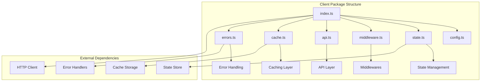
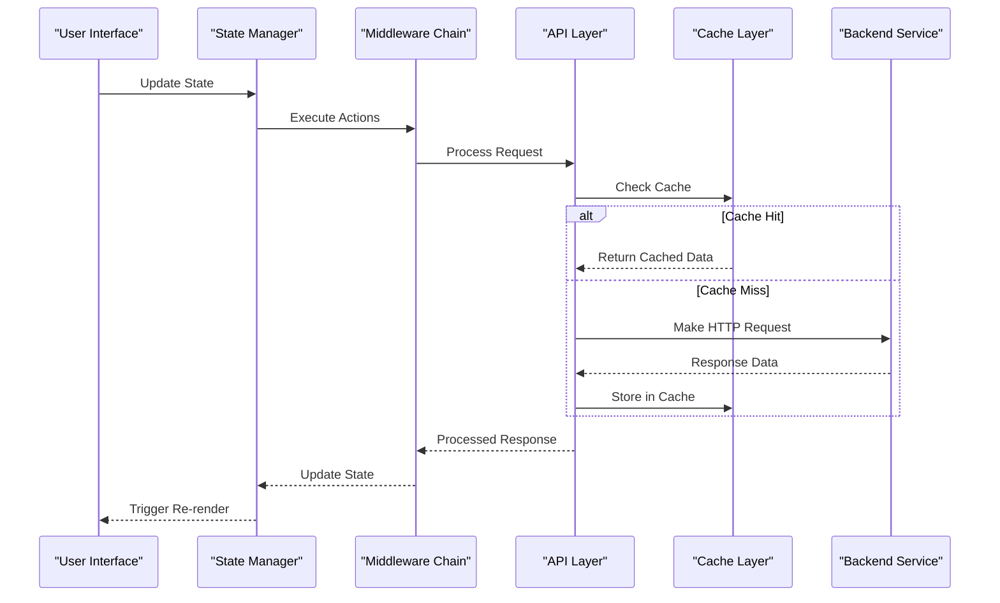
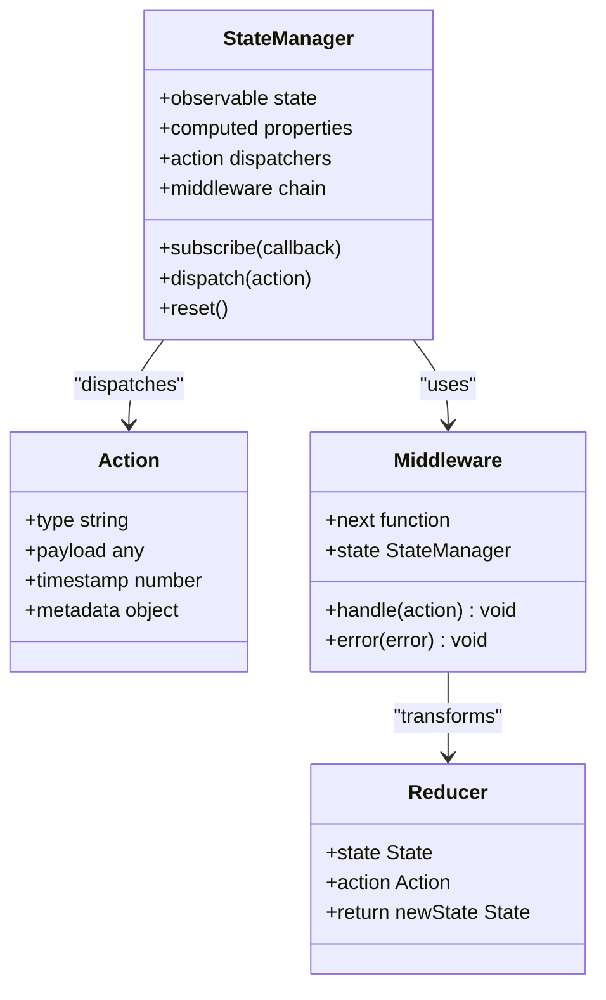
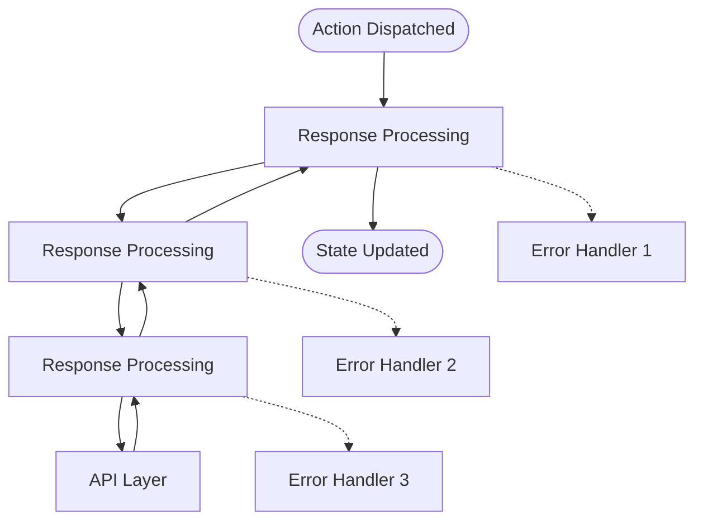
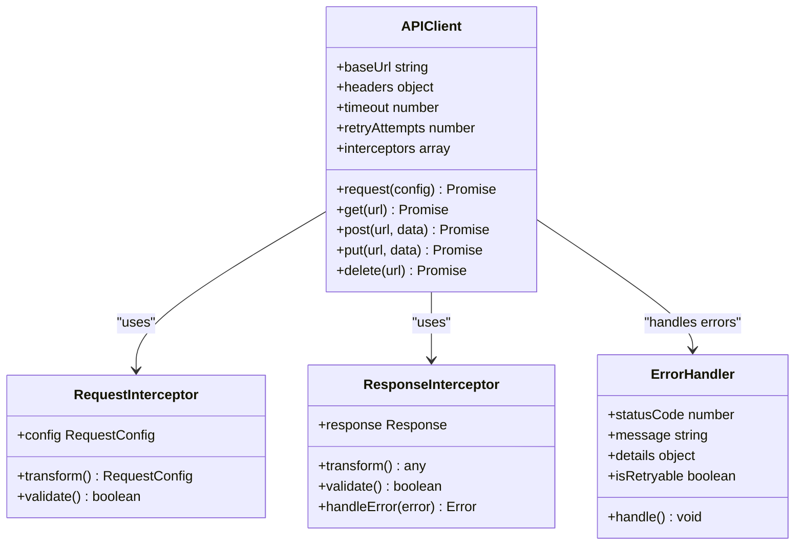
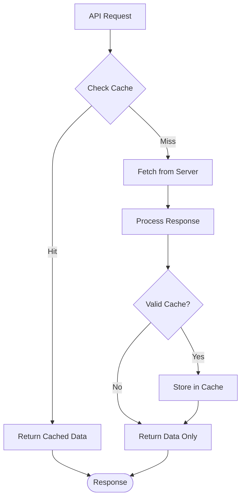
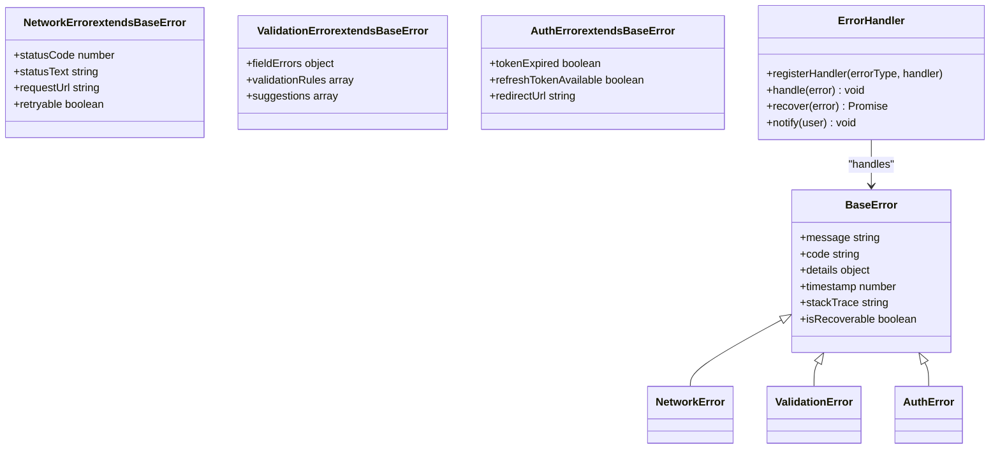
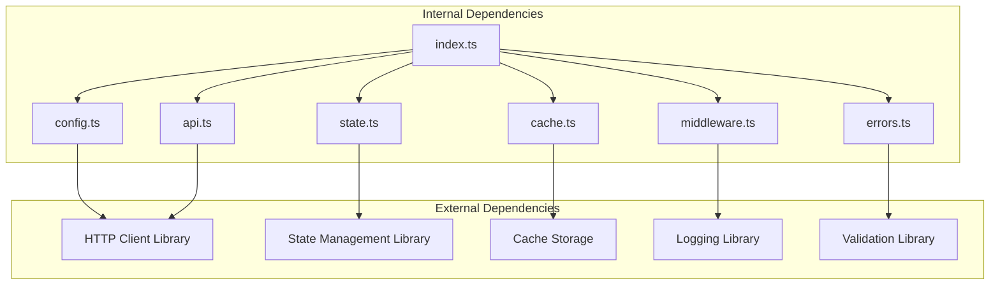

# Client Architecture

<cite>
**Referenced Files in This Document**
- [packages/client/src/index.ts](file://packages/client/src/index.ts)
- [packages/client/src/config.ts](file://packages/client/src/config.ts)
- [packages/client/src/state.ts](file://packages/client/src/state.ts)
- [packages/client/src/middleware.ts](file://packages/client/src/middleware.ts)
- [packages/client/src/api.ts](file://packages/client/src/api.ts)
- [packages/client/src/cache.ts](file://packages/client/src/cache.ts)
- [packages/client/src/errors.ts](file://packages/client/src/errors.ts)
- [packages/client/package.json](file://packages/client/package.json)
</cite>

## Table of Contents
1. [Introduction](#introduction)
2. [Project Structure](#project-structure)
3. [Core Components](#core-components)
4. [Architecture Overview](#architecture-overview)
5. [Detailed Component Analysis](#detailed-component-analysis)
6. [Dependency Analysis](#dependency-analysis)
7. [Performance Considerations](#performance-considerations)
8. [Troubleshooting Guide](#troubleshooting-guide)
9. [Conclusion](#conclusion)
10. [Appendices](#appendices)

## Introduction

The client-side architecture in the `packages/client` directory follows modern reactive programming patterns and state management principles. This architecture is designed to provide a robust foundation for building scalable web applications with efficient data flow, comprehensive error handling, and extensible middleware capabilities.

The client package serves as the primary interface between the frontend application and backend services, implementing sophisticated state management, caching strategies, and asynchronous operation handling.

## Project Structure

The client package is organized following a modular architecture pattern with clear separation of concerns:



**Diagram sources**
- [packages/client/src/index.ts:1-50](file://packages/client/src/index.ts#L1-L50)
- [packages/client/src/config.ts:1-30](file://packages/client/src/config.ts#L1-L30)

**Section sources**
- [packages/client/src/index.ts:1-100](file://packages/client/src/index.ts#L1-L100)
- [packages/client/package.json:1-50](file://packages/client/package.json#L1-L50)

## Core Components

### State Management System

The state management implementation follows reactive programming patterns using observable streams and computed values. The system provides automatic dependency tracking and efficient re-rendering triggers.

Key features include:
- Reactive state updates with automatic propagation
- Computed properties for derived state
- Action creators for state mutations
- Middleware integration for side effects

### Configuration Management

The configuration system supports environment-specific settings, validation, and runtime overrides. It provides type-safe configuration access throughout the application.

### API Layer

The API layer abstracts HTTP communication with built-in retry logic, error handling, and request/response transformation. It supports both synchronous and asynchronous operations.

**Section sources**
- [packages/client/src/state.ts:1-150](file://packages/client/src/state.ts#L1-L150)
- [packages/client/src/config.ts:1-100](file://packages/client/src/config.ts#L1-L100)
- [packages/client/src/api.ts:1-200](file://packages/client/src/api.ts#L1-L200)

## Architecture Overview

The client architecture implements a layered approach with clear separation between presentation, business logic, and data access layers:



**Diagram sources**
- [packages/client/src/middleware.ts:1-100](file://packages/client/src/middleware.ts#L1-L100)
- [packages/client/src/api.ts:1-150](file://packages/client/src/api.ts#L1-L150)
- [packages/client/src/cache.ts:1-100](file://packages/client/src/cache.ts#L1-L100)

## Detailed Component Analysis

### State Management Implementation

The state management system uses a combination of reactive primitives and middleware patterns to handle complex state transitions and side effects.

#### State Architecture Pattern



**Diagram sources**
- [packages/client/src/state.ts:1-200](file://packages/client/src/state.ts#L1-L200)
- [packages/client/src/middleware.ts:1-150](file://packages/client/src/middleware.ts#L1-L150)

#### Reactive Programming Patterns

The implementation leverages reactive programming concepts including:
- Observable streams for state changes
- Computed values for derived state
- Effect subscriptions for side effects
- Debounced updates for performance optimization

**Section sources**
- [packages/client/src/state.ts:1-300](file://packages/client/src/state.ts#L1-L300)

### Middleware System

The middleware system provides a flexible way to extend client functionality through a chain-based architecture similar to Express.js middleware.

#### Middleware Chain Architecture



**Diagram sources**
- [packages/client/src/middleware.ts:1-200](file://packages/client/src/middleware.ts#L1-L200)

#### Built-in Middlewares

Common middlewares include:
- Authentication middleware for token management
- Logging middleware for debugging
- Retry middleware for failed requests
- Caching middleware for response storage
- Validation middleware for input/output

**Section sources**
- [packages/client/src/middleware.ts:1-250](file://packages/client/src/middleware.ts#L1-L250)

### API Layer Implementation

The API layer provides a unified interface for all backend communications with built-in error handling, retry logic, and response transformation.

#### API Client Architecture



**Diagram sources**
- [packages/client/src/api.ts:1-300](file://packages/client/src/api.ts#L1-L300)

#### Asynchronous Operation Handling

The API layer implements sophisticated async operation management:
- Promise-based API with async/await support
- Request cancellation with AbortController
- Progress tracking for large uploads/downloads
- Timeout handling with configurable limits
- Automatic retry with exponential backoff

**Section sources**
- [packages/client/src/api.ts:1-400](file://packages/client/src/api.ts#L1-L400)

### Caching Strategy

The caching layer implements multiple cache strategies to optimize performance and reduce network requests.

#### Cache Architecture



**Diagram sources**
- [packages/client/src/cache.ts:1-200](file://packages/client/src/cache.ts#L1-L200)

#### Cache Strategies

Supported cache strategies include:
- Memory cache for temporary data
- LocalStorage for persistent client-side data
- SessionStorage for session-specific data
- Custom cache providers for external storage
- Cache invalidation policies
- Stale-while-revalidate patterns

**Section sources**
- [packages/client/src/cache.ts:1-250](file://packages/client/src/cache.ts#L1-L250)

### Error Handling System

The error handling system provides comprehensive error management with custom error types, recovery strategies, and user-friendly error messages.

#### Error Architecture



**Diagram sources**
- [packages/client/src/errors.ts:1-200](file://packages/client/src/errors.ts#L1-L200)

**Section sources**
- [packages/client/src/errors.ts:1-300](file://packages/client/src/errors.ts#L1-L300)

## Dependency Analysis

The client package maintains clean dependencies and follows inversion of control principles:



**Diagram sources**
- [packages/client/package.json:1-100](file://packages/client/package.json#L1-L100)

**Section sources**
- [packages/client/package.json:1-150](file://packages/client/package.json#L1-L150)

## Performance Considerations

### Optimization Techniques

The client implementation includes several performance optimizations:

1. **Lazy Loading**: Components and modules are loaded on-demand
2. **Code Splitting**: Bundle size reduction through dynamic imports
3. **Memoization**: Expensive computations are cached
4. **Debouncing**: Frequent updates are batched
5. **Virtual Scrolling**: Large lists are rendered efficiently
6. **Request Deduplication**: Duplicate requests are prevented

### Caching Strategies

Multiple caching levels are implemented:
- Browser cache headers utilization
- In-memory cache for frequently accessed data
- Persistent storage for offline support
- Cache warming for critical resources
- Intelligent cache invalidation

### Memory Management

Memory usage is optimized through:
- Proper cleanup of event listeners
- Weak references for large objects
- Garbage collection hints
- Memory leak detection
- Resource pooling for connections

## Troubleshooting Guide

### Common Issues and Solutions

#### State Synchronization Problems
- Ensure proper action dispatching order
- Verify middleware chain execution
- Check for circular dependencies in state updates

#### Network Request Failures
- Implement proper retry logic with exponential backoff
- Handle network timeouts gracefully
- Provide fallback mechanisms for offline scenarios

#### Performance Bottlenecks
- Monitor memory usage with browser dev tools
- Identify unnecessary re-renders
- Optimize large data transformations

#### Error Recovery
- Implement graceful degradation
- Provide user feedback for failed operations
- Log detailed error information for debugging

**Section sources**
- [packages/client/src/errors.ts:1-200](file://packages/client/src/errors.ts#L1-L200)
- [packages/client/src/api.ts:1-300](file://packages/client/src/api.ts#L1-L300)

## Conclusion

The client architecture in `packages/client` provides a robust foundation for building modern web applications. Its modular design, comprehensive state management, and extensive middleware system make it highly extensible and maintainable.

Key strengths include:
- Reactive state management with automatic updates
- Flexible middleware architecture for extending functionality
- Comprehensive error handling and recovery mechanisms
- Multiple caching strategies for optimal performance
- Clean separation of concerns and dependency management

The architecture is designed to scale with application complexity while maintaining performance and developer productivity.

## Appendices

### Setup Examples

#### Basic Client Initialization

```typescript
// Initialize client with default configuration
const client = new Client({
  baseUrl: 'https://api.example.com',
  timeout: 5000,
  retries: 3
});

// Configure authentication
client.use(authenticationMiddleware);

// Make API calls
const users = await client.get('/users');
```

#### Advanced Configuration

```typescript
// Custom middleware chain
const client = new Client({
  baseURL: process.env.API_URL,
  headers: {
    'Content-Type': 'application/json'
  },
  interceptors: [
    loggingInterceptor,
    authInterceptor,
    cacheInterceptor,
    errorInterceptor
  ]
});
```

### Extending Functionality

#### Custom Middleware Example

```typescript
// Create custom middleware
const customMiddleware = (store) => (next) => (action) => {
  // Pre-processing
  const startTime = Date.now();
  
  // Execute next middleware or action
  const result = next(action);
  
  // Post-processing
  const duration = Date.now() - startTime;
  console.log(`Action ${action.type} took ${duration}ms`);
  
  return result;
};
```

#### Custom Error Handler

```typescript
// Register custom error handler
client.registerErrorHandler('NETWORK_ERROR', (error) => {
  // Handle network errors
  showNetworkErrorNotification();
  return retryRequest(error);
});
```

**Section sources**
- [packages/client/src/index.ts:1-100](file://packages/client/src/index.ts#L1-L100)
- [packages/client/src/middleware.ts:1-200](file://packages/client/src/middleware.ts#L1-L200)