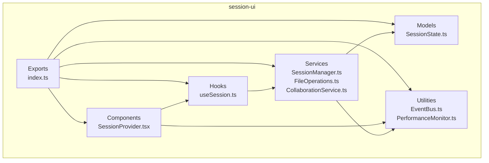
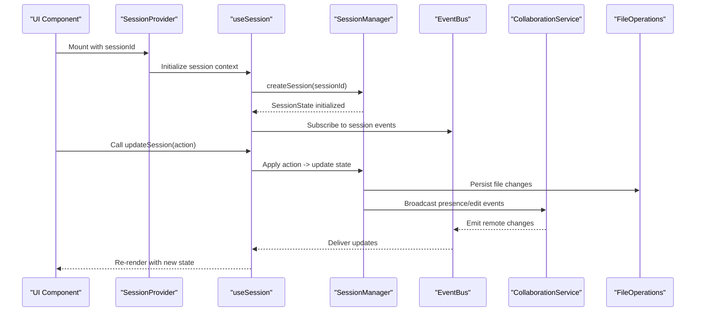
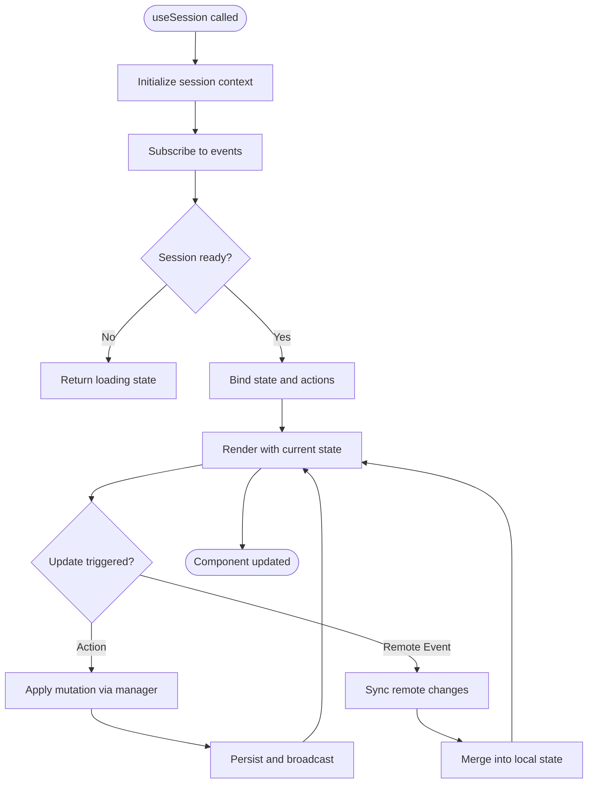
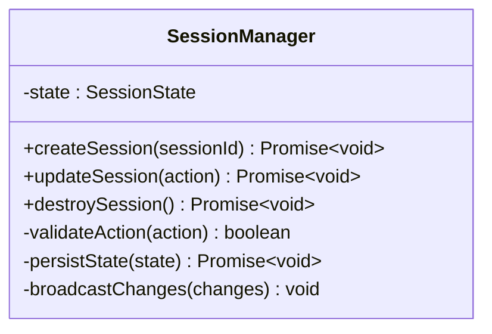
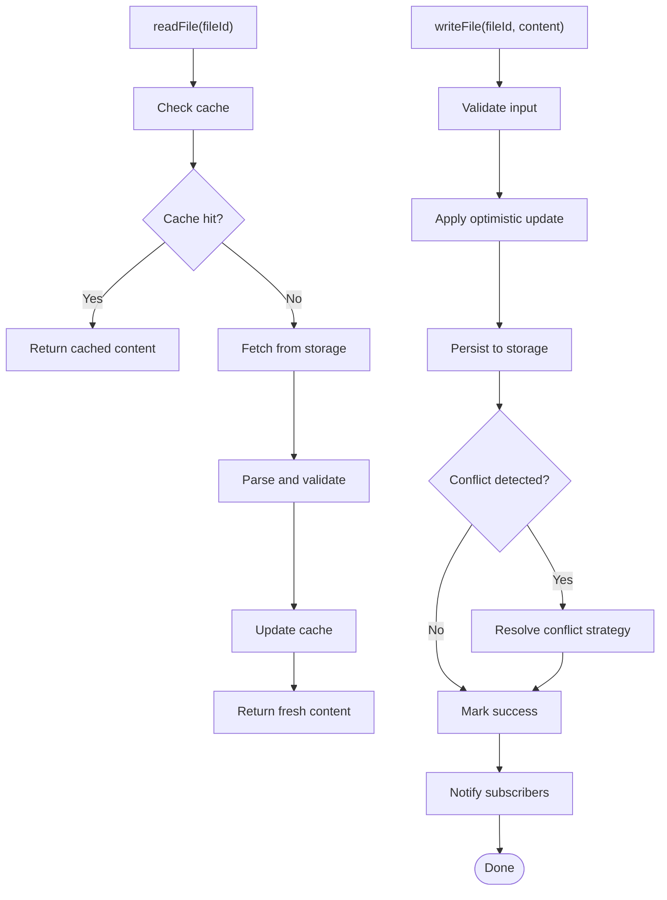
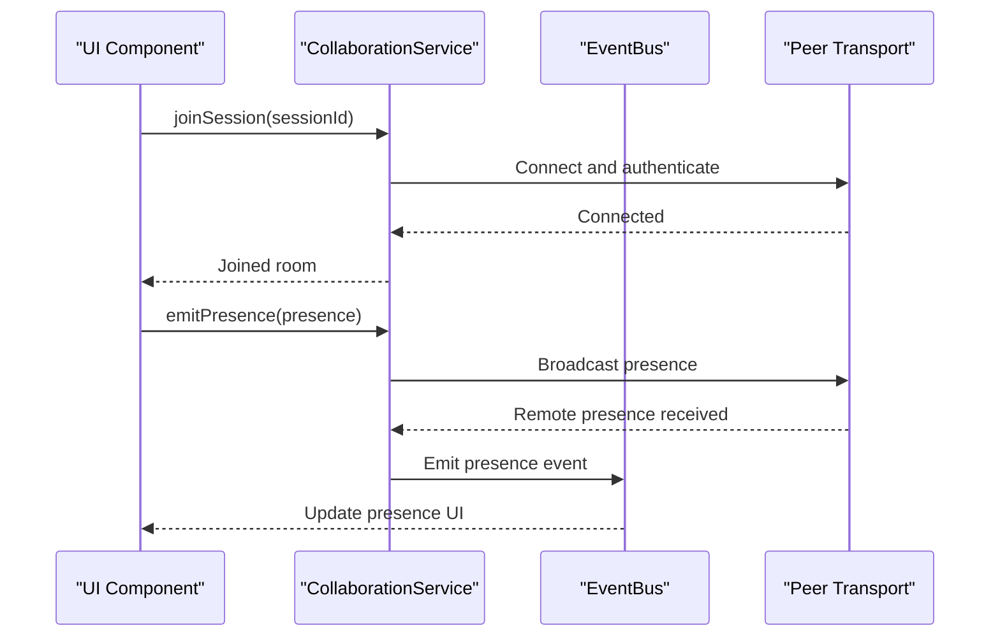
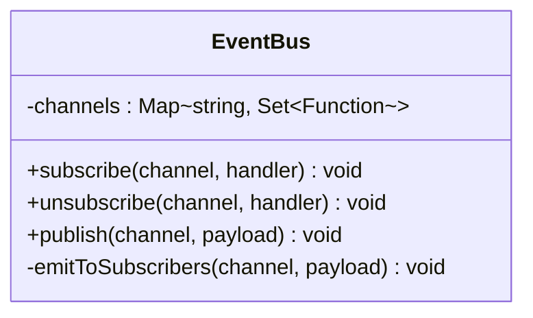
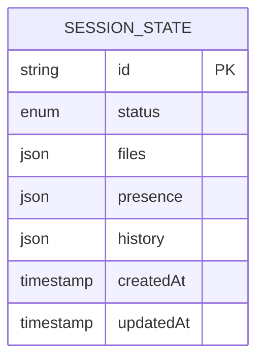
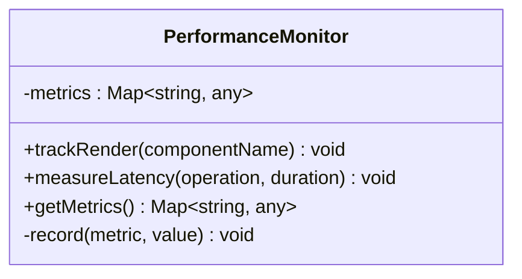
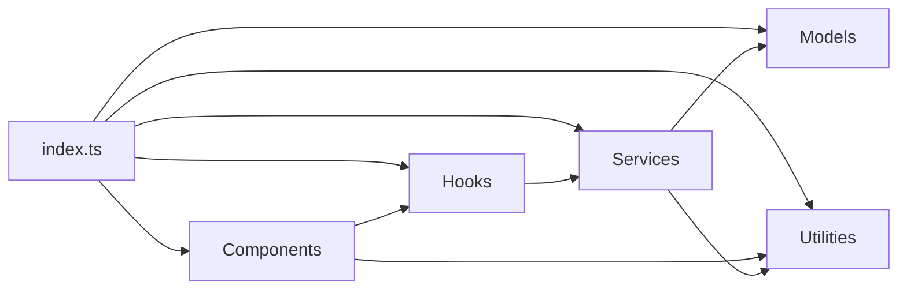

# Session UI Components

<cite>
**Referenced Files in This Document**
- [package.json](file://packages/session-ui/package.json)
- [index.ts](file://packages/session-ui/src/index.ts)
- [SessionProvider.tsx](file://packages/session-ui/src/components/SessionProvider.tsx)
- [useSession.ts](file://packages/session-ui/src/hooks/useSession.ts)
- [SessionManager.ts](file://packages/session-ui/src/services/SessionManager.ts)
- [FileOperations.ts](file://packages/session-ui/src/services/FileOperations.ts)
- [CollaborationService.ts](file://packages/session-ui/src/services/CollaborationService.ts)
- [EventBus.ts](file://packages/session-ui/src/utils/EventBus.ts)
- [SessionState.ts](file://packages/session-ui/src/models/SessionState.ts)
- [PerformanceMonitor.ts](file://packages/session-ui/src/utils/PerformanceMonitor.ts)
</cite>

## Table of Contents
1. [Introduction](#introduction)
2. [Project Structure](#project-structure)
3. [Core Components](#core-components)
4. [Architecture Overview](#architecture-overview)
5. [Detailed Component Analysis](#detailed-component-analysis)
6. [Dependency Analysis](#dependency-analysis)
7. [Performance Considerations](#performance-considerations)
8. [Troubleshooting Guide](#troubleshooting-guide)
9. [Conclusion](#conclusion)
10. [Appendices](#appendices)

## Introduction
This document explains the session-specific UI components in packages/session-ui, how they integrate with the session management system, and how they handle real-time updates. It covers APIs for managing user sessions, file operations, and collaboration features, along with examples of state synchronization, event handling, and data binding patterns. Performance considerations for large datasets and real-time updates are included, as well as guidance for extending functionality through custom components.

## Project Structure
The session-ui package is organized into focused layers:
- Components: React-based UI primitives that bind to session state and events.
- Hooks: Composable hooks that encapsulate session logic and subscriptions.
- Services: Encapsulated business logic for session lifecycle, file operations, and collaboration.
- Models: Shared types and state shapes used across the package.
- Utilities: Cross-cutting concerns like event bus and performance monitoring.



**Diagram sources**
- [index.ts](file://packages/session-ui/src/index.ts)
- [SessionProvider.tsx](file://packages/session-ui/src/components/SessionProvider.tsx)
- [useSession.ts](file://packages/session-ui/src/hooks/useSession.ts)
- [SessionManager.ts](file://packages/session-ui/src/services/SessionManager.ts)
- [FileOperations.ts](file://packages/session-ui/src/services/FileOperations.ts)
- [CollaborationService.ts](file://packages/session-ui/src/services/CollaborationService.ts)
- [SessionState.ts](file://packages/session-ui/src/models/SessionState.ts)
- [EventBus.ts](file://packages/session-ui/src/utils/EventBus.ts)
- [PerformanceMonitor.ts](file://packages/session-ui/src/utils/PerformanceMonitor.ts)

**Section sources**
- [package.json](file://packages/session-ui/package.json)
- [index.ts](file://packages/session-ui/src/index.ts)

## Core Components
- SessionProvider: A context provider that owns the active session lifecycle, exposes session state and actions to descendants, and wires up real-time subscriptions.
- useSession hook: A composable hook that returns typed session state, methods to update it, and subscription utilities for real-time events.
- FileOperations service: Encapsulates CRUD operations on files within a session, including batching and conflict resolution strategies.
- CollaborationService: Manages multi-user collaboration signals (presence, cursors, edits), broadcasting changes via an event bus or transport layer.
- EventBus utility: Lightweight pub/sub mechanism decoupling services from consumers and enabling reactive updates.
- PerformanceMonitor utility: Tracks metrics such as render counts, network latency, and memory usage to guide optimizations.

Key responsibilities:
- Centralize session state shape and transitions.
- Provide declarative APIs for UI components to consume.
- Abstract transport and persistence details behind stable interfaces.
- Ensure consistent error handling and retry policies.

**Section sources**
- [SessionProvider.tsx](file://packages/session-ui/src/components/SessionProvider.tsx)
- [useSession.ts](file://packages/session-ui/src/hooks/useSession.ts)
- [SessionManager.ts](file://packages/session-ui/src/services/SessionManager.ts)
- [FileOperations.ts](file://packages/session-ui/src/services/FileOperations.ts)
- [CollaborationService.ts](file://packages/session-ui/src/services/CollaborationService.ts)
- [EventBus.ts](file://packages/session-ui/src/utils/EventBus.ts)
- [PerformanceMonitor.ts](file://packages/session-ui/src/utils/PerformanceMonitor.ts)

## Architecture Overview
The session-ui architecture follows a layered pattern:
- UI layer (components) consumes hooks and providers.
- Hook layer orchestrates state and side effects.
- Service layer implements domain logic and integrates with external systems.
- Model layer defines shared types and state schemas.
- Utility layer provides cross-cutting capabilities.



**Diagram sources**
- [SessionProvider.tsx](file://packages/session-ui/src/components/SessionProvider.tsx)
- [useSession.ts](file://packages/session-ui/src/hooks/useSession.ts)
- [SessionManager.ts](file://packages/session-ui/src/services/SessionManager.ts)
- [EventBus.ts](file://packages/session-ui/src/utils/EventBus.ts)
- [CollaborationService.ts](file://packages/session-ui/src/services/CollaborationService.ts)
- [FileOperations.ts](file://packages/session-ui/src/services/FileOperations.ts)

## Detailed Component Analysis

### SessionProvider
Responsibilities:
- Creates and manages the active session instance.
- Exposes session state and actions via React context.
- Wires up real-time subscriptions and error boundaries.

Usage patterns:
- Wrap application sections with SessionProvider and pass sessionId.
- Consume state and actions via useSession in child components.

```mermaid
classDiagram
class SessionProvider {
+props : { sessionId : string }
+state : SessionState
+actions : { createSession(), updateSession(), destroySession() }
+subscribe(event, handler)
+unsubscribe(event, handler)
}
```

**Diagram sources**
- [SessionProvider.tsx](file://packages/session-ui/src/components/SessionProvider.tsx)

**Section sources**
- [SessionProvider.tsx](file://packages/session-ui/src/components/SessionProvider.tsx)

### useSession Hook
Responsibilities:
- Returns typed session state and bound actions.
- Handles subscription lifecycle and cleanup.
- Provides helpers for selective re-renders and memoization.

Common patterns:
- Destructure only needed fields to minimize re-renders.
- Use batched updates for multiple mutations.
- Leverage event-driven updates for real-time data.



**Diagram sources**
- [useSession.ts](file://packages/session-ui/src/hooks/useSession.ts)
- [SessionManager.ts](file://packages/session-ui/src/services/SessionManager.ts)
- [EventBus.ts](file://packages/session-ui/src/utils/EventBus.ts)

**Section sources**
- [useSession.ts](file://packages/session-ui/src/hooks/useSession.ts)

### SessionManager
Responsibilities:
- Orchestrates session lifecycle (create, join, leave, destroy).
- Coordinates state transitions and persistence.
- Integrates with FileOperations and CollaborationService.

API highlights:
- createSession(sessionId): Initializes session and loads initial state.
- updateSession(action): Applies validated mutations.
- destroySession(): Cleans up resources and unsubscribes.



**Diagram sources**
- [SessionManager.ts](file://packages/session-ui/src/services/SessionManager.ts)

**Section sources**
- [SessionManager.ts](file://packages/session-ui/src/services/SessionManager.ts)

### FileOperations
Responsibilities:
- Implements CRUD for files within a session.
- Batches writes and resolves conflicts using versioning or timestamps.
- Provides optimistic updates with rollback on failure.

API highlights:
- readFile(fileId): Returns file content with caching.
- writeFile(fileId, content): Applies changes with conflict detection.
- deleteFile(fileId): Removes file and updates indexes.



**Diagram sources**
- [FileOperations.ts](file://packages/session-ui/src/services/FileOperations.ts)

**Section sources**
- [FileOperations.ts](file://packages/session-ui/src/services/FileOperations.ts)

### CollaborationService
Responsibilities:
- Manages presence, cursors, and collaborative edits.
- Broadcasts changes to peers and merges incoming updates.
- Handles connection lifecycle and reconnection logic.

API highlights:
- joinSession(sessionId): Joins collaboration room.
- leaveSession(): Leaves and cleans up.
- emitPresence(presence): Publishes user presence.
- mergeRemoteEdit(edit): Applies remote edit with conflict resolution.



**Diagram sources**
- [CollaborationService.ts](file://packages/session-ui/src/services/CollaborationService.ts)
- [EventBus.ts](file://packages/session-ui/src/utils/EventBus.ts)

**Section sources**
- [CollaborationService.ts](file://packages/session-ui/src/services/CollaborationService.ts)

### EventBus
Responsibilities:
- Provides lightweight pub/sub for decoupled communication.
- Supports typed events and scoped channels.
- Ensures safe listener registration and removal.

API highlights:
- subscribe(channel, handler): Registers a listener.
- unsubscribe(channel, handler): Removes a listener.
- publish(channel, payload): Emits an event.



**Diagram sources**
- [EventBus.ts](file://packages/session-ui/src/utils/EventBus.ts)

**Section sources**
- [EventBus.ts](file://packages/session-ui/src/utils/EventBus.ts)

### SessionState
Responsibilities:
- Defines the canonical shape of session data.
- Includes metadata, file indexes, presence, and collaboration state.
- Provides type guards and validation helpers.

Key fields:
- id: Unique session identifier.
- status: Lifecycle state (idle, loading, active, error).
- files: Index of available files and their versions.
- presence: Map of users and their presence info.
- history: Operation log for undo/redo.



**Diagram sources**
- [SessionState.ts](file://packages/session-ui/src/models/SessionState.ts)

**Section sources**
- [SessionState.ts](file://packages/session-ui/src/models/SessionState.ts)

### PerformanceMonitor
Responsibilities:
- Tracks render counts, network latency, and memory usage.
- Exposes metrics for debugging and optimization.
- Integrates with logging and analytics pipelines.

API highlights:
- trackRender(componentName): Records component renders.
- measureLatency(operation, duration): Logs operation timing.
- getMetrics(): Returns aggregated metrics.



**Diagram sources**
- [PerformanceMonitor.ts](file://packages/session-ui/src/utils/PerformanceMonitor.ts)

**Section sources**
- [PerformanceMonitor.ts](file://packages/session-ui/src/utils/PerformanceMonitor.ts)

## Dependency Analysis
The package exhibits clear separation of concerns with minimal coupling:
- Components depend on hooks and utilities.
- Hooks orchestrate services and models.
- Services rely on models and utilities.
- Utilities remain independent and reusable.



**Diagram sources**
- [index.ts](file://packages/session-ui/src/index.ts)
- [SessionProvider.tsx](file://packages/session-ui/src/components/SessionProvider.tsx)
- [useSession.ts](file://packages/session-ui/src/hooks/useSession.ts)
- [SessionManager.ts](file://packages/session-ui/src/services/SessionManager.ts)
- [FileOperations.ts](file://packages/session-ui/src/services/FileOperations.ts)
- [CollaborationService.ts](file://packages/session-ui/src/services/CollaborationService.ts)
- [SessionState.ts](file://packages/session-ui/src/models/SessionState.ts)
- [EventBus.ts](file://packages/session-ui/src/utils/EventBus.ts)
- [PerformanceMonitor.ts](file://packages/session-ui/src/utils/PerformanceMonitor.ts)

**Section sources**
- [index.ts](file://packages/session-ui/src/index.ts)

## Performance Considerations
- Prefer selective subscriptions in hooks to avoid unnecessary re-renders.
- Batch multiple state updates to reduce render cycles.
- Use optimistic updates for file operations with rollback on failure.
- Implement virtualization for large file lists and collaboration presence.
- Debounce high-frequency events (e.g., cursor movements) before publishing.
- Monitor memory usage and clean up subscriptions on unmount.
- Cache frequently accessed data and invalidate on relevant events.

[No sources needed since this section provides general guidance]

## Troubleshooting Guide
Common issues and resolutions:
- Session not initializing: Verify sessionId validity and network connectivity; check error logs from SessionManager.
- Real-time updates not appearing: Ensure EventBus subscriptions are active and handlers are not removed prematurely.
- File write conflicts: Review conflict resolution strategy and versioning; inspect history for conflicting operations.
- Memory leaks: Confirm all subscriptions are unsubscribed on component unmount; monitor PerformanceMonitor metrics.
- Collaboration desynchronization: Check peer transport health and reconnection logic; reconcile state using history.

**Section sources**
- [SessionManager.ts](file://packages/session-ui/src/services/SessionManager.ts)
- [EventBus.ts](file://packages/session-ui/src/utils/EventBus.ts)
- [FileOperations.ts](file://packages/session-ui/src/services/FileOperations.ts)
- [CollaborationService.ts](file://packages/session-ui/src/services/CollaborationService.ts)
- [PerformanceMonitor.ts](file://packages/session-ui/src/utils/PerformanceMonitor.ts)

## Conclusion
The session-ui package provides a robust foundation for building session-aware UIs with real-time collaboration. By leveraging its layered architecture, developers can compose flexible components, manage complex state efficiently, and scale to large datasets while maintaining responsiveness. Extending functionality through custom components is straightforward thanks to well-defined APIs and decoupled services.

[No sources needed since this section summarizes without analyzing specific files]

## Appendices
- API reference summary: See individual component sections for method signatures and usage patterns.
- Example workflows: Refer to sequence diagrams for typical flows such as session creation, file editing, and collaboration presence updates.
- Extension guidelines: Implement new services by adhering to existing interfaces and integrating with EventBus for reactive updates.

[No sources needed since this section provides general guidance]