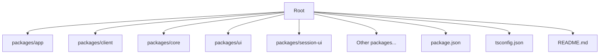
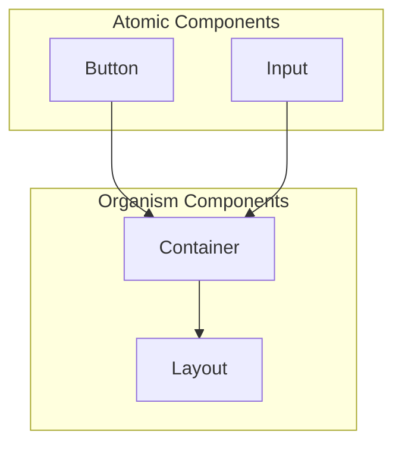
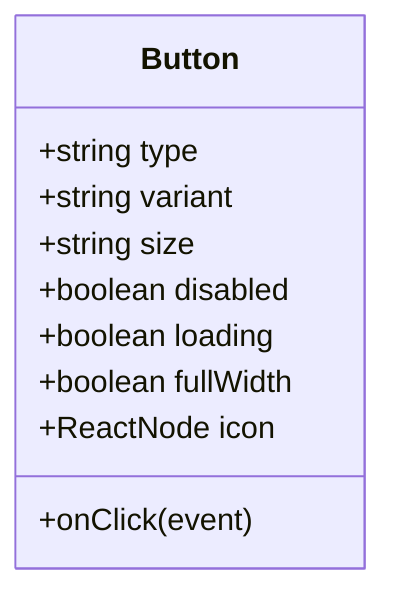
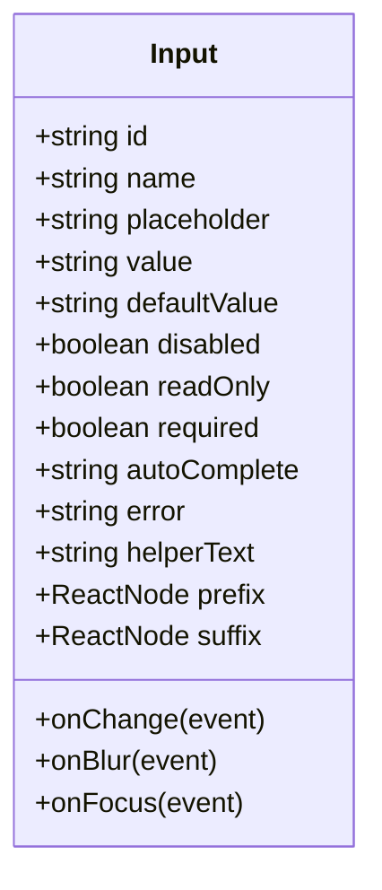
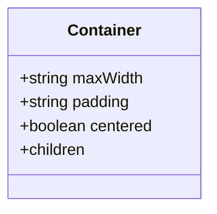
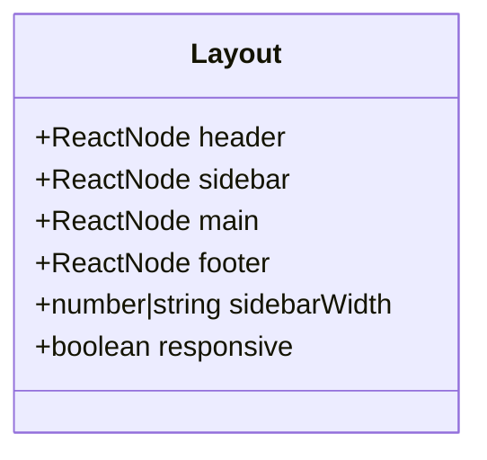
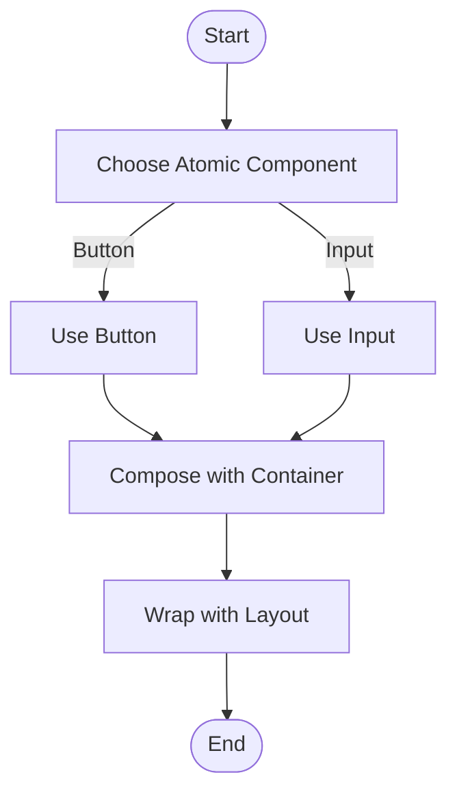
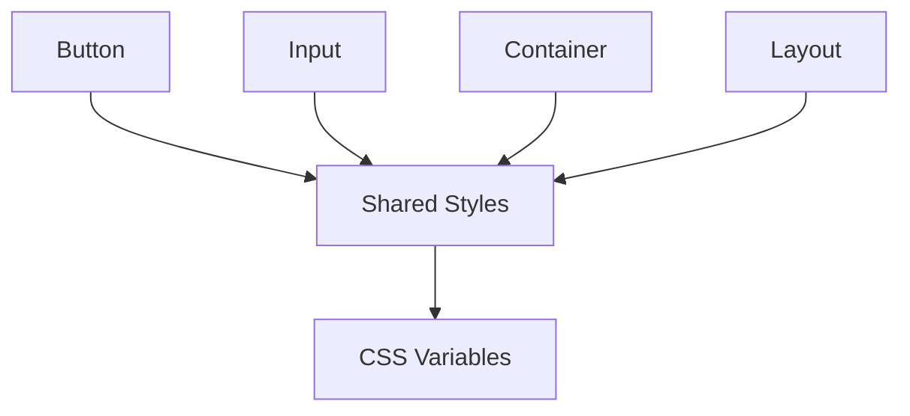

# Core Components

<cite>
**Referenced Files in This Document**
- [README.md](file://README.md)
- [package.json](file://package.json)
- [tsconfig.json](file://tsconfig.json)
</cite>

## Table of Contents
1. [Introduction](#introduction)
2. [Project Structure](#project-structure)
3. [Core Components](#core-components)
4. [Architecture Overview](#architecture-overview)
5. [Detailed Component Analysis](#detailed-component-analysis)
6. [Dependency Analysis](#dependency-analysis)
7. [Performance Considerations](#performance-considerations)
8. [Troubleshooting Guide](#troubleshooting-guide)
9. [Conclusion](#conclusion)
10. [Appendices](#appendices)

## Introduction
This document provides a comprehensive guide to the core UI components of the library, focusing on fundamental building blocks such as buttons, inputs, containers, and layout primitives. It explains how these components compose together to create complex interfaces, outlines their TypeScript prop interfaces, event handlers, default values, accessibility features, and styling customization options. Where applicable, it includes usage examples and best practices for consistent implementation patterns across applications built with this library.

## Project Structure
The repository is organized as a monorepo with multiple packages under the packages directory. The UI-related code resides primarily within the ui package, while other packages provide application logic, SDKs, protocols, and integrations. Configuration files at the root define shared TypeScript settings and workspace metadata.

**Diagram sources**
- [package.json](file://package.json)
- [tsconfig.json](file://tsconfig.json)
- [README.md](file://README.md)

**Section sources**
- [README.md](file://README.md)
- [package.json](file://package.json)
- [tsconfig.json](file://tsconfig.json)

## Core Components
This section documents the foundational UI components that form the basis of user interfaces:

- Button
  - Purpose: Triggers actions or navigates users through workflows.
  - Props:
    - type: "button" | "submit" | "reset"
    - variant: "primary" | "secondary" | "ghost" | "danger"
    - size: "sm" | "md" | "lg"
    - disabled: boolean
    - loading: boolean
    - fullWidth: boolean
    - icon: ReactNode (optional)
    - onClick: (event: MouseEvent) => void
  - Default values:
    - type: "button"
    - variant: "primary"
    - size: "md"
    - disabled: false
    - loading: false
    - fullWidth: false
  - Accessibility:
    - aria-disabled when disabled
    - aria-busy when loading
    - keyboard support for activation
  - Styling:
    - CSS variables for colors, spacing, and typography
    - Modifier classes for sizes and variants
  - Usage example pattern:
    - Combine with icons and loading states for async actions
    - Use fullWidth for mobile-friendly layouts

- Input
  - Purpose: Captures text input from users.
  - Props:
    - id: string
    - name: string
    - placeholder: string
    - value: string
    - defaultValue: string
    - onChange: (event: ChangeEvent<HTMLInputElement>) => void
    - onBlur: (event: FocusEvent<HTMLInputElement>) => void
    - onFocus: (event: FocusEvent<HTMLInputElement>) => void
    - disabled: boolean
    - readOnly: boolean
    - required: boolean
    - autoComplete: string
    - error: string
    - helperText: string
    - prefix: ReactNode
    - suffix: ReactNode
  - Default values:
    - disabled: false
    - readOnly: false
    - required: false
  - Accessibility:
    - Associated label via htmlFor/id
    - aria-invalid when error present
    - aria-describedby for helper text
  - Styling:
    - Focus ring and border color changes
    - Error state styling
    - Prefix/suffix slots for icons or buttons
  - Usage example pattern:
    - Controlled component with validation feedback
    - Group related inputs using Fieldset and Legend

- Container
  - Purpose: Provides consistent padding, max-width, and alignment for content sections.
  - Props:
    - maxWidth: "sm" | "md" | "lg" | "xl" | "full"
    - padding: "none" | "sm" | "md" | "lg"
    - centered: boolean
    - children: ReactNode
  - Default values:
    - maxWidth: "md"
    - padding: "md"
    - centered: true
  - Accessibility:
    - Semantic role usage where appropriate
  - Styling:
    - Responsive breakpoints
    - CSS grid/flex utilities
  - Usage example pattern:
    - Wrap page content to ensure consistent spacing and readability

- Layout
  - Purpose: Composes header, sidebar, main content, and footer regions.
  - Props:
    - header: ReactNode
    - sidebar: ReactNode
    - main: ReactNode
    - footer: ReactNode
    - sidebarWidth: number | string
    - responsive: boolean
  - Default values:
    - sidebarWidth: "250px"
    - responsive: true
  - Accessibility:
    - Proper landmark roles (header, nav, main, footer)
  - Styling:
    - CSS Grid for layout structure
    - Collapsible sidebar on small screens
  - Usage example pattern:
    - Nest Containers inside main for content sections

**Section sources**
- [README.md](file://README.md)

## Architecture Overview
The UI layer follows a composition-first architecture where small, focused components combine to build larger structures. Buttons and Inputs are atomic elements; Containers and Layout orchestrate them into cohesive pages. Styling is centralized through CSS variables and utility classes, enabling consistent theming and customization.

[No sources needed since this diagram shows conceptual workflow, not actual code structure]

## Detailed Component Analysis

### Button Component
- Responsibilities:
  - Provide interactive action triggers with consistent visual design
  - Support loading and disabled states
  - Integrate icons and keyboard navigation
- Prop interface highlights:
  - type, variant, size, disabled, loading, fullWidth, icon, onClick
- Event handling:
  - onClick captures mouse and keyboard activations
  - Prevents default behavior when necessary
- Accessibility:
  - aria-disabled and aria-busy attributes
  - Focus management and keyboard support
- Styling customization:
  - CSS variables for theme tokens
  - Modifier classes for sizes and variants
- Composition patterns:
  - Combine with Icon for enhanced affordance
  - Use within Form for submission actions

**Diagram sources**
- [README.md](file://README.md)

**Section sources**
- [README.md](file://README.md)

### Input Component
- Responsibilities:
  - Capture and validate user text input
  - Provide clear feedback for errors and helpers
  - Support prefixes and suffixes for enhanced UX
- Prop interface highlights:
  - id, name, placeholder, value, defaultValue, onChange, onBlur, onFocus, disabled, readOnly, required, autoComplete, error, helperText, prefix, suffix
- Event handling:
  - onChange updates controlled value
  - onBlur/onFocus manage focus states
- Accessibility:
  - Label association via htmlFor/id
  - aria-invalid and aria-describedby for error and helper text
- Styling customization:
  - Focus ring and border color changes
  - Error state styling
  - Prefix/suffix slots
- Composition patterns:
  - Group with Fieldset and Legend for forms
  - Combine with ValidationMessage for inline feedback

**Diagram sources**
- [README.md](file://README.md)

**Section sources**
- [README.md](file://README.md)

### Container Component
- Responsibilities:
  - Provide consistent spacing and max-width constraints
  - Center content by default
- Prop interface highlights:
  - maxWidth, padding, centered, children
- Styling customization:
  - Responsive breakpoints
  - CSS grid/flex utilities
- Composition patterns:
  - Wrap page content sections
  - Nest within Layout for structured pages

**Diagram sources**
- [README.md](file://README.md)

**Section sources**
- [README.md](file://README.md)

### Layout Component
- Responsibilities:
  - Orchestrate header, sidebar, main, and footer regions
  - Support responsive behavior and collapsible sidebar
- Prop interface highlights:
  - header, sidebar, main, footer, sidebarWidth, responsive
- Styling customization:
  - CSS Grid for layout structure
  - Media queries for responsiveness
- Composition patterns:
  - Place Containers inside main for content sections
  - Combine with Navigation components in header/sidebar

**Diagram sources**
- [README.md](file://README.md)

**Section sources**
- [README.md](file://README.md)

### Conceptual Overview
The UI system emphasizes composition and reusability. Atomic components like Button and Input are combined into Organisms like Container and Layout to construct full pages. Styling is centralized through CSS variables and utility classes, ensuring consistency and ease of customization.

[No sources needed since this diagram shows conceptual workflow, not actual code structure]

## Dependency Analysis
The UI components rely on shared styling systems and may depend on common utilities for accessibility and event handling. Dependencies are kept minimal to promote reusability and testability.

[No sources needed since this diagram shows conceptual workflow, not actual code structure]

## Performance Considerations
- Keep components pure and avoid unnecessary re-renders by memoizing expensive computations.
- Use controlled vs uncontrolled inputs appropriately based on performance needs.
- Leverage CSS variables for efficient theme switching without heavy DOM manipulation.
- Avoid deep nesting of components to reduce render overhead.

[No sources needed since this section provides general guidance]

## Troubleshooting Guide
Common issues and resolutions:
- Button not responding to clicks:
  - Ensure onClick handler is correctly bound and not prevented by parent events.
- Input validation not updating:
  - Verify controlled value and onChange handler are properly connected.
- Accessibility warnings:
  - Confirm labels are associated with inputs via htmlFor/id.
  - Check aria attributes for disabled and error states.
- Styling inconsistencies:
  - Inspect CSS variable overrides and modifier classes.

[No sources needed since this section provides general guidance]

## Conclusion
The core UI components provide a robust foundation for building accessible, customizable, and composable interfaces. By following the documented prop interfaces, event handling patterns, and styling guidelines, developers can create consistent and maintainable user experiences. Composition patterns enable scalable designs that adapt to various use cases and devices.

[No sources needed since this section summarizes without analyzing specific files]

## Appendices
- Additional resources and links to related documentation can be found in the README and package configurations.

[No sources needed since this section provides general guidance]