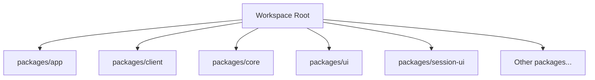
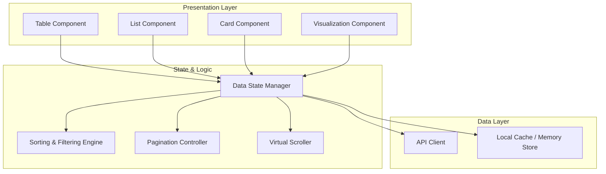
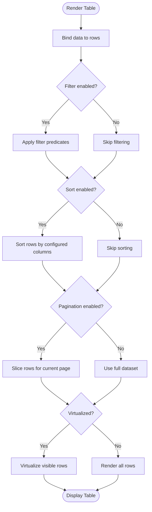
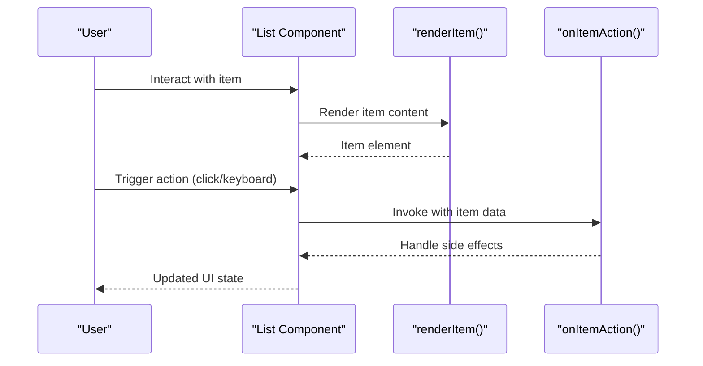
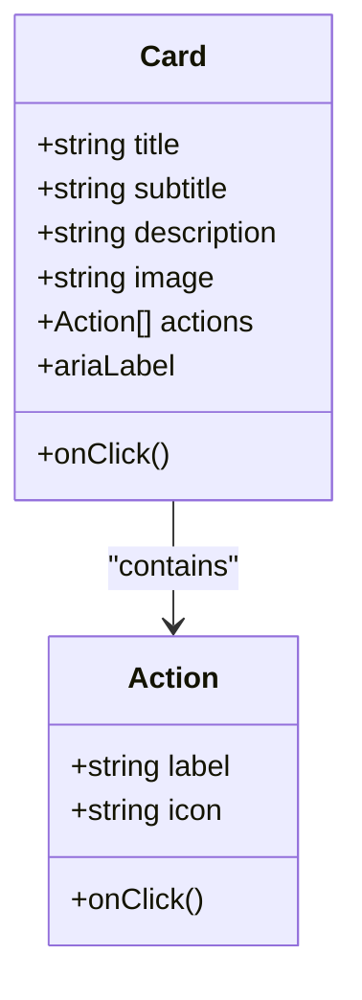
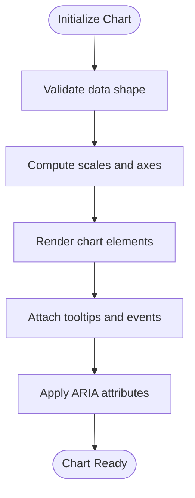
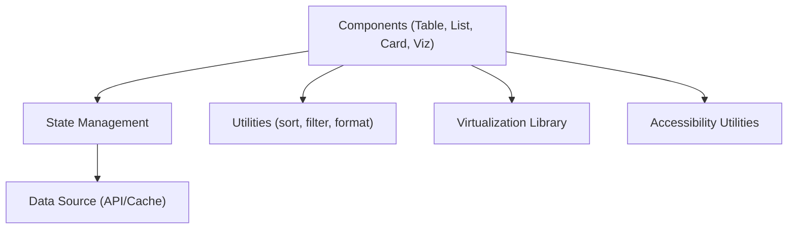

# Data Display Components

<cite>
**Referenced Files in This Document**
- [README.md](file://README.md)
- [package.json](file://package.json)
- [tsconfig.json](file://tsconfig.json)
- [bunfig.toml](file://bunfig.toml)
</cite>

## Table of Contents
1. [Introduction](#introduction)
2. [Project Structure](#project-structure)
3. [Core Components](#core-components)
4. [Architecture Overview](#architecture-overview)
5. [Detailed Component Analysis](#detailed-component-analysis)
6. [Dependency Analysis](#dependency-analysis)
7. [Performance Considerations](#performance-considerations)
8. [Troubleshooting Guide](#troubleshooting-guide)
9. [Conclusion](#conclusion)
10. [Appendices](#appendices)

## Introduction
This document provides comprehensive guidance for implementing data display components such as tables, lists, cards, and data visualization elements within the project. It focuses on props for data binding, sorting, filtering, pagination, virtual scrolling for large datasets, handling different data formats, and accessibility requirements for screen readers and keyboard navigation. The goal is to help developers build performant, accessible, and maintainable UIs that present data effectively.

## Project Structure
The repository is a multi-package workspace with several packages under packages/. While this document targets data display components, the current workspace snapshot does not include specific component source files. Therefore, the guidance below is conceptual and aligned with best practices for building data display components in modern web applications.

[No sources needed since this diagram shows conceptual structure, not actual code structure]

**Section sources**
- [README.md](file://README.md)
- [package.json](file://package.json)
- [tsconfig.json](file://tsconfig.json)
- [bunfig.toml](file://bunfig.toml)

## Core Components
This section outlines the core data display components and their responsibilities:

- Table
  - Displays tabular data with features like sorting, filtering, selection, and pagination.
  - Supports fixed headers, resizable columns, and row actions.
- List
  - Renders linear collections with support for grouping, nested items, and infinite scroll.
  - Optimized for memory efficiency via virtualization when needed.
- Card
  - Presents grouped information in a compact, scannable format.
  - Useful for dashboards and summary views.
- Data Visualization
  - Charts and graphs for numerical insights (bar, line, pie, scatter).
  - Accessible legends, tooltips, and keyboard navigation.

Key capabilities across components:
- Data binding through typed props
- Sorting by one or multiple columns/fields
- Filtering by text, ranges, enums, and custom predicates
- Pagination with server-side or client-side strategies
- Virtual scrolling for large datasets
- Accessibility attributes and roles for screen readers and keyboard users

[No sources needed since this section provides general guidance]

## Architecture Overview
A typical data display architecture separates concerns into presentation, state management, and data fetching layers.

[No sources needed since this diagram shows conceptual architecture, not actual code structure]

## Detailed Component Analysis

### Table Component
Responsibilities:
- Render rows and columns from a dataset
- Provide column-level sorting and global search/filtering
- Support row selection and actions
- Implement pagination and virtual scrolling for performance

Props overview:
- data: array of objects representing rows
- columns: definition array specifying field keys, labels, renderers, sortability, and filters
- sortable: boolean to enable sorting
- filterable: boolean to enable filtering
- selectable: boolean to enable row selection
- pageSize: number of rows per page
- currentPage: current page index
- totalItems: total count for pagination
- virtualized: boolean to enable virtual scrolling
- rowHeight: number for virtual scrolling calculations
- ariaLabel: string for accessibility label
- onSortChange: callback invoked with new sort configuration
- onFilterChange: callback invoked with new filter configuration
- onPageChange: callback invoked with new page index
- onSelectChange: callback invoked with selected row IDs

Accessibility considerations:
- Use table role and proper header associations
- Provide aria-sort on sortable columns
- Ensure focus management for keyboard navigation
- Announce status changes (e.g., filtered results count)

Performance tips:
- Enable virtualization for large datasets
- Debounce filter input
- Use stable keys for rows to optimize re-renders

[No sources needed since this diagram shows conceptual algorithm flow, not actual code structure]

**Section sources**
- [README.md](file://README.md)
- [package.json](file://package.json)

### List Component
Responsibilities:
- Render ordered or unordered lists
- Support grouping, nested items, and item actions
- Provide virtual scrolling for long lists

Props overview:
- items: array of list entries
- renderItem: function to render each entry
- groupBy: optional key to group items
- virtualized: boolean to enable virtual scrolling
- itemHeight: number for virtual scrolling calculations
- ariaLabel: string for accessibility label
- onItemAction: callback for item interactions

Accessibility considerations:
- Use appropriate list roles (ul/ol) and li elements
- Provide aria-label or aria-labelledby for lists
- Ensure focus order and keyboard shortcuts for actions

Performance tips:
- Use memoization for expensive render functions
- Virtualize long lists to reduce DOM size

[No sources needed since this diagram shows conceptual workflow, not actual code structure]

**Section sources**
- [README.md](file://README.md)
- [package.json](file://package.json)

### Card Component
Responsibilities:
- Display summarized information in a card layout
- Support images, metadata, and actions

Props overview:
- title: string
- subtitle: string
- description: string
- image: URL or asset reference
- actions: array of action definitions
- onClick: callback for card click
- ariaLabel: string for accessibility label

Accessibility considerations:
- Use semantic HTML (article, h1-h6, p)
- Provide alt text for images
- Ensure interactive elements are keyboard accessible

Performance tips:
- Lazy-load images
- Avoid heavy computations inside render

[No sources needed since this diagram shows conceptual class relationships, not actual code structure]

**Section sources**
- [README.md](file://README.md)
- [package.json](file://package.json)

### Data Visualization Component
Responsibilities:
- Render charts and graphs for numerical data
- Provide tooltips, legends, and zoom controls
- Ensure accessibility for screen readers and keyboard users

Props overview:
- data: array of data points or series
- type: chart type (bar, line, pie, scatter)
- xKey: key for x-axis values
- yKey: key for y-axis values
- colorMap: mapping of categories to colors
- tooltipEnabled: boolean
- legendEnabled: boolean
- ariaLabel: string for accessibility label
- onPointClick: callback for point interactions

Accessibility considerations:
- Provide descriptive aria-labels and titles
- Include accessible legends and tooltips
- Ensure keyboard navigation between data points

Performance tips:
- Memoize computed axes and scales
- Use canvas or WebGL for large datasets

[No sources needed since this diagram shows conceptual algorithm flow, not actual code structure]

**Section sources**
- [README.md](file://README.md)
- [package.json](file://package.json)

## Dependency Analysis
Data display components typically depend on:
- State management libraries for data binding and updates
- Utility libraries for sorting, filtering, and formatting
- Virtualization libraries for efficient rendering of large datasets
- Accessibility utilities for ARIA attributes and keyboard handling

[No sources needed since this diagram shows conceptual dependencies, not actual code structure]

**Section sources**
- [README.md](file://README.md)
- [package.json](file://package.json)

## Performance Considerations
- Virtual scrolling: Enable for datasets exceeding hundreds of items to limit DOM nodes.
- Debouncing: Apply to filter inputs to avoid excessive re-renders.
- Memoization: Use memoization for expensive computations and render functions.
- Stable keys: Ensure unique and stable keys for rows/items to optimize reconciliation.
- Lazy loading: Defer loading of images and heavy resources until needed.
- Server-side operations: Offload sorting, filtering, and pagination to the backend for very large datasets.

[No sources needed since this section provides general guidance]

## Troubleshooting Guide
Common issues and resolutions:
- Slow rendering with large datasets
  - Enable virtualization and ensure correct row height configuration.
  - Check for unnecessary re-renders caused by unstable keys or props.
- Incorrect sorting or filtering behavior
  - Verify predicate functions and sort comparators.
  - Ensure locale-aware comparisons for strings.
- Accessibility failures
  - Confirm ARIA attributes and roles are applied correctly.
  - Test keyboard navigation and screen reader announcements.
- Memory leaks
  - Clean up event listeners and timers in component unmount.
  - Avoid retaining large references in closures.

[No sources needed since this section provides general guidance]

## Conclusion
This guide outlines best practices for building data display components that are performant, accessible, and maintainable. By leveraging virtualization, debouncing, memoization, and proper ARIA usage, developers can create robust interfaces for tables, lists, cards, and visualizations. Adhering to these patterns ensures a smooth user experience even with large datasets and diverse data formats.

[No sources needed since this section summarizes without analyzing specific files]

## Appendices
- Example prop schemas for data binding, sorting, filtering, and pagination
- Keyboard navigation patterns for tables and lists
- Accessibility checklists for screen readers and assistive technologies

[No sources needed since this section provides general guidance]