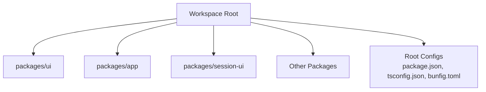
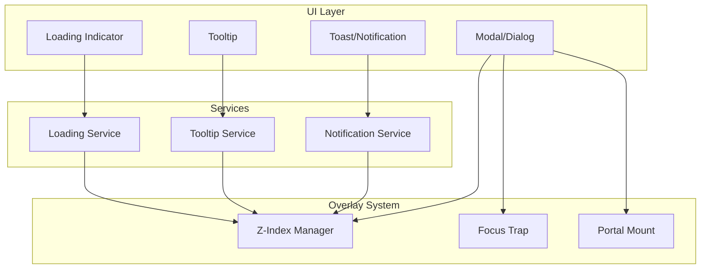
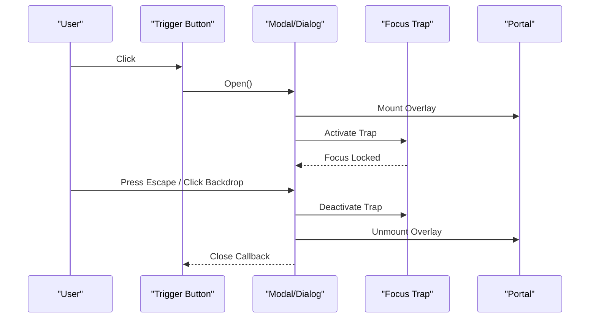
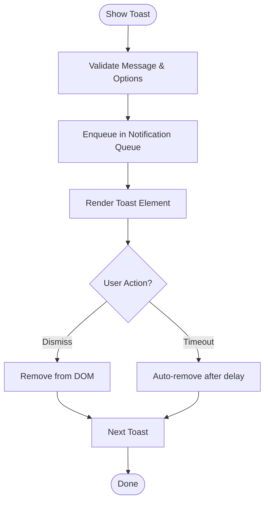
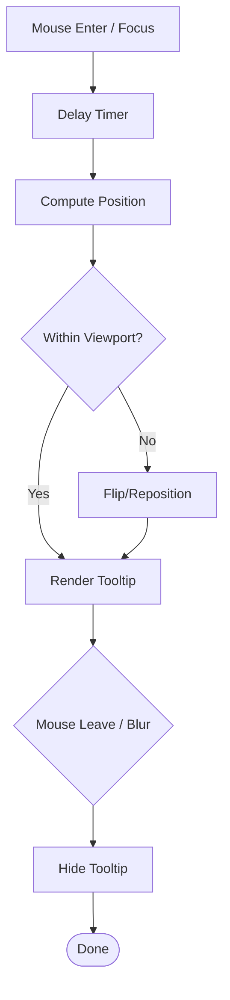
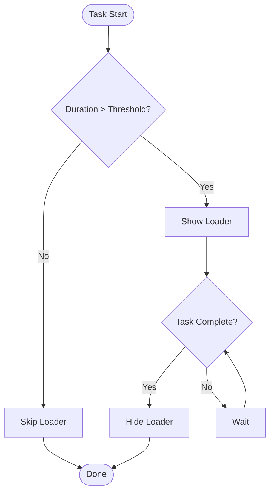

# Feedback Components

<cite>
**Referenced Files in This Document**
- [README.md](file://README.md)
- [package.json](file://package.json)
- [tsconfig.json](file://tsconfig.json)
- [bunfig.toml](file://bunfig.toml)
</cite>

## Table of Contents
1. [Introduction](#introduction)
2. [Project Structure](#project-structure)
3. [Core Components](#core-components)
4. [Architecture Overview](#architecture-overview)
5. [Detailed Component Analysis](#detailed-component-analysis)
6. [Dependency Analysis](#dependency-analysis)
7. [Performance Considerations](#performance-considerations)
8. [Troubleshooting Guide](#troubleshooting-guide)
9. [Conclusion](#conclusion)
10. [Appendices](#appendices)

## Introduction
This document provides comprehensive guidance for implementing feedback components such as modals, dialogs, notifications (toasts), tooltips, and loading indicators within the project’s UI layer. It covers positioning strategies, z-index management, focus trapping, accessible overlays, toast patterns, user interaction handling, animation approaches, performance optimization, and cross-platform compatibility considerations. The goal is to help developers build consistent, accessible, and performant feedback experiences across platforms.

## Project Structure
The repository is a multi-package workspace with a primary UI package under packages/ui. Feedback components are typically implemented as reusable UI primitives that can be composed into higher-level features. Configuration files at the root define tooling and build settings used by the workspace.

[No sources needed since this diagram shows conceptual structure]

**Section sources**
- [README.md:1-50](file://README.md#L1-L50)
- [package.json:1-40](file://package.json#L1-L40)
- [tsconfig.json:1-30](file://tsconfig.json#L1-L30)
- [bunfig.toml:1-30](file://bunfig.toml#L1-L30)

## Core Components
Feedback components commonly include:
- Modal/Dialog: An overlay that captures focus and requires explicit dismissal.
- Toast/Notification: Non-blocking messages that auto-dismiss or persist briefly.
- Tooltip: Contextual hints positioned near trigger elements.
- Loading Indicator: Visual cues indicating ongoing operations.

Key implementation concerns:
- Positioning: Use fixed or absolute positioning relative to viewport or container.
- Z-index Management: Centralized tokens or layers to avoid stacking conflicts.
- Focus Trapping: Ensure keyboard navigation remains within the overlay until dismissed.
- Accessibility: Proper roles, labels, aria attributes, and screen reader announcements.
- Animation: Smooth transitions with reduced-motion support.
- Performance: Efficient re-renders, GPU-accelerated transforms, and minimal layout thrash.

[No sources needed since this section provides general guidance]

## Architecture Overview
A robust feedback system separates concerns into layers:
- Layered Container: Manages z-index stacks and portal mounting.
- Overlay Manager: Controls modal/dialog stacking, focus traps, and backdrop behavior.
- Notification Service: Queues and renders toast notifications with lifecycle control.
- Tooltip Controller: Computes positions and manages visibility around triggers.
- Loading Indicators: Global or scoped loaders with debounced display logic.

[No sources needed since this diagram shows conceptual architecture]

## Detailed Component Analysis

### Modal and Dialog
Responsibilities:
- Render an accessible overlay with proper role and aria attributes.
- Trap focus within the dialog and manage focus restoration on close.
- Handle backdrop clicks, Escape key, and programmatic open/close.
- Support multiple stacked dialogs with correct z-index ordering.

Positioning and Z-Index:
- Mount via portal to ensure top-level rendering.
- Use a centralized z-index stack; increment per open dialog.

Accessibility:
- Use appropriate roles (e.g., dialog/alertdialog).
- Provide aria-labelledby and aria-describedby where applicable.
- Announce changes to assistive technologies.

Animation:
- Fade/scale transitions using CSS transforms and opacity.
- Respect prefers-reduced-motion.

Best Practices:
- Prevent body scroll when modal is open.
- Ensure keyboard accessibility and logical tab order.
- Debounce rapid reopen/close to avoid flicker.

[No sources needed since this section provides general guidance]

### Toast Notifications
Responsibilities:
- Display transient messages with optional actions.
- Queue multiple toasts with controlled stacking.
- Auto-dismiss after a timeout or manual action.

Positioning:
- Fixed position aligned to viewport edges.
- Stacking direction based on count and available space.

Accessibility:
- Use live regions for announcements.
- Provide dismiss controls with clear labels.

Animation:
- Slide-in/out or fade transitions.
- Pause animations on hover/focus if interactive.

Best Practices:
- Limit concurrent toasts to prevent overflow.
- Group related messages.
- Provide sufficient contrast and readable typography.

[No sources needed since this section provides general guidance]

### Tooltips
Responsibilities:
- Show contextual hints near trigger elements.
- Compute optimal placement to avoid clipping.
- Manage show/hide timing and focus states.

Positioning:
- Calculate bounding rectangles and adjust offsets.
- Flip or reposition to stay within viewport bounds.

Accessibility:
- Associate tooltip content with trigger via aria-describedby.
- Hide tooltip from screen readers when not visible.

Animation:
- Subtle fade or slide transitions.
- Avoid heavy effects that impact performance.

Best Practices:
- Debounce frequent reflows.
- Avoid showing tooltips over complex media.
- Respect reduced motion preferences.

[No sources needed since this section provides general guidance]

### Loading Indicators
Responsibilities:
- Provide visual feedback during async operations.
- Support global and scoped loaders.
- Debounce short-lived tasks to avoid flicker.

Positioning:
- Centered overlay for global loaders.
- Inline or inline-block for scoped loaders.

Accessibility:
- Use appropriate roles and aria-busy states.
- Announce start/end of long-running tasks.

Animation:
- Spinners or progress bars with smooth transitions.
- Prefer transform-based animations for performance.

Best Practices:
- Use skeleton screens for perceived performance.
- Avoid blocking interactions unless necessary.
- Provide cancel options for long tasks.

[No sources needed since this section provides general guidance]

## Dependency Analysis
Feedback components should minimize external dependencies and leverage lightweight utilities for:
- DOM measurements and positioning.
- Event handling and focus management.
- Animation and transition helpers.

Recommended patterns:
- Encapsulate z-index tokens in a central configuration.
- Use a single portal manager to avoid duplicate mounts.
- Implement a notification queue service to coordinate toast lifecycles.

[No sources needed since this section provides general guidance]

## Performance Considerations
- Prefer CSS transforms and opacity for animations to leverage GPU acceleration.
- Avoid forced synchronous layouts; batch DOM reads/writes.
- Use requestAnimationFrame for smooth updates.
- Debounce resize and scroll handlers.
- Lazy-mount overlays only when needed.
- Reduce re-renders by memoizing computed values and avoiding unnecessary state updates.
- Respect prefers-reduced-motion to improve accessibility and performance.

[No sources needed since this section provides general guidance]

## Troubleshooting Guide
Common issues and resolutions:
- Z-index conflicts: Centralize z-index tokens and verify portal mount order.
- Focus not trapped: Ensure focus trap activates on open and deactivates on close.
- Tooltip clipping: Recalculate positions on scroll/resize and flip as needed.
- Toast overlap: Implement stacking logic and limit concurrent toasts.
- Animation jank: Switch to transform-based animations and reduce layout thrash.
- Screen reader announcements: Use live regions and update aria attributes dynamically.

[No sources needed since this section provides general guidance]

## Conclusion
Implementing effective feedback components requires careful attention to positioning, z-index management, focus trapping, accessibility, animations, and performance. By following the patterns and best practices outlined here, you can deliver consistent, accessible, and high-quality user feedback across modal dialogs, toasts, tooltips, and loading indicators.

[No sources needed since this section summarizes without analyzing specific files]

## Appendices
- Accessibility Checklist: Roles, aria attributes, keyboard navigation, and screen reader testing.
- Animation Guidelines: Preferred properties, reduced motion support, and performance tips.
- Cross-Platform Notes: Differences in viewport measurement, touch vs mouse events, and browser quirks.

[No sources needed since this section provides general guidance]