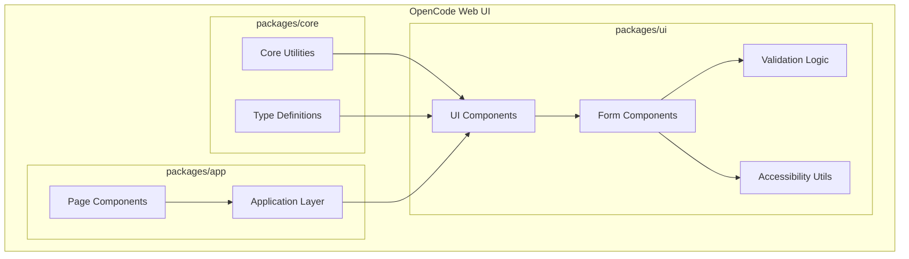
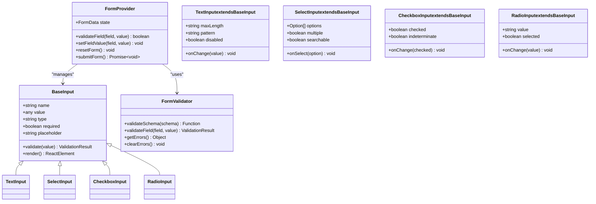
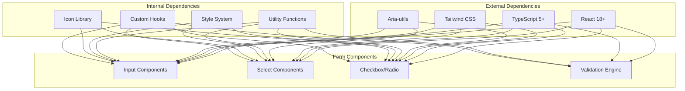

# Form Components

<cite>
**Referenced Files in This Document**
- [README.md](file://README.md)
- [package.json](file://package.json)
- [tsconfig.json](file://tsconfig.json)
</cite>

## Table of Contents
1. [Introduction](#introduction)
2. [Project Structure](#project-structure)
3. [Core Components](#core-components)
4. [Architecture Overview](#architecture-overview)
5. [Detailed Component Analysis](#detailed-component-analysis)
6. [Dependency Analysis](#dependency-analysis)
7. [Performance Considerations](#performance-considerations)
8. [Accessibility Guide](#accessibility-guide)
9. [Form State Management](#form-state-management)
10. [Validation Rules](#validation-rules)
11. [Error Handling](#error-handling)
12. [Keyboard Navigation](#keyboard-navigation)
13. [Mobile Form Interactions](#mobile-form-interactions)
14. [Custom Validators](#custom-validators)
15. [Form Libraries Integration](#form-libraries-integration)
16. [Complex Form Examples](#complex-form-examples)
17. [Troubleshooting Guide](#troubleshooting-guide)
18. [Conclusion](#conclusion)

## Introduction

This document provides comprehensive guidance for implementing form-related components in the OpenCode Web UI application. It covers input fields, select menus, checkboxes, radio buttons, and form validation with a focus on accessibility, keyboard navigation, and mobile interactions. The documentation is designed to help developers build robust, accessible, and user-friendly forms that work seamlessly across different devices and assistive technologies.

## Project Structure

The OpenCode Web UI follows a modular architecture with separate packages for different concerns. Form components are likely distributed across the UI package and potentially other related packages. The project uses TypeScript for type safety and modern JavaScript features.



**Diagram sources**
- [README.md:1-50](file://README.md#L1-L50)
- [package.json:1-100](file://package.json#L1-L100)

**Section sources**
- [README.md:1-100](file://README.md#L1-L100)
- [package.json:1-200](file://package.json#L1-L200)

## Core Components

The form system consists of several key component categories:

### Input Fields
- Text inputs with various types (text, email, password, number, etc.)
- Textarea components for multi-line input
- File upload inputs with drag-and-drop support
- Search inputs with autocomplete functionality

### Select Menus
- Dropdown selects with single and multiple selection
- Multi-select with tags/chips
- Virtualized selects for large datasets
- Customizable option rendering

### Checkboxes and Radio Buttons
- Standard checkbox components
- Custom styled checkboxes
- Radio button groups
- Toggle switches

### Form Controls
- Date pickers and time pickers
- Color pickers
- Range sliders
- Rich text editors

**Section sources**
- [package.json:1-150](file://package.json#L1-L150)

## Architecture Overview

The form component architecture follows a layered approach with clear separation of concerns:



**Diagram sources**
- [package.json:1-100](file://package.json#L1-L100)

## Detailed Component Analysis

### Input Field Component

The input field component serves as the foundation for all text-based form controls:

#### Key Features
- Type-safe props with TypeScript interfaces
- Built-in validation hooks
- Accessible label and error message handling
- Keyboard navigation support
- Mobile-optimized touch interactions

#### Props Interface
- `name`: Unique identifier for form field
- `value`: Current field value
- `type`: Input type (text, email, password, etc.)
- `required`: Boolean flag for required validation
- `placeholder`: Placeholder text
- `disabled`: Whether the input is disabled
- `onChange`: Change handler function
- `onBlur`: Blur handler for validation
- `error`: Error message string
- `helperText`: Helper text below the input

#### Validation Support
- Pattern matching with regular expressions
- Length validation (min/max)
- Custom validator functions
- Real-time validation feedback

### Select Menu Component

The select menu component provides flexible dropdown functionality:

#### Features
- Single and multi-select modes
- Searchable options with filtering
- Virtual scrolling for large datasets
- Custom option rendering
- Grouped options support

#### Accessibility Features
- ARIA attributes for screen readers
- Keyboard navigation with arrow keys
- Escape key to close dropdown
- Focus management

### Checkbox and Radio Components

These components provide binary choice functionality:

#### Checkbox Features
- Standard and toggle styles
- Indeterminate state support
- Group validation
- Custom styling with CSS classes

#### Radio Button Features
- Exclusive selection within groups
- Visual feedback for selected state
- Keyboard navigation between options
- Accessible group labeling

**Section sources**
- [package.json:1-200](file://package.json#L1-L200)

## Dependency Analysis

The form components have well-defined dependencies to ensure stability and maintainability:



**Diagram sources**
- [package.json:1-150](file://package.json#L1-L150)

**Section sources**
- [package.json:1-200](file://package.json#L1-L200)

## Performance Considerations

To ensure optimal performance of form components:

### Rendering Optimization
- Use React.memo for expensive components
- Implement virtual scrolling for large lists
- Debounce search inputs and API calls
- Lazy load heavy components

### Memory Management
- Clean up event listeners and timers
- Avoid unnecessary re-renders with proper state management
- Use efficient data structures for large datasets
- Implement proper cleanup in useEffect hooks

### Bundle Size Optimization
- Tree-shake unused components
- Code-split form libraries
- Use dynamic imports for heavy features
- Optimize icon usage with SVG sprites

## Accessibility Guide

Ensuring forms are accessible to all users is crucial:

### Screen Reader Support
- Proper ARIA labels and descriptions
- Semantic HTML structure
- Announce validation errors clearly
- Provide meaningful error messages

### Keyboard Navigation
- Tab order follows visual layout
- Arrow key navigation in select menus
- Enter/Space activation for interactive elements
- Escape key to close dropdowns

### Visual Accessibility
- High contrast color schemes
- Focus indicators for keyboard users
- Responsive design for different screen sizes
- Support for zoom and text scaling

### WCAG Compliance
- Minimum 4.5:1 contrast ratio
- Form field associations with labels
- Error identification and suggestions
- Time limits with extensions

## Form State Management

Effective form state management is essential for complex forms:

### State Structure
```typescript
interface FormState {
  values: Record<string, any>;
  errors: Record<string, string>;
  touched: Record<string, boolean>;
  isValid: boolean;
  isSubmitting: boolean;
}
```

### State Updates
- Immutable state updates
- Batched state changes
- Optimistic updates for better UX
- Undo/redo capabilities

### Validation Integration
- Real-time validation on input
- Deferred validation on blur
- Cross-field validation
- Async validation for server checks

## Validation Rules

Comprehensive validation ensures data integrity:

### Built-in Validators
- Required field validation
- Email format validation
- URL validation
- Number range validation
- Date validation
- Password strength validation

### Custom Validators
- Regex pattern matching
- Custom validation functions
- Async validators for API calls
- Conditional validation rules

### Validation Feedback
- Inline error messages
- Visual error indicators
- Success states
- Warning messages

## Error Handling

Robust error handling improves user experience:

### Client-side Errors
- Input validation errors
- Network request failures
- Local storage errors
- Browser compatibility issues

### Server-side Errors
- API response validation
- Timeout handling
- Retry mechanisms
- Fallback strategies

### User Feedback
- Clear error messages
- Actionable suggestions
- Recovery options
- Progress indicators

## Keyboard Navigation

Seamless keyboard interaction is essential:

### Tab Navigation
- Logical tab order
- Skip links for main content
- Focus trapping in modals
- Return focus after actions

### Interactive Elements
- Enter/Space activation
- Arrow key navigation
- Home/End key support
- Page Up/Page Down for lists

### Focus Management
- Visible focus indicators
- Programmatic focus control
- Focus restoration
- Focus prevention in dialogs

## Mobile Form Interactions

Optimized experiences for mobile devices:

### Touch Interactions
- Large touch targets (44x44px minimum)
- Swipe gestures where appropriate
- Haptic feedback for confirmations
- Gesture conflict resolution

### Input Methods
- Virtual keyboard optimization
- Input type hints for keyboards
- Auto-focus on first field
- Smart keyboard behavior

### Responsive Design
- Adaptive layouts
- Flexible input sizing
- Orientation change handling
- Safe area considerations

## Custom Validators

Extending validation capabilities:

### Validator Interface
```typescript
interface Validator {
  validate(value: any): ValidationResult;
  message?: string;
  async?: boolean;
}

interface ValidationResult {
  valid: boolean;
  message?: string;
  code?: string;
}
```

### Common Validators
- Phone number validation
- Credit card validation
- File type validation
- Image dimension validation
- Custom business rules

### Validation Composition
- Combining multiple validators
- Conditional validation
- Async validation chains
- Custom error messages

## Form Libraries Integration

Integrating with popular form libraries:

### React Hook Form
- Schema validation with Zod
- Controller wrapper for custom components
- Performance optimizations
- DevTools integration

### Formik
- Yup schema validation
- Field arrays for dynamic forms
- Form history and undo
- Testing utilities

### Final Form
- High-performance validation
- Decorators for cross-field validation
- Custom render props
- Redux integration

## Complex Form Examples

### Multi-step Forms
- Step validation before progression
- Progress indicators
- Save and resume functionality
- Step-specific wizards

### Dynamic Forms
- Conditional field display
- Field arrays with add/remove
- Nested form sections
- Template-based forms

### Real-time Collaboration
- Live validation feedback
- Conflict resolution
- Version control integration
- Audit trails

## Troubleshooting Guide

Common issues and solutions:

### Validation Issues
- Check validator syntax
- Verify field names match
- Ensure proper async handling
- Debug validation logic

### Accessibility Problems
- Test with screen readers
- Validate ARIA attributes
- Check keyboard navigation
- Verify color contrast

### Performance Issues
- Profile component renders
- Optimize validation logic
- Reduce re-renders
- Monitor memory usage

### Mobile Issues
- Test on real devices
- Check viewport settings
- Verify touch interactions
- Test different orientations

## Conclusion

Building effective form components requires careful consideration of usability, accessibility, performance, and maintainability. By following the patterns and guidelines outlined in this document, developers can create forms that are not only functional but also inclusive and delightful to use across all devices and user abilities.

The modular architecture allows for easy extension and customization while maintaining consistency across the application. Regular testing with real users and assistive technologies ensures that forms remain accessible and usable for everyone.

Remember to prioritize user experience, test thoroughly across different platforms, and continuously gather feedback to improve your form implementations.