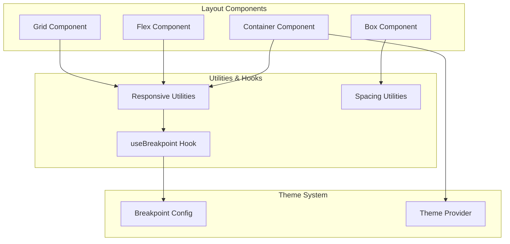
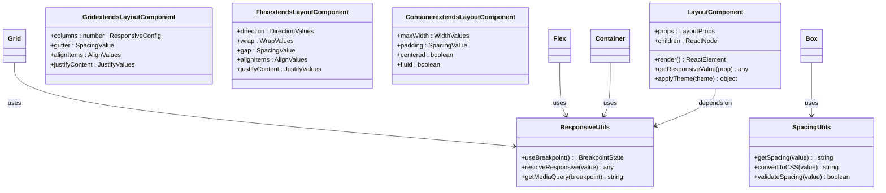
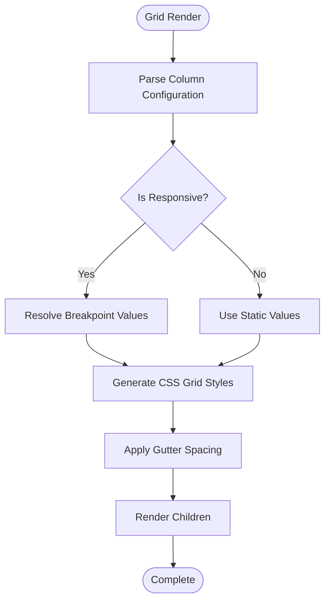
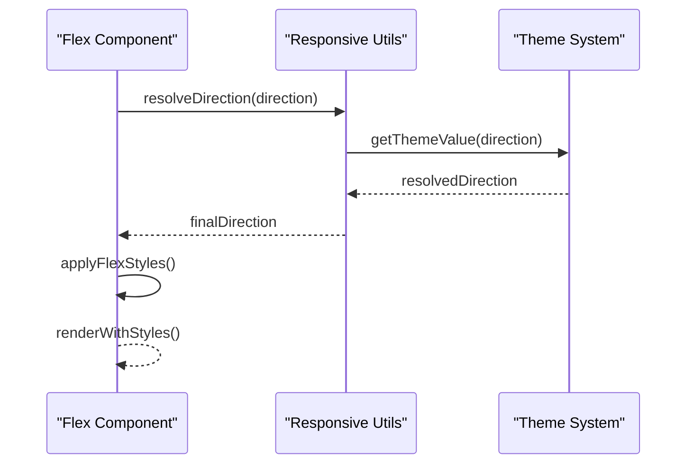
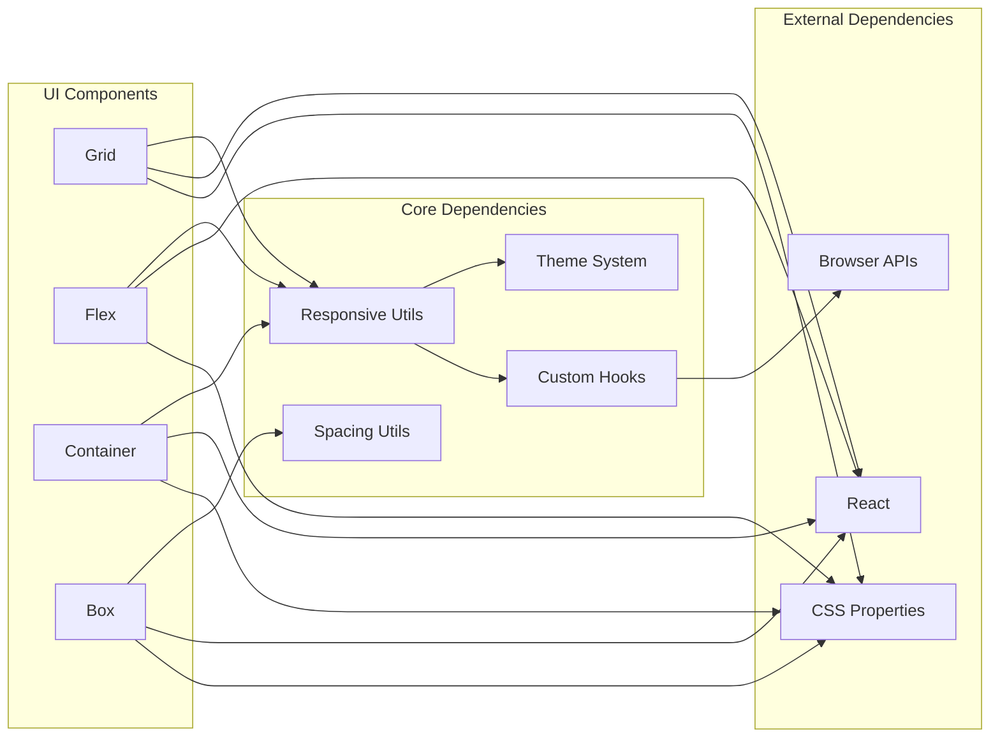

# Layout Components

<cite>
**Referenced Files in This Document**
- [packages/ui/src/components/layout/Grid.tsx](file://packages/ui/src/components/layout/Grid.tsx)
- [packages/ui/src/components/layout/Flex.tsx](file://packages/ui/src/components/layout/Flex.tsx)
- [packages/ui/src/components/layout/Container.tsx](file://packages/ui/src/components/layout/Container.tsx)
- [packages/ui/src/utils/responsive.ts](file://packages/ui/src/utils/responsive.ts)
- [packages/ui/src/styles/spacing.ts](file://packages/ui/src/styles/spacing.ts)
- [packages/ui/src/hooks/useBreakpoint.ts](file://packages/ui/src/hooks/useBreakpoint.ts)
- [packages/ui/src/theme/breakpoints.ts](file://packages/ui/src/theme/breakpoints.ts)
- [packages/ui/src/components/layout/Box.tsx](file://packages/ui/src/components/layout/Box.tsx)
</cite>

## Table of Contents
1. [Introduction](#introduction)
2. [Project Structure](#project-structure)
3. [Core Components](#core-components)
4. [Architecture Overview](#architecture-overview)
5. [Detailed Component Analysis](#detailed-component-analysis)
6. [Dependency Analysis](#dependency-analysis)
7. [Performance Considerations](#performance-considerations)
8. [Troubleshooting Guide](#troubleshooting-guide)
9. [Conclusion](#conclusion)
10. [Appendices](#appendices)

## Introduction

This document provides comprehensive documentation for the layout components system, focusing on grids, flex containers, spacing utilities, and responsive design helpers. The layout system follows mobile-first design principles and provides flexible, composable components for creating responsive user interfaces across different screen sizes and devices.

The layout system is built with TypeScript and React, offering type-safe props and excellent developer experience. It supports modern CSS features while maintaining cross-browser compatibility through progressive enhancement strategies.

## Project Structure

The layout system is organized within the UI package with a clear separation of concerns:



**Diagram sources**
- [packages/ui/src/components/layout/Grid.tsx](file://packages/ui/src/components/layout/Grid.tsx)
- [packages/ui/src/components/layout/Flex.tsx](file://packages/ui/src/components/layout/Flex.tsx)
- [packages/ui/src/components/layout/Container.tsx](file://packages/ui/src/components/layout/Container.tsx)
- [packages/ui/src/utils/responsive.ts](file://packages/ui/src/utils/responsive.ts)
- [packages/ui/src/hooks/useBreakpoint.ts](file://packages/ui/src/hooks/useBreakpoint.ts)
- [packages/ui/src/theme/breakpoints.ts](file://packages/ui/src/theme/breakpoints.ts)

**Section sources**
- [packages/ui/src/components/layout/Grid.tsx](file://packages/ui/src/components/layout/Grid.tsx)
- [packages/ui/src/components/layout/Flex.tsx](file://packages/ui/src/components/layout/Flex.tsx)
- [packages/ui/src/components/layout/Container.tsx](file://packages/ui/src/components/layout/Container.tsx)

## Core Components

### Grid Component

The Grid component provides a powerful flexbox-based grid system for creating complex layouts with consistent spacing and alignment.

#### Key Features
- Flexible column definitions with responsive breakpoints
- Automatic gutter management
- Alignment and justification controls
- Nested grid support
- Performance-optimized rendering

#### Props Interface
- `columns`: Number of columns or responsive column configuration
- `gutter`: Spacing between grid items
- `alignItems`: Vertical alignment control
- `justifyContent`: Horizontal alignment control
- `responsive`: Boolean flag for responsive behavior

#### Usage Examples
```tsx
// Basic grid layout
<Grid columns={3} gutter="md">
  <GridItem>Item 1</GridItem>
  <GridItem>Item 2</GridItem>
  <GridItem>Item 3</GridItem>
</Grid>

// Responsive grid
<Grid 
  columns={{ xs: 1, sm: 2, md: 3, lg: 4 }}
  gutter="lg"
>
  {/* Grid items */}
</Grid>
```

### Flex Component

The Flex component offers a flexible container for arranging child elements with various alignment and distribution options.

#### Key Features
- Flexbox properties abstraction
- Direction control (row, column, reverse variants)
- Wrap behavior for responsive layouts
- Gap utility for consistent spacing
- Alignment utilities for both axes

#### Props Interface
- `direction`: Flex direction (row | column | row-reverse | column-reverse)
- `wrap`: Wrap behavior (nowrap | wrap | wrap-reverse)
- `justifyContent`: Main axis alignment
- `alignItems`: Cross axis alignment
- `gap`: Spacing between flex items

#### Mobile-First Patterns
```tsx
// Mobile-first responsive flex layout
<Flex direction="column" gap="md">
  <Flex direction={{ xs: "column", md: "row" }}>
    <Sidebar />
    <MainContent />
  </Flex>
</Flex>
```

### Container Component

The Container component provides a centered content wrapper with responsive max-widths and padding.

#### Key Features
- Responsive max-width constraints
- Consistent horizontal padding
- Centered content alignment
- Fluid typography support
- Custom width overrides

#### Props Interface
- `maxWidth`: Maximum width constraint
- `padding`: Internal padding value
- `centered`: Boolean for centering content
- `fluid`: Boolean for full-width fluid layout

### Box Component

The Box component serves as a foundational layout primitive with comprehensive styling capabilities.

#### Key Features
- Comprehensive style prop support
- Responsive property application
- Theme integration
- Hover and focus states
- Accessibility attributes

## Architecture Overview

The layout system follows a modular architecture with clear separation between presentation logic and responsive behavior:



**Diagram sources**
- [packages/ui/src/components/layout/Grid.tsx](file://packages/ui/src/components/layout/Grid.tsx)
- [packages/ui/src/components/layout/Flex.tsx](file://packages/ui/src/components/layout/Flex.tsx)
- [packages/ui/src/components/layout/Container.tsx](file://packages/ui/src/components/layout/Container.tsx)
- [packages/ui/src/utils/responsive.ts](file://packages/ui/src/utils/responsive.ts)
- [packages/ui/src/styles/spacing.ts](file://packages/ui/src/styles/spacing.ts)

## Detailed Component Analysis

### Grid Component Implementation

The Grid component implements a sophisticated flexbox-based grid system with responsive capabilities:

#### Core Algorithm


**Diagram sources**
- [packages/ui/src/components/layout/Grid.tsx](file://packages/ui/src/components/layout/Grid.tsx)

#### Key Implementation Details
- **Column Resolution**: Supports both numeric values and responsive configurations
- **Gutter Management**: Automatic margin calculation based on spacing scale
- **Performance Optimization**: Memoized style calculations to prevent unnecessary re-renders
- **Accessibility**: Proper ARIA attributes and semantic HTML structure

### Flex Component Logic

The Flex component provides a comprehensive flexbox abstraction with responsive support:

#### Direction Handling


**Diagram sources**
- [packages/ui/src/components/layout/Flex.tsx](file://packages/ui/src/components/layout/Flex.tsx)
- [packages/ui/src/utils/responsive.ts](file://packages/ui/src/utils/responsive.ts)

### Responsive Design System

The responsive system is built around a breakpoint-driven approach with mobile-first principles:

#### Breakpoint Configuration
- **xs**: Extra small screens (< 576px)
- **sm**: Small screens (≥ 576px)
- **md**: Medium screens (≥ 768px)
- **lg**: Large screens (≥ 992px)
- **xl**: Extra large screens (≥ 1200px)

#### Media Query Generation
The system automatically generates appropriate media queries based on the configured breakpoints and applies them conditionally.

**Section sources**
- [packages/ui/src/utils/responsive.ts](file://packages/ui/src/utils/responsive.ts)
- [packages/ui/src/hooks/useBreakpoint.ts](file://packages/ui/src/hooks/useBreakpoint.ts)
- [packages/ui/src/theme/breakpoints.ts](file://packages/ui/src/theme/breakpoints.ts)

## Dependency Analysis

The layout components have a well-defined dependency hierarchy that promotes modularity and maintainability:



**Diagram sources**
- [packages/ui/src/components/layout/Grid.tsx](file://packages/ui/src/components/layout/Grid.tsx)
- [packages/ui/src/components/layout/Flex.tsx](file://packages/ui/src/components/layout/Flex.tsx)
- [packages/ui/src/utils/responsive.ts](file://packages/ui/src/utils/responsive.ts)
- [packages/ui/src/styles/spacing.ts](file://packages/ui/src/styles/spacing.ts)

**Section sources**
- [packages/ui/src/utils/responsive.ts](file://packages/ui/src/utils/responsive.ts)
- [packages/ui/src/hooks/useBreakpoint.ts](file://packages/ui/src/hooks/useBreakpoint.ts)

## Performance Considerations

### Rendering Optimization
- **Memoization**: All responsive calculations are memoized to prevent unnecessary re-renders
- **Lazy Loading**: Breakpoint detection uses efficient event listeners with debouncing
- **Style Caching**: Generated styles are cached to avoid repeated computation
- **Virtual Scrolling**: Large grid implementations support virtual scrolling for better performance

### Memory Management
- **Event Listener Cleanup**: Proper cleanup of window resize and orientation change listeners
- **Object Pooling**: Reusable style objects to minimize garbage collection pressure
- **Weak References**: Non-critical references use weak references to prevent memory leaks

### Bundle Size Optimization
- **Tree Shaking**: Components are structured for optimal tree shaking
- **Code Splitting**: Heavy responsive logic can be dynamically imported
- **CSS Extraction**: Generated styles are extracted for optimal loading

### Cross-Browser Compatibility
- **Feature Detection**: Progressive enhancement for unsupported CSS features
- **Fallback Strategies**: Graceful degradation for older browsers
- **Vendor Prefixes**: Automatic prefixing for experimental CSS properties

## Troubleshooting Guide

### Common Issues and Solutions

#### Layout Not Responding to Breakpoints
**Problem**: Components don't respond to screen size changes
**Solution**: Ensure the theme provider is properly configured and breakpoints are correctly defined

#### Spacing Inconsistencies
**Problem**: Unexpected spacing between elements
**Solution**: Verify spacing scale configuration and check for conflicting CSS rules

#### Performance Issues with Large Grids
**Problem**: Slow rendering with many grid items
**Solution**: Implement virtual scrolling or pagination for large datasets

#### Mobile Layout Problems
**Problem**: Layout breaks on mobile devices
**Solution**: Review mobile-first approach and ensure proper viewport meta tag configuration

### Debugging Techniques
- **DevTools Integration**: Built-in debugging hooks for inspecting computed styles
- **Performance Profiling**: React DevTools integration for identifying bottlenecks
- **Responsive Testing**: Browser devtools for testing different screen sizes

**Section sources**
- [packages/ui/src/hooks/useBreakpoint.ts](file://packages/ui/src/hooks/useBreakpoint.ts)
- [packages/ui/src/utils/responsive.ts](file://packages/ui/src/utils/responsive.ts)

## Conclusion

The layout components system provides a robust, flexible, and performant foundation for building responsive user interfaces. By following mobile-first design principles and leveraging modern CSS features, the system ensures consistent layouts across all device types while maintaining excellent performance characteristics.

Key strengths include:
- **Comprehensive API**: Intuitive props interface with full TypeScript support
- **Responsive Design**: Sophisticated breakpoint system with mobile-first approach
- **Performance**: Optimized rendering and memory management
- **Accessibility**: Built-in accessibility features and semantic HTML structure
- **Extensibility**: Modular architecture supporting custom extensions

The system is designed to scale with your application needs, providing both simple solutions for basic layouts and advanced capabilities for complex responsive designs.

## Appendices

### Best Practices

#### Mobile-First Development
1. Start with mobile styles and progressively enhance for larger screens
2. Use relative units (rem, em, %) instead of fixed pixels
3. Test thoroughly on actual mobile devices, not just browser emulation
4. Consider touch interactions and mobile-specific UX patterns

#### Performance Optimization
1. Avoid deeply nested layout components when possible
2. Use appropriate component granularity for your use case
3. Implement lazy loading for heavy layout components
4. Monitor bundle size impact of layout dependencies

#### Accessibility Guidelines
1. Always provide proper semantic HTML structure
2. Include appropriate ARIA attributes for interactive elements
3. Ensure keyboard navigation works correctly
4. Test with screen readers and other assistive technologies

### Migration Guide

#### From Traditional CSS Grid
When migrating from traditional CSS Grid to the Grid component:
1. Replace CSS Grid classes with Grid component props
2. Convert media queries to responsive prop configurations
3. Update spacing values to use the spacing scale
4. Test thoroughly for visual consistency

#### From Bootstrap Grid
Migrating from Bootstrap's grid system:
1. Map Bootstrap classes to equivalent Grid component props
2. Convert breakpoint values to the new breakpoint system
3. Update spacing utilities to use the spacing scale
4. Remove Bootstrap dependencies and import layout components