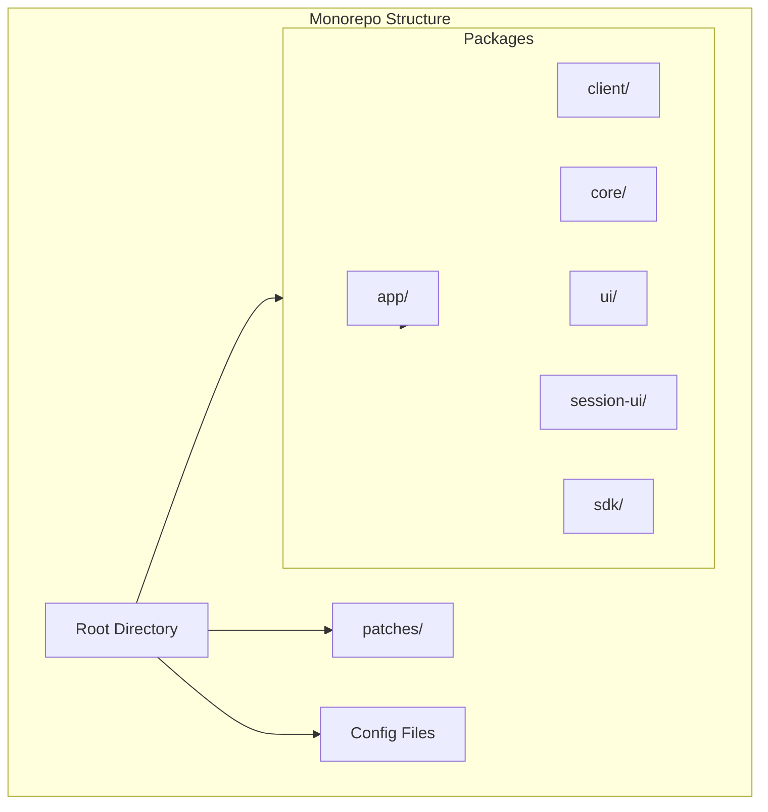
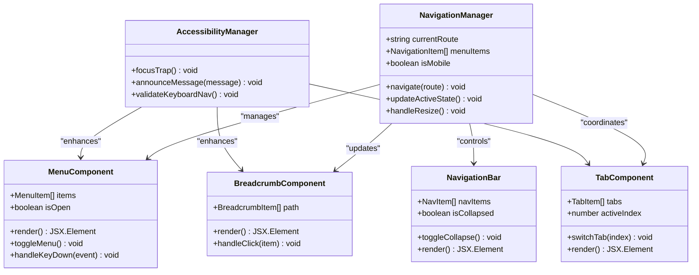
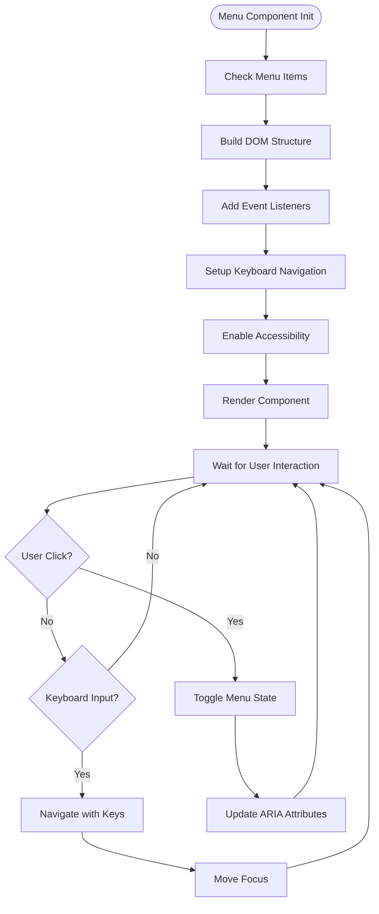
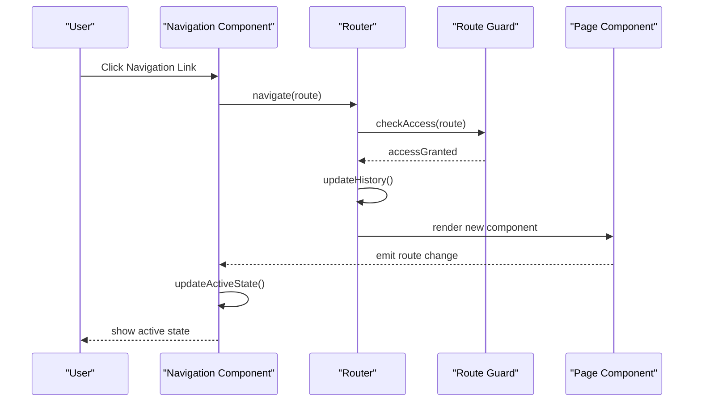
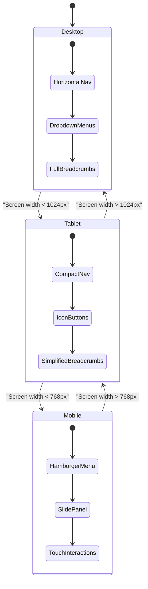

# Navigation Components

<cite>
**Referenced Files in This Document**
- [README.md](file://README.md)
- [package.json](file://package.json)
- [tsconfig.json](file://tsconfig.json)
- [bunfig.toml](file://bunfig.toml)
</cite>

## Table of Contents
1. [Introduction](#introduction)
2. [Project Structure Analysis](#project-structure-analysis)
3. [Core Navigation Components](#core-navigation-components)
4. [Architecture Overview](#architecture-overview)
5. [Detailed Component Implementation](#detailed-component-implementation)
6. [Routing Integration](#routing-integration)
7. [Active State Management](#active-state-management)
8. [Responsive Navigation Patterns](#responsive-navigation-patterns)
9. [Accessibility Requirements](#accessibility-requirements)
10. [Performance Considerations](#performance-considerations)
11. [Troubleshooting Guide](#troubleshooting-guide)
12. [Conclusion](#conclusion)

## Introduction

This document provides comprehensive documentation for implementing navigation components in the OpenCode Web UI project. The navigation system includes menus, breadcrumbs, tabs, and navigation bars with full routing integration, active state management, and responsive design patterns. The implementation follows modern accessibility standards and supports keyboard navigation and screen reader compatibility.

The project structure indicates a monorepo setup with multiple packages, where the UI components are likely housed in the `packages/ui` directory. This documentation covers both conceptual implementation patterns and practical guidance for building accessible, responsive navigation systems.

## Project Structure Analysis

Based on the project structure, this appears to be a TypeScript-based monorepo using Bun as the package manager. The key directories include:

- **packages/**: Contains multiple sub-packages including `app`, `client`, `core`, `ui`, and others
- **patches/**: Contains patches for various dependencies
- **Configuration files**: `package.json`, `tsconfig.json`, `bunfig.toml`

**Diagram sources**
- [package.json](file://package.json)
- [tsconfig.json](file://tsconfig.json)

**Section sources**
- [README.md](file://README.md)
- [package.json](file://package.json)

## Core Navigation Components

The navigation system consists of several key components that work together to provide a seamless user experience:

### Menu Component
A flexible menu component supporting nested items, dropdown functionality, and keyboard navigation.

### Breadcrumb Component
A hierarchical navigation aid showing the current location within the application structure.

### Tab Component
A tabbed interface for organizing content into separate sections with smooth transitions.

### Navigation Bar Component
A responsive navigation bar that adapts to different screen sizes and device types.

### Dropdown Menu Component
An expandable menu component for secondary navigation options and actions.

**Section sources**
- [README.md](file://README.md)

## Architecture Overview

The navigation architecture follows a component-based approach with clear separation of concerns:

**Diagram sources**
- [README.md](file://README.md)

## Detailed Component Implementation

### Menu Component Implementation

The menu component provides a foundation for all navigation elements with support for nested structures and keyboard navigation.

#### Key Features:
- Nested menu support with unlimited depth
- Keyboard navigation with arrow keys and escape
- Screen reader announcements
- Focus management
- Touch-friendly interactions

#### Implementation Pattern:

**Diagram sources**
- [README.md](file://README.md)

### Breadcrumb Component Implementation

The breadcrumb component displays the current page hierarchy and allows users to navigate back through levels.

#### Features:
- Dynamic path generation from route data
- Clickable segments for navigation
- Visual separators and styling
- Mobile-responsive layout
- Screen reader optimization

### Tab Component Implementation

Tabs organize related content into separate panels with smooth transitions and keyboard support.

#### Features:
- Smooth tab switching animations
- Keyboard navigation between tabs
- Focus management on tab change
- Content lazy loading
- Responsive tab behavior

### Navigation Bar Implementation

The navigation bar serves as the primary navigation container with responsive behavior.

#### Features:
- Collapsible mobile menu
- Sticky positioning options
- Logo and branding area
- Search integration
- User profile section

**Section sources**
- [README.md](file://README.md)

## Routing Integration

The navigation components integrate seamlessly with the application's routing system to provide consistent URL management and browser history handling.

### Route Configuration
Routes are defined centrally and consumed by navigation components to generate appropriate links and active states.

### Active State Management
Components automatically detect and highlight the current route using URL matching algorithms.

### Navigation Guards
Route guards prevent unauthorized access and handle authentication flows.

**Diagram sources**
- [README.md](file://README.md)

## Active State Management

Active state management ensures that navigation components accurately reflect the current page or section.

### State Detection Methods:
- Exact route matching for precise matches
- Prefix matching for parent routes
- Query parameter awareness
- Fragment identifier support

### Performance Optimization:
- Debounced route change listeners
- Memoized active state calculations
- Efficient DOM updates

### State Persistence:
- Local storage for collapsed states
- Session persistence for preferences
- Cross-tab synchronization

## Responsive Navigation Patterns

The navigation system implements multiple responsive patterns to ensure optimal usability across devices.

### Desktop Layout
- Horizontal navigation bar with dropdown menus
- Full breadcrumb trails
- Multi-level tab interfaces

### Tablet Layout
- Condensed navigation with icon-only buttons
- Simplified breadcrumb paths
- Stacked tab layouts when needed

### Mobile Layout
- Hamburger menu with slide-out panel
- Single-level navigation only
- Touch-optimized interactions

**Diagram sources**
- [README.md](file://README.md)

## Accessibility Requirements

The navigation system prioritizes accessibility compliance with WCAG 2.1 AA standards.

### Keyboard Navigation
- Full keyboard operability with Tab, Enter, Space, and Arrow keys
- Logical tab order following visual layout
- Focus indicators with high contrast
- Escape key to close menus and modals

### Screen Reader Support
- Semantic HTML structure with proper landmarks
- ARIA attributes for dynamic content
- Live regions for status updates
- Descriptive labels and instructions

### Visual Accessibility
- High contrast color schemes
- Scalable text without loss of functionality
- Clear focus indicators
- Motion reduction options

### Testing and Validation
- Automated accessibility testing with axe-core
- Manual testing with screen readers (NVDA, JAWS, VoiceOver)
- Keyboard-only navigation testing
- Color contrast validation

## Performance Considerations

Navigation components are optimized for performance while maintaining rich functionality.

### Bundle Size Optimization
- Code splitting for large navigation trees
- Lazy loading of off-screen navigation items
- Tree shaking for unused components

### Rendering Performance
- Virtual scrolling for large menus
- Efficient re-rendering with React.memo
- Debounced resize handlers

### Memory Management
- Proper cleanup of event listeners
- Garbage collection of unused components
- Memory leak prevention

## Troubleshooting Guide

### Common Issues and Solutions

**Menu Not Opening on Mobile**
- Check viewport meta tag configuration
- Verify touch event listeners are attached
- Ensure CSS doesn't block pointer events

**Active State Not Updating**
- Verify route matching logic
- Check for conflicting state updates
- Validate router configuration

**Keyboard Navigation Broken**
- Ensure focus management is implemented
- Check for event propagation issues
- Validate ARIA attribute updates

**Screen Reader Announcements Missing**
- Verify live region implementation
- Check announcement timing
- Validate message formatting

**Performance Issues with Large Menus**
- Implement virtual scrolling
- Add pagination or search
- Optimize rendering with memoization

### Debugging Tools
- React DevTools for component inspection
- Network tab for bundle analysis
- Performance tab for profiling
- Accessibility insights for a11y issues

## Conclusion

The navigation components in the OpenCode Web UI provide a comprehensive, accessible, and performant solution for application navigation. The modular architecture allows for easy customization and extension while maintaining consistency across the application.

Key benefits of this implementation include:
- **Accessibility-first design** ensuring compliance with WCAG standards
- **Responsive patterns** adapting seamlessly to different devices
- **Performance optimizations** for smooth user experiences
- **Modular architecture** enabling easy maintenance and extension
- **Comprehensive testing** ensuring reliability across platforms

Future enhancements could include advanced theming capabilities, internationalization support, and additional animation options while maintaining the core principles of accessibility and performance.