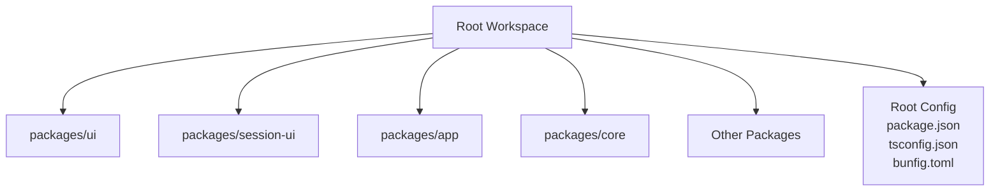
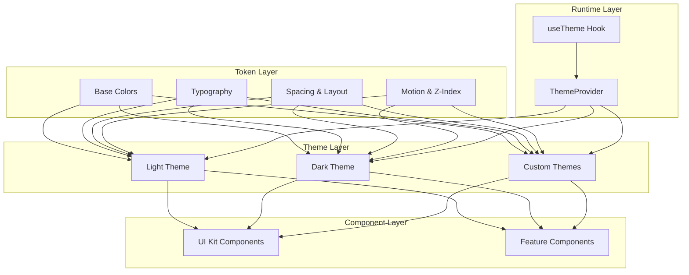
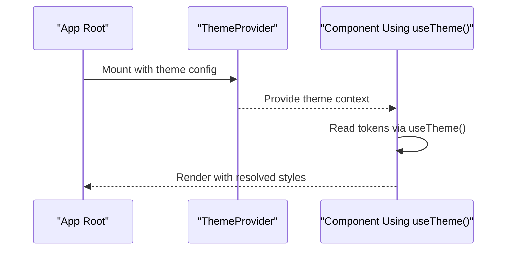
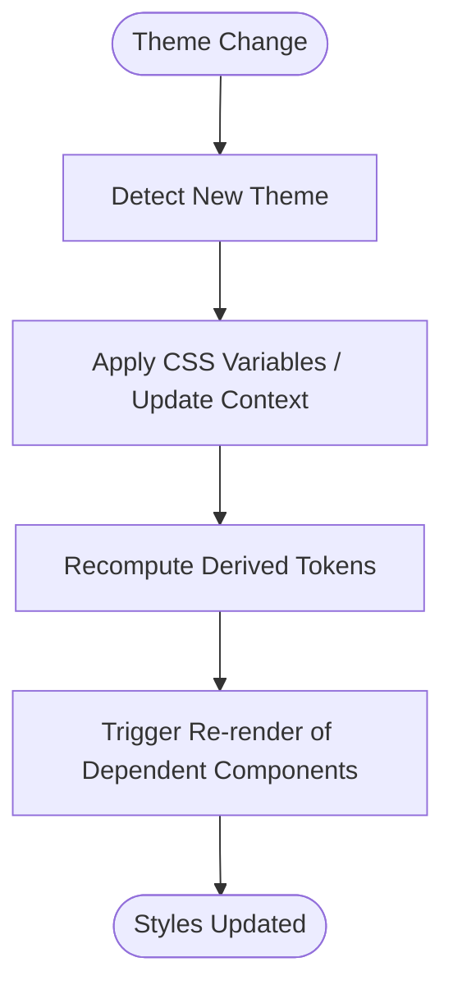
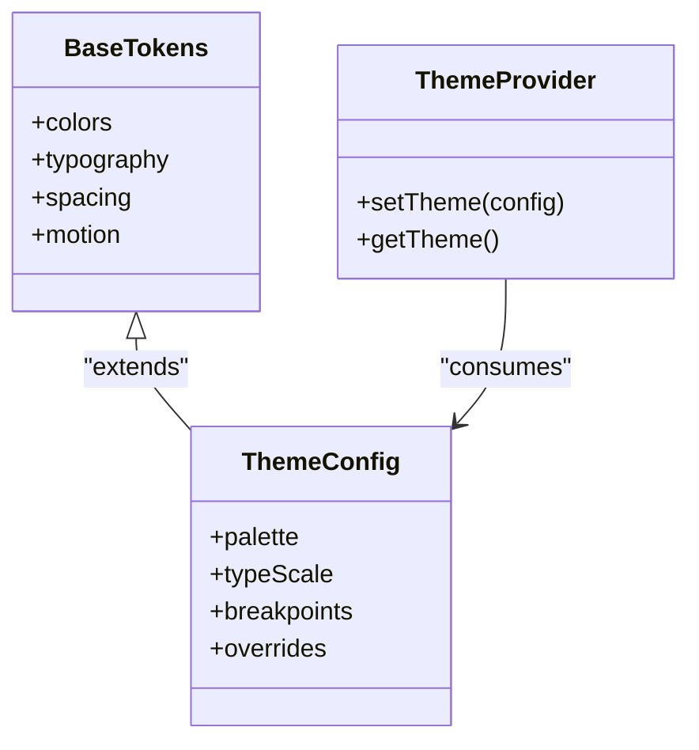
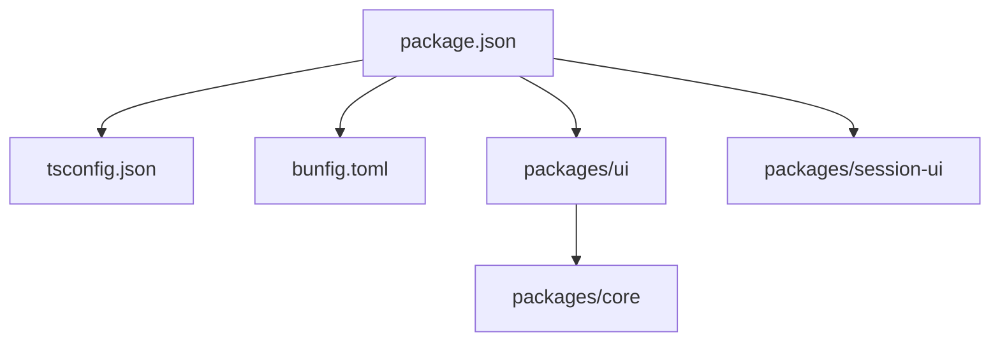

# Styling and Theming System

<cite>
**Referenced Files in This Document**
- [README.md](file://README.md)
- [package.json](file://package.json)
- [tsconfig.json](file://tsconfig.json)
- [bunfig.toml](file://bunfig.toml)
</cite>

## Table of Contents
1. [Introduction](#introduction)
2. [Project Structure](#project-structure)
3. [Core Components](#core-components)
4. [Architecture Overview](#architecture-overview)
5. [Detailed Component Analysis](#detailed-component-analysis)
6. [Dependency Analysis](#dependency-analysis)
7. [Performance Considerations](#performance-considerations)
8. [Troubleshooting Guide](#troubleshooting-guide)
9. [Conclusion](#conclusion)
10. [Appendices](#appendices)

## Introduction
This document explains the styling and theming system for the project, focusing on CSS-in-JS patterns, theme configuration, color systems, typography scales, and design tokens. It also provides guidance for creating custom themes, overriding component styles, and implementing dark mode support. Where applicable, it highlights performance considerations, CSS optimization strategies, and practices to maintain design consistency across the application.

## Project Structure
The repository is organized as a multi-package workspace with several packages under packages/. The UI-related code is likely located within the ui package and possibly session-ui, while shared configuration and build settings are defined at the root level.

**Diagram sources**
- [package.json:1-200](file://package.json#L1-L200)
- [tsconfig.json:1-200](file://tsconfig.json#L1-L200)
- [bunfig.toml:1-200](file://bunfig.toml#L1-L200)

**Section sources**
- [README.md:1-200](file://README.md#L1-L200)
- [package.json:1-200](file://package.json#L1-L200)
- [tsconfig.json:1-200](file://tsconfig.json#L1-L200)
- [bunfig.toml:1-200](file://bunfig.toml#L1-L200)

## Core Components
- Theme Configuration: Centralized definitions for colors, typography, spacing, breakpoints, and other design tokens.
- Color System: Semantic color tokens (e.g., primary, secondary, surface, text) with light/dark variants.
- Typography Scale: Consistent type scale (font families, sizes, weights, line heights).
- Design Tokens: Reusable values for spacing, radii, shadows, z-index, and motion.
- CSS-in-JS Patterns: Runtime or compile-time style generation using libraries such as styled-components, Emotion, or vanilla-extract; dynamic theme resolution based on context.
- Dark Mode Support: Theme switching via context/state, CSS variables, or runtime token mapping.
- Component Style Overrides: Layered approach combining default theme tokens with local overrides and composition utilities.

[No sources needed since this section doesn't analyze specific files]

## Architecture Overview
The theming architecture typically follows a layered model:
- Token Layer: Base design tokens (colors, type, spacing).
- Theme Layer: Semantic tokens derived from base tokens (e.g., brand colors, elevation).
- Component Layer: Component-specific styles that consume semantic tokens and allow overrides.
- Runtime Layer: Theme provider and context to switch between themes (light/dark/custom).

[No sources needed since this diagram shows conceptual workflow, not actual code structure]

## Detailed Component Analysis

### Theme Provider and Context
- Purpose: Supplies the active theme to the component tree and exposes hooks for consuming tokens.
- Responsibilities:
  - Initialize theme state (light/dark/custom).
  - Merge user-provided theme overrides.
  - Expose a hook to access tokens and helpers.
- Typical API:
  - <ThemeProvider theme={...}>
  - useTheme() returns current theme object and setters.

[No sources needed since this diagram shows conceptual workflow, not actual code structure]

### Color System and Dark Mode
- Color Tokens:
  - Semantic names (primary, secondary, success, warning, error, neutral).
  - Light/Dark variants per token.
- Implementation Approaches:
  - CSS Variables: Define :root variables for light and [data-theme="dark"] overrides.
  - Runtime Mapping: Map tokens to computed values at render time.
- Switching Mechanism:
  - Toggle data attribute or theme context value.
  - Ensure all components read from tokens rather than hard-coded colors.

[No sources needed since this diagram shows conceptual workflow, not actual code structure]

### Typography Scale and Spacing
- Typography:
  - Font families, sizes, weights, line-heights, letter-spacing.
  - Type scale tokens (e.g., h1-h6, body, caption).
- Spacing:
  - Consistent spacing scale (e.g., 4px grid).
  - Layout tokens for padding, margins, gaps.
- Usage:
  - Components should reference tokens instead of raw values.
  - Provide helper functions for responsive scaling.

[No sources needed since this section doesn't analyze specific files]

### CSS-in-JS Patterns
- Options:
  - styled-components/Emotion: Runtime CSS generation with props/theme.
  - vanilla-extract/CSS Modules: Compile-time CSS extraction and scoping.
- Best Practices:
  - Keep styles close to components but abstract tokens into theme.
  - Avoid inline heavy computations; prefer memoization.
  - Use composition utilities to reduce duplication.

[No sources needed since this section doesn't analyze specific files]

### Creating Custom Themes
- Steps:
  - Extend base tokens with brand-specific values.
  - Override semantic tokens where necessary.
  - Provide theme factory or configuration object.
  - Wrap app with ThemeProvider using custom theme.
- Example Flow:
  - Define custom palette and typography.
  - Merge with defaults.
  - Inject into theme context.

[No sources needed since this diagram shows conceptual workflow, not actual code structure]

### Overriding Component Styles
- Strategies:
  - Theme-level overrides for global changes.
  - Component-level props for localized adjustments.
  - CSS layering and specificity management.
- Guidelines:
  - Prefer token overrides over direct CSS hacks.
  - Document override points in component APIs.
  - Test visual regression after overrides.

[No sources needed since this section doesn't analyze specific files]

### Implementing Dark Mode Support
- Approach:
  - Maintain light/dark token sets.
  - Use data attributes or context to toggle.
  - Ensure all components rely on tokens.
- Performance:
  - Minimize re-renders by batching theme updates.
  - Use CSS variables for instant switches without JS recalculation when possible.

[No sources needed since this section doesn't analyze specific files]

## Dependency Analysis
- Build and Tooling:
  - Package manager and scripts defined in package.json.
  - TypeScript configuration in tsconfig.json.
  - Bun configuration in bunfig.toml.
- UI Dependencies:
  - Likely includes React/Solid, CSS-in-JS library, and design system utilities.
- Inter-Package Dependencies:
  - ui may depend on core schema/types.
  - session-ui may extend ui components.

**Diagram sources**
- [package.json:1-200](file://package.json#L1-L200)
- [tsconfig.json:1-200](file://tsconfig.json#L1-L200)
- [bunfig.toml:1-200](file://bunfig.toml#L1-L200)

**Section sources**
- [package.json:1-200](file://package.json#L1-L200)
- [tsconfig.json:1-200](file://tsconfig.json#L1-L200)
- [bunfig.toml:1-200](file://bunfig.toml#L1-L200)

## Performance Considerations
- CSS Optimization:
  - Extract static CSS where possible (vanilla-extract/CSS modules).
  - Avoid excessive runtime style generation; memoize computed styles.
  - Leverage CSS variables for theme switching to minimize reflows.
- Rendering Efficiency:
  - Batch theme updates to avoid multiple re-renders.
  - Use context selectors to limit re-renders to consumers that need updated tokens.
- Bundle Size:
  - Tree-shake unused styles and tokens.
  - Lazy-load non-critical theme assets.
- Accessibility:
  - Ensure sufficient contrast ratios in both light and dark modes.
  - Provide keyboard and screen reader-friendly toggles.

[No sources needed since this section provides general guidance]

## Troubleshooting Guide
- Common Issues:
  - Theme not applied: Verify provider wrapping and context consumption.
  - Inconsistent colors: Check token usage vs. hardcoded values.
  - Dark mode flicker: Ensure initial theme matches system preference and apply early.
- Debugging Tips:
  - Inspect CSS variables and computed tokens in dev tools.
  - Log theme context values during transitions.
  - Use visual regression tests to catch unintended changes.

[No sources needed since this section provides general guidance]

## Conclusion
A robust styling and theming system hinges on clear separation of concerns: base tokens, semantic themes, component styles, and runtime context. By standardizing design tokens, leveraging CSS-in-JS effectively, and optimizing for performance and accessibility, teams can maintain consistent, scalable, and adaptable UIs across light, dark, and custom themes.

[No sources needed since this section summarizes without analyzing specific files]

## Appendices
- Quick Start Checklist:
  - Define base tokens and semantic themes.
  - Implement ThemeProvider and useTheme hook.
  - Replace hardcoded values with tokens in components.
  - Add dark mode toggle and test contrast.
  - Optimize bundle and re-renders.
- References:
  - Review package.json scripts and dependencies.
  - Align TypeScript paths and module resolution.
  - Configure Bun for efficient builds.

[No sources needed since this section provides general guidance]