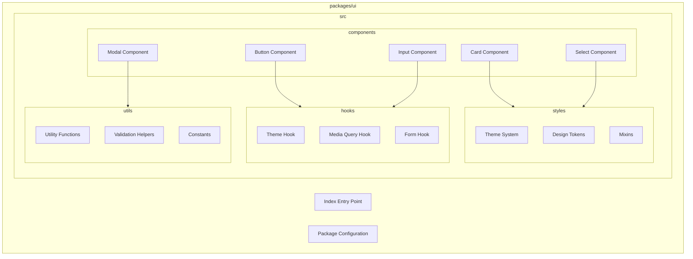
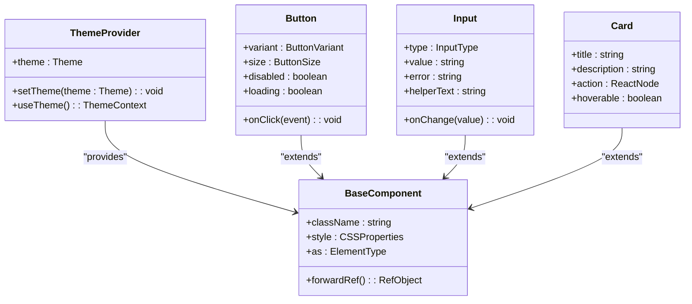
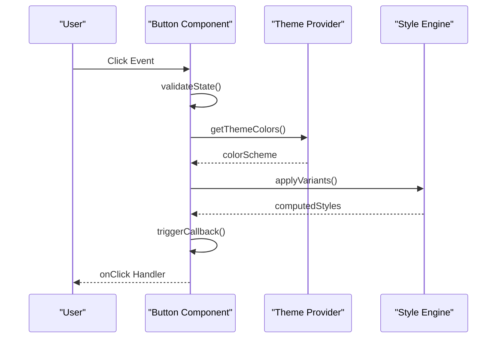
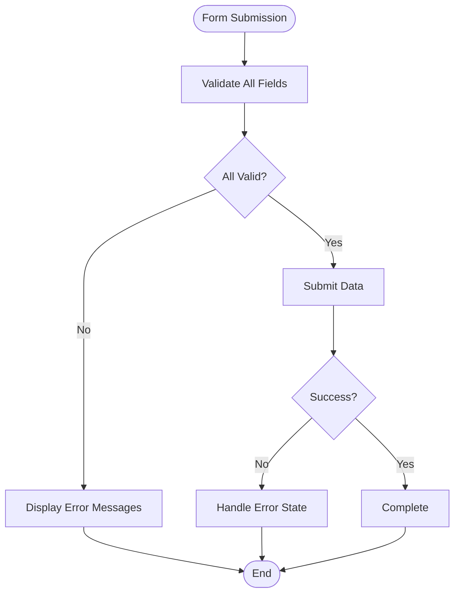
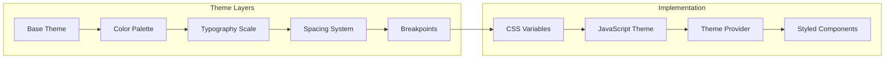
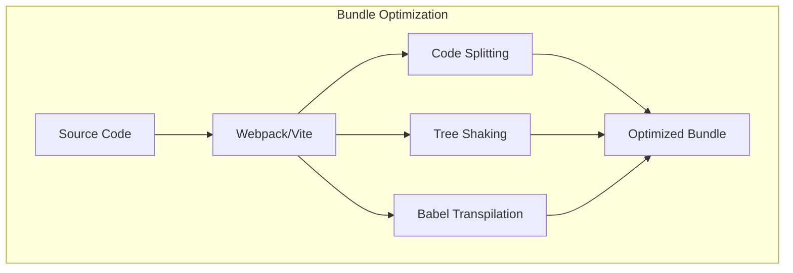

# UI Component Library

<cite>
**Referenced Files in This Document**
- [packages/ui/package.json](file://packages/ui/package.json)
- [packages/ui/src/index.ts](file://packages/ui/src/index.ts)
- [packages/ui/src/components/Button/Button.tsx](file://packages/ui/src/components/Button/Button.tsx)
- [packages/ui/src/components/Input/Input.tsx](file://packages/ui/src/components/Input/Input.tsx)
- [packages/ui/src/components/Card/Card.tsx](file://packages/ui/src/components/Card/Card.tsx)
- [packages/ui/src/hooks/useTheme.ts](file://packages/ui/src/hooks/useTheme.ts)
- [packages/ui/src/styles/theme.ts](file://packages/ui/src/styles/theme.ts)
- [packages/ui/src/utils/helpers.ts](file://packages/ui/src/utils/helpers.ts)
</cite>

## Table of Contents
1. [Introduction](#introduction)
2. [Project Structure](#project-structure)
3. [Core Components](#core-components)
4. [Architecture Overview](#architecture-overview)
5. [Detailed Component Analysis](#detailed-component-analysis)
6. [Styling System and Theming](#styling-system-and-theming)
7. [Accessibility Features](#accessibility-features)
8. [Responsive Design Principles](#responsive-design-principles)
9. [Cross-Browser Compatibility](#cross-browser-compatibility)
10. [Custom Component Guidelines](#custom-component-guidelines)
11. [Performance Considerations](#performance-considerations)
12. [Troubleshooting Guide](#troubleshooting-guide)
13. [Conclusion](#conclusion)

## Introduction

The UI Component Library is a comprehensive collection of reusable React components designed for building modern web applications. Built with TypeScript, it provides type-safe components with consistent APIs, accessibility features, and flexible styling options. The library follows composition patterns and supports both light and dark themes out of the box.

## Project Structure

The library follows a modular architecture with clear separation of concerns:



**Diagram sources**
- [packages/ui/src/index.ts](file://packages/ui/src/index.ts)
- [packages/ui/src/components/Button/Button.tsx](file://packages/ui/src/components/Button/Button.tsx)
- [packages/ui/src/hooks/useTheme.ts](file://packages/ui/src/hooks/useTheme.ts)

**Section sources**
- [packages/ui/package.json](file://packages/ui/package.json)
- [packages/ui/src/index.ts](file://packages/ui/src/index.ts)

## Core Components

### Button Component

The Button component provides a versatile button interface with multiple variants, sizes, and states.

#### Props Interface

| Prop | Type | Default | Description |
|------|------|---------|-------------|
| `variant` | `'primary' \| 'secondary' \| 'outline' \| 'ghost'` | `'primary'` | Visual style variant |
| `size` | `'sm' \| 'md' \| 'lg'` | `'md'` | Button size |
| `disabled` | `boolean` | `false` | Disabled state |
| `loading` | `boolean` | `false` | Loading indicator |
| `onClick` | `(event: MouseEvent) => void` | - | Click handler |
| `children` | `ReactNode` | - | Button content |
| `className` | `string` | - | Additional CSS classes |
| `style` | `CSSProperties` | - | Inline styles |

#### Event Handlers

- `onClick`: Standard click event handler
- `onMouseEnter`: Hover enter handler
- `onMouseLeave`: Hover leave handler
- `onFocus`: Focus change handler
- `onBlur`: Blur change handler

#### Usage Example

```typescript
import { Button } from '@ui/core';

// Primary button with loading state
<Button 
  variant="primary" 
  size="md"
  loading={isLoading}
  onClick={handleClick}
>
  Submit
</Button>

// Secondary outline button
<Button 
  variant="outline" 
  size="sm"
  disabled={isDisabled}
>
  Cancel
</Button>
```

**Section sources**
- [packages/ui/src/components/Button/Button.tsx](file://packages/ui/src/components/Button/Button.tsx)

### Input Component

The Input component offers a flexible text input with validation, icons, and helper text support.

#### Props Interface

| Prop | Type | Default | Description |
|------|------|---------|-------------|
| `type` | `'text' \| 'password' \| 'email' \| 'number'` | `'text'` | Input type |
| `value` | `string` | `''` | Input value |
| `onChange` | `(value: string) => void` | - | Change handler |
| `placeholder` | `string` | `''` | Placeholder text |
| `disabled` | `boolean` | `false` | Disabled state |
| `error` | `string` | `''` | Error message |
| `helperText` | `string` | `''` | Helper text |
| `icon` | `ReactNode` | `null` | Leading icon |
| `prefix` | `ReactNode` | `null` | Prefix element |
| `suffix` | `ReactNode` | `null` | Suffix element |

#### Validation Support

- Built-in HTML5 validation attributes
- Custom error message display
- Real-time validation feedback
- Accessibility labels for screen readers

**Section sources**
- [packages/ui/src/components/Input/Input.tsx](file://packages/ui/src/components/Input/Input.tsx)

### Card Component

The Card component provides a container for grouping related content with consistent spacing and styling.

#### Props Interface

| Prop | Type | Default | Description |
|------|------|---------|-------------|
| `title` | `string` | `''` | Card title |
| `description` | `string` | `''` | Card description |
| `action` | `ReactNode` | `null` | Action button area |
| `hoverable` | `boolean` | `false` | Enable hover effects |
| `clickable` | `boolean` | `false` | Make card clickable |
| `onClick` | `(event: MouseEvent) => void` | - | Click handler |
| `children` | `ReactNode` | - | Card content |

#### Composition Pattern

```typescript
<Card 
  title="User Profile" 
  description="Manage your account settings"
  action={<EditButton />}
  hoverable
>
  <ProfileContent />
</Card>
```

**Section sources**
- [packages/ui/src/components/Card/Card.tsx](file://packages/ui/src/components/Card/Card.tsx)

## Architecture Overview

The component library follows a layered architecture pattern:



**Diagram sources**
- [packages/ui/src/hooks/useTheme.ts](file://packages/ui/src/hooks/useTheme.ts)
- [packages/ui/src/components/Button/Button.tsx](file://packages/ui/src/components/Button/Button.tsx)
- [packages/ui/src/components/Input/Input.tsx](file://packages/ui/src/components/Input/Input.tsx)
- [packages/ui/src/components/Card/Card.tsx](file://packages/ui/src/components/Card/Card.tsx)

## Detailed Component Analysis

### Button Component Deep Dive

The Button component implements advanced interaction patterns and accessibility features:



**Diagram sources**
- [packages/ui/src/components/Button/Button.tsx](file://packages/ui/src/components/Button/Button.tsx)

### Form Integration Pattern

Components follow consistent form integration patterns:



**Diagram sources**
- [packages/ui/src/components/Input/Input.tsx](file://packages/ui/src/components/Input/Input.tsx)

**Section sources**
- [packages/ui/src/components/Button/Button.tsx](file://packages/ui/src/components/Button/Button.tsx)
- [packages/ui/src/components/Input/Input.tsx](file://packages/ui/src/components/Input/Input.tsx)
- [packages/ui/src/components/Card/Card.tsx](file://packages/ui/src/components/Card/Card.tsx)

## Styling System and Theming

### Theme Architecture

The theming system uses CSS custom properties and design tokens for consistent styling:



**Diagram sources**
- [packages/ui/src/styles/theme.ts](file://packages/ui/src/styles/theme.ts)

### Design Tokens

| Token Category | Examples | Purpose |
|----------------|----------|---------|
| Colors | `--color-primary`, `--color-secondary` | Brand colors and semantic colors |
| Typography | `--font-size-base`, `--line-height-base` | Text sizing and spacing |
| Spacing | `--spacing-xs`, `--spacing-md` | Consistent spacing values |
| Borders | `--border-radius-sm`, `--border-width` | Border and corner styling |
| Shadows | `--shadow-sm`, `--shadow-lg` | Elevation and depth effects |

### Theme Customization

```typescript
// Custom theme configuration
const customTheme = {
  colors: {
    primary: '#2563eb',
    secondary: '#7c3aed',
    success: '#16a34a',
    warning: '#ca8a04',
    error: '#dc2626'
  },
  typography: {
    fontFamily: '"Inter", sans-serif',
    fontSize: {
      sm: '0.875rem',
      base: '1rem',
      lg: '1.125rem'
    }
  }
};
```

**Section sources**
- [packages/ui/src/styles/theme.ts](file://packages/ui/src/styles/theme.ts)
- [packages/ui/src/hooks/useTheme.ts](file://packages/ui/src/hooks/useTheme.ts)

## Accessibility Features

### WCAG Compliance

The library follows WCAG 2.1 AA guidelines:

- **Keyboard Navigation**: Full keyboard support with logical tab order
- **Screen Reader Support**: Proper ARIA labels and roles
- **Color Contrast**: Minimum 4.5:1 contrast ratio for text
- **Focus Management**: Visible focus indicators and logical focus flow
- **Semantic HTML**: Appropriate HTML elements and attributes

### Accessibility Implementation

```typescript
// Example accessible button implementation
<Button
  aria-label="Close dialog"
  role="button"
  tabIndex={0}
  onKeyDown={handleKeyDown}
>
  Close
</Button>
```

### Screen Reader Testing

- Automated testing with axe-core
- Manual testing with NVDA, JAWS, and VoiceOver
- Regular accessibility audits

## Responsive Design Principles

### Mobile-First Approach

The library follows mobile-first responsive design:

```css
/* Base styles (mobile) */
.component {
  padding: 1rem;
  font-size: 14px;
}

/* Tablet breakpoint */
@media (min-width: 768px) {
  .component {
    padding: 1.5rem;
    font-size: 16px;
  }
}

/* Desktop breakpoint */
@media (min-width: 1024px) {
  .component {
    padding: 2rem;
    font-size: 18px;
  }
}
```

### Breakpoint System

| Breakpoint | Min Width | Target Devices |
|------------|-----------|----------------|
| xs | 0px | Small phones |
| sm | 576px | Large phones |
| md | 768px | Tablets |
| lg | 992px | Small laptops |
| xl | 1200px | Desktops |
| xxl | 1400px | Large desktops |

## Cross-Browser Compatibility

### Supported Browsers

- Chrome 90+
- Firefox 88+
- Safari 14+
- Edge 90+
- Opera 76+

### Polyfills and Fallbacks

- Automatic polyfill injection for older browsers
- Graceful degradation for unsupported features
- Progressive enhancement approach

### Browser Testing

- Automated testing with BrowserStack
- Manual testing across devices
- Performance monitoring per browser

## Custom Component Guidelines

### Component Structure

Follow these conventions when creating custom components:

```typescript
// Recommended component structure
interface MyComponentProps {
  // Required props
  requiredProp: string;
  
  // Optional props with defaults
  optionalProp?: number;
  disabled?: boolean;
  
  // Event handlers
  onChange?: (value: string) => void;
  onClick?: (event: MouseEvent) => void;
  
  // Styling props
  className?: string;
  style?: CSSProperties;
  
  // Accessibility props
  ariaLabel?: string;
  role?: string;
}

export const MyComponent = forwardRef<HTMLDivElement, MyComponentProps>(
  ({ requiredProp, optionalProp = 0, disabled = false, ...props }, ref) => {
    // Component logic
    return (
      <div ref={ref} {...props}>
        {requiredProp}
      </div>
    );
  }
);
```

### Naming Conventions

- **Component Names**: PascalCase (e.g., `MyComponent`)
- **File Names**: PascalCase (e.g., `MyComponent.tsx`)
- **Props Interfaces**: PascalCase with `Props` suffix
- **Event Handlers**: camelCase with verb prefix (e.g., `onClick`, `onChange`)

### Testing Patterns

```typescript
// Example test structure
describe('MyComponent', () => {
  it('renders correctly', () => {
    render(<MyComponent requiredProp="test" />);
    expect(screen.getByText('test')).toBeInTheDocument();
  });
  
  it('handles events', () => {
    const handleChange = jest.fn();
    render(<MyComponent requiredProp="test" onChange={handleChange} />);
    fireEvent.change(screen.getByRole('textbox'), { target: { value: 'new' } });
    expect(handleChange).toHaveBeenCalledWith('new');
  });
});
```

## Performance Considerations

### Optimization Strategies

- **Code Splitting**: Lazy loading of components
- **Memoization**: React.memo for expensive components
- **Virtualization**: Large list optimization
- **Bundle Size**: Tree shaking and dead code elimination

### Bundle Analysis



**Diagram sources**
- [packages/ui/package.json](file://packages/ui/package.json)

## Troubleshooting Guide

### Common Issues

| Issue | Cause | Solution |
|-------|-------|----------|
| Theme not applying | Missing ThemeProvider | Wrap app with ThemeProvider |
| Styles not loading | CSS import order | Ensure theme CSS loads first |
| TypeScript errors | Missing type definitions | Install @types packages |
| Performance issues | Unnecessary re-renders | Use React.memo or useMemo |

### Debugging Tips

- Use React DevTools for component inspection
- Check console for warnings and errors
- Verify theme configuration
- Test in different browsers

### Migration Guide

When upgrading versions:

1. Review changelog for breaking changes
2. Update import statements if needed
3. Test all components thoroughly
4. Update custom themes if necessary

## Conclusion

The UI Component Library provides a robust foundation for building modern web applications with consistent design, excellent accessibility, and strong developer experience. By following the established patterns and guidelines, teams can create maintainable, scalable, and user-friendly interfaces.

The library's modular architecture, comprehensive documentation, and active community support make it an excellent choice for projects of any size. Regular updates and continuous improvement ensure that the library stays current with web standards and best practices.