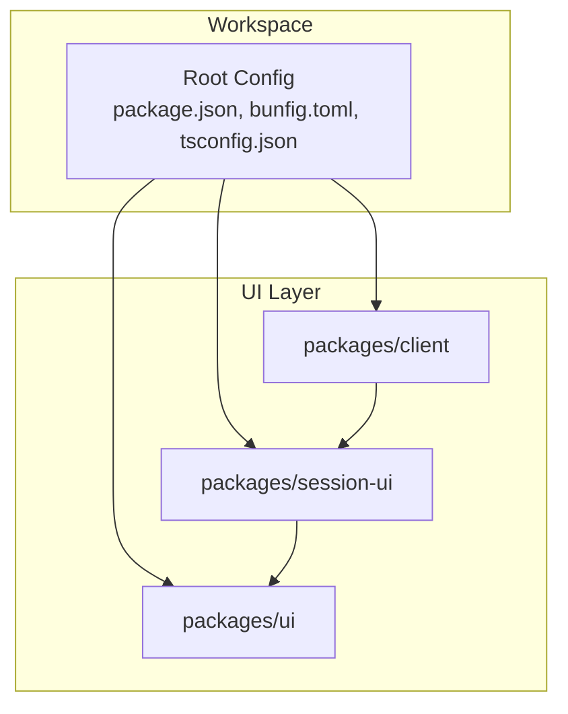
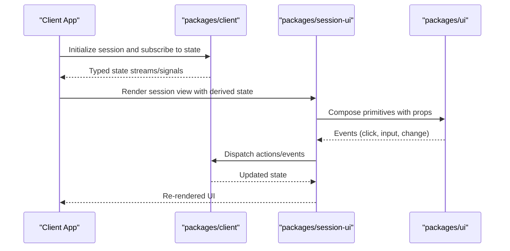
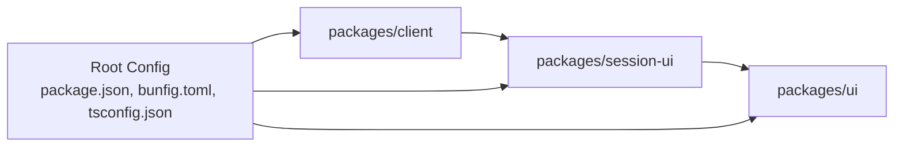

# User Interface Layer

<cite>
**Referenced Files in This Document**
- [package.json](file://package.json)
- [bunfig.toml](file://bunfig.toml)
- [tsconfig.json](file://tsconfig.json)
- [README.md](file://README.md)
</cite>

## Table of Contents
1. [Introduction](#introduction)
2. [Project Structure](#project-structure)
3. [Core Components](#core-components)
4. [Architecture Overview](#architecture-overview)
5. [Detailed Component Analysis](#detailed-component-analysis)
6. [Dependency Analysis](#dependency-analysis)
7. [Performance Considerations](#performance-considerations)
8. [Troubleshooting Guide](#troubleshooting-guide)
9. [Conclusion](#conclusion)
10. [Appendices](#appendices)

## Introduction
This document describes the user interface layer across three key areas:
- Reusable UI component library in packages/ui
- Session-specific components in packages/session-ui
- Client-side architecture in packages/client

It explains how components are composed, how state is managed, and how reactive patterns are applied. It also covers styling systems, theming, responsive design, APIs for props and events, accessibility, cross-browser compatibility, and performance optimization. Finally, it provides guidance on creating custom components and integrating with session management.

## Project Structure
The repository is a multi-package workspace configured via Bun and TypeScript. The UI layer spans:
- packages/ui: Shared, reusable UI primitives and layout abstractions
- packages/session-ui: Session-aware UI components that integrate with client-side session state
- packages/client: Client-side application logic, routing, and integration points for UI layers

**Diagram sources**
- [package.json](file://package.json)
- [bunfig.toml](file://bunfig.toml)
- [tsconfig.json](file://tsconfig.json)

**Section sources**
- [package.json](file://package.json)
- [bunfig.toml](file://bunfig.toml)
- [tsconfig.json](file://tsconfig.json)

## Core Components
This section outlines the responsibilities and composition patterns expected across the UI layer:
- packages/ui: Provides atomic components (buttons, inputs, dialogs), layout primitives (grid, flex containers), and shared styles/themes. Designed to be framework-agnostic where possible and composable through props and slots.
- packages/session-ui: Builds on ui to render session-scoped views (e.g., chat panels, history lists). Manages session-specific state and reacts to changes from the client layer.
- packages/client: Orchestrates data fetching, session lifecycle, and integrates with session-ui to drive UI updates. Exposes typed APIs consumed by session-ui.

Key principles:
- Composition over inheritance: Small, focused components combined via props and children
- Unidirectional data flow: State flows down as props; events bubble up
- Reactive updates: Changes in client state trigger re-renders in session-ui and ui components
- Theme-driven styling: Centralized tokens for colors, spacing, typography, and breakpoints

[No sources needed since this section doesn't analyze specific files]

## Architecture Overview
The UI architecture follows a layered approach:
- Client layer owns data and session state, exposing typed signals/observables
- Session-ui consumes client APIs to derive session-scoped UI state
- ui provides reusable building blocks styled via a theme system

[No sources needed since this diagram shows conceptual workflow, not actual code structure]

## Detailed Component Analysis

### packages/ui: Reusable Component Library
Responsibilities:
- Atomic components: buttons, inputs, badges, tooltips, modals, cards
- Layout primitives: grid, stack, container, spacer
- Theming: design tokens, color palettes, typography scales, breakpoints
- Accessibility: semantic HTML, ARIA attributes, keyboard navigation, focus management
- Responsiveness: mobile-first utilities and breakpoint-aware behavior

Component API patterns:
- Props interfaces define required/optional fields with defaults
- Event callbacks use typed event payloads
- Slots or children allow flexible composition
- Variants controlled via props (size, color, density)

Styling and theming:
- CSS variables or token objects for consistent design
- Theme provider at app boundary
- Responsive utilities based on media queries or utility classes

Accessibility compliance:
- Focus indicators and order
- Screen reader labels and roles
- Keyboard interactions and shortcuts
- Color contrast and reduced motion support

Cross-browser compatibility:
- Polyfills and feature detection where necessary
- Vendor prefixes and fallbacks for older browsers
- Testing matrix covering major browsers and devices

Performance optimizations:
- Memoization of expensive computations
- Lazy loading of heavy components
- Virtualization for long lists
- Minimal re-renders via selective subscriptions

Customization options:
- Override theme tokens
- Provide custom renderers or wrappers
- Extend variants and sizes via configuration

**Section sources**
- [README.md](file://README.md)

### packages/session-ui: Session-Specific Components
Responsibilities:
- Session-aware views (panels, timelines, message lists)
- Integration with client session state and lifecycle
- Local ephemeral state for transient UI behaviors
- Event handling bridging UI actions to client commands

State management strategies:
- Derived state from client signals/streams
- Optimistic updates with rollback on failure
- Debounced/throttled input handling
- Selective subscriptions to minimize re-renders

Reactive programming approaches:
- Streams/observables for async data
- Signals for fine-grained reactivity
- Effects for side effects tied to state changes

Integration with session management:
- Subscribe to session open/close, messages, errors
- Dispatch actions like send, retry, cancel
- Handle offline/online states and queueing

Accessibility and UX:
- Clear status announcements
- Error boundaries and retry prompts
- Loading skeletons and progress indicators

**Section sources**
- [README.md](file://README.md)

### packages/client: Client-Side Architecture
Responsibilities:
- Session lifecycle management (create, connect, reconnect, close)
- Data fetching and caching
- Event bus or stream pipeline for real-time updates
- Typed APIs consumed by session-ui

State management:
- Centralized store with typed slices
- Selectors for derived data
- Middleware for logging, error handling, persistence

Reactive patterns:
- Observables for network requests and server events
- Signals for UI-bound state
- Effects for syncing state with external systems

Error handling:
- Network retries with backoff
- Graceful degradation and fallbacks
- Structured error types and codes

Security and compatibility:
- Sanitization of user inputs
- CORS and cookie policies
- Feature detection and polyfills

**Section sources**
- [README.md](file://README.md)

## Dependency Analysis
The UI layer exhibits clear dependencies:
- session-ui depends on ui for primitives and theming
- client provides APIs consumed by session-ui
- Root workspace config coordinates build, bundling, and type resolution

**Diagram sources**
- [package.json](file://package.json)
- [bunfig.toml](file://bunfig.toml)
- [tsconfig.json](file://tsconfig.json)

**Section sources**
- [package.json](file://package.json)
- [bunfig.toml](file://bunfig.toml)
- [tsconfig.json](file://tsconfig.json)

## Performance Considerations
- Prefer memoization for computed values and expensive renders
- Use virtualization for large datasets
- Defer non-critical work with requestIdleCallback or similar
- Minimize bundle size via tree-shaking and code splitting
- Avoid unnecessary re-renders by subscribing only to relevant state slices
- Optimize images and assets with modern formats and lazy loading
- Profile rendering with browser dev tools and React/Solid/Vue profilers depending on framework usage

[No sources needed since this section provides general guidance]

## Troubleshooting Guide
Common issues and resolutions:
- Theme not applying: Ensure theme provider wraps the app and tokens are correctly exported
- Session state not updating: Verify subscriptions and selectors; check for stale closures
- Accessibility warnings: Validate ARIA attributes and keyboard navigation; run automated audits
- Cross-browser inconsistencies: Inspect vendor prefixes and polyfills; test on target browsers
- Performance regressions: Identify heavy components, excessive re-renders, and large bundles

[No sources needed since this section provides general guidance]

## Conclusion
The UI layer is organized into reusable primitives, session-aware components, and a robust client architecture. By adhering to composition patterns, reactive state management, and strong accessibility and performance practices, the system delivers a scalable and maintainable interface. Custom components should follow the established APIs and integrate cleanly with session management for consistent behavior across the application.

[No sources needed since this section summarizes without analyzing specific files]

## Appendices

### Creating Custom Components
Guidelines:
- Start with a small, focused component in packages/ui
- Define a typed props interface with sensible defaults
- Emit typed events for user interactions
- Support theming via tokens and variants
- Ensure accessibility and keyboard support
- Add tests for behavior and edge cases

Integrating with session management:
- Consume client APIs to read/write session state
- Handle loading, error, and success states
- Debounce frequent updates and batch mutations
- Provide feedback to users for asynchronous operations

[No sources needed since this section provides general guidance]